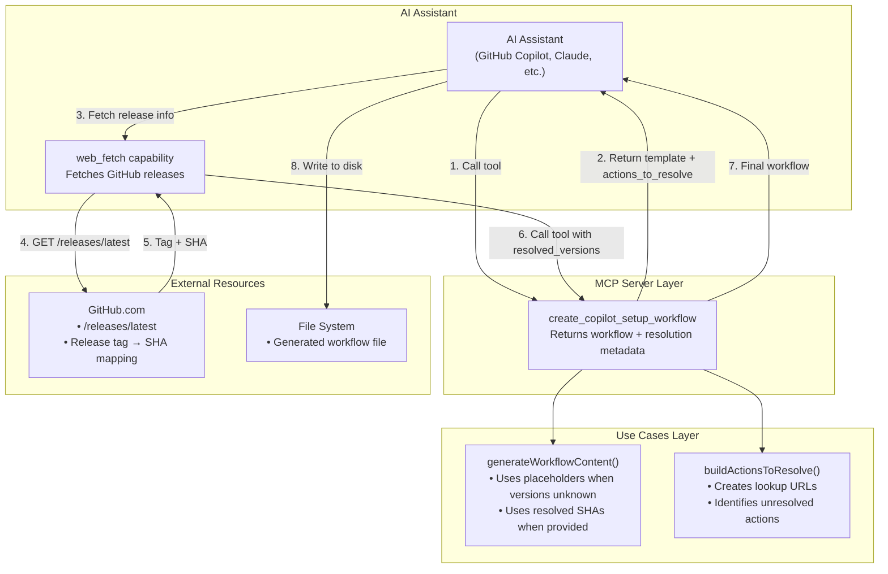
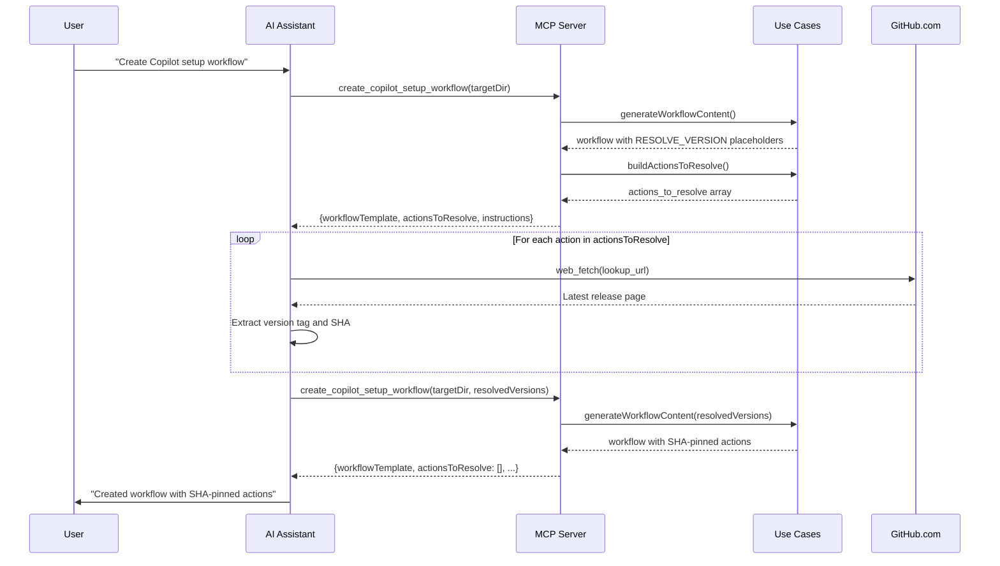

# Feature: Dynamic Action Version Resolution for Copilot Setup Steps

## Problem Statement

When the lousy-agents MCP server creates or updates Copilot Setup Steps workflows, it currently uses hardcoded action versions (e.g., `actions/setup-node@v4`). This approach has two significant limitations: (1) versions become stale as GitHub Actions release updates, requiring manual maintenance; and (2) version tags can be mutated, creating security risks. Software engineers need workflows that use the latest stable action versions pinned to immutable commit SHAs for both freshness and security, but this requires dynamic resolution that the current MCP server cannot provide without hitting GitHub API rate limits.

## Personas

| Persona | Impact | Notes |
|---------|--------|-------|
| Software Engineer Learning Vibe Coding | Positive | Primary user - gets workflows with latest secure action versions without manual research |
| Platform Engineer | Positive | Can ensure security compliance with SHA-pinned actions across repositories |
| Team Lead | Positive | Can standardize on latest action versions with security assurance |

## Value Assessment

- **Primary value**: Future — Ensures workflows stay current with latest action versions, reducing technical debt from stale dependencies
- **Secondary value**: Customer — Improves user confidence by providing security through SHA-pinned actions and clear resolution instructions

## User Stories

### Story 1: Request Latest Action Version Resolution

As a **Software Engineer Learning Vibe Coding**,
I want **the MCP tool to indicate which action versions need to be resolved to their latest versions**,
so that I can **use my AI assistant to look up and pin the latest secure versions**.

#### Acceptance Criteria

- When the `create_copilot_setup_workflow` tool is called, the MCP server shall return an `actions_to_resolve` array containing each action that needs version resolution
- When an action is included in `actions_to_resolve`, the system shall include the action name (e.g., `actions/setup-node`)
- When an action is included in `actions_to_resolve`, the system shall include a `lookup_url` pointing to the GitHub releases page (e.g., `https://github.com/actions/setup-node/releases/latest`)
- When an action is included in `actions_to_resolve`, the system shall include a `current_placeholder` field indicating the placeholder used in the workflow template
- The MCP server shall include `instructions` field with guidance for the LLM to resolve versions using its web_fetch capabilities

#### Notes

- This design delegates version resolution to the LLM's web_fetch capabilities to avoid GitHub API rate limits on the MCP server
- The LLM should look up the latest release tag, then resolve the tag to its commit SHA
- The pattern enables future caching or API-based resolution without changing the response format

---

### Story 2: Generate Workflow Template with Version Placeholders

As a **Software Engineer Learning Vibe Coding**,
I want **the workflow template to contain version placeholders that signal resolution is needed**,
so that I can **understand which actions need version updates before the workflow is finalized**.

#### Acceptance Criteria

- When generating a workflow template, the system shall use `RESOLVE_VERSION` placeholders for action versions (e.g., `actions/setup-node@RESOLVE_VERSION`)
- When the `actions_to_resolve` array is empty (all versions already known), the system shall use actual versions in the workflow template
- The workflow template shall be valid YAML that can be used as-is for testing or updated with resolved versions

#### Notes

- Placeholder format `RESOLVE_VERSION` is chosen for clarity and easy grep/search
- The workflow with placeholders should still pass YAML validation
- Users may choose to use the placeholder workflow temporarily while resolution occurs

---

### Story 3: Provide SHA Pinning Instructions

As a **Software Engineer Learning Vibe Coding**,
I want **clear instructions on how to pin actions to commit SHAs**,
so that I can **ensure my workflow uses immutable action references for security**.

#### Acceptance Criteria

- The `instructions` field shall explain that actions should be pinned to commit SHAs, not version tags
- The `instructions` field shall explain the format for SHA-pinned actions (e.g., `actions/setup-node@1234567890abcdef...  # v4.0.0`)
- The `instructions` field shall explain how to find the SHA for a release tag using GitHub's UI or API
- If the LLM resolves versions, then the final workflow shall include version comments after SHA references for human readability

#### Notes

- SHA pinning is a security best practice as tags can be force-pushed
- Including version comments after SHA makes the workflow more maintainable
- Example: `actions/setup-node@1a2b3c4d5e6f7g8h9i0j  # v4.0.0`

---

### Story 4: Support Incremental Version Resolution

As a **Software Engineer Learning Vibe Coding**,
I want **to be able to resolve action versions incrementally**,
so that I can **update my workflow as versions are resolved without regenerating everything**.

#### Acceptance Criteria

- When calling `create_copilot_setup_workflow` with existing placeholders, the system shall preserve unresolved placeholders
- The MCP server shall accept an optional `resolved_versions` parameter containing actions that have been resolved
- When `resolved_versions` is provided, the system shall update the workflow template with the resolved SHA references
- The response shall indicate which actions still need resolution in `actions_to_resolve`

#### Notes

- This supports the iterative workflow where the LLM resolves versions one at a time
- Partial resolution allows for graceful handling of rate limits or lookup failures

---

## Design

> Refer to `.github/copilot-instructions.md` for technical standards.

### Components Affected

**Entities Layer:**
- `src/entities/copilot-setup.ts` — Add `ActionToResolve` interface for version resolution metadata

**Use Cases Layer:**
- `src/use-cases/copilot-setup.ts` — Update workflow generation to support placeholders and resolution
- `src/use-cases/action-resolution.ts` (new) — Logic for building actions_to_resolve array and processing resolved versions

**MCP Tools Layer:**
- `src/mcp/tools/create-copilot-setup-workflow.ts` — Update response format to include resolution metadata
- `src/mcp/tools/types.ts` — Add new response type for version resolution

**Gateways Layer:**
- No changes required — existing version gateway can be extended if needed

### Dependencies

- No new external dependencies required
- Relies on LLM capabilities (web_fetch) for actual version resolution

### Data Model Changes

**ActionToResolve type (new):**

```typescript
interface ActionToResolve {
  /** Action name without version (e.g., "actions/setup-node") */
  action: string;
  /** Placeholder used in workflow template (e.g., "RESOLVE_VERSION") */
  currentPlaceholder: string;
  /** URL to lookup latest version (e.g., "https://github.com/actions/setup-node/releases/latest") */
  lookupUrl: string;
}
```

**ResolvedVersion type (new):**

```typescript
interface ResolvedVersion {
  /** Action name without version (e.g., "actions/setup-node") */
  action: string;
  /** Resolved commit SHA */
  sha: string;
  /** Version tag for human-readable comment (e.g., "v4.0.0") */
  versionTag: string;
}
```

**Updated CreateWorkflowResult:**

The existing response format is extended with optional fields for version resolution. This maintains backward compatibility with existing clients.

```typescript
interface CreateWorkflowResult {
  success: boolean;
  action: "created" | "updated" | "no_changes_needed";
  workflowPath: string;
  stepsAdded: string[];
  message: string;
  
  // New optional fields for version resolution (backward compatible)
  /** The generated workflow content, included when workflow is created/updated */
  workflowTemplate?: string;
  /** Actions that need version resolution, empty when all versions are resolved */
  actionsToResolve?: ActionToResolve[];
  /** Instructions for the LLM to resolve versions, only included when actionsToResolve is non-empty */
  instructions?: string;
}
```

Note: The existing `successResponse` utility wraps results in `{ success: true, ...data }` format. The new fields are added to the data payload.

### Data Flow Diagram



### Sequence Diagram: Version Resolution Flow



### Architecture Notes

1. **Delegation Pattern**: The MCP server delegates version resolution to the LLM's web_fetch capabilities. This avoids rate limit issues on the server while leveraging the LLM's natural ability to parse web pages and extract version information.

2. **Placeholder Strategy**: Using `RESOLVE_VERSION` as a placeholder provides:
   - Clear visual signal that resolution is needed
   - Valid YAML syntax (the placeholder is a valid version string)
   - Easy grep/search for unresolved actions

3. **Incremental Resolution**: Supporting the `resolved_versions` parameter allows for:
   - Graceful handling of partial resolution failures
   - Iterative refinement as versions are looked up
   - Better user experience with progressive updates

4. **SHA Pinning Format**: The format `action@sha  # vX.X.X` follows GitHub Actions conventions and provides:
   - Immutable action reference (SHA cannot be force-pushed)
   - Human-readable version comment for maintenance
   - Compatibility with Dependabot SHA updates

### Open Questions

- [ ] Should we provide a separate tool for version resolution only (without workflow creation)?
- [ ] Should we cache resolved versions to speed up subsequent calls?
- [ ] Should we provide alternative resolution methods (e.g., npm package for local resolution)?

---

## Tasks

> Each task should be completable in a single coding agent session.
> Tasks are sequenced by dependency. Complete in order unless noted.

### Task 1: Add ActionToResolve and ResolvedVersion entities

**Objective**: Create new entity types for version resolution metadata

**Context**: These types form the foundation for the version resolution feature

**Affected files**:
- `src/entities/copilot-setup.ts`
- `src/entities/index.ts`

**Requirements**:
- The `ActionToResolve` interface shall include action, currentPlaceholder, and lookupUrl fields
- The `ResolvedVersion` interface shall include action, sha, and versionTag fields

**Verification**:
- [ ] `npm run build` compiles successfully
- [ ] `mise run format-check` passes
- [ ] Types are exported from entities/index.ts

**Done when**:
- [ ] All verification steps pass
- [ ] No new errors in affected files
- [ ] Types follow existing entity patterns
- [ ] Code follows patterns in `.github/copilot-instructions.md`

---

### Task 2: Create action resolution use case

**Objective**: Create use case for building actions_to_resolve array and generating lookup URLs

**Context**: This separates the resolution logic from workflow generation

**Depends on**: Task 1

**Affected files**:
- `src/use-cases/action-resolution.ts` (new)
- `src/use-cases/action-resolution.test.ts` (new)
- `src/use-cases/index.ts`

**Requirements**:
- When given a list of actions, the use case shall build ActionToResolve entries for each
- The lookup_url shall point to the GitHub releases/latest page for the action
- The use case shall generate consistent placeholder values

**Verification**:
- [ ] `npm test src/use-cases/action-resolution.test.ts` passes
- [ ] `mise run format-check` passes
- [ ] Tests cover all supported action patterns

**Done when**:
- [ ] All verification steps pass
- [ ] No new errors in affected files
- [ ] Use case follows clean architecture patterns
- [ ] Code follows patterns in `.github/copilot-instructions.md`

---

### Task 3: Update workflow generation for placeholders

**Objective**: Update workflow generation to use RESOLVE_VERSION placeholders when versions are unknown

**Context**: This enables the placeholder-based resolution flow

**Depends on**: Task 2

**Affected files**:
- `src/use-cases/copilot-setup.ts`
- `src/use-cases/copilot-setup.test.ts`

**Requirements**:
- When generating workflow content, the use case shall support placeholder mode
- When resolved versions are provided, the use case shall use SHA-pinned format with version comments
- The use case shall preserve existing non-placeholder versions

**Verification**:
- [ ] `npm test src/use-cases/copilot-setup.test.ts` passes
- [ ] `mise run format-check` passes
- [ ] Tests verify placeholder generation
- [ ] Tests verify SHA-pinned format with comments

**Done when**:
- [ ] All verification steps pass
- [ ] No new errors in affected files
- [ ] Workflow generation supports both modes
- [ ] Code follows patterns in `.github/copilot-instructions.md`

---

### Task 4: Update MCP tool response types

**Objective**: Add new fields to CreateWorkflowResult for version resolution

**Context**: This updates the MCP response format to include resolution metadata

**Depends on**: Task 3

**Affected files**:
- `src/mcp/tools/types.ts`

**Requirements**:
- The response type shall include workflowTemplate field
- The response type shall include actionsToResolve array
- The response type shall include instructions string

**Verification**:
- [ ] `npm run build` compiles successfully
- [ ] `mise run format-check` passes
- [ ] Types are consistent with entity types

**Done when**:
- [ ] All verification steps pass
- [ ] No new errors in affected files
- [ ] Types follow existing MCP patterns
- [ ] Code follows patterns in `.github/copilot-instructions.md`

---

### Task 5: Update create_copilot_setup_workflow handler

**Objective**: Update the MCP tool handler to return version resolution metadata

**Context**: This integrates the resolution logic into the existing tool

**Depends on**: Task 4

**Affected files**:
- `src/mcp/tools/create-copilot-setup-workflow.ts`
- `src/mcp/server.test.ts` (update tests)

**Requirements**:
- When called, the handler shall return actionsToResolve array
- When called, the handler shall return workflowTemplate with placeholders
- When called, the handler shall return instructions for version resolution
- When resolvedVersions is provided, the handler shall use SHA-pinned versions

**Verification**:
- [ ] `npm test src/mcp/server.test.ts` passes
- [ ] `mise run format-check` passes
- [ ] Integration tests verify full response format

**Done when**:
- [ ] All verification steps pass
- [ ] No new errors in affected files
- [ ] Handler returns complete resolution metadata
- [ ] Code follows patterns in `.github/copilot-instructions.md`

---

### Task 6: Add resolved_versions parameter support

**Objective**: Add support for the resolved_versions input parameter to the MCP tool

**Context**: This enables incremental version resolution

**Depends on**: Task 5

**Affected files**:
- `src/mcp/server.ts` — Update tool schema
- `src/mcp/tools/create-copilot-setup-workflow.ts`
- `src/mcp/server.test.ts`

**Requirements**:
- The tool shall accept optional resolvedVersions parameter
- When resolvedVersions is provided, the handler shall generate SHA-pinned workflow
- The actionsToResolve array shall only include unresolved actions

**Verification**:
- [ ] `npm test src/mcp/server.test.ts` passes
- [ ] `mise run format-check` passes
- [ ] Tests verify incremental resolution

**Done when**:
- [ ] All verification steps pass
- [ ] No new errors in affected files
- [ ] Incremental resolution works correctly
- [ ] Code follows patterns in `.github/copilot-instructions.md`

---

### Task 7: Integration testing and documentation

**Objective**: Perform end-to-end testing and update documentation

**Context**: Final verification ensures the feature works correctly

**Depends on**: Task 6

**Affected files**:
- `README.md` — Update MCP tool documentation
- `src/mcp/server.integration.test.ts`

**Requirements**:
- Manual test shall verify full resolution flow
- Documentation shall explain the version resolution pattern
- Full validation suite shall pass

**Verification**:
- [ ] `npm test` passes
- [ ] `mise run format-check` passes
- [ ] `mise run ci && npm run build` passes
- [ ] README includes version resolution documentation

**Done when**:
- [ ] All verification steps pass
- [ ] Feature works correctly in manual testing
- [ ] Documentation is complete
- [ ] No regressions in existing functionality

---

## Out of Scope

- Automatic version resolution via GitHub API (delegated to LLM)
- Caching of resolved versions (future enhancement)
- Version comparison or update detection
- Integration with Dependabot or Renovate
- Support for non-GitHub action sources

## Future Considerations

- Add version caching to speed up repeated resolution
- Add `resolve_action_versions` standalone tool for reuse
- Support for action pinning in other workflow files (not just copilot-setup-steps)
- Add version staleness warnings when workflows are read
- Integration with security advisory databases for vulnerable action detection
