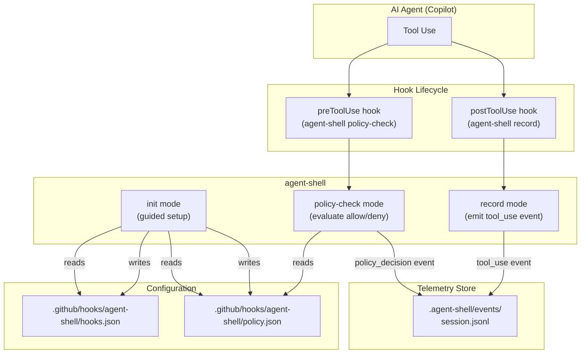
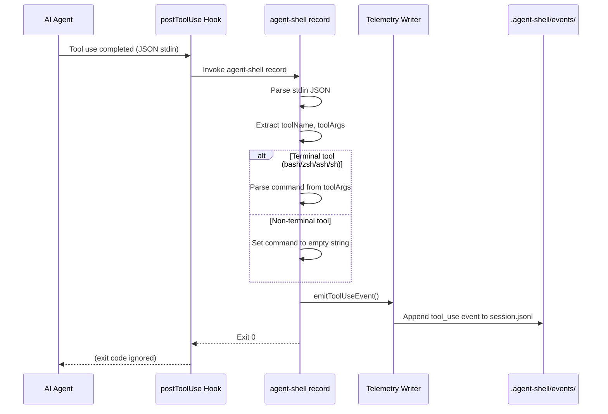
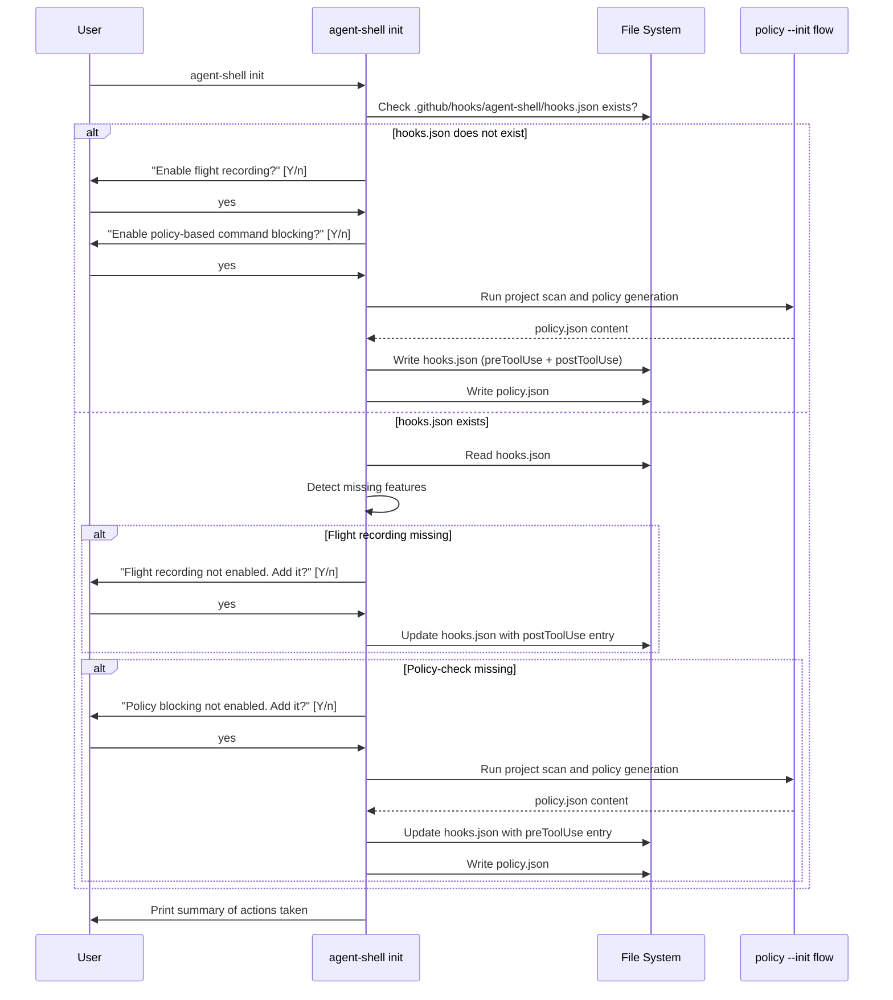

# Feature: agent-shell flight recording for agent hook lifecycle events

## Table of Contents

- [Problem Statement](#problem-statement)
- [Personas](#personas)
- [Value Assessment](#value-assessment)
- [User Stories](#user-stories)
  - [Story 1: Record agent tool usage via postToolUse hook](#story-1-record-agent-tool-usage-via-posttooluse-hook)
  - [Story 2: Initialize agent-shell with interactive setup](#story-2-initialize-agent-shell-with-interactive-setup)
  - [Story 3: Initialize agent-shell with non-interactive CLI options](#story-3-initialize-agent-shell-with-non-interactive-cli-options)
  - [Story 4: Auto-allow agent-shell in generated policy](#story-4-auto-allow-agent-shell-in-generated-policy)
- [Design](#design)
  - [Components Affected](#components-affected)
  - [Dependencies](#dependencies)
  - [Data Model Changes](#data-model-changes)
  - [Diagrams](#diagrams)
  - [Open Questions](#open-questions)
- [Tasks](#tasks)
- [Out of Scope](#out-of-scope)
- [Future Considerations](#future-considerations)

---

## Problem Statement

agent-shell currently records structured JSONL telemetry when used as an npm `script-shell` shim, capturing what scripts ran, who initiated them, and whether they succeeded. However, when AI agents use tools beyond npm scripts — file edits, code searches, API calls — those interactions are invisible to the telemetry system. The Copilot hooks lifecycle (`preToolUse`, `postToolUse`, etc.) provides a way to observe all agent tool usage, but agent-shell has no mode to capture this broader activity. Additionally, there is no unified `init` subcommand to guide a user through configuring both the npm script-shell recording and hook-based flight recording in one step.

## Personas

| Persona | Impact | Notes |
| --- | --- | --- |
| Software Engineer Learning Vibe Coding | Positive | Primary user — gains visibility into all agent tool usage, not just npm scripts |
| Platform Engineer | Positive | Can audit the full scope of agent activity across a repository |
| Team Lead | Positive | Can review agent behavior patterns to build trust and identify areas for guardrails |

## Value Assessment

- **Primary value**: Efficiency — Eliminates the blind spot where agent tool usage outside npm scripts is unrecorded, giving a complete audit trail without manual monitoring
- **Secondary value**: Future — The recorded data enables future analysis of agent behavior patterns, informing policy refinements and identifying which tools agents rely on most

## User Stories

### Story 1: Record agent tool usage via postToolUse hook

As a **Software Engineer Learning Vibe Coding**,
I want **agent-shell to record every tool the AI agent uses during a session via a `postToolUse` hook**,
so that I can **review a complete log of agent activity — not just npm scripts — in the same structured format I already use for script telemetry**.

#### Acceptance Criteria

- When agent-shell receives a `postToolUse` hook payload on stdin, the system shall parse the JSON input and emit a `tool_use` telemetry event to the session JSONL file.
- The `tool_use` event shall include the fields: `v`, `session_id`, `event` (literal `"tool_use"`), `tool_name`, `command` (the command string if the tool is a terminal tool, otherwise empty string), `actor`, `timestamp`, `env`, and `tags`.
- When the `postToolUse` payload contains a terminal tool name (one of: `bash`, `zsh`, `ash`, `sh`) and `toolArgs` is a JSON-encoded string, the system shall parse `toolArgs` as JSON. When the parsed result is a non-null plain object containing a `command` string field, the system shall use that command string in the `command` field of the telemetry event.
- When the `postToolUse` payload contains a terminal tool name but `toolArgs` is not a string, the system shall set `command` to an empty string and still emit the `tool_use` event (observation-only — no fail-closed behavior).
- When the `postToolUse` payload contains a terminal tool name and `toolArgs` is a string but not valid JSON, the system shall set `command` to an empty string and still emit the `tool_use` event.
- When the `postToolUse` payload contains a terminal tool name and `toolArgs` parses to a value that is not a non-null plain object, or the object does not contain a `command` string field, the system shall set `command` to an empty string and still emit the `tool_use` event.
- When the `postToolUse` payload contains a non-terminal tool name, the system shall set the `command` field to an empty string and record the `tool_name` field with the tool's name.
- When a terminal tool's `toolArgs.command` is an empty string, the system shall record the event with an empty `command` field (same as non-terminal tools).
- If stdin contains data that is not valid JSON, then the system shall write a diagnostic message to stderr and exit gracefully without emitting telemetry.
- If stdin input exceeds 1 MiB, then the system shall reject the input, write a diagnostic message to stderr, and exit gracefully without emitting telemetry.
- If the `postToolUse` payload is missing the `toolName` field or `toolName` is not a string, then the system shall write a diagnostic message to stderr and skip telemetry emission.
- While telemetry emission fails (e.g., events directory not writable), the system shall log the error to stderr and exit gracefully without crashing.
- The `tool_use` telemetry event shall be written to the same `.agent-shell/events/` directory and session JSONL file used by existing `script_end` and `policy_decision` events.
- When displaying `tool_use` events in table format via `agent-shell log`, the system shall show `tool_name` in the SCRIPT column and `command` in the COMMAND column, with `-` for EXIT and DURATION.
- The `--actor` and `--last` filters shall apply to `tool_use` events. The `--failures` and `--script` filters shall exclude `tool_use` events (they apply only to `script_end` events).

#### Notes

- The `postToolUse` hook contract follows the [Copilot hooks documentation](https://docs.github.com/en/copilot/reference/hooks-configuration#post-tool-use-hook)
- The hook receives JSON on stdin with `toolName`, `toolArgs`, and `toolResult` fields
- Unlike `preToolUse` (which returns allow/deny), `postToolUse` is observation-only — it records but does not influence agent behavior
- The agent ignores the exit code of the `postToolUse` hook, so telemetry failures are non-blocking to the agent workflow

### Story 2: Initialize agent-shell with interactive setup

As a **Software Engineer Learning Vibe Coding**,
I want **to run `agent-shell init` and have it guide me through enabling flight recording and policy enforcement**,
so that I can **set up all agent-shell features in one step without reading documentation**.

#### Acceptance Criteria

- When the user runs `agent-shell init`, the system shall check whether agent-shell has already been initialized by inspecting for the existence of `.github/hooks/agent-shell/hooks.json`.
- When hooks.json does not exist, the system shall prompt the user: "Enable flight recording to capture all agent tool usage?" with a default of "yes."
- When the user accepts flight recording, the system shall generate a hooks.json that includes a `postToolUse` hook entry for `agent-shell record`.
- When hooks.json does not exist, the system shall prompt the user: "Enable policy-based command blocking?" with a default of "yes."
- When the user accepts policy blocking, the system shall scan the project using `scanProject()` and generate policy.json using `generatePolicy()`, and add a `preToolUse` hook entry for `agent-shell policy-check` to the hooks.json.
- When hooks.json already exists, the system shall inspect the existing configuration and identify features that are not yet enabled (e.g., flight recording is missing, or policy-check is missing).
- While hooks.json already exists and contains both `postToolUse` (flight recording) and `preToolUse` (policy-check) entries for agent-shell, the system shall inform the user that all features are already configured and exit successfully.
- While hooks.json already exists but is missing the flight recording hook, the system shall prompt the user: "Flight recording is not yet enabled. Would you like to add it?" with a default of "yes."
- While hooks.json already exists but is missing the policy-check hook, the system shall prompt the user: "Policy-based command blocking is not yet enabled. Would you like to add it?" with a default of "yes."
- When the user declines a feature prompt, the system shall skip that feature and continue to the next prompt.
- If the resolved path for hooks.json or policy.json is outside the repository root (via symlink or directory traversal), then the system shall abort the write and display an error message. The system shall use `isWithinProjectRoot()` for containment checks.
- The system shall print a summary of actions taken when initialization completes.

#### Notes

- The init subcommand is designed for guided first-time setup and incremental feature enablement
- It combines the interactive experience missing from `policy --init` (which is non-interactive)
- The init command must be run inside a git repository (`git rev-parse --show-toplevel` is used to locate the repo root)

### Story 3: Initialize agent-shell with non-interactive CLI options

As a **Platform Engineer**,
I want **to run `agent-shell init --flight-recorder --policy` without interactive prompts**,
so that I can **script agent-shell setup in CI or automation tooling**.

#### Acceptance Criteria

- When the user runs `agent-shell init --flight-recorder`, the system shall enable flight recording without prompting.
- When the user runs `agent-shell init --policy`, the system shall enable policy-based command blocking without prompting.
- When the user runs `agent-shell init --flight-recorder --policy`, the system shall enable both features without prompting.
- When the user runs `agent-shell init` with no flags in a non-interactive terminal (no TTY), the system shall default to enabling all features without prompting and shall print a message to stderr listing which features were auto-enabled.
- If the user provides `--no-flight-recorder`, then the system shall skip flight recording setup.
- If the user provides `--no-policy`, then the system shall skip policy setup.
- When features are already configured, the system shall skip them and print a message indicating they are already present.

#### Notes

- Non-interactive mode is essential for CI pipelines and automation scripts
- The `--no-*` flags follow the GNU convention for negating boolean flags

### Story 4: Auto-allow agent-shell in generated policy

As a **Software Engineer Learning Vibe Coding**,
I want **`agent-shell` commands to be automatically included in the allow list when policy is generated**,
so that I can **use agent-shell subcommands (like `agent-shell record` and `agent-shell policy-check`) without them being blocked by the policy they enforce**.

#### Acceptance Criteria

- When `generatePolicy()` produces an allow list, the system shall include `agent-shell policy-check` and `agent-shell record` as allowed commands.
- When the `init` command generates a hooks.json, the system shall ensure that the agent-shell commands referenced in hook entries are present in the policy allow list.
- The auto-allowed agent-shell commands shall use exact-match rules (not wildcard patterns) to prevent command injection via appended arguments.

#### Notes

- Without auto-allowing, the `preToolUse` policy-check hook would block its own sibling `postToolUse` recording hook, creating a circular denial
- Only specific agent-shell subcommands are allowed — not a blanket `agent-shell *` wildcard

---

## Design

> Refer to `.github/copilot-instructions.md` for technical standards.

### Components Affected

- `packages/agent-shell/src/mode.ts` — Add `init` and `record` mode types with argument parsing
- `packages/agent-shell/src/record.ts` — New module: handles `postToolUse` flight recording — parses stdin, emits `tool_use` telemetry event
- `packages/agent-shell/src/init-command.ts` — New module: orchestrates interactive and non-interactive init flow, detects existing configuration, prompts for features, writes hooks.json
- `packages/agent-shell/src/types.ts` — Add `ToolUseEvent` schema and extend `ScriptEventSchema` discriminated union
- `packages/agent-shell/src/telemetry.ts` — Add `emitToolUseEvent()` function
- `packages/agent-shell/src/policy-init.ts` — Update `DEFAULT_SAFE_COMMANDS` to include `agent-shell policy-check` and `agent-shell record`; update `generateHooksConfig()` to accept feature flags
- `packages/agent-shell/src/index.ts` — Wire up `init` and `record` cases in main switch, update USAGE text

### Dependencies

- `zod` (existing) — Validate `postToolUse` hook input
- `node:fs/promises` (existing) — Read/write hooks.json
- `node:readline` (new, stdlib) — Interactive prompts for init command
- TTY detection uses `process.stdin.isTTY` (no additional import needed)

### Data Model Changes

New telemetry event type `tool_use`:

```typescript
export const ToolUseEventSchema = z
    .object({
        v: z.literal(1),
        session_id: z.string(),
        event: z.literal("tool_use"),
        tool_name: z.string(),
        command: z.string(),
        actor: z.string(),
        timestamp: z.string(),
        env: z.record(z.string(), z.string()),
        tags: z.record(z.string(), z.string()),
    })
    .strict();
```

The `ScriptEventSchema` discriminated union will be extended to include `ToolUseEventSchema`.

### Diagrams

#### Data Flow Diagram



#### Sequence Diagram — Flight Recording via postToolUse



#### Sequence Diagram — Interactive Init



### Resolved Questions

- [x] Should the `init` command also configure `.npmrc` for script-shell recording, or should that remain in `lousy-agents copilot-setup`? **Decision**: Keep `.npmrc` management in `copilot-setup`. The npm script-shell feature may be removed in the future in favor of hook-based flight recording and policy enforcement, which is the superior integration path.

---

## Tasks

> Each task should be completable in a single coding agent session.
> Tasks are sequenced by dependency. Complete in order unless noted.

### Task 1: Add `tool_use` event schema to types

**Objective**: Define the `ToolUseEvent` Zod schema and extend the `ScriptEventSchema` discriminated union to include it.

**Context**: The telemetry system needs a new event type before the record mode can emit events. This is a foundational change that unblocks Tasks 2 and 5.

**Affected files**:
- `packages/agent-shell/src/types.ts`
- `packages/agent-shell/tests/types.test.ts`

**Requirements**:
- The `ToolUseEventSchema` shall include fields: `v` (literal 1), `session_id`, `event` (literal `"tool_use"`), `tool_name`, `command`, `actor`, `timestamp`, `env`, `tags`
- The `ScriptEventSchema` discriminated union shall include `ToolUseEventSchema` as an additional variant
- The `ToolUseEvent` type shall be exported

**Verification**:
- [ ] `npm test packages/agent-shell/tests/types.test.ts` passes
- [ ] `npx biome check packages/agent-shell/src/types.ts` passes

**Done when**:
- [ ] All verification steps pass
- [ ] Schema validates correct `tool_use` events and rejects invalid ones
- [ ] Existing event schemas remain unchanged
- [ ] Code follows patterns in `.github/copilot-instructions.md`

---

### Task 2: Add `emitToolUseEvent()` to telemetry module

**Depends on**: Task 1

**Objective**: Implement a telemetry emission function for `tool_use` events, following the same pattern as `emitScriptEndEvent` and `emitPolicyDecisionEvent`.

**Context**: The record mode handler (Task 3) will call this function. It must write to the same events directory and use the same session ID resolution as other telemetry emitters.

**Affected files**:
- `packages/agent-shell/src/telemetry.ts`
- `packages/agent-shell/tests/telemetry.test.ts`

**Requirements**:
- `emitToolUseEvent()` shall accept `tool_name`, `command`, `env`, and `projectRoot` options
- The function shall resolve session ID and events directory using the same helpers as existing emitters
- The function shall use `detectActor()`, `captureEnv()`, and `captureTags()` consistently with other emitters
- The function shall write a `tool_use` event to the session JSONL file

**Verification**:
- [ ] `npm test packages/agent-shell/tests/telemetry.test.ts` passes
- [ ] `npx biome check packages/agent-shell/src/telemetry.ts` passes

**Done when**:
- [ ] All verification steps pass
- [ ] Event is written with correct fields to the expected file path
- [ ] Code follows patterns in `.github/copilot-instructions.md`

---

### Task 3: Implement `record` mode handler

**Depends on**: Task 2

**Objective**: Create the `record` mode handler that parses `postToolUse` hook stdin input and emits a `tool_use` telemetry event.

**Context**: This is the core flight recording functionality. It reads the JSON payload from the agent's `postToolUse` hook and records it as structured telemetry.

**Affected files**:
- `packages/agent-shell/src/record.ts` (new)
- `packages/agent-shell/tests/record.test.ts` (new)

**Requirements**:
- When stdin contains valid JSON with a `toolName` string field, the handler shall emit a `tool_use` telemetry event
- When the `toolName` is a terminal tool (`bash`, `zsh`, `ash`, `sh`) and `toolArgs` is a JSON-encoded string that parses to a non-null plain object containing a `command` string field, the handler shall use that command string in the event
- When the `toolName` is a terminal tool but `toolArgs` is not a string, not valid JSON, not a plain object, or missing a `command` string, the handler shall set `command` to an empty string and still emit the event
- When the `toolName` is not a terminal tool, the handler shall set `command` to an empty string
- The handler shall reuse the existing `readStdin()` function from `index.ts` (which enforces a 1 MiB stdin limit) rather than implementing its own stdin reader
- If stdin is not valid JSON, then the handler shall write a diagnostic to stderr and set a non-zero exit code
- If `toolName` is missing or not a string, then the handler shall write a diagnostic to stderr and skip telemetry emission
- If telemetry emission fails, then the handler shall log the error to stderr and exit gracefully

**Verification**:
- [ ] `npm test packages/agent-shell/tests/record.test.ts` passes
- [ ] `npx biome check packages/agent-shell/src/record.ts` passes

**Done when**:
- [ ] All verification steps pass
- [ ] Terminal and non-terminal tool payloads are handled correctly
- [ ] Error cases (invalid JSON, missing fields) are handled gracefully
- [ ] Code follows patterns in `.github/copilot-instructions.md`

---

### Task 4: Add `init` and `record` modes to CLI argument parser

**Depends on**: None (independent)

**Objective**: Extend the mode parser to recognize `init` and `record` as new subcommands with their respective arguments.

**Context**: The mode parser is the entry point for all CLI commands. Both new modes must be recognized before the passthrough check.

**Affected files**:
- `packages/agent-shell/src/mode.ts`
- `packages/agent-shell/tests/mode.test.ts` (or `packages/agent-shell/tests/shim.test.ts` if mode tests are co-located)

**Requirements**:
- When `init` is provided as the first argument, `resolveMode` shall return `{ type: "init" }` with parsed boolean flags for `flightRecorder`, `policy`, `noFlightRecorder`, and `noPolicy`
- When `record` is provided as the first argument, `resolveMode` shall return `{ type: "record" }`
- `init` and `record` shall take precedence over `AGENTSHELL_PASSTHROUGH=1`
- When `init` is provided with `--flight-recorder`, the flag shall be set to `true`
- When `init` is provided with `--policy`, the flag shall be set to `true`
- When `init` is provided with `--no-flight-recorder`, the negation flag shall be set to `true`
- When `init` is provided with `--no-policy`, the negation flag shall be set to `true`

**Verification**:
- [ ] `npm test` (agent-shell mode tests) passes
- [ ] `npx biome check packages/agent-shell/src/mode.ts` passes

**Done when**:
- [ ] All verification steps pass
- [ ] Mode types added and tested for all flag combinations
- [ ] Code follows patterns in `.github/copilot-instructions.md`

---

### Task 5: Update `generatePolicy()` to auto-allow agent-shell commands

**Depends on**: None (independent)

**Objective**: Add `agent-shell policy-check` and `agent-shell record` to the default allow list in the policy generator.

**Context**: Without this, the policy-check `preToolUse` hook would block the `agent-shell record` command invoked by the `postToolUse` hook, creating a circular denial.

**Affected files**:
- `packages/agent-shell/src/policy-init.ts`
- `packages/agent-shell/tests/policy-init.test.ts`

**Requirements**:
- `DEFAULT_SAFE_COMMANDS` shall include `agent-shell policy-check` and `agent-shell record` as exact-match rules
- The auto-allowed entries shall not use wildcard patterns
- Existing policy generation behavior shall remain unchanged for all other rules

**Verification**:
- [ ] `npm test packages/agent-shell/tests/policy-init.test.ts` passes
- [ ] `npx biome check packages/agent-shell/src/policy-init.ts` passes

**Done when**:
- [ ] All verification steps pass
- [ ] Generated policy includes agent-shell commands in allow list
- [ ] No wildcard patterns used for agent-shell commands
- [ ] Code follows patterns in `.github/copilot-instructions.md`

---

### Task 6: Update `generateHooksConfig()` to support feature flags

**Depends on**: Task 5

**Objective**: Extend the hooks config generator to conditionally include `postToolUse` (flight recording) and `preToolUse` (policy-check) hooks based on feature flags.

**Context**: The `init` command needs to generate a hooks.json with only the features the user selected. The existing `generateHooksConfig()` always includes `preToolUse` only.

**Affected files**:
- `packages/agent-shell/src/policy-init.ts`
- `packages/agent-shell/tests/policy-init.test.ts`

**Requirements**:
- Update the `GeneratedHooksConfig` interface to include `postToolUse` as an optional array alongside `preToolUse`
- `generateHooksConfig()` shall accept an options parameter: `{ flightRecorder?: boolean; policyCheck?: boolean }`
- When `flightRecorder` is `true`, the generated config shall include a `postToolUse` hook entry with `bash: "agent-shell record"` and `timeoutSec: 30`
- When `policyCheck` is `true`, the generated config shall include a `preToolUse` hook entry with `bash: "agent-shell policy-check"` and `timeoutSec: 30`
- When called with no options (backward compatibility), the function shall default to `{ policyCheck: true }` to preserve existing behavior
- When neither flag is `true`, the function shall return a config with an empty `hooks` object

**Verification**:
- [ ] `npm test packages/agent-shell/tests/policy-init.test.ts` passes
- [ ] `npx biome check packages/agent-shell/src/policy-init.ts` passes

**Done when**:
- [ ] All verification steps pass
- [ ] Backward compatibility with existing `policy --init` behavior preserved
- [ ] Both hooks are correctly generated when both flags are `true`
- [ ] Code follows patterns in `.github/copilot-instructions.md`

---

### Task 7a: Implement init config detection and non-interactive mode

**Depends on**: Tasks 4, 5, 6

**Objective**: Create the init command handler core that detects existing configuration and supports non-interactive mode with CLI flags.

**Context**: This is the foundation of the init command. It handles config file detection, feature flag parsing, and the non-interactive path. The interactive prompting layer (Task 7b) builds on top of this.

**Affected files**:
- `packages/agent-shell/src/init-command.ts` (new)
- `packages/agent-shell/tests/init-command.test.ts` (new)

**Requirements**:
- When hooks.json does not exist, the handler shall identify both flight recording and policy as missing features
- When hooks.json exists, the handler shall parse it and detect which features (postToolUse, preToolUse) are already configured
- When all features are already configured, the handler shall inform the user and exit successfully
- When explicit flags are provided (`--flight-recorder`, `--policy`, `--no-flight-recorder`, `--no-policy`), the handler shall apply them without prompting
- When running in a non-TTY environment with no explicit flags, the handler shall default to enabling all features and print a message to stderr listing which features were auto-enabled
- When policy is enabled, the handler shall invoke the existing `scanProject()` and `generatePolicy()` flow
- If the resolved path for hooks.json or policy.json is outside the repository root (via symlink or directory traversal), then the handler shall abort the write and display an error. Use `isWithinProjectRoot()` for containment checks
- The handler shall accept dependency injection for file system operations, stdout/stderr, and repository root resolution for testability
- The handler shall print a summary of actions taken upon completion

**Verification**:
- [ ] `npm test packages/agent-shell/tests/init-command.test.ts` passes
- [ ] `npx biome check packages/agent-shell/src/init-command.ts` passes

**Done when**:
- [ ] All verification steps pass
- [ ] Non-interactive flags work for all feature combinations
- [ ] Existing hooks.json configurations are detected correctly
- [ ] Config file path containment is validated
- [ ] Code follows patterns in `.github/copilot-instructions.md`

---

### Task 7b: Implement interactive prompting for init command

**Depends on**: Task 7a

**Objective**: Add interactive prompting to the init command handler so users are guided through feature selection in TTY environments.

**Context**: This layer adds the user-facing prompts on top of the config detection and non-interactive core from Task 7a.

**Affected files**:
- `packages/agent-shell/src/init-command.ts` (updated)
- `packages/agent-shell/tests/init-command.test.ts` (updated)

**Requirements**:
- When hooks.json does not exist and running in a TTY, the handler shall prompt for flight recording and policy features
- When hooks.json exists but is missing features, the handler shall prompt only for the missing features
- When the user accepts a feature, the handler shall update the hooks config accordingly
- When the user declines a feature, the handler shall skip it and continue to the next prompt
- The prompting function shall be injectable for testability (accept a `prompt` dependency)
- TTY detection shall use `process.stdin.isTTY` (no `node:tty` import needed)

**Verification**:
- [ ] `npm test packages/agent-shell/tests/init-command.test.ts` passes
- [ ] `npx biome check packages/agent-shell/src/init-command.ts` passes

**Done when**:
- [ ] All verification steps pass
- [ ] Interactive prompts work for fresh and incremental setup
- [ ] Prompt dependency is injectable for testing
- [ ] Code follows patterns in `.github/copilot-instructions.md`

---

### Task 8: Wire up `init` and `record` in main entry point

**Depends on**: Tasks 3, 4, 7b

**Objective**: Connect the `init` and `record` modes to the main CLI entry point.

**Context**: This is the final integration step that makes both new subcommands available to users.

**Affected files**:
- `packages/agent-shell/src/index.ts`

**Requirements**:
- The `init` case in the main switch shall call `handleInit` with appropriate dependencies
- The `record` case in the main switch shall call `handleRecord` with stdin, stderr, env, and telemetry dependencies
- USAGE text shall be updated to include `agent-shell init` and `agent-shell record` subcommands
- Error handling shall wrap both handlers consistently with existing patterns (write error to stderr, set exitCode)

**Verification**:
- [ ] `npm test` passes (all agent-shell tests)
- [ ] `npx biome check packages/agent-shell/src/index.ts` passes
- [ ] `npm run build` succeeds

**Done when**:
- [ ] All verification steps pass
- [ ] Both subcommands are accessible from the CLI
- [ ] USAGE text is up to date
- [ ] Code follows patterns in `.github/copilot-instructions.md`

---

### Task 9: Update README documentation

**Depends on**: Task 8

**Objective**: Document the `init` subcommand and flight recording feature in the agent-shell README.

**Context**: Users need documentation to discover and use the new features.

**Affected files**:
- `packages/agent-shell/README.md`

**Requirements**:
- Document the `agent-shell init` subcommand with interactive and non-interactive usage examples
- Document the `agent-shell record` subcommand and its role as a `postToolUse` hook
- Document the `tool_use` telemetry event schema
- Update the Quick Start section to recommend `agent-shell init` as the primary setup path
- Update the hook configuration example to show both `preToolUse` and `postToolUse` entries

**Verification**:
- [ ] README renders correctly in GitHub markdown preview
- [ ] All code examples are syntactically correct
- [ ] `mise run lint` passes (markdownlint)

**Done when**:
- [ ] All verification steps pass
- [ ] Documentation covers init, record, and tool_use event
- [ ] Quick Start reflects the new recommended setup flow

---

### Task 10: Integrate log query with `tool_use` events

**Depends on**: Tasks 1, 8

**Objective**: Ensure `agent-shell log` can display `tool_use` events alongside existing event types.

**Context**: The log subcommand is the primary way users query telemetry. It must recognize and display the new event type.

**Affected files**:
- `packages/agent-shell/src/log/query.ts`
- `packages/agent-shell/src/log/format.ts` (or display module)
- `packages/agent-shell/tests/log/` (relevant test files)

**Requirements**:
- When querying events, `tool_use` events shall be included in results alongside `script_end`, `shim_error`, and `policy_decision` events
- When displaying `tool_use` events in table format, `tool_name` shall appear in the SCRIPT column and `command` in the COMMAND column, with `-` for EXIT and DURATION columns
- The `--actor` and `--last` filters shall apply to `tool_use` events
- The `--failures` and `--script` filters shall exclude `tool_use` events (they apply only to `script_end` events)
- The `--json` output mode shall include `tool_use` events in their full schema

**Verification**:
- [ ] `npm test` (agent-shell log tests) passes
- [ ] `npx biome check packages/agent-shell/src/log/` passes

**Done when**:
- [ ] All verification steps pass
- [ ] `tool_use` events appear in log output
- [ ] Existing log behavior is unchanged for other event types
- [ ] Code follows patterns in `.github/copilot-instructions.md`

---

## Out of Scope

- Windows/PowerShell-specific handling for the init command prompts
- Capturing `toolResult` content from `postToolUse` payloads (deferred to future iteration)
- Configuring `.npmrc` for script-shell recording (remains in `lousy-agents copilot-setup`)
- Real-time streaming or dashboard visualization of flight recorder data
- Claude Code `settings.json` generation (Copilot hooks.json only)
- Encryption or access control for telemetry data at rest

## Future Considerations

- Capture `toolResult` summary in `tool_use` events for richer audit data
- Add `sessionStart` and `sessionEnd` hooks for session lifecycle bookending
- Analytics commands (`agent-shell stats`) to summarize tool usage patterns
- Integration with `lousy-agents init` to offer agent-shell setup during project scaffolding
- Support for `userPromptSubmitted` hook to capture prompt metadata (without content, for privacy)
- Export telemetry to external observability platforms (OpenTelemetry, etc.)
