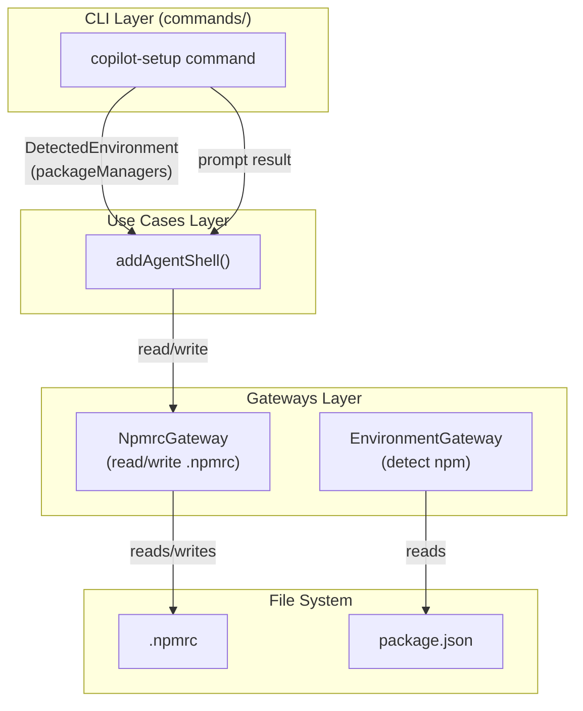
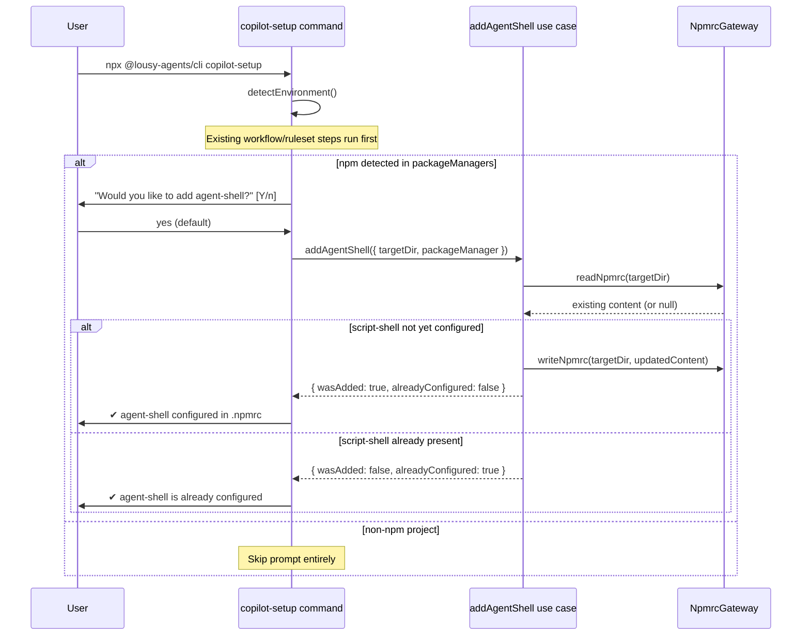

# Feature: `copilot-setup` command offers to add agent-shell for npm users

## Problem Statement

npm users who run `npx @lousy-agents/cli copilot-setup` gain a workflow that configures GitHub Copilot's environment, but they miss out on agent-shell's observability capabilities. Without agent-shell, there is no structured audit trail of which npm scripts ran, who initiated them, or whether they succeeded during Copilot coding sessions. This feature integrates the agent-shell setup offer into the existing `copilot-setup` command so npm users can enable observability in a single guided step.

## Personas

| Persona | Impact | Notes |
| --------- | -------- | ------- |
| Software Engineer Learning Vibe Coding | Positive | Primary user — gets prompted to enable agent-shell telemetry with a single keypress |
| Platform Engineer | Positive | Can ensure agent-shell is consistently configured across npm repositories |
| Team Lead | Positive | Can guide team members to enable observability as part of Copilot setup |

## Value Assessment

- **Primary value**: Efficiency — Eliminates the manual steps of installing and configuring agent-shell for npm users
- **Secondary value**: Customer — Improves retention by surfacing agent-shell's value at the right moment in the Copilot setup flow

## User Stories

### Story 1: Prompt to add agent-shell for npm projects

As a **Software Engineer Learning Vibe Coding**,
I want **to be prompted to add agent-shell when I run `npx @lousy-agents/cli copilot-setup` in an npm project**,
so that I can **enable npm script observability with minimal effort**.

#### Acceptance Criteria

- When the user runs `copilot-setup` and the project is detected as an npm project, the system shall prompt the user with "Would you like to add agent-shell to observe npm script execution?"
- The system shall default the prompt to "yes"
- When the user accepts, the system shall add `script-shell=agent-shell` to the project's `.npmrc` file
- When the user accepts and `.npmrc` does not exist, the system shall create the file with the `script-shell` entry
- When the user accepts and `.npmrc` already contains a `script-shell` entry, the system shall skip the update and inform the user that agent-shell is already configured
- When the user declines, the system shall skip the update and inform the user that agent-shell setup was skipped
- When the project is not an npm project (no `package.json` or uses yarn/pnpm), the system shall skip the prompt entirely
- The system shall display a success message after adding the `script-shell` entry

#### Notes

- The `script-shell` line to add is: `script-shell=agent-shell`
- `agent-shell` must be installed globally (`npm install -g @lousy-agents/agent-shell`) so it resolves via PATH independently of the project's `node_modules`
- Detection of npm project is based on the `packageManagers` array in the detected environment (type must be `"npm"`)
- The prompt should appear after the workflow setup steps and ruleset check

---

## Design

> Refer to `.github/copilot-instructions.md` for technical standards.

### Components Affected

- `packages/core/src/gateways/npmrc-gateway.ts` — New gateway: reads and writes `.npmrc` files
- `packages/core/src/gateways/index.ts` — Export the new gateway
- `packages/core/src/use-cases/add-agent-shell.ts` — New use case: checks npm detection and orchestrates `.npmrc` update
- `packages/cli/src/commands/copilot-setup.ts` — Updated to prompt and call the new use case after existing steps

### Dependencies

- `@lousy-agents/core/gateways/index.js` (existing, new export added)
- `@lousy-agents/agent-shell` (runtime dependency installed by the user, not this tool)
- `file-system-utils.ts` (existing, for `resolveSafePath` and `fileExists`)

### Data Model Changes

No new entities required. The `DetectedEnvironment.packageManagers` field (from `entities/copilot-setup.ts`) is already sufficient to determine whether the project uses npm.

### Diagrams

#### Data Flow Diagram

#### Sequence Diagram

### Open Questions

- [ ] Should the command also add `.agent-shell/` to `.gitignore` as part of this setup? (out of scope for this task, potential follow-on)
- [ ] Should the command install `@lousy-agents/agent-shell` automatically, or just configure `.npmrc`? (out of scope; user installs manually)

---

## Tasks

> Each task should be completable in a single coding agent session.
> Tasks are sequenced by dependency. Complete in order unless noted.

### Task 1: Create NpmrcGateway

- [x] **Objective**: Implement a file system gateway that reads and writes `.npmrc` files safely.

**Context**: The gateway handles all file system I/O for `.npmrc` operations and uses `resolveSafePath` from file-system-utils to prevent path traversal attacks.

**Affected files**:
- `packages/core/src/gateways/npmrc-gateway.ts` (new)
- `packages/core/src/gateways/npmrc-gateway.test.ts` (new)
- `packages/core/src/gateways/index.ts` (updated)

**Requirements**:
- When `.npmrc` exists, `readNpmrc` shall return its text content
- When `.npmrc` does not exist, `readNpmrc` shall return `null`
- `writeNpmrc` shall write the given content to `.npmrc`, creating the file if needed
- All paths must be resolved via `resolveSafePath` (path traversal protection)

**Verification**:
- [ ] `mise run test` passes
- [ ] `mise run format-check` passes

**Done when**:
- [x] All verification steps pass
- [x] Acceptance criteria "reads and writes `.npmrc`" satisfied
- [x] Code follows patterns in `.github/copilot-instructions.md`

---

### Task 2: Create addAgentShell use case

- [x] **Objective**: Implement a use case that checks whether agent-shell is already configured and updates `.npmrc` when it is not.

**Context**: This use case encapsulates the business logic so that the CLI command stays thin and testable.

**Affected files**:
- `packages/core/src/use-cases/add-agent-shell.ts` (new)
- `packages/core/src/use-cases/add-agent-shell.test.ts` (new)

**Requirements**:
- When `packageManager.type === "npm"` and `.npmrc` does not contain `script-shell`, the use case shall add the entry and return `{ wasAdded: true, alreadyConfigured: false }`
- When `.npmrc` already contains `script-shell=`, the use case shall return `{ wasAdded: false, alreadyConfigured: true }` without modifying the file
- The use case shall define and accept a `NpmrcGateway` port

**Verification**:
- [ ] `mise run test` passes

**Done when**:
- [x] All verification steps pass
- [x] Acceptance criteria for Story 1 ("already configured" and "adds entry") satisfied
- [x] Code follows patterns in `.github/copilot-instructions.md`

---

### Task 3: Integrate prompt into copilot-setup command

- [x] **Objective**: Update the `copilot-setup` command to detect npm projects and prompt the user to add agent-shell.

**Depends on**: Task 1, Task 2

**Affected files**:
- `packages/cli/src/commands/copilot-setup.ts` (updated)
- `packages/cli/src/commands/copilot-setup.test.ts` (updated)

**Requirements**:
- When the detected environment includes an npm package manager, the command shall prompt "Would you like to add agent-shell to observe npm script execution?"
- The prompt shall default to "yes"
- When the user accepts, the command shall call `addAgentShell` and display a success or "already configured" message
- When the user declines, the command shall display a skip message
- When the detected environment does not include npm, the command shall skip the prompt entirely

**Verification**:
- [ ] `mise run test` passes
- [ ] `mise run format-check` passes

**Done when**:
- [x] All verification steps pass
- [x] All acceptance criteria in Story 1 satisfied
- [x] Code follows patterns in `.github/copilot-instructions.md`

---

## Out of Scope

- Automatic installation of `@lousy-agents/agent-shell` as a dev dependency
- Adding `.agent-shell/` to `.gitignore`
- Support for yarn or pnpm equivalents (npm only for this iteration)

## Future Considerations

- Offer agent-shell setup for yarn and pnpm users
- Automatically add `.agent-shell/` to `.gitignore` as part of this setup step
- Optionally install `@lousy-agents/agent-shell` automatically via `npm install -g`
