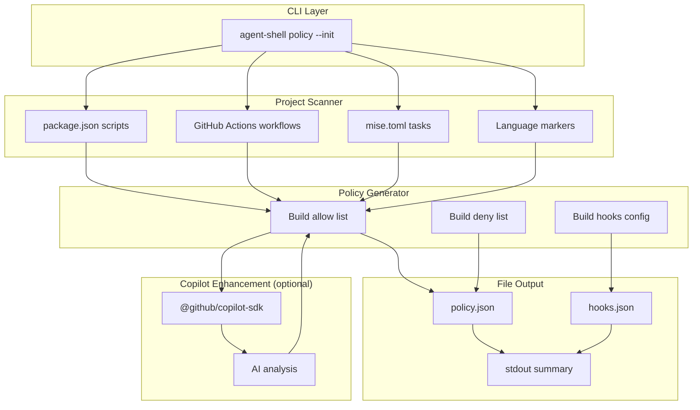
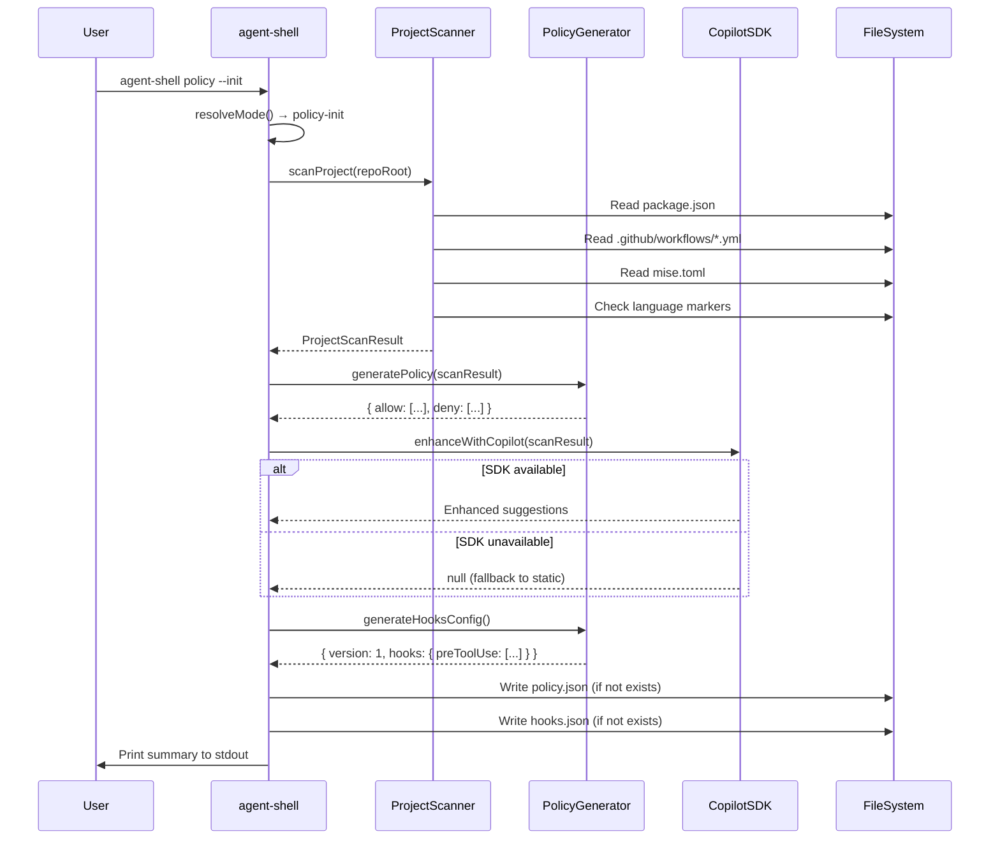

# Feature: agent-shell `policy --init` — Dynamic Project Discovery and Policy Generation

## Table of Contents

- [Problem Statement](#problem-statement)
- [Personas](#personas)
- [Value Assessment](#value-assessment)
- [User Stories](#user-stories)
- [Design](#design)
  - [Components Affected](#components-affected)
  - [Dependencies](#dependencies)
  - [Diagrams](#diagrams)
- [Tasks](#tasks)
- [Out of Scope](#out-of-scope)
- [Future Considerations](#future-considerations)

---

## Problem Statement

When a developer sets up agent-shell for policy-based command blocking, they must manually create both a `policy.json` allow/deny list and a `hooks.json` configuration file. This requires inspecting the project to understand which terminal commands are used by the build system, CI workflows, and development tools — a tedious and error-prone process that discourages adoption. The `policy --init` command automates this by dynamically discovering the project's tools and generating a proposed policy and hook configuration.

## Personas

| Persona | Impact | Notes |
| --- | --- | --- |
| Software Engineer Learning Vibe Coding | Positive | Primary user — gets a working policy and hook config in one command |
| Platform Engineer | Positive | Can bootstrap team-wide policies from actual project usage |

## Value Assessment

- **Primary value**: Efficiency — Eliminates manual inspection and configuration of policy files
- **Secondary value**: Customer — Reduces barrier to adopting agent-shell policy enforcement

## User Stories

### Story 1: Initialize policy from project discovery

As a **Software Engineer Learning Vibe Coding**,
I want **to run `agent-shell policy --init` and have it scan my project to generate a policy and hook configuration**,
so that I can **immediately start using policy-based command blocking without manual configuration**.

#### Acceptance Criteria

- When the user runs `agent-shell policy --init` in a git repository, the system shall scan the project to discover npm scripts from `package.json`, run commands from GitHub Actions workflow files, and tasks from `mise.toml`.
- When scanning is complete, the system shall generate a `policy.json` file at `.github/hooks/agent-shell/policy.json` containing an allow list derived from discovered commands and a deny list of commonly dangerous patterns.
- When scanning is complete, the system shall generate a `hooks.json` file at `.github/copilot/hooks.json` containing a preToolUse hook entry that invokes `agent-shell policy-check`.
- If `.github/hooks/agent-shell/policy.json` already exists, then the system shall skip writing the policy file and inform the user.
- If `.github/copilot/hooks.json` already exists, then the system shall skip writing the hooks file and inform the user.
- When the files are generated, the system shall print the proposed policy and hook configuration to stdout for user review.
- While the `@github/copilot-sdk` is available and authenticated, the system shall use AI-powered analysis to enhance the discovered allow list with additional suggestions.
- If the `@github/copilot-sdk` is not available or fails to connect, then the system shall fall back to static file analysis without error.

#### Notes

- The `policy --init` command is designed for one-time setup during project onboarding
- Generated files should be committed to version control for team-wide enforcement
- The command requires being run inside a git repository (uses `git rev-parse --show-toplevel`)

### Story 2: Discover programming languages and build tools

As a **Platform Engineer**,
I want **the policy init to detect which programming languages and tools my project uses**,
so that I can **get language-appropriate allow rules in the generated policy**.

#### Acceptance Criteria

- When the project contains `package.json`, the system shall detect Node.js and include npm command patterns in the allow list.
- When the project contains `requirements.txt`, `Pipfile`, or `pyproject.toml`, the system shall detect Python.
- When the project contains `go.mod`, the system shall detect Go.
- When the project contains `Cargo.toml`, the system shall detect Rust.
- When the project contains `Gemfile`, the system shall detect Ruby.
- When the project contains `pom.xml` or `build.gradle`, the system shall detect Java.
- When the project contains `mise.toml`, the system shall discover task definitions and include `mise run <task>*` patterns.

---

## Design

### Components Affected

- `packages/agent-shell/src/mode.ts` — Add `policy-init` mode type and parsing
- `packages/agent-shell/src/project-scanner.ts` — New module: scans project for tools, commands, languages
- `packages/agent-shell/src/policy-init.ts` — New module: orchestrates scanning, generates policy and hooks config, writes files
- `packages/agent-shell/src/copilot-enhance.ts` — New module: optional AI-enhanced analysis via `@github/copilot-sdk`
- `packages/agent-shell/src/index.ts` — Wire up `policy-init` case in main switch, update USAGE text
- `packages/agent-shell/rspack.config.ts` — Mark `@github/copilot-sdk` as external dependency

### Dependencies

- `@github/copilot-sdk` (new, external — not bundled, loaded at runtime for AI-enhanced analysis)
- `zod` (existing)
- `node:fs/promises` (existing)
- `node:path` (existing)

### Diagrams

#### Data Flow Diagram

#### Sequence Diagram

---

## Tasks

### Task 1: Add `policy-init` mode to CLI argument parser

**Objective**: Extend the mode parser to recognize `policy --init` as a new subcommand.

**Context**: The mode parser is the entry point for all CLI commands. This must be added before the passthrough check to ensure `policy --init` is not swallowed by passthrough mode.

**Affected files**:
- `packages/agent-shell/src/mode.ts`
- `packages/agent-shell/tests/shim.test.ts`

**Requirements**:
- When `policy --init` is provided, resolveMode returns `{ type: "policy-init" }`
- When `policy` alone is provided, resolveMode returns `{ type: "usage" }`
- `policy --init` takes precedence over AGENTSHELL_PASSTHROUGH=1

**Verification**:
- [x] `npm test packages/agent-shell/tests/shim.test.ts` passes
- [x] `npx biome check packages/agent-shell/src/mode.ts` passes

**Done when**:
- [x] All verification steps pass
- [x] Mode type added and tested

---

### Task 2: Create project scanner module

**Depends on**: None (independent)

**Objective**: Implement static file analysis to discover npm scripts, workflow commands, mise tasks, and programming languages.

**Affected files**:
- `packages/agent-shell/src/project-scanner.ts` (new)
- `packages/agent-shell/tests/project-scanner.test.ts` (new)

**Requirements**:
- Discovers scripts from `package.json`
- Extracts run commands from GitHub Actions workflow YAML files
- Parses `mise.toml` for task definitions
- Detects programming languages from file markers (package.json, go.mod, Cargo.toml, etc.)
- Handles missing files and malformed content gracefully

**Verification**:
- [x] `npm test packages/agent-shell/tests/project-scanner.test.ts` passes
- [x] `npx biome check packages/agent-shell/src/project-scanner.ts` passes

**Done when**:
- [x] All verification steps pass
- [x] Scanner handles all discovery sources
- [x] Graceful degradation for missing/malformed files

---

### Task 3: Create policy generator and init handler

**Depends on**: Task 2

**Objective**: Generate a policy.json from scan results and a hooks.json for preToolUse, write both to disk.

**Affected files**:
- `packages/agent-shell/src/policy-init.ts` (new)
- `packages/agent-shell/tests/policy-init.test.ts` (new)

**Requirements**:
- Generates allow list from discovered commands with wildcard patterns
- Includes default safe commands (git, cat, ls, etc.)
- Includes standard deny rules (rm -rf, sudo, etc.)
- Generates hooks.json with agent-shell policy-check as preToolUse hook
- Does not overwrite existing files
- Prints summary to stdout

**Verification**:
- [x] `npm test packages/agent-shell/tests/policy-init.test.ts` passes
- [x] `npx biome check packages/agent-shell/src/policy-init.ts` passes

**Done when**:
- [x] All verification steps pass
- [x] Policy generation produces correct allow/deny rules
- [x] Existing files are not overwritten

---

### Task 4: Add @github/copilot-sdk integration

**Depends on**: Task 3

**Objective**: Optionally enhance policy generation with AI analysis via the Copilot SDK.

**Affected files**:
- `packages/agent-shell/src/copilot-enhance.ts` (new)
- `packages/agent-shell/rspack.config.ts`
- `packages/agent-shell/package.json`

**Requirements**:
- Uses @github/copilot-sdk for AI-powered project analysis when available
- Falls back gracefully to static analysis when SDK is not available
- SDK is marked as external in rspack config (not bundled)
- Parses AI response to extract additional allow rules and suggestions

**Verification**:
- [x] `npx biome check packages/agent-shell/src/copilot-enhance.ts` passes
- [x] Existing tests still pass (SDK falls back gracefully in test environment)

**Done when**:
- [x] All verification steps pass
- [x] Copilot enhancement is optional and non-breaking

---

### Task 5: Wire up policy-init in main entry point

**Depends on**: Tasks 1, 3, 4

**Objective**: Connect the policy-init mode to the main CLI entry point.

**Affected files**:
- `packages/agent-shell/src/index.ts`

**Requirements**:
- `policy-init` case in main switch calls handlePolicyInit
- USAGE text updated to include `policy --init`
- Error handling wraps the handler

**Verification**:
- [x] `npm test` passes (all agent-shell tests)
- [x] `npx biome check packages/agent-shell/src/index.ts` passes

**Done when**:
- [x] All verification steps pass
- [x] End-to-end flow works

---

## Out of Scope

- Windows/PowerShell specific handling
- Policy file validation/linting (separate feature)
- Interactive prompts for customizing generated policy
- Claude Code settings.json generation (Copilot hooks.json only)

## Future Considerations

- Interactive mode for reviewing and customizing generated rules before writing
- `policy --update` to re-scan and merge new discoveries into existing policy
- Integration with `lousy-agents init` CLI command for unified setup
- Support for additional build tools (Makefile, Justfile, Taskfile)
- Policy templates for common project archetypes (Node.js, Python, Go, etc.)
