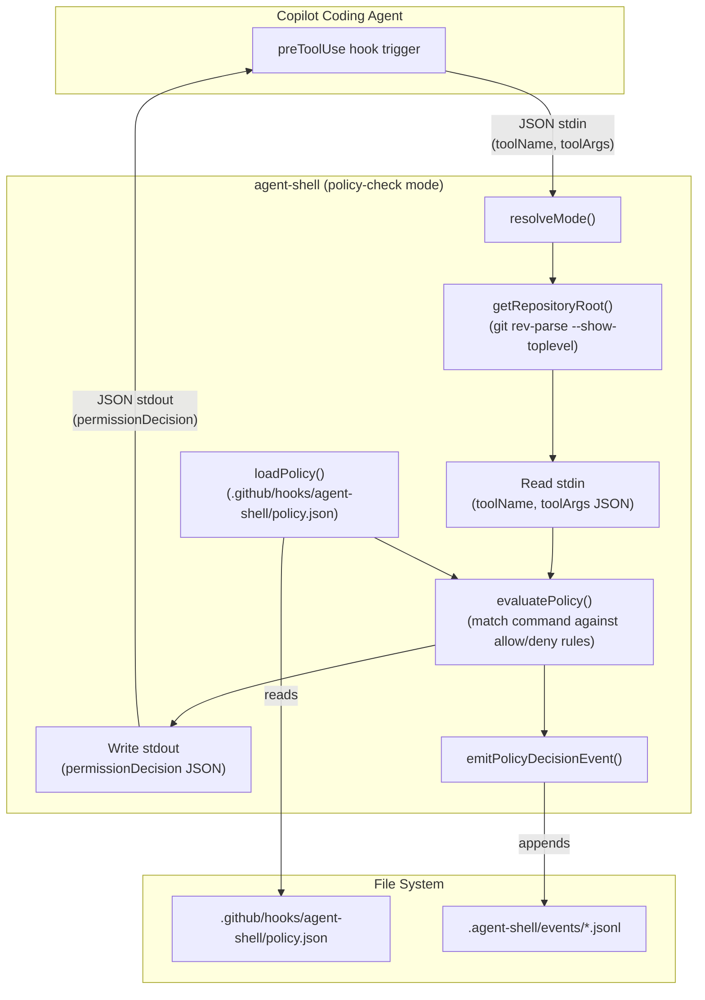
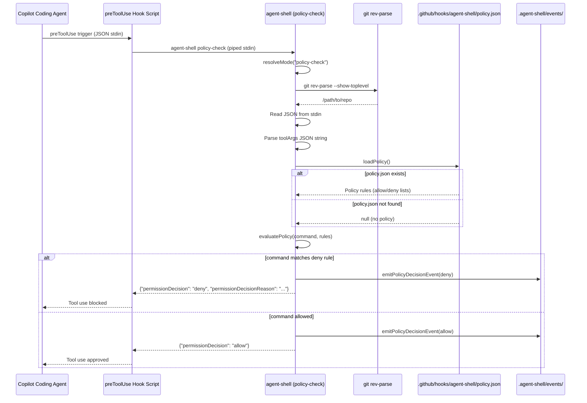

# Feature: agent-shell `preToolUse` hook support for policy-based command blocking

## Problem Statement

When AI coding agents (such as GitHub Copilot coding agent) execute terminal commands (npm scripts, terraform, shell commands, etc.) via agent-shell, there is no mechanism to prevent specific commands from running before they start. Agent-shell currently records telemetry _after_ execution completes, but cannot intercept and block commands that violate repository-level policies. Repository maintainers need a way to define which commands are allowed or denied, and have those policies enforced at the `preToolUse` hook point — before the agent invokes a tool — so that disallowed commands are blocked rather than observed after the fact.

## Personas

| Persona | Impact | Notes |
|---------|--------|-------|
| Software Engineer Learning Vibe Coding | Positive | Primary user — gains guardrails that prevent unintended script execution during agent sessions |
| Platform Engineer | Positive | Can define and enforce repository-level policies for what commands agents are allowed to run |
| Team Lead | Positive | Gains confidence that agent sessions respect team-defined constraints without manual monitoring |

## Value Assessment

- **Primary value**: Future — Prevents unintended side effects from agent-executed commands before they happen, reducing incident response and rollback effort
- **Secondary value**: Efficiency — Eliminates the need for manual monitoring of agent sessions to catch disallowed commands

## User Stories

### Story 1: Block a disallowed npm script via preToolUse hook

As a **Platform Engineer**,
I want **to configure agent-shell with a policy that blocks specific npm commands when an agent tries to use them**,
so that I can **enforce repository-level constraints on what agents are allowed to execute**.

#### Acceptance Criteria

- When the hook receives JSON on stdin with `toolName` and `toolArgs` fields, the system shall return JSON on stdout with `permissionDecision` and `permissionDecisionReason` (required when denying) fields, per the [official GitHub Copilot hooks documentation](https://docs.github.com/en/copilot/reference/hooks-configuration#pre-tool-use-hook).

- When agent-shell is invoked in `policy-check` mode, the system shall evaluate input in the following order: (1) parse stdin as JSON (fail-closed if invalid), (2) extract `toolName` and parse `toolArgs` JSON string (fail-closed if `toolArgs` is not valid JSON), (3) load and validate policy file (fail-closed if invalid JSON; allow-all if missing), (4) check if `toolName` is `bash` or a terminal tool (fail-open to allow if not a terminal tool and policy is valid), (5) validate `command` exists in parsed `toolArgs` and is a string (fail-closed if not), (6) evaluate deny rules first (deny if match), then evaluate allow rules if allow list exists (deny if no match), otherwise allow.
- When the tool input contains a command that matches any deny rule in the agent-shell policy, the system shall write a JSON response to stdout with `{"permissionDecision":"deny","permissionDecisionReason":"..."}`.
- When the tool input contains a command that does not match any deny rule (and matches an allow rule if allow list exists), the system shall write a JSON response to stdout with `{"permissionDecision":"allow"}`.
- If the policy configuration file does not exist, then the system shall approve all tool uses by default.
- If the policy configuration file exists but contains invalid JSON, then the system shall write a deny JSON response to stdout with an error description and write the error details to stderr (fail-closed: policy errors block execution).
- If stdin contains data that is not valid JSON, then the system shall write a deny JSON response to stdout with a descriptive error message and write the parse error details to stderr (fail-closed: JSON parsing must succeed before any other evaluation).
- If the stdin JSON contains `toolName` of `bash` but the parsed `toolArgs` does not contain a `command` field, then the system shall write a deny JSON response to stdout with a descriptive error message (fail-closed for terminal commands with unevaluable input).
- If the stdin JSON contains `toolName` of `bash` but the `command` in `toolArgs` is not a string, then the system shall write a deny JSON response to stdout with a descriptive error message (fail-closed for terminal commands with invalid command type).
- If the stdin contains valid JSON but the `toolName` field is not a terminal tool type (e.g., `bash`), then the system shall write an allow JSON response to stdout (fail-open applies only to successfully parsed JSON with a non-terminal tool name).
- While agent-shell is running in `policy-check` mode, the system shall emit a telemetry event recording the policy decision (allowed or denied) for auditability.
- If telemetry emission fails (e.g., events directory not writable), then the system shall log the error to stderr but shall not change the allow/deny decision or prevent writing the decision JSON to stdout.
- The system shall support exact-match and glob-pattern rules for command strings in both allow and deny lists.
- When evaluating glob patterns, the system shall use the following matching semantics: `*` matches any sequence of characters (including spaces and empty strings), matching is case-sensitive, patterns are anchored to the full command string (the entire command must match the pattern, not a substring), and only `*` is a special character (all other characters including `.`, `?`, `[`, `]`, etc. shall match literally).
- The system shall discover the repository root using `git rev-parse --show-toplevel` rather than relying on `process.cwd()`.

#### Notes

- The `preToolUse` hook is a GitHub Copilot coding agent feature that runs a configured script before tool execution
- The hook receives JSON on stdin describing the tool and its input, and reads JSON from stdout for the decision
- agent-shell must be available on PATH (globally installed) to function as a hook script
- The policy configuration file location defaults to `.github/hooks/agent-shell/policy.json` relative to the repository root (discovered via `git rev-parse --show-toplevel`), but can be overridden via the `AGENTSHELL_POLICY_PATH` environment variable. Relative paths in `AGENTSHELL_POLICY_PATH` shall be resolved relative to the repository root (from `git rev-parse --show-toplevel`); absolute paths are used as-is.
- Deny rules take precedence over allow rules
- If an allow list is present and the command does not match any allow rule, the command is denied

### Story 2: Configure preToolUse hook to use agent-shell

As a **Software Engineer Learning Vibe Coding**,
I want **to configure my repository's `.github/hooks/` to use agent-shell for `preToolUse` evaluation**,
so that I can **have agent-shell enforce command policies before the agent executes tools**.

#### Acceptance Criteria

- When the user creates a `.github/hooks/hooks.json` file with a `preToolUse` array containing a command entry that executes `agent-shell policy-check`, the system shall be invocable by the Copilot coding agent's hook mechanism.
- The agent-shell `policy-check` mode shall be compatible with the Copilot coding agent's `preToolUse` hook contract (JSON stdin with `toolName`/`toolArgs`, JSON stdout with `permissionDecision`/`permissionDecisionReason`).
- When agent-shell is referenced in the hook configuration, the system shall execute without requiring additional dependencies beyond the globally installed agent-shell binary and platform-default shell (POSIX-compatible `sh` on Unix/macOS, PowerShell on Windows).
- The `copilot-setup` CLI command shall provide an option to scaffold `.github/hooks/` with agent-shell preToolUse integration, including the hooks.json configuration and policy check scripts.

#### Notes

- The hook configuration file is `.github/hooks/hooks.json` (per official GitHub documentation)
- The hook script at `.github/hooks/agent-shell/policy-check.sh` invokes `agent-shell policy-check`
- The `copilot-setup` command shall offer a sub-choice for adding agent-shell preToolUse hook support

### Story 3: Audit blocked commands via telemetry

As a **Team Lead**,
I want **to see which commands were blocked by agent-shell policy during an agent session**,
so that I can **understand what the agent attempted and verify that policies are working as expected**.

#### Acceptance Criteria

- When a policy decision is made (allow or deny), the system shall emit a `policy_decision` telemetry event to the events directory (defaults to `.agent-shell/events` unless `AGENTSHELL_LOG_DIR` is set).
- The `policy_decision` event shall include the command that was evaluated, the policy rule that matched (if any), the decision (allow or deny), and the actor.
- When the user runs `agent-shell log`, the system shall display policy decision events alongside script execution events.
- When the user runs `agent-shell log --failures`, the system shall include denied policy decisions in the results.

#### Notes

- The telemetry event schema extends the existing base fields (v, session_id, command, actor, timestamp, env, tags)
- Policy decision events use a new event type `policy_decision` with additional fields: `decision` (allow/deny), `matched_rule` (the pattern that matched, if any)

---

## Design

> Refer to `.github/copilot-instructions.md` for technical standards.

### Components Affected

- `packages/agent-shell/src/mode.ts` — Add `policy-check` mode to the CLI argument parser
- `packages/agent-shell/src/index.ts` — Add `policy-check` case to the main switch that orchestrates stdin reading, policy evaluation, and stdout writing
- `packages/agent-shell/src/policy.ts` — New module: loads and evaluates policy rules against a command
- `packages/agent-shell/src/types.ts` — Extend with `PolicyDecisionEvent` schema and `PolicyConfig` schema
- `packages/agent-shell/src/telemetry.ts` — Add `emitPolicyDecisionEvent` function

### Dependencies

- `zod` (existing, for policy config schema validation)
- `node:fs/promises` (existing, for reading policy file)
- `node:path` (existing, for resolving policy file path)
- `packages/agent-shell/src/path-utils.ts` (existing, for safe path resolution)

### Data Model Changes

#### Policy Configuration Schema

The policy file defaults to `.github/hooks/agent-shell/policy.json` (relative to repository root) but can be overridden via the `AGENTSHELL_POLICY_PATH` environment variable set in the hook configuration.

```json
{
  "allow": [
    "npm test",
    "npm run lint*"
  ],
  "deny": [
    "npm run deploy*",
    "terraform destroy*",
    "rm -rf *"
  ]
}
```

| Field | Type | Description |
|-------|------|-------------|
| `allow` | `string[]` | (Optional) Array of command patterns to explicitly allow. If specified, commands must match an allow rule to proceed. |
| `deny` | `string[]` | Array of command patterns to block. Deny rules take precedence over allow rules. |

**Evaluation order**: (1) If the command matches any deny rule, deny. (2) If an allow list exists and the command does not match any allow rule, deny. (3) Otherwise, allow.

#### preToolUse Hook Input (stdin)

Based on the [official GitHub Copilot hooks documentation](https://docs.github.com/en/copilot/reference/hooks-configuration#pre-tool-use-hook):

```json
{
  "timestamp": 1704614600000,
  "cwd": "/path/to/project",
  "toolName": "bash",
  "toolArgs": "{\"command\":\"npm run foo\",\"description\":\"Run foo script\"}"
}
```

| Field | Type | Description |
|-------|------|-------------|
| `timestamp` | `number` | Unix timestamp in milliseconds |
| `cwd` | `string` | Current working directory of the hook execution |
| `toolName` | `string` | Name of the tool being invoked (e.g., `bash`) |
| `toolArgs` | `string` | JSON-encoded string containing tool arguments (must be parsed) |

**Note**: The `toolArgs` field is a JSON-encoded string that must be parsed to extract the `command` field for policy evaluation.

#### preToolUse Hook Output (stdout)

Based on the [official GitHub Copilot hooks documentation](https://docs.github.com/en/copilot/reference/hooks-configuration#pre-tool-use-hook):

Approved:

```json
{
  "permissionDecision": "allow"
}
```

Denied:

```json
{
  "permissionDecision": "deny",
  "permissionDecisionReason": "Command 'npm run foo' is blocked by agent-shell policy (matched rule: 'npm run foo')"
}
```

| Field | Type | Description |
|-------|------|-------------|
| `permissionDecision` | `"allow" \| "deny"` | The decision for the tool invocation |
| `permissionDecisionReason` | `string` | (Required when denying) Human-readable reason for the denial |

#### Policy Decision Telemetry Event

```json
{
  "v": 1,
  "session_id": "uuid",
  "event": "policy_decision",
  "command": "npm run foo",
  "actor": "copilot",
  "decision": "deny",
  "matched_rule": "npm run foo",
  "timestamp": "2026-03-14T14:00:00.000Z",
  "env": {},
  "tags": {}
}
```

### Diagrams

#### Data Flow Diagram



#### Sequence Diagram



### Hook Configuration

Based on the [official GitHub Copilot hooks documentation](https://docs.github.com/en/copilot/reference/hooks-configuration#pre-tool-use-hook):

#### `.github/hooks/hooks.json`

```json
{
  "version": 1,
  "hooks": {
    "preToolUse": [
      {
        "type": "command",
        "bash": "./.github/hooks/agent-shell/policy-check.sh",
        "powershell": "./.github/hooks/agent-shell/policy-check.ps1",
        "cwd": ".",
        "timeoutSec": 5,
        "env": {
          "AGENTSHELL_POLICY_PATH": ".github/hooks/agent-shell/policy.json"
        }
      }
    ]
  }
}
```

| Field | Type | Description |
|-------|------|-------------|
| `version` | `number` | Hook schema version (currently `1`) |
| `hooks.preToolUse` | `array` | Array of hooks to run before tool invocation |
| `type` | `"command"` | Hook type |
| `bash` | `string` | Path to shell script (Unix/macOS) |
| `powershell` | `string` | Path to PowerShell script (Windows) |
| `cwd` | `string` | Working directory for script execution |
| `timeoutSec` | `number` | Maximum execution time in seconds (recommended: ≤5 seconds per hook) |
| `env` | `object` | Environment variables to pass to the hook script |

> **Performance Note**: Hooks run synchronously and block agent execution. Keep execution time under 5 seconds when possible.

#### `.github/hooks/agent-shell/policy-check.sh`

```sh
#!/usr/bin/env sh
exec agent-shell policy-check
```

#### `.github/hooks/agent-shell/policy-check.ps1`

```powershell
& agent-shell policy-check
```

#### Hook Configuration Zod Schema

A Zod schema shall be defined for validating hook configurations, enabling future hook configuration linting:

```typescript
const HookCommandSchema = z.object({
  type: z.literal("command"),
  bash: z.string().optional(),
  powershell: z.string().optional(),
  cwd: z.string().optional(),
  timeoutSec: z.number().positive().optional(),
  env: z.record(z.string()).optional(),
}).refine(
  (data) => data.bash !== undefined || data.powershell !== undefined,
  { message: "At least one of 'bash' or 'powershell' must be provided" }
);

const HooksConfigSchema = z.object({
  version: z.literal(1),
  hooks: z.object({
    sessionStart: z.array(HookCommandSchema).optional(),
    userPromptSubmitted: z.array(HookCommandSchema).optional(),
    preToolUse: z.array(HookCommandSchema).optional(),
    postToolUse: z.array(HookCommandSchema).optional(),
    sessionEnd: z.array(HookCommandSchema).optional(),
  }),
});
```

### Open Questions (Resolved)

The following questions have been resolved based on user decisions:

- [x] ~~What is the exact JSON contract for GitHub Copilot coding agent `preToolUse` hooks?~~ **Resolved**: See [official documentation](https://docs.github.com/en/copilot/reference/hooks-configuration#pre-tool-use-hook). Input uses `timestamp`, `cwd`, `toolName`, `toolArgs`; output uses `permissionDecision`, `permissionDecisionReason`.
- [x] ~~Should the policy support an `allow` list in addition to `deny`?~~ **Resolved**: Yes, support both allow and deny lists. Deny rules take precedence.
- [x] ~~Should the policy file location be configurable via an environment variable?~~ **Resolved**: Yes, use `AGENTSHELL_POLICY_PATH` environment variable (set via hook config `env` field). Default location is `.github/hooks/agent-shell/policy.json`.
- [x] ~~Should `policy-check` mode also support non-npm tool types?~~ **Resolved**: Yes, support all terminal/bash command types (e.g., terraform, npm, shell commands).

### Additional Design Decisions

- **Repository root discovery**: Use `git rev-parse --show-toplevel` as the source of truth for repository root, rather than relying on `process.cwd()`.
- **Hook configuration schema**: Define a Zod schema for validating hook configurations to enable future linting capabilities.
- **`copilot-setup` integration**: Add hook provisioning to the `copilot-setup` CLI command, starting with agent-shell for preToolUse.

---

## Tasks

> Each task should be completable in a single coding agent session.
> Tasks are sequenced by dependency. Complete in order unless noted.

### Task 0: Verify Copilot preToolUse hook contract

**Objective**: ~~Verify the exact JSON stdin/stdout contract for GitHub Copilot coding agent `preToolUse` hooks before implementing schemas or tests.~~ **COMPLETED** — Contract verified via official documentation.

**Context**: ~~The spec's Data Model section documents an assumed JSON shape for hook input and output. This assumption must be verified against official Copilot documentation to avoid implementing the wrong interface. This task is a prerequisite for all other tasks.~~ The hook contract has been verified using the [official GitHub Copilot hooks documentation](https://docs.github.com/en/copilot/reference/hooks-configuration#pre-tool-use-hook).

**Affected files**:
- `.github/specs/agent-shell-pre-tool-use-hook.spec.md` (updated — ~~confirm or correct the assumed JSON shapes~~ **DONE**)

**Requirements**:
- ~~Locate and review official GitHub Copilot documentation for `preToolUse` hook contracts~~ **DONE**
- ~~Verify the stdin JSON shape (`tool_name`, `tool_input.command`, etc.) matches the documented contract~~ **DONE** — Uses `timestamp`, `cwd`, `toolName`, `toolArgs`
- ~~Verify the stdout JSON shape (`decision`, `message`, etc.) matches the documented contract~~ **DONE** — Uses `permissionDecision`, `permissionDecisionReason`
- ~~If the documented contract differs from assumptions, update the Data Model section and all dependent tasks~~ **DONE**
- ~~If documentation is not yet publicly available, document this as a known risk and proceed with assumptions~~ N/A — Documentation is available

**Verification**:
- [x] Data Model section accurately reflects the documented hook contract
- [x] No assumptions remain — official documentation is referenced

**Done when**:
- [x] Hook contract is verified against documentation

---

### Task 1: Define policy configuration schema and types

**Objective**: Define the Zod schemas for the policy configuration file, hook configuration file, and the policy decision telemetry event type.

**Context**: This task establishes the data types that all other tasks depend on. The policy config schema validates `.github/hooks/agent-shell/policy.json`, the hook config schema validates `.github/hooks/hooks.json`, and the event schema extends the existing telemetry types.

**Affected files**:
- `packages/agent-shell/src/types.ts` (updated — add `PolicyConfigSchema`, `PolicyDecisionEventSchema`, `HooksConfigSchema`)
- `packages/agent-shell/tests/types.test.ts` (updated — add validation tests for new schemas)

**Requirements**:
- The `PolicyConfigSchema` shall validate a JSON object with optional `allow` and optional `deny` arrays of strings (both default to empty arrays when not provided)
- The `HooksConfigSchema` shall validate the GitHub Copilot hooks configuration format with version and hooks object
- The `PolicyDecisionEventSchema` shall extend the existing base fields with `decision` (allow/deny) and `matched_rule` (string, optional)
- The `ScriptEventSchema` discriminated union shall include the new `PolicyDecisionEvent` variant
- When invalid data is provided, Zod shall reject it with descriptive errors

**Verification**:
- [ ] `npm test packages/agent-shell/tests/types.test.ts` passes
- [ ] `npx biome check packages/agent-shell/src/types.ts` passes

**Done when**:
- [ ] All verification steps pass
- [ ] `PolicyConfigSchema`, `HooksConfigSchema`, and `PolicyDecisionEventSchema` are exported and tested
- [ ] Code follows patterns in `.github/copilot-instructions.md`

---

### Task 2: Implement repository root discovery

**Objective**: Create a utility function to discover the repository root using `git rev-parse --show-toplevel`.

**Depends on**: None

**Context**: Policy file paths should be resolved relative to the repository root, not the current working directory. This ensures consistent behavior regardless of where the hook is invoked from.

**Affected files**:
- `packages/agent-shell/src/git-utils.ts` (new)
- `packages/agent-shell/tests/git-utils.test.ts` (new)

**Requirements**:
- `getRepositoryRoot()` shall execute `git rev-parse --show-toplevel` and return the trimmed output
- If `git` command fails (e.g., not in a git repository), the function shall throw a descriptive error
- The function shall cache the result to avoid repeated subprocess calls; the cache shall be scoped to the process lifetime and shall not be persisted between invocations

**Verification**:
- [ ] `npm test packages/agent-shell/tests/git-utils.test.ts` passes
- [ ] `npx biome check packages/agent-shell/src/git-utils.ts` passes

**Done when**:
- [ ] All verification steps pass
- [ ] Repository root is discovered correctly in git repositories
- [ ] Non-git directories produce a clear error
- [ ] Code follows patterns in `.github/copilot-instructions.md`

---

### Task 3: Implement policy loading and evaluation

**Objective**: Create the `policy.ts` module that loads the policy configuration file and evaluates a command against the allow and deny rules.

**Depends on**: Task 1, Task 2

**Context**: This is the core business logic for policy evaluation. It reads the policy file, validates it with Zod, and matches commands against patterns using exact and glob matching. Deny rules take precedence over allow rules.

**Affected files**:
- `packages/agent-shell/src/policy.ts` (new)
- `packages/agent-shell/tests/policy.test.ts` (new)

**Requirements**:
- When a policy file exists and is valid JSON, `loadPolicy` shall return the parsed and validated policy
- When a policy file does not exist, `loadPolicy` shall return `null`
- When a policy file contains invalid JSON, `loadPolicy` shall throw an error with a descriptive message
- When a command matches any deny rule, `evaluatePolicy` shall return `{ decision: "deny", matchedRule: "<rule>" }`
- When a command matches a deny rule with a `*` wildcard, `evaluatePolicy` shall return `{ decision: "deny", matchedRule: "<rule>" }`
- When an allow list exists and the command does not match any allow rule, `evaluatePolicy` shall return `{ decision: "deny", matchedRule: null }`
- When a command does not match any deny rule (and matches an allow rule if present), `evaluatePolicy` shall return `{ decision: "allow" }`
- When the policy is `null` (no file), `evaluatePolicy` shall return `{ decision: "allow" }`
- Before reading the policy file, the system shall attempt to resolve the path using `realpath` to follow any symlinks; if `realpath` returns `ENOENT` (file does not exist), `loadPolicy` shall return `null` (no policy)
- After successful `realpath` resolution, the system shall validate the resolved path is within the repository root (discovered via `git rev-parse --show-toplevel`) using the existing `isWithinProjectRoot` helper (passing the discovered repo root as the "projectRoot" parameter)
- The default policy file path is `.github/hooks/agent-shell/policy.json` relative to the repository root, but can be overridden via the `AGENTSHELL_POLICY_PATH` environment variable
- If the policy file path (after `realpath` resolution) is outside the repository root, `loadPolicy` shall throw a descriptive error and refuse to read the file
- If the policy file is a symlink pointing outside the repository root, `loadPolicy` shall throw a descriptive error (symlink escape prevention)

**Verification**:
- [ ] `npm test packages/agent-shell/tests/policy.test.ts` passes
- [ ] `npx biome check packages/agent-shell/src/policy.ts` passes

**Done when**:
- [ ] All verification steps pass
- [ ] Exact-match and glob-match rules are tested for both allow and deny
- [ ] Missing policy file is handled gracefully
- [ ] Invalid policy file produces a descriptive error
- [ ] `AGENTSHELL_POLICY_PATH` override is supported
- [ ] Path traversal is prevented
- [ ] Symlink escapes are prevented (realpath + isWithinProjectRoot)
- [ ] Code follows patterns in `.github/copilot-instructions.md`

---

### Task 4: Add `policy-check` mode to CLI argument parser

**Objective**: Extend `resolveMode` to recognize the `policy-check` subcommand and return a new mode variant.

**Depends on**: Task 1

**Context**: This task adds the CLI entry point so agent-shell can be invoked as `agent-shell policy-check`. The mode resolution must integrate cleanly with the existing mode types.

**Affected files**:
- `packages/agent-shell/src/mode.ts` (updated — add `policy-check` mode)
- `packages/agent-shell/tests/shim.test.ts` (updated — add mode resolution tests for `policy-check`)

**Requirements**:
- When the first argument is `policy-check`, `resolveMode` shall return `{ type: "policy-check" }` **regardless of the `AGENTSHELL_PASSTHROUGH` environment variable** — passthrough mode must not bypass the policy enforcement check
- The `Mode` union type shall include the new `{ type: "policy-check" }` variant
- The `policy-check` mode check shall occur **before** the `AGENTSHELL_PASSTHROUGH` check in `resolveMode` to ensure it cannot be bypassed
- Existing mode resolution behavior shall not change for non-`policy-check` commands

**Verification**:
- [ ] `npm test packages/agent-shell/tests/shim.test.ts` passes
- [ ] `npx biome check packages/agent-shell/src/mode.ts` passes

**Done when**:
- [ ] All verification steps pass
- [ ] `policy-check` mode is recognized by `resolveMode`
- [ ] Existing modes are unaffected
- [ ] Code follows patterns in `.github/copilot-instructions.md`

---

### Task 5: Add policy decision telemetry emission

**Objective**: Add an `emitPolicyDecisionEvent` function to the telemetry module that records policy evaluation outcomes.

**Depends on**: Task 1

**Context**: This enables auditability of policy decisions. The function follows the same pattern as the existing `emitScriptEndEvent` and `emitShimErrorEvent` functions.

**Affected files**:
- `packages/agent-shell/src/telemetry.ts` (updated — add `emitPolicyDecisionEvent`)
- `packages/agent-shell/tests/telemetry.test.ts` (updated — add tests for new event emission)

**Requirements**:
- `emitPolicyDecisionEvent` shall accept command, decision (allow/deny), matched rule (optional), and environment
- The emitted event shall include all base fields (v, session_id, actor, timestamp, env, tags) plus `decision` and `matched_rule`
- The event shall be appended to the same session JSONL file as other events
- The function shall follow the existing dependency injection pattern (`TelemetryDeps`)

**Verification**:
- [ ] `npm test packages/agent-shell/tests/telemetry.test.ts` passes
- [ ] `npx biome check packages/agent-shell/src/telemetry.ts` passes

**Done when**:
- [ ] All verification steps pass
- [ ] Policy decision events are written to the correct session file
- [ ] Both allow and deny decisions are emitted correctly
- [ ] Code follows patterns in `.github/copilot-instructions.md`

---

### Task 6: Implement `policy-check` mode in main entry point

**Objective**: Wire the `policy-check` mode into the main `index.ts` switch to read stdin, evaluate the policy, emit telemetry, and write the decision to stdout.

**Depends on**: Task 2, Task 3, Task 4, Task 5

**Context**: This is the integration point that connects all the pieces. The main function reads JSON from stdin, loads the policy, evaluates it, emits a telemetry event, and writes the decision to stdout.

**Affected files**:
- `packages/agent-shell/src/index.ts` (updated — add `policy-check` case)
- `packages/agent-shell/tests/integration/policy-check.test.ts` (new — integration tests)

**Requirements**:
- When invoked as `agent-shell policy-check`, the system shall read JSON from stdin
- The system shall parse stdin JSON and extract `toolName` and `toolArgs` fields per the [official hook contract](https://docs.github.com/en/copilot/reference/hooks-configuration#pre-tool-use-hook)
- The system shall parse `toolArgs` (which is a JSON-encoded string) to extract the `command` field
- When stdin contains valid tool input with a command, the system shall load the policy and evaluate the command
- When the command is denied by policy, the system shall write `{"permissionDecision":"deny","permissionDecisionReason":"..."}` to stdout and exit with code 0
- When the command is allowed, the system shall write `{"permissionDecision":"allow"}` to stdout and exit with code 0
- When stdin contains invalid JSON, the system shall write a deny response to stdout and write an error to stderr
- When stdin JSON contains `toolName` of `bash` but `toolArgs` does not contain a `command` field, the system shall write a deny response to stdout with a descriptive error (fail-closed for terminal commands with unevaluable input)
- When `toolName` is not a terminal tool type (e.g., `bash`), the system shall write an allow response to stdout
- When `command` in `toolArgs` is not a string, the system shall write a deny response to stdout with a descriptive error
- When the policy file contains invalid JSON, the system shall write a deny response to stdout and write the error to stderr
- If telemetry emission fails (e.g., events directory not writable), the system shall log the error to stderr but shall still write the decision JSON to stdout and exit with code 0
- If any unexpected runtime error occurs (stdin read failure, policy load crash, unhandled exception), the system shall catch the error, write a deny JSON response to stdout with a generic error message, write error details to stderr, and exit with code 0
- The system shall emit a policy decision telemetry event for every evaluation (best-effort; failures do not block the decision)
- The system shall exit with code 0 in all cases (the hook contract uses the JSON response, not the exit code, for the decision)

**Verification**:
- [ ] `npm test packages/agent-shell/tests/integration/policy-check.test.ts` passes
- [ ] `npx biome check packages/agent-shell/src/index.ts` passes
- [ ] Manual test: `echo '{"timestamp":1704614600000,"cwd":"/path","toolName":"bash","toolArgs":"{\"command\":\"npm run foo\"}"}' | agent-shell policy-check` outputs correct JSON

**Done when**:
- [ ] All verification steps pass
- [ ] End-to-end flow works: stdin → policy evaluation → stdout + telemetry
- [ ] Error cases are handled gracefully
- [ ] Code follows patterns in `.github/copilot-instructions.md`

---

### Task 7: Integrate policy decision events into log query and display

**Objective**: Update the log query and format modules to include policy decision events in output.

**Depends on**: Task 5

**Context**: Users need to see policy decisions when querying the event log. This task ensures `agent-shell log` displays policy decisions alongside existing event types, and that `--failures` includes denied decisions.

**Affected files**:
- `packages/agent-shell/src/log/format.ts` (updated — handle `policy_decision` event type in table formatting)
- `packages/agent-shell/src/log/query.ts` (updated — include `policy_decision` events in query results; treat `deny` as a failure for `--failures` filter)
- `packages/agent-shell/tests/log/format.test.ts` (updated)
- `packages/agent-shell/tests/log/query.test.ts` (updated)

**Requirements**:
- When querying events, `policy_decision` events shall be included in results
- When the `--failures` filter is active, denied policy decisions shall be included
- When formatting events as a table, policy decision events shall display the decision and matched rule
- When formatting events as JSON, policy decision events shall be included as-is

**Verification**:
- [ ] `npm test packages/agent-shell/tests/log/format.test.ts` passes
- [ ] `npm test packages/agent-shell/tests/log/query.test.ts` passes
- [ ] `npx biome check packages/agent-shell/src/log/format.ts packages/agent-shell/src/log/query.ts` passes

**Done when**:
- [ ] All verification steps pass
- [ ] `agent-shell log` shows policy decision events
- [ ] `agent-shell log --failures` includes denied decisions
- [ ] Code follows patterns in `.github/copilot-instructions.md`

---

### Task 8: Update README and USAGE documentation

**Objective**: Document the `policy-check` mode, policy configuration format, and hook setup in the agent-shell README.

**Depends on**: Task 6

**Context**: Users need to know how to configure agent-shell as a preToolUse hook and how to write policy rules.

**Affected files**:
- `packages/agent-shell/README.md` (updated)
- `packages/agent-shell/src/index.ts` (updated — update USAGE string)

**Requirements**:
- The README shall document the `policy-check` subcommand and its purpose
- The README shall include an example `.github/hooks/agent-shell/policy.json` with both allow and deny rules
- The README shall include example `.github/hooks/hooks.json` and hook script configuration per the [official documentation](https://docs.github.com/en/copilot/reference/hooks-configuration#pre-tool-use-hook)
- The USAGE string in `index.ts` shall list `agent-shell policy-check` as a valid subcommand
- The README shall document the telemetry event format for policy decisions
- The README shall document the `AGENTSHELL_POLICY_PATH` environment variable override

**Verification**:
- [ ] `npx biome check packages/agent-shell/src/index.ts` passes
- [ ] README renders correctly in GitHub markdown preview

**Done when**:
- [ ] All verification steps pass
- [ ] Documentation covers setup, configuration, and usage
- [ ] Examples are accurate and copy-pasteable

---

### Task 9: Add `copilot-setup` hook provisioning

**Objective**: Add an option to the `copilot-setup` CLI command to scaffold `.github/hooks/` with agent-shell preToolUse integration.

**Depends on**: Task 8

**Context**: Users should be able to easily configure agent-shell hooks via the existing `copilot-setup` command, rather than manually creating all configuration files.

**Affected files**:
- `packages/cli/src/commands/copilot-setup.ts` (updated — add hook provisioning option)
- `packages/cli/tests/commands/copilot-setup.test.ts` (updated)

**Requirements**:
- The `copilot-setup` command shall offer a sub-choice for adding agent-shell preToolUse hook support
- When selected, the command shall create `.github/hooks/hooks.json` with a preToolUse entry for agent-shell
- When selected, the command shall create both `.github/hooks/agent-shell/policy-check.sh` and `.github/hooks/agent-shell/policy-check.ps1` for cross-platform compatibility
- When selected, the command shall create a default `.github/hooks/agent-shell/policy.json` with example rules
- The command shall not overwrite existing hook files without confirmation
- Dry-run mode shall preview what would be created without writing files

**Verification**:
- [ ] `npm test packages/cli/tests/commands/copilot-setup.test.ts` passes
- [ ] `npx biome check packages/cli/src/commands/copilot-setup.ts` passes

**Done when**:
- [ ] All verification steps pass
- [ ] Hook provisioning creates all required files
- [ ] Dry-run mode works correctly
- [ ] Code follows patterns in `.github/copilot-instructions.md`

---

## Out of Scope

- Policy evaluation for non-terminal tools (e.g., file writes, API calls) — only terminal/bash commands are evaluated
- Remote/shared policy configurations (e.g., fetching policies from URLs)
- Policy inheritance from organization-level configurations

## Future Considerations

- Support policy evaluation for additional Copilot tool types beyond terminal commands
- Enable shared/inherited policies (e.g., organization-level policy files)
- Add `agent-shell policy-check --dry-run` for testing policies without emitting telemetry
- Add hook configuration validation/linting via the Zod schema
- Support for more complex glob patterns (e.g., `**`, `?`, `[abc]`)
- Surface policy decisions in the MCP server for richer agent feedback
