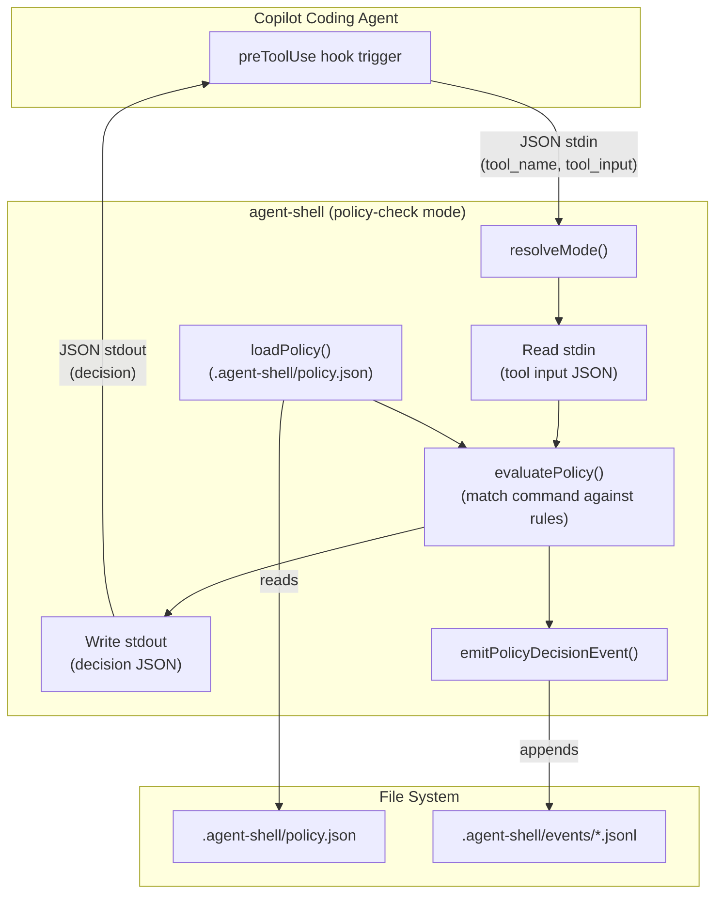
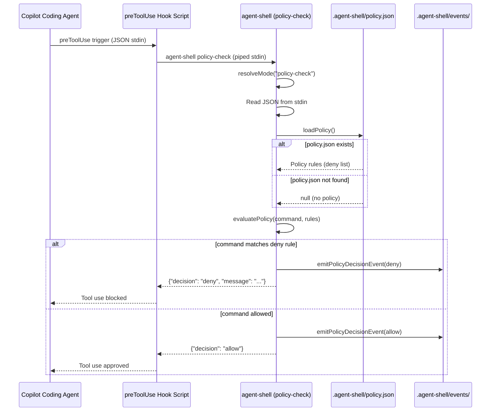

# Feature: agent-shell `preToolUse` hook support for policy-based command blocking

## Problem Statement

When AI coding agents (such as GitHub Copilot coding agent) execute npm scripts via agent-shell, there is no mechanism to prevent specific commands from running before they start. Agent-shell currently records telemetry _after_ execution completes, but cannot intercept and block commands that violate repository-level policies. Repository maintainers need a way to define which commands are allowed or denied, and have those policies enforced at the `preToolUse` hook point — before the agent invokes a tool — so that disallowed commands are blocked rather than observed after the fact.

## Personas

| Persona | Impact | Notes |
|---------|--------|-------|
| Software Engineer Learning Vibe Coding | Positive | Primary user — gains guardrails that prevent unintended script execution during agent sessions |
| Platform Engineer | Positive | Can define and enforce repository-level policies for what commands agents are allowed to run |
| Team Lead | Positive | Gains confidence that agent sessions respect team-defined constraints without manual monitoring |

## Value Assessment

- **Primary value**: Future — Prevents unintended side effects from agent-executed commands before they happen, reducing incident response and rollback effort
- **Secondary value**: Efficiency — Eliminates the need for manual monitoring of agent sessions to catch disallowed commands

## User Stories

### Story 1: Block a disallowed npm script via preToolUse hook

As a **Platform Engineer**,
I want **to configure agent-shell with a policy that blocks specific npm commands when an agent tries to use them**,
so that I can **enforce repository-level constraints on what agents are allowed to execute**.

#### Acceptance Criteria

- When agent-shell is invoked in `policy-check` mode, the system shall read the tool input from stdin as JSON.
- When the tool input contains a command that matches a deny rule in the agent-shell policy, the system shall write a JSON response to stdout rejecting the tool use with a descriptive message.
- When the tool input contains a command that does not match any deny rule, the system shall write a JSON response to stdout approving the tool use.
- If the policy configuration file does not exist, then the system shall approve all tool uses by default.
- If the policy configuration file contains invalid JSON, then the system shall write a deny JSON response to stdout with an error description and write the error details to stderr.
- If the stdin JSON is valid but does not contain the expected `tool_input.command` field, then the system shall write an allow JSON response to stdout (fail-open for unrecognized input shapes).
- If the `tool_name` in the stdin JSON is not `run_terminal_command`, then the system shall write an allow JSON response to stdout (policy evaluation applies only to terminal commands).
- If the `tool_input.command` field is not a string, then the system shall write a deny JSON response to stdout with a descriptive error message.
- While agent-shell is running in `policy-check` mode, the system shall emit a telemetry event recording the policy decision (allowed or denied) for auditability.
- If telemetry emission fails (e.g., events directory not writable), then the system shall log the error to stderr but shall not change the allow/deny decision or prevent writing the decision JSON to stdout.
- The system shall support exact-match and glob-pattern deny rules for command strings.
- Glob pattern matching shall use the following semantics: `*` matches any sequence of characters (including spaces and empty strings), matching is case-sensitive, and patterns are anchored to the full command string (the entire command must match the pattern, not a substring).

#### Notes

- The `preToolUse` hook is a GitHub Copilot coding agent feature that runs a configured script before tool execution
- The hook receives JSON on stdin describing the tool and its input, and reads JSON from stdout for the decision
- agent-shell must be available on PATH (globally installed) to function as a hook script
- The policy configuration file location defaults to `.agent-shell/policy.json` relative to the repository root

### Story 2: Configure preToolUse hook to use agent-shell

As a **Software Engineer Learning Vibe Coding**,
I want **to configure my repository's `.github/hooks/` to use agent-shell for `preToolUse` evaluation**,
so that I can **have agent-shell enforce command policies before the agent executes tools**.

#### Acceptance Criteria

- When the user creates a `.github/hooks/` directory with a properly configured hook referencing agent-shell, the system shall be invocable by the Copilot coding agent's hook mechanism.
- The agent-shell `policy-check` mode shall be compatible with the Copilot coding agent's `preToolUse` hook contract (JSON stdin/stdout).
- When agent-shell is referenced in the hook configuration, the system shall execute without requiring additional dependencies beyond the globally installed agent-shell binary and a POSIX-compatible shell (`sh`).

#### Notes

- The hook configuration file is `.github/hooks/hook.json`
- The hook script at `.github/hooks/agent-shell-policy.sh` invokes `agent-shell policy-check`
- This story focuses on the integration contract, not the scaffolding of these files (scaffolding is a future consideration)

### Story 3: Audit blocked commands via telemetry

As a **Team Lead**,
I want **to see which commands were blocked by agent-shell policy during an agent session**,
so that I can **understand what the agent attempted and verify that policies are working as expected**.

#### Acceptance Criteria

- When a command is blocked by policy, the system shall emit a `policy_decision` telemetry event to the `.agent-shell/events/` directory.
- The `policy_decision` event shall include the command that was evaluated, the policy rule that matched, the decision (allow or deny), and the actor.
- When the user runs `agent-shell log`, the system shall display policy decision events alongside script execution events.
- When the user runs `agent-shell log --failures`, the system shall include denied policy decisions in the results.

#### Notes

- The telemetry event schema extends the existing base fields (v, session_id, command, actor, timestamp, env, tags)
- Policy decision events use a new event type `policy_decision` with additional fields: `decision` (allow/deny), `matched_rule` (the pattern that matched, if any)

---

## Design

> Refer to `.github/copilot-instructions.md` for technical standards.

### Components Affected

- `packages/agent-shell/src/mode.ts` — Add `policy-check` mode to the CLI argument parser
- `packages/agent-shell/src/index.ts` — Add `policy-check` case to the main switch that orchestrates stdin reading, policy evaluation, and stdout writing
- `packages/agent-shell/src/policy.ts` — New module: loads and evaluates policy rules against a command
- `packages/agent-shell/src/types.ts` — Extend with `PolicyDecisionEvent` schema and `PolicyConfig` schema
- `packages/agent-shell/src/telemetry.ts` — Add `emitPolicyDecisionEvent` function

### Dependencies

- `zod` (existing, for policy config schema validation)
- `node:fs/promises` (existing, for reading policy file)
- `node:path` (existing, for resolving policy file path)
- `packages/agent-shell/src/path-utils.ts` (existing, for safe path resolution)

### Data Model Changes

#### Policy Configuration Schema (`.agent-shell/policy.json`)

```json
{
  "deny": [
    "npm run foo",
    "npm run deploy*"
  ]
}
```

| Field | Type | Description |
|-------|------|-------------|
| `deny` | `string[]` | Array of command patterns to block. Supports exact match and glob-style `*` wildcards. |

#### preToolUse Hook Input (stdin)

> **⚠️ ASSUMPTION**: The following JSON shape is based on anticipated Copilot agent hook contract. This must be verified against official documentation before implementation begins (see Task 0).

```json
{
  "tool_name": "run_terminal_command",
  "tool_input": {
    "command": "npm run foo"
  }
}
```

#### preToolUse Hook Output (stdout)

> **⚠️ ASSUMPTION**: The following response format is based on anticipated Copilot agent hook contract. This must be verified against official documentation before implementation begins (see Task 0).

Approved:

```json
{
  "decision": "allow"
}
```

Denied:

```json
{
  "decision": "deny",
  "message": "Command 'npm run foo' is blocked by agent-shell policy (matched rule: 'npm run foo')"
}
```

#### Policy Decision Telemetry Event

```json
{
  "v": 1,
  "session_id": "uuid",
  "event": "policy_decision",
  "command": "npm run foo",
  "actor": "copilot",
  "decision": "deny",
  "matched_rule": "npm run foo",
  "timestamp": "2026-03-14T14:00:00.000Z",
  "env": {},
  "tags": {}
}
```

### Diagrams

#### Data Flow Diagram



#### Sequence Diagram



### Hook Configuration

#### `.github/hooks/hook.json`

```json
[
  {
    "event": "preToolUse",
    "tools": ["run_terminal_command"],
    "script": ".github/hooks/agent-shell-policy.sh"
  }
]
```

#### `.github/hooks/agent-shell-policy.sh`

```sh
#!/usr/bin/env sh
exec agent-shell policy-check
```

### Open Questions

- [ ] What is the exact JSON contract for GitHub Copilot coding agent `preToolUse` hooks? The stdin/stdout format should be verified against the Copilot agent documentation once publicly available.
- [ ] Should the policy support an `allow` list in addition to `deny`? (Starting with deny-only keeps the initial scope small; allow-list could be a follow-on.)
- [ ] Should the policy file location be configurable via an environment variable (e.g., `AGENTSHELL_POLICY_PATH`)? (Deferred to future consideration.)
- [ ] Should `policy-check` mode also support non-npm tool types (e.g., file writes, API calls)? (Out of scope for this iteration; focus is on terminal commands.)

---

## Tasks

> Each task should be completable in a single coding agent session.
> Tasks are sequenced by dependency. Complete in order unless noted.

### Task 0: Verify Copilot preToolUse hook contract

- [ ] **Objective**: Verify the exact JSON stdin/stdout contract for GitHub Copilot coding agent `preToolUse` hooks before implementing schemas or tests.

**Context**: The spec's Data Model section documents an assumed JSON shape for hook input and output. This assumption must be verified against official Copilot documentation to avoid implementing the wrong interface. This task is a prerequisite for all other tasks.

**Affected files**:
- `.github/specs/agent-shell-pre-tool-use-hook.spec.md` (updated — confirm or correct the assumed JSON shapes)

**Requirements**:
- Locate and review official GitHub Copilot documentation for `preToolUse` hook contracts
- Verify the stdin JSON shape (`tool_name`, `tool_input.command`, etc.) matches the documented contract
- Verify the stdout JSON shape (`decision`, `message`, etc.) matches the documented contract
- If the documented contract differs from assumptions, update the Data Model section and all dependent tasks
- If documentation is not yet publicly available, document this as a known risk and proceed with assumptions

**Verification**:
- [ ] Data Model section accurately reflects the documented (or best-known) hook contract
- [ ] Assumptions are explicitly labeled in the spec if verification is incomplete

**Done when**:
- [ ] Hook contract is verified against documentation, OR
- [ ] Spec explicitly documents that assumptions are unverified and why

---

### Task 1: Define policy configuration schema and types

- [ ] **Objective**: Define the Zod schema for the policy configuration file and the policy decision telemetry event type.

**Context**: This task establishes the data types that all other tasks depend on. The policy config schema validates `.agent-shell/policy.json` and the event schema extends the existing telemetry types.

**Affected files**:
- `packages/agent-shell/src/types.ts` (updated — add `PolicyConfigSchema`, `PolicyDecisionEventSchema`)
- `packages/agent-shell/tests/types.test.ts` (updated — add validation tests for new schemas)

**Requirements**:
- The `PolicyConfigSchema` shall validate a JSON object with a `deny` array of strings
- The `PolicyDecisionEventSchema` shall extend the existing base fields with `decision` (allow/deny) and `matched_rule` (string, optional)
- The `ScriptEventSchema` discriminated union shall include the new `PolicyDecisionEvent` variant
- When invalid data is provided, Zod shall reject it with descriptive errors

**Verification**:
- [ ] `npm test -- packages/agent-shell/tests/types.test.ts` passes
- [ ] `npx biome check packages/agent-shell/src/types.ts` passes

**Done when**:
- [ ] All verification steps pass
- [ ] `PolicyConfigSchema` and `PolicyDecisionEventSchema` are exported and tested
- [ ] Code follows patterns in `.github/copilot-instructions.md`

---

### Task 2: Implement policy loading and evaluation

- [ ] **Objective**: Create the `policy.ts` module that loads the policy configuration file and evaluates a command against the deny rules.

**Depends on**: Task 1

**Context**: This is the core business logic for policy evaluation. It reads the policy file, validates it with Zod, and matches commands against deny patterns using exact and glob matching.

**Affected files**:
- `packages/agent-shell/src/policy.ts` (new)
- `packages/agent-shell/tests/policy.test.ts` (new)

**Requirements**:
- When a policy file exists and is valid JSON, `loadPolicy` shall return the parsed and validated policy
- When a policy file does not exist, `loadPolicy` shall return `null`
- When a policy file contains invalid JSON, `loadPolicy` shall throw an error with a descriptive message
- When a command exactly matches a deny rule, `evaluatePolicy` shall return `{ decision: "deny", matchedRule: "<rule>" }`
- When a command matches a deny rule with a `*` wildcard, `evaluatePolicy` shall return `{ decision: "deny", matchedRule: "<rule>" }`
- When a command does not match any deny rule, `evaluatePolicy` shall return `{ decision: "allow" }`
- When the policy is `null` (no file), `evaluatePolicy` shall return `{ decision: "allow" }`
- Before reading the policy file, the system shall resolve the path using `realpath` to follow any symlinks, then validate the resolved path is within the project root using `isWithinProjectRoot`
- If the policy file path (after `realpath` resolution) is outside the project root, `loadPolicy` shall throw a descriptive error and refuse to read the file
- If the policy file is a symlink pointing outside the project root, `loadPolicy` shall throw a descriptive error (symlink escape prevention)

**Verification**:
- [ ] `npm test -- packages/agent-shell/tests/policy.test.ts` passes
- [ ] `npx biome check packages/agent-shell/src/policy.ts` passes

**Done when**:
- [ ] All verification steps pass
- [ ] Exact-match and glob-match deny rules are tested
- [ ] Missing policy file is handled gracefully
- [ ] Invalid policy file produces a descriptive error
- [ ] Path traversal is prevented
- [ ] Symlink escapes are prevented (realpath + isWithinProjectRoot)
- [ ] Code follows patterns in `.github/copilot-instructions.md`

---

### Task 3: Add `policy-check` mode to CLI argument parser

- [ ] **Objective**: Extend `resolveMode` to recognize the `policy-check` subcommand and return a new mode variant.

**Depends on**: Task 1

**Context**: This task adds the CLI entry point so agent-shell can be invoked as `agent-shell policy-check`. The mode resolution must integrate cleanly with the existing mode types.

**Affected files**:
- `packages/agent-shell/src/mode.ts` (updated — add `policy-check` mode)
- `packages/agent-shell/tests/shim.test.ts` (updated — add mode resolution tests for `policy-check`)

**Requirements**:
- When the first argument is `policy-check`, `resolveMode` shall return `{ type: "policy-check" }`
- The `Mode` union type shall include the new `{ type: "policy-check" }` variant
- Existing mode resolution behavior shall not change

**Verification**:
- [ ] `npm test -- packages/agent-shell/tests/shim.test.ts` passes
- [ ] `npx biome check packages/agent-shell/src/mode.ts` passes

**Done when**:
- [ ] All verification steps pass
- [ ] `policy-check` mode is recognized by `resolveMode`
- [ ] Existing modes are unaffected
- [ ] Code follows patterns in `.github/copilot-instructions.md`

---

### Task 4: Add policy decision telemetry emission

- [ ] **Objective**: Add an `emitPolicyDecisionEvent` function to the telemetry module that records policy evaluation outcomes.

**Depends on**: Task 1

**Context**: This enables auditability of policy decisions. The function follows the same pattern as the existing `emitScriptEndEvent` and `emitShimErrorEvent` functions.

**Affected files**:
- `packages/agent-shell/src/telemetry.ts` (updated — add `emitPolicyDecisionEvent`)
- `packages/agent-shell/tests/telemetry.test.ts` (updated — add tests for new event emission)

**Requirements**:
- `emitPolicyDecisionEvent` shall accept command, decision (allow/deny), matched rule (optional), and environment
- The emitted event shall include all base fields (v, session_id, actor, timestamp, env, tags) plus `decision` and `matched_rule`
- The event shall be appended to the same session JSONL file as other events
- The function shall follow the existing dependency injection pattern (`TelemetryDeps`)

**Verification**:
- [ ] `npm test -- packages/agent-shell/tests/telemetry.test.ts` passes
- [ ] `npx biome check packages/agent-shell/src/telemetry.ts` passes

**Done when**:
- [ ] All verification steps pass
- [ ] Policy decision events are written to the correct session file
- [ ] Both allow and deny decisions are emitted correctly
- [ ] Code follows patterns in `.github/copilot-instructions.md`

---

### Task 5: Implement `policy-check` mode in main entry point

- [ ] **Objective**: Wire the `policy-check` mode into the main `index.ts` switch to read stdin, evaluate the policy, emit telemetry, and write the decision to stdout.

**Depends on**: Task 2, Task 3, Task 4

**Context**: This is the integration point that connects all the pieces. The main function reads JSON from stdin, loads the policy, evaluates it, emits a telemetry event, and writes the decision to stdout.

**Affected files**:
- `packages/agent-shell/src/index.ts` (updated — add `policy-check` case)
- `packages/agent-shell/tests/integration/policy-check.test.ts` (new — integration tests)

**Requirements**:
- When invoked as `agent-shell policy-check`, the system shall read JSON from stdin
- When stdin contains valid tool input with a command, the system shall load the policy and evaluate the command
- When the command is denied by policy, the system shall write `{"decision":"deny","message":"..."}` to stdout and exit with code 0
- When the command is allowed, the system shall write `{"decision":"allow"}` to stdout and exit with code 0
- When stdin contains invalid JSON, the system shall write a deny response to stdout and write an error to stderr
- When stdin JSON is valid but missing `tool_input.command`, the system shall write an allow response to stdout (fail-open)
- When `tool_name` is not `run_terminal_command`, the system shall write an allow response to stdout
- When `tool_input.command` is not a string, the system shall write a deny response to stdout with a descriptive error
- When the policy file contains invalid JSON, the system shall write a deny response to stdout and write the error to stderr
- If telemetry emission fails (e.g., events directory not writable), the system shall log the error to stderr but shall still write the decision JSON to stdout and exit with code 0
- If any unexpected runtime error occurs (stdin read failure, policy load crash, unhandled exception), the system shall catch the error, write a deny JSON response to stdout with a generic error message, write error details to stderr, and exit with code 0
- The system shall emit a policy decision telemetry event for every evaluation (best-effort; failures do not block the decision)
- The system shall exit with code 0 in all cases (the hook contract uses the JSON response, not the exit code, for the decision)

**Verification**:
- [ ] `npm test -- packages/agent-shell/tests/integration/policy-check.test.ts` passes
- [ ] `npx biome check packages/agent-shell/src/index.ts` passes
- [ ] Manual test: `echo '{"tool_name":"run_terminal_command","tool_input":{"command":"npm run foo"}}' | agent-shell policy-check` outputs correct JSON

**Done when**:
- [ ] All verification steps pass
- [ ] End-to-end flow works: stdin → policy evaluation → stdout + telemetry
- [ ] Error cases are handled gracefully
- [ ] Code follows patterns in `.github/copilot-instructions.md`

---

### Task 6: Integrate policy decision events into log query and display

- [ ] **Objective**: Update the log query and format modules to include policy decision events in output.

**Depends on**: Task 4

**Context**: Users need to see policy decisions when querying the event log. This task ensures `agent-shell log` displays policy decisions alongside existing event types, and that `--failures` includes denied decisions.

**Affected files**:
- `packages/agent-shell/src/log/format.ts` (updated — handle `policy_decision` event type in table formatting)
- `packages/agent-shell/src/log/query.ts` (updated — include `policy_decision` events in query results; treat `deny` as a failure for `--failures` filter)
- `packages/agent-shell/tests/log/format.test.ts` (updated)
- `packages/agent-shell/tests/log/query.test.ts` (updated)

**Requirements**:
- When querying events, `policy_decision` events shall be included in results
- When the `--failures` filter is active, denied policy decisions shall be included
- When formatting events as a table, policy decision events shall display the decision and matched rule
- When formatting events as JSON, policy decision events shall be included as-is

**Verification**:
- [ ] `npm test -- packages/agent-shell/tests/log/format.test.ts` passes
- [ ] `npm test -- packages/agent-shell/tests/log/query.test.ts` passes
- [ ] `npx biome check packages/agent-shell/src/log/format.ts packages/agent-shell/src/log/query.ts` passes

**Done when**:
- [ ] All verification steps pass
- [ ] `agent-shell log` shows policy decision events
- [ ] `agent-shell log --failures` includes denied decisions
- [ ] Code follows patterns in `.github/copilot-instructions.md`

---

### Task 7: Update README and USAGE documentation

- [ ] **Objective**: Document the `policy-check` mode, policy configuration format, and hook setup in the agent-shell README.

**Depends on**: Task 5

**Context**: Users need to know how to configure agent-shell as a preToolUse hook and how to write policy rules.

**Affected files**:
- `packages/agent-shell/README.md` (updated)
- `packages/agent-shell/src/index.ts` (updated — update USAGE string)

**Requirements**:
- The README shall document the `policy-check` subcommand and its purpose
- The README shall include an example `.agent-shell/policy.json` with deny rules
- The README shall include example `.github/hooks/hook.json` and hook script configuration
- The USAGE string in `index.ts` shall list `agent-shell policy-check` as a valid subcommand
- The README shall document the telemetry event format for policy decisions

**Verification**:
- [ ] `npx biome check packages/agent-shell/src/index.ts` passes
- [ ] README renders correctly in GitHub markdown preview

**Done when**:
- [ ] All verification steps pass
- [ ] Documentation covers setup, configuration, and usage
- [ ] Examples are accurate and copy-pasteable

---

## Out of Scope

- Scaffolding `.github/hooks/` files via a CLI command (potential follow-on for `copilot-setup`)
- `allow`-list policy rules (starting with deny-only for simplicity)
- Policy evaluation for non-terminal tools (e.g., file writes, API calls)
- Configurable policy file location via environment variable
- Remote/shared policy configurations
- Policy rule priorities or ordering logic (first match wins with deny-only)

## Future Considerations

- Add an `allow` list to the policy schema for more nuanced control (deny takes precedence)
- Add a `copilot-setup` CLI step that scaffolds `.github/hooks/` with agent-shell integration
- Support policy evaluation for additional Copilot tool types beyond `run_terminal_command`
- Enable shared/inherited policies (e.g., organization-level policy files)
- Add `agent-shell policy-check --dry-run` for testing policies without emitting telemetry
- Add `AGENTSHELL_POLICY_PATH` environment variable to override the default policy file location
- Surface policy decisions in the MCP server for richer agent feedback
