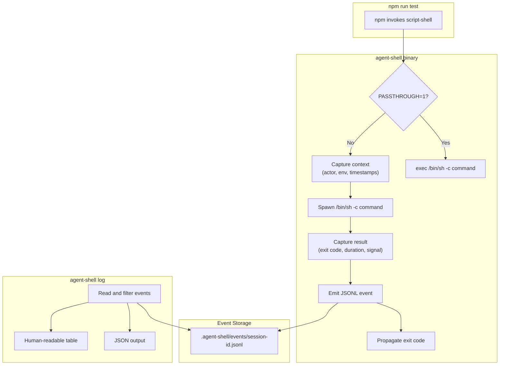
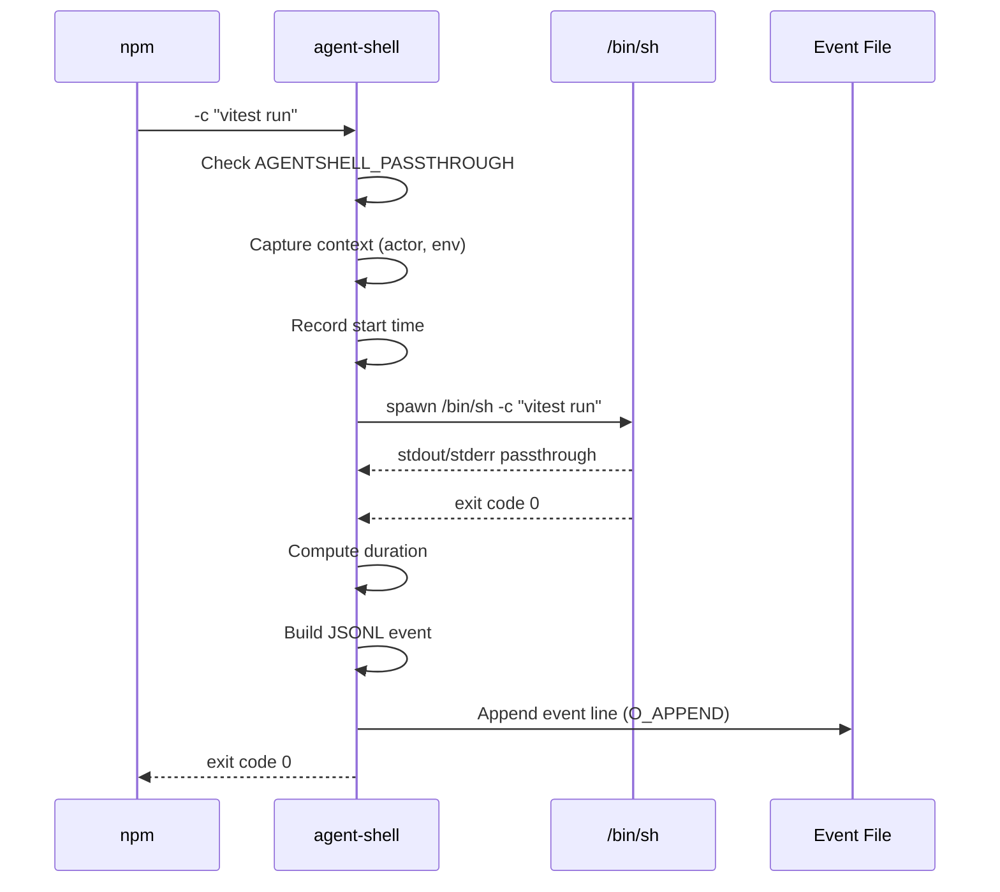
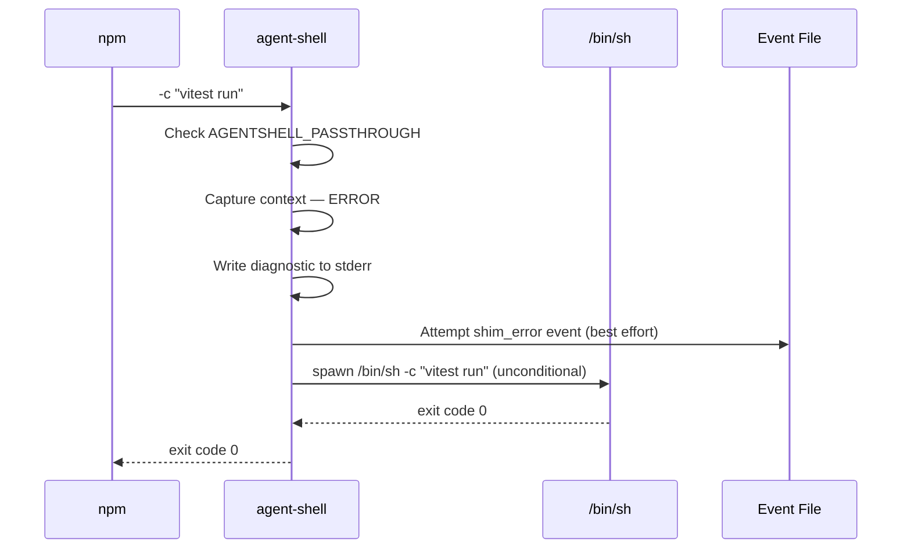

# Feature: agent-shell — npm Script Execution Flight Recorder

> **Supersedes**: The npm instrumentation path (Story 2, Story 4) from `feedback-loop-checkpoint-tools.spec.md`. The MCP tool-based capture and session recovery from that spec are out of scope here and may be revisited independently.

## Problem Statement

Coding agents (Claude Code, GitHub Copilot, etc.) execute npm scripts as part of their workflows, but there is no independent verification of what was actually run, whether it succeeded, and who initiated it. Agents self-report their actions, and self-reporting is not observability. Developers reviewing agent work currently rely on the agent's own summary — the equivalent of asking a junior developer to self-report their debugging session. When an agent session goes sideways, reconstructing what happened requires trusting the agent's context window, which may be incomplete, truncated, or wrong.

This is a standalone observability problem. It does not require defining session boundaries, building MCP tools, or coupling to any specific AI assistant's protocol. The instrumentation layer sits below the agent at the npm script-shell level and records what actually happened — independent of what any agent claims.

## Personas

| Persona | Impact | Notes |
|---------|--------|-------|
| Software Engineer Learning Vibe Coding | Positive | Primary user. Gets an independent audit trail of what npm scripts ran, who initiated them, and whether they succeeded — without trusting agent self-reports. |
| Team Member | Neutral | Secondary persona. Inherits `.npmrc` configuration set by a teammate. Must understand agent-shell exists to troubleshoot unexpected behavior. Passthrough escape hatch (`AGENTSHELL_PASSTHROUGH=1`) and uninstall documentation mitigate disruption. |

## Value Assessment

- **Primary value**: Customer — Increases trust in agent output by providing independent, tamper-free telemetry of script execution. Reduces time spent manually verifying agent work.
- **Secondary value**: Future — Creates a data foundation for policy enforcement (Phase 2, gated on evidence) and cross-session analytics without committing to those features now. If Phase 1 data shows agents rarely misreport, the tool remains valuable as an audit trail and the urgency for enforcement drops.
- **Efficiency**: Positive — Eliminates manual reconstruction of "what did the agent do?" from chat logs or agent self-reports. The `log` subcommand replaces ad-hoc investigation with structured querying.
- **Commercial**: Not applicable — agent-shell is an open-source tool, not a revenue product.
- **Market**: Indirect — Positions lousy-agents as an ecosystem with observability capabilities, potentially attracting users who need agent accountability tooling.

## User Stories

### Story 1: Transparent Script Execution Recording

As a **Software Engineer Learning Vibe Coding**,
I want **every npm script execution to be automatically recorded with structured telemetry**,
so that I can **have an independent, tamper-free record of what scripts ran, when, and whether they succeeded — regardless of who initiated them**.

#### Acceptance Criteria

- When npm invokes agent-shell as `script-shell` with `-c <command>`, the system shall spawn `/bin/sh -c <command>` as a child process, wait for completion, and exit with the child's exit code.
- When the child process completes, the system shall append a single JSONL event to the session's event file containing: schema version, session ID, event type, script name, command, package name, package version, actor classification, exit code, signal (if applicable), duration in milliseconds, ISO 8601 timestamp, captured environment variables, and custom tags.
- When the child process is terminated by a signal (SIGINT, SIGTERM, SIGTSTP), the system shall record the signal name in the event's `signal` field, emit the completion event, and propagate the signal termination.
- The system shall forward SIGINT, SIGTERM, and SIGTSTP from the parent to the child process.
- The system shall read `npm_lifecycle_event`, `npm_lifecycle_script`, `npm_package_name`, and `npm_package_version` from the environment to populate event fields.
- When invoked outside of an npm context (npm environment variables absent), the system shall omit npm-specific fields (`script`, `package`, `package_version`) and still record the execution event.
- The system shall write events to `.agent-shell/events/<session-id>.jsonl`, where session ID is a fresh UUID per invocation unless `AGENTSHELL_SESSION_ID` is set, in which case the system shall use that value.
- The system shall ensure each event is durably written before the shim process exits, such that a process crash after event emission does not lose the completed event.
- Where `AGENTSHELL_LOG_DIR` is configured, the system shall write event files to that directory instead of `.agent-shell/events/`.

#### Notes

- The `-c <command>` interface matches what npm provides when invoking a `script-shell`. The shim must not add an extra `-c` — npm already provides it.
- Session ID defaults to a fresh UUID per invocation. To correlate events across a single agent workflow (e.g., an agent that runs test, lint, then build in sequence), callers set `AGENTSHELL_SESSION_ID`.
- Per-session files solve the unbounded file growth problem that a single JSONL file would have, and make session-based querying natural.

-----

### Story 2: Actor Classification

As a **Software Engineer Learning Vibe Coding**,
I want **each script execution to be classified by who initiated it (human, CI, or coding agent)**,
so that I can **distinguish agent-initiated work from my own and identify patterns in how different actors use my project's scripts**.

#### Acceptance Criteria

- Where `AGENTSHELL_ACTOR` is configured in the environment, the system shall use its value as the actor identity without further heuristic evaluation.
- When `GITHUB_ACTIONS=true` is set and `AGENTSHELL_ACTOR` is not set, the system shall classify the actor as `ci` and include `GITHUB_ACTOR` as supplementary detail in the event's `env` field.
- When environment variables associated with known coding agents are detected and neither `AGENTSHELL_ACTOR` nor CI indicators are set, the system shall classify the actor with the appropriate agent identifier. Phase 1 targets Claude Code and GitHub Copilot; the specific environment variables used for detection must be validated empirically during implementation (see Open Questions). If a variable cannot be confirmed, the detection rule shall be omitted rather than guessed.
- When no agent or CI environment indicators are detected and `AGENTSHELL_ACTOR` is not set, the system shall classify the actor as `human`.
- The system shall capture a predefined allowlist of environment variables (`npm_lifecycle_*`, `npm_package_name`, `NODE_ENV`, `CI`, `GITHUB_*`, `AGENTSHELL_*`) in every event, regardless of actor classification.
- The system shall exclude environment variables matching sensitive patterns (names containing `SECRET`, `TOKEN`, `KEY`, `PASSWORD`, or `CREDENTIAL`) from the captured environment.
- The system shall truncate any captured environment variable value that exceeds 1024 bytes, replacing the excess with a fixed suffix `…[truncated]`. If any value is truncated, the system shall include `_env_truncated: true` as a key in the captured `env` object. `AGENTSHELL_TAG_*` variables shall not be captured in the `env` object (they are captured exclusively as `tags`) to avoid duplicating potentially large values.
- If the number of `AGENTSHELL_TAG_*` environment variables exceeds 50, or any single tag value exceeds 1024 bytes, then the system shall discard excess tags (keeping the first 50 alphabetically) and truncate oversized values, including a `_tags_truncated: true` field in the event's `tags` object.

#### Notes

- The full environment allowlist in every event enables retroactive refinement of detection rules without reprocessing history. If a new agent ships with a distinctive env var, existing logs already captured it.
- Process tree walking (reading `/proc/<pid>/comm` on Linux, `sysctl`/`libproc` on macOS) is explicitly deferred, gated on evidence that env-var heuristics misclassify events at a rate above 10%.
- The known agent signatures for Phase 1 are best-effort. Claude Code and GitHub Copilot are the initial targets. If specific env vars cannot be confirmed empirically during implementation, the detection rules for those agents are omitted (not guessed), and the full env allowlist in every event supports adding rules retroactively.

-----

### Story 3: Query Execution History

As a **Software Engineer Learning Vibe Coding**,
I want **a built-in query interface over my project's script execution history**,
so that I can **quickly answer "what did the agent do?" without writing jq pipelines or reading raw JSONL files**.

#### Acceptance Criteria

- When the user runs `agent-shell log` with no flags, the system shall display events from the most recent session (determined by file modification time in the events directory) in a human-readable table format.
- When `--last <duration>` is specified (e.g., `30m`, `2h`, `1d`), the system shall display events from the specified time window across all sessions.
- When `--actor <name>` is specified, the system shall filter events to those matching the specified actor classification.
- When `--failures` is specified, the system shall display only events with non-zero exit codes.
- When `--script <name>` is specified, the system shall filter events by the `script` field (npm lifecycle event name).
- When `--list-sessions` is specified, the system shall display a summary of all sessions: session ID, first and last event timestamps, event count, and distinct actor kinds observed.
- When `--json` is specified, the system shall output events as a JSON array instead of the human-readable table.
- If no event files exist in the events directory, then the system shall display a message indicating no events have been recorded and include guidance on how to enable instrumentation.
- If an event file contains malformed lines, then the system shall skip those lines and continue processing valid entries without error.
- If an event file exceeds 100,000 lines or any individual line exceeds 64KB, the system shall stop reading that file at the limit, emit a stderr warning indicating the file was truncated, and continue processing remaining files.
- The log subcommand shall read events from the directory specified by `AGENTSHELL_LOG_DIR` when set, falling back to `.agent-shell/events/` relative to the current working directory. When `AGENTSHELL_LOG_DIR` is set, the log subcommand shall apply the same `realpath` + project-root containment validation as the write path. If the resolved path is outside the project root, the system shall emit a diagnostic to stderr and fall back to `.agent-shell/events/`.

#### Notes

- The human-readable table is the default output for local development. `--json` is the integration format for scripts and CI artifact processing.
- Duration parsing supports three suffixes: `m` (minutes), `h` (hours), `d` (days).
- Multiple filter flags can be combined (e.g., `--actor claude-code --failures --last 2h`).

-----

### Story 4: Safe Operation

As a **Software Engineer Learning Vibe Coding**,
I want **the instrumentation to never interfere with my script execution, even when the instrumentation itself fails**,
so that I can **trust that enabling agent-shell will not break my development workflow or CI pipeline**.

#### Acceptance Criteria

- Where `AGENTSHELL_PASSTHROUGH=1` is configured, the system shall bypass all instrumentation and execute the command with the underlying shell, adding no observable overhead.
- If the system encounters an internal error during context capture or telemetry writing, then it shall write a diagnostic message to stderr (including the error), attempt to write a `shim_error` event to the JSONL, and fall through to execute the command with the underlying shell unconditionally.
- The child process spawn and exit code propagation shall execute regardless of instrumentation success — they shall be outside the instrumentation error-handling boundary.
- The system shall never prevent script execution due to its own failure.
- If `AGENTSHELL_SESSION_ID` contains path traversal sequences (e.g., `..`) or absolute path components, then the system shall reject the value, write a diagnostic to stderr, and fall back to generating a fresh UUID.
- If `AGENTSHELL_LOG_DIR` resolves to a path outside the project root or contains path traversal sequences, then the system shall reject the value, write a diagnostic to stderr, and fall back to the default `.agent-shell/events/` directory.
- Before writing an event file, the system shall resolve the target events directory path (including symlink resolution) and verify the resolved path is within the project root. If the resolved path is outside the project root (e.g., due to a symlink), the system shall refuse to write, emit a stderr diagnostic, and fall through to execute the command without recording.
- When `--version` is passed as the first argument (not after `-c`), the system shall print the package version and exit 0.
- When invoked with no arguments or unrecognized arguments (not `-c`, not `log`, not `--version`), the system shall print a usage message to stderr and exit 1.

#### Notes

- `AGENTSHELL_PASSTHROUGH=1` is the "break glass" escape hatch. It must be documented prominently.
- The graceful degradation contract requires a clear architectural boundary: instrumentation logic (which can fail) wraps around but does not gate shell execution logic (which must always succeed).
- Path validation for `AGENTSHELL_SESSION_ID` and `AGENTSHELL_LOG_DIR` prevents directory traversal attacks where a malicious env var could write files to arbitrary locations.

-----

## Design

> Refer to `.github/copilot-instructions.md` for technical standards.

### Architecture Overview

agent-shell is a TypeScript binary that serves as an npm `script-shell` shim. The binary has two modes:

1. **Shim mode**: When invoked with `-c <command>` (by npm), it wraps the real shell with telemetry.
2. **Log mode**: When invoked with `log [options]`, it queries and displays recorded events.

The binary ships as `@lousy-agents/agent-shell` in the existing lousy-agents monorepo as a separate npm workspace package with zero runtime coupling to `@lousy-agents/cli`.

```
npm run test
  └─► agent-shell -c "vitest run"
        ├─ check AGENTSHELL_PASSTHROUGH → exec /bin/sh if set
        ├─ capture context (actor, env, timestamps)
        ├─ spawn /bin/sh -c "vitest run"
        │    └─ actual test execution
        ├─ capture result (exit code, duration, signal)
        ├─ emit JSONL event
        └─ propagate exit code
```

### Language: TypeScript

The shim is glue code — read env vars, spawn a process, time it, write a JSON line, forward the exit code. Rust was considered for startup performance and cross-ecosystem portability, but rejected because:

1. **Velocity over speculation.** Zero adopters exist. The concept is unvalidated. TypeScript ships faster in the maintainer's existing tooling.
2. **Operational reality.** When agent-shell has a bug at midnight, it needs to be debuggable by the person maintaining it.
3. **Reversibility.** If TypeScript startup overhead proves perceptible (threshold: >100ms), the shim is small enough to rewrite in Rust without changing external interfaces. The JSONL format, `.npmrc` configuration, and `log` subcommand are the public surface — not the implementation language.

The startup overhead hypothesis must be validated empirically during Phase 1.

### Package Structure

```
packages/agent-shell/
├── package.json            # @lousy-agents/agent-shell
├── tsconfig.json
├── vitest.config.ts
├── README.md
├── src/
│   ├── index.ts            # Entry point: mode routing (-c, log, --version)
│   ├── shim.ts             # Core shim logic (spawn, signal forwarding, exit code)
│   ├── telemetry.ts        # JSONL event construction and file writing
│   ├── actor.ts            # Actor detection heuristics
│   ├── env-capture.ts      # Environment variable allowlist/blocklist filtering
│   ├── types.ts            # ScriptEvent Zod schema and shared types
│   └── log/
│       ├── index.ts        # Log subcommand CLI parsing
│       ├── query.ts        # Event file reading and filtering
│       └── format.ts       # Table and JSON output formatters
└── tests/
    ├── shim.test.ts
    ├── telemetry.test.ts
    ├── actor.test.ts
    ├── env-capture.test.ts
    ├── log/
    │   ├── query.test.ts
    │   └── format.test.ts
    └── integration/
        ├── shim-lifecycle.test.ts
        └── log-query.test.ts
```

### Telemetry Schema (v1)

One JSON object per line, appended atomically. Schema version field included from day one for forward compatibility.

```json
{
  "v": 1,
  "session_id": "a1b2c3d4-e5f6-7890-abcd-ef1234567890",
  "event": "script_end",
  "script": "test",
  "command": "vitest run",
  "package": "my-app",
  "package_version": "1.2.0",
  "actor": "claude-code",
  "exit_code": 1,
  "signal": null,
  "duration_ms": 3420,
  "timestamp": "2026-03-08T14:32:01-06:00",
  "env": {
    "NODE_ENV": "test",
    "CI": "true",
    "GITHUB_ACTOR": "dependabot[bot]"
  },
  "tags": {
    "pr": "1234",
    "task": "fix-auth-bug"
  }
}
```

Field semantics:

| Field | Type | Required | Source |
|---|---|---|---|
| `v` | number | Yes | Hardcoded schema version (1) |
| `session_id` | string (UUID) | Yes | `AGENTSHELL_SESSION_ID` or generated per invocation |
| `event` | string | Yes | Event type: `script_end` or `shim_error` |
| `script` | string | No | `npm_lifecycle_event` (absent outside npm) |
| `command` | string | Yes | The literal `-c` argument (the actual command executed) |
| `package` | string | No | `npm_package_name` (absent outside npm) |
| `package_version` | string | No | `npm_package_version` (absent outside npm) |
| `actor` | string | Yes | Detected or overridden actor classification |
| `exit_code` | number | Yes | Child process exit code |
| `signal` | string \| null | Yes | Signal name if terminated by signal, else null |
| `duration_ms` | number | Yes | Wall-clock execution time in milliseconds |
| `timestamp` | string (ISO 8601) | Yes | Completion time of the command |
| `env` | object | Yes | Captured environment variables (allowlisted) |
| `tags` | object | Yes | Custom tags from `AGENTSHELL_TAG_*` vars (empty `{}` if none) |

**`shim_error` event variant:** When `event` is `shim_error`, only the following fields are populated: `v`, `session_id`, `event`, `command`, `actor`, `timestamp`, `env`, `tags`. Fields `exit_code`, `signal`, `duration_ms`, `script`, `package`, and `package_version` are omitted (not present in the JSON line) because the error occurred before child process execution. The Zod schema shall use a discriminated union on the `event` field: `script_end` requires all fields (including `exit_code`, `signal`, `duration_ms`); `shim_error` requires only the subset listed above. Fields like `exit_code` must be required when `event === 'script_end'` and must not be present when `event === 'shim_error'`.

Design decisions:

- **Selective env capture.** Allowlist of useful prefixes (`npm_lifecycle_*`, `npm_package_name`, `NODE_ENV`, `CI`, `GITHUB_*`, `AGENTSHELL_*`). Sensitive variables excluded by blocklist patterns in variable names.
- **Custom tags.** `AGENTSHELL_TAG_<key>=<value>` env vars attach arbitrary metadata without schema changes. For example, `AGENTSHELL_TAG_pr=1234` produces `"tags": {"pr": "1234"}`.
- **Per-session log files.** Events written to `.agent-shell/events/<session-id>.jsonl`. Configurable path via `AGENTSHELL_LOG_DIR`. Solves unbounded file growth and enables session-scoped querying.
- **Write strategy.** Append-only with explicit flush after each event line. On POSIX systems, `O_APPEND` ensures the write offset is atomically set to end-of-file before each write. Each JSON line is self-contained and newline-terminated, so a truncated write from a killed process produces at most one malformed line.

### Actor Detection Priority

Detection follows a strict priority order. The first matching rule wins:

1. `AGENTSHELL_ACTOR` env var set → use its value (explicit override)
2. `GITHUB_ACTIONS=true` → `ci` (with `GITHUB_ACTOR` for detail)
3. Known agent env signatures → appropriate actor identifier (e.g., `claude-code`, `copilot`)
4. No match → `human` (fallback)

### Environment Variable Configuration

| Variable | Purpose | Default |
|---|---|---|
| `AGENTSHELL_PASSTHROUGH` | Set to `1` to bypass all instrumentation | Unset (instrumentation active) |
| `AGENTSHELL_ACTOR` | Override automatic actor detection | Unset (heuristic detection) |
| `AGENTSHELL_SESSION_ID` | Shared session ID for event correlation | Unset (fresh UUID per invocation) |
| `AGENTSHELL_LOG_DIR` | Override event file directory | `.agent-shell/events/` |
| `AGENTSHELL_TAG_<key>` | Attach custom key=value metadata to events | None |

### npm-Provided Context (Read-Only)

| Variable | Use |
|---|---|
| `npm_lifecycle_event` | Script name (`test`, `build`, etc.) |
| `npm_lifecycle_script` | Full command string |
| `npm_package_name` | Package name from `package.json` |
| `npm_package_version` | Package version |

### Distribution

- Published as `@lousy-agents/agent-shell` on npm.
- `bin` field in `package.json` exposes the `agent-shell` command.
- Install: `npm install -D @lousy-agents/agent-shell`
- Configure: add `script-shell=./node_modules/.bin/agent-shell` to `.npmrc`
- The `.agent-shell/` directory should be added to `.gitignore`. Documentation and any lousy-agents scaffolding should recommend this automatically.

### Relationship to lousy-agents

These are complementary tools with independent identities:

- **lousy-agents:** "Structured onboarding for AI coding agents."
- **agent-shell:** "A flight recorder for npm script execution."

The dependency arrow is one-directional: lousy-agents may recommend agent-shell, and the lousy-agents MCP server may gain a tool that reads agent-shell telemetry in the future. agent-shell never depends on lousy-agents. This is enforced at the workspace level: no runtime imports between `@lousy-agents/cli` and `@lousy-agents/agent-shell`.

### Complexity Budget

The shim's value comes from being boring and trustworthy. To protect this:

- The shim binary (excluding the `log` subcommand) shall not exceed 500 lines of application code.
- The `log` subcommand shall not exceed 500 lines of application code.
- The total agent-shell package shall not exceed 2,000 lines of application code (excluding tests).
- These limits are documented guidelines, not automated checks, but should be treated as strong signals that the tool is outgrowing its scope.

### Architecture Exemption

agent-shell uses a flat module structure (`src/shim.ts`, `src/telemetry.ts`, `src/actor.ts`) rather than Clean Architecture layers (`entities/`, `use-cases/`, `gateways/`). The `.github/instructions/software-architecture.instructions.md` layering rules apply to `src/` in repositories following Clean Architecture. agent-shell's complexity budget (≤500 LOC for shim, ≤2,000 LOC total) is below the threshold where layer separation adds value, so **this spec explicitly exempts `packages/agent-shell/` from those rules**. If the package exceeds its complexity budget in the future, adopt layered structure at that time.

### Diagrams

#### Data Flow



#### Sequence: Shim Invocation



#### Sequence: Graceful Degradation



### Open Questions

- [ ] **VS Code disambiguation.** Distinguishing a human using VS Code's integrated terminal from Copilot agent mode. Both may share similar environment signatures. Needs empirical env dump comparison from both contexts.
- [ ] **Startup overhead.** Node.js cold-start latency needs measurement across platforms (Linux, macOS, CI runners). If >100ms, evaluate Rust rewrite. External interfaces are stable regardless.
- [ ] **pnpm compatibility.** pnpm has a `script-shell` config option. If agent-shell works without modification, that's free adoption surface. Test early and document the result. This does not change scope — pnpm is documented as unsupported regardless of test outcome, but "happens to work" is worth noting.
- [ ] **Windows support.** The shim assumes `/bin/sh`. On Windows, npm defaults to `cmd.exe`. Most coding agent workflows run on Linux or macOS. Deferring Windows is acceptable but must be documented explicitly.

-----

## Out of Scope

- Policy enforcement (Phase 2, gated on Phase 1 evidence showing agents executing inappropriate scripts)
- Output capture and classification (tee stdout/stderr, parse PASS/FAIL lines)
- Execution budgets or circuit breakers (halt when agent reruns failing scripts)
- Filesystem mutation tracking (inotify/FSEvents during execution)
- Non-interactive stdin enforcement (pipe `/dev/null` for agent sessions)
- Provenance signing (HMAC-sign events for tamper evidence)
- Process tree walking for actor detection (deferred unless env-var accuracy <90%)
- Support for non-npm package managers as primary targets (yarn, pnpm, bun)
- Hosted infrastructure, dashboards, or SaaS components
- Modification of agent behavior, prompt injection, or script alteration
- Integration with lousy-agents MCP server (that is a lousy-agents concern, not agent-shell)
- MCP tool-based capture or session recovery (from the superseded spec)
- A CLI subcommand to configure `.npmrc` (manual or documented configuration for Phase 1)

## Future Considerations

- **Priority: High** — **Phase 2: Policy Enforcement.** Gated on Phase 1 data showing agents executing inappropriate scripts (`publish`, `deploy`) OR explicit adopter requests for prevention. Same binary, activated by `.agent-shell/policy.toml`. Simple allow/deny lists per actor kind. No regex, no globs, no conditional logic. Malformed policy = warn and allow (never break builds). Denied invocations logged as `"event": "policy_denied"`.
- **Priority: Medium** — **pnpm/yarn compatibility.** If `script-shell` works in pnpm without modification, expand documented scope. yarn support requires investigation.
- **Priority: Medium** — **Process tree walking.** Escalated from env-var heuristics only if actor detection accuracy drops below 90% based on Phase 1 data.
- **Priority: Low** — **lousy-agents MCP integration.** A lousy-agents MCP tool that reads agent-shell JSONL data to provide agents with execution history context. Dependency arrow: lousy-agents depends on agent-shell, never the reverse.
- **Priority: Low** — **Structured output parsing.** Optional parsers for popular frameworks (Vitest JSON reporter, ESLint JSON) to enrich events with pass/fail counts. Opt-in behind framework detection.
- **Priority: Low** — **Setup subcommand.** `agent-shell init` to write `.npmrc` configuration and `.gitignore` entry automatically.

All items above are subject to a **12-month moratorium** after Phase 1 ships. Every feature request should be answered with: "Show me the JSONL data that proves this is needed."

-----

## Tasks

> Each task should be completable in a single coding agent session.
> Tasks are sequenced by dependency. Complete in order unless noted.

### Task 1: Workspace Setup

**Objective**: Add an npm workspace package for `@lousy-agents/agent-shell` in the existing monorepo.

**Context**: agent-shell is a separate package with its own identity, bin entry, and test configuration. It shares dev infrastructure (CI, Biome, Vitest, mise) but has zero runtime coupling to `@lousy-agents/cli`. The existing repo is a single-package structure; this task introduces npm workspaces for the first time.

**Affected files**:

- `package.json` (update — add `workspaces` field)
- `packages/agent-shell/package.json` (new)
- `packages/agent-shell/tsconfig.json` (new)
- `packages/agent-shell/vitest.config.ts` (new)
- `packages/agent-shell/src/index.ts` (new — placeholder entry point with shebang)

**Requirements**:

- The root `package.json` shall include a `workspaces` field listing `packages/agent-shell`. The existing root package (`@lousy-agents/cli`) shall continue to function — workspace addition must not break the existing build or test pipeline.
- The workspace `package.json` shall define `name` as `@lousy-agents/agent-shell`, `type` as `module`, a `bin` entry mapping `agent-shell` to the compiled entry point, and zero runtime dependencies on any other workspace package.
- The workspace shall have its own `tsconfig.json` (extending the root or standalone, appropriate for the package scope).
- The workspace shall have its own `vitest.config.ts` with test file patterns scoped to the package.
- The placeholder `src/index.ts` shall include a `#!/usr/bin/env node` shebang and exit cleanly.
- Running `npm install` from the root shall link the workspace correctly.
- The workspace build process shall produce a single executable entry point. Use rspack, tsx, or tsc — whichever is simplest for the package size.

**Verification**:

- [ ] `npm install` succeeds from root
- [ ] `npx biome check packages/agent-shell/src/index.ts` passes
- [ ] Existing `npm run build` succeeds (root package unaffected)
- [ ] Existing `mise run test` passes (root tests unaffected)
- [ ] No runtime imports between `@lousy-agents/cli` and `@lousy-agents/agent-shell`

**Done when**:

- [ ] All verification steps pass
- [ ] Workspace is linked and its placeholder entry point runs
- [ ] No new errors in affected files
- [ ] Prerequisite infrastructure for Stories 1–4 is in place (no acceptance criteria directly satisfied by this task)
- [ ] Code follows patterns in `.github/copilot-instructions.md`

-----

### Task 2: Minimal Shim with Signal Handling

**Depends on**: Task 1

**Objective**: Create the core shim binary that accepts `-c <command>`, spawns `/bin/sh`, propagates exit codes, forwards signals, and supports `--version` and passthrough mode.

**Context**: This is the foundation. Before any telemetry, the shim must be invisible — identical exit code, identical stdout/stderr passthrough, identical signal behavior, no perceptible latency difference compared to direct `/bin/sh`. Passthrough mode and `--version` are included here because they determine control flow before any other logic runs.

**Affected files**:

- `packages/agent-shell/src/index.ts` (update — add mode routing)
- `packages/agent-shell/src/shim.ts` (new)
- `packages/agent-shell/tests/shim.test.ts` (new)

**Requirements**:

- When invoked with `-c <command>`, the binary shall spawn `/bin/sh -c <command>` as a child process, pipe stdout and stderr through to the parent, and exit with the child's exit code.
- When the child process is killed by a signal, the binary shall exit with the conventional signal exit code (128 + signal number).
- The binary shall forward SIGINT, SIGTERM, and SIGTSTP to the child process.
- Where `AGENTSHELL_PASSTHROUGH=1` is configured, the binary shall immediately exec the underlying shell with the original arguments and zero instrumentation overhead.
- When `--version` is the first argument (not after `-c`), the binary shall print the package version from `package.json` and exit 0.
- When invoked with no arguments or unrecognized arguments, the binary shall print a usage message to stderr and exit 1.
- The shim shall not add, remove, or modify any arguments when passing through to `/bin/sh`.
- Stdout and stderr from the child process shall pass through to the parent unchanged — the shim shall not buffer, transform, or capture output.

**Verification**:

- [ ] `npm test packages/agent-shell/tests/shim.test.ts` passes
- [ ] `npx biome check packages/agent-shell/src/shim.ts` passes
- [ ] Shim exits with the same code as the child process (e.g., `exit 42` → exit code 42)
- [ ] Shim passes stdout and stderr through unchanged
- [ ] Passthrough mode skips all instrumentation
- [ ] `--version` prints version and exits 0

**Done when**:

- [ ] All verification steps pass
- [ ] No new errors in affected files
- [ ] Acceptance criteria for Story 1 (spawn, exit code, signal forwarding) and Story 4 (passthrough, --version, usage message) satisfied
- [ ] Code follows patterns in `.github/copilot-instructions.md`

-----

### Task 3a: Event Schema and Environment Capture

**Depends on**: Task 2

**Objective**: Define the telemetry event Zod schema and the environment variable capture logic (allowlist/blocklist and custom tags).

**Context**: These are the data definition and input-filtering modules that all telemetry depends on. Separating them from the file-writing logic keeps this task focused on schema correctness and environment safety.

**Affected files**:

- `packages/agent-shell/src/types.ts` (new)
- `packages/agent-shell/src/env-capture.ts` (new)
- `packages/agent-shell/tests/env-capture.test.ts` (new)

**Requirements**:

- The `types.ts` module shall define a `ScriptEvent` Zod schema matching the telemetry format in the Design section. For `script_end` events: `v` (number, literal 1), `session_id` (string), `event` (literal `script_end`), `script` (string, optional), `command` (string), `package` (string, optional), `package_version` (string, optional), `actor` (string), `exit_code` (number), `signal` (string or null), `duration_ms` (number), `timestamp` (string), `env` (record of string to string), `tags` (record of string to string). For `shim_error` events: `v`, `session_id`, `event` (literal `shim_error`), `command`, `actor`, `timestamp`, `env`, `tags` — fields `exit_code`, `signal`, `duration_ms`, `script`, `package`, `package_version` are omitted. Use a Zod discriminated union on the `event` field.
- The `env-capture.ts` module shall capture environment variables matching the allowlist prefixes (`npm_lifecycle_`, `npm_package_name`, `NODE_ENV`, `CI`, `GITHUB_`, `AGENTSHELL_`) and exclude variables whose names contain any blocklist pattern (`SECRET`, `TOKEN`, `KEY`, `PASSWORD`, `CREDENTIAL`), case-insensitive. `AGENTSHELL_TAG_*` variables shall be excluded from env capture (captured exclusively as `tags` to avoid duplication).
- The `env-capture.ts` module shall truncate any captured env variable value exceeding 1024 bytes, replacing the truncated portion with `…[truncated]`. If any value is truncated, include `_env_truncated: true` as a key in the returned env object.
- Custom tags shall be extracted from environment variables matching `AGENTSHELL_TAG_<key>=<value>`, with the key derived by stripping the `AGENTSHELL_TAG_` prefix and lowercasing. Tag keys that match JavaScript prototype-pollution reserved names (`__proto__`, `constructor`, `prototype`) shall be silently dropped. The tags object shall be created with `Object.create(null)` (or equivalent null-prototype construction) to prevent prototype pollution from any key that bypasses the blocklist.
- Both modules shall accept their dependencies (environment object) as parameters, not read from globals directly, to enable deterministic testing.
- When `npm_lifecycle_event` is absent from the environment, the `script` field shall be omitted from the constructed event. When `npm_package_name` is absent, the `package` field shall be omitted. When `npm_package_version` is absent, the `package_version` field shall be omitted. Tests shall verify event construction with and without npm environment variables.
- Custom tag validation shall enforce: maximum 50 tags, maximum 1024 bytes per tag value. Excess tags (beyond 50, sorted alphabetically) shall be discarded. Oversized values shall be truncated. When truncation occurs, include `_tags_truncated: true` in the tags object.

**Verification**:

- [ ] `npm test packages/agent-shell/tests/env-capture.test.ts` passes
- [ ] `npx biome check packages/agent-shell/src/types.ts` passes
- [ ] `npx biome check packages/agent-shell/src/env-capture.ts` passes
- [ ] Tests verify sensitive env vars are excluded from captured environment
- [ ] Tests verify `AGENTSHELL_TAG_*` vars are excluded from the `env` object (not duplicated)
- [ ] Tests verify env values exceeding 1024 bytes are truncated with `…[truncated]` suffix and `_env_truncated: true` is set
- [ ] Tests verify custom tag extraction from `AGENTSHELL_TAG_*` vars
- [ ] Tests verify tag count limit (50) and value size limit (1024 bytes)
- [ ] Tests verify event construction with npm env vars present and absent
- [ ] Tests verify that `AGENTSHELL_TAG___proto__`, `AGENTSHELL_TAG_constructor`, and `AGENTSHELL_TAG_prototype` are silently dropped from the tags object
- [ ] Tests verify that the tags object has a null prototype (prototype pollution is not possible)

**Done when**:

- [ ] All verification steps pass
- [ ] No new errors in affected files
- [ ] Acceptance criteria for Story 2 (env allowlist capture, sensitive pattern exclusion) satisfied
- [ ] Code follows patterns in `.github/copilot-instructions.md`

-----

### Task 3b: Telemetry Emission and Graceful Degradation

**Depends on**: Task 2, Task 3a

**Objective**: Add JSONL telemetry event file writing to the shim, integrate session ID management and path validation, and implement the graceful degradation contract.

**Context**: This task transforms the invisible shim into an observable shim. Every npm script invocation now produces a structured telemetry event. The graceful degradation contract ensures instrumentation failures never prevent script execution.

**Affected files**:

- `packages/agent-shell/src/telemetry.ts` (new)
- `packages/agent-shell/src/shim.ts` (update — integrate telemetry, wrap instrumentation in try-catch)
- `packages/agent-shell/tests/telemetry.test.ts` (new)

**Requirements**:

- The `telemetry.ts` module shall construct a `ScriptEvent` object and write it as a single JSONL line to the session event file, using append mode with explicit flush to ensure durability.
- Where `AGENTSHELL_SESSION_ID` is set, the module shall validate it contains no path traversal sequences (`..`) or absolute path components, and contains only alphanumeric characters, hyphens, and underscores (matching UUID format). Values containing `/`, `\`, or other path separator characters shall be rejected. If valid, use it as the session ID. If invalid, reject it with a stderr diagnostic and generate a fresh UUID instead.
- When `AGENTSHELL_SESSION_ID` is not set, the module shall generate a fresh UUID via `crypto.randomUUID()`.
- Where `AGENTSHELL_LOG_DIR` is set, the module shall validate it does not contain path traversal sequences and, after resolving symlinks via `realpath`, does not resolve to a path outside the project root. If valid, write event files to `<AGENTSHELL_LOG_DIR>/<session-id>.jsonl`. If invalid, reject it with a stderr diagnostic and fall back to `.agent-shell/events/`.
- Before writing to the events directory (whether default or custom), the module shall resolve the full path including symlinks and verify it remains within the project root. If a symlink redirects the path outside the project root, refuse to write and emit a stderr diagnostic.
- When neither override is set, events shall be written to `.agent-shell/events/<session-id>.jsonl` relative to the current working directory.
- If the event directory does not exist, the telemetry module shall create it recursively before writing.
- The shim shall wrap all instrumentation logic (context capture, telemetry writing) in a try-catch. On error: write a diagnostic message to stderr including the error, attempt to write a `shim_error` event to the JSONL (best effort), then proceed with shell execution unconditionally. The child process spawn and exit code propagation shall be outside the instrumentation try-catch boundary.
- The `telemetry` module shall accept file system functions as parameters (not use Node.js globals directly) to enable deterministic testing.
- When the child process is terminated by a signal, the telemetry module shall emit a `script_end` event with the `signal` field populated before the shim propagates the signal exit code.

**Verification**:

- [ ] `npm test packages/agent-shell/tests/telemetry.test.ts` passes
- [ ] `npx biome check packages/agent-shell/src/telemetry.ts` passes
- [ ] After running a command through the shim, a valid JSONL event exists in the event directory
- [ ] Instrumentation failure does not prevent script execution
- [ ] Path traversal in `AGENTSHELL_SESSION_ID` is rejected with fallback to UUID
- [ ] Session IDs containing `/` or `\` are rejected with fallback to UUID
- [ ] Path traversal in `AGENTSHELL_LOG_DIR` is rejected with fallback to default
- [ ] Symlink in events directory pointing outside project root is detected and write refused

**Done when**:

- [ ] All verification steps pass
- [ ] No new errors in affected files
- [ ] Acceptance criteria for Story 1 (JSONL emission, session files, event durability, npm context capture) and Story 4 (graceful degradation, path traversal validation, symlink protection) satisfied
- [ ] Code follows patterns in `.github/copilot-instructions.md`

-----

### Task 4: Actor Detection

**Depends on**: Task 3b

**Objective**: Implement environment-variable-based actor classification and integrate it into telemetry event construction.

**Context**: Actor detection is the intelligence layer that makes telemetry actionable. Without it, every event is "something ran a script." With it, users can distinguish agent behavior from their own. The detection function must be pure (accept env as parameter) for deterministic testing.

**Affected files**:

- `packages/agent-shell/src/actor.ts` (new)
- `packages/agent-shell/tests/actor.test.ts` (new)
- `packages/agent-shell/src/shim.ts` (update — integrate actor detection into event construction)

**Requirements**:

- The `actor.ts` module shall export a function that accepts an environment object (record of string to string) and returns the detected actor classification as a string.
- Where `AGENTSHELL_ACTOR` is present in the environment, the function shall return its value without further evaluation.
- When `GITHUB_ACTIONS` equals `true` (and `AGENTSHELL_ACTOR` is not set), the function shall return `ci`.
- When known coding agent environment signatures are detected (and neither `AGENTSHELL_ACTOR` nor CI indicators are set), the function shall return the appropriate agent identifier. Initial detection targets: Claude Code and GitHub Copilot. Document the specific env vars checked. If specific vars cannot be confirmed empirically during implementation, the detection rule for that agent shall be omitted entirely — no placeholder, no TODO stub, no guessed variable names.
- When no indicators match, the function shall return `human`.
- The detection priority must be enforced: explicit override > CI > agent signatures > fallback.
- The function shall not read `process.env` directly — it receives the environment as a parameter.

**Verification**:

- [ ] `npm test packages/agent-shell/tests/actor.test.ts` passes
- [ ] `npx biome check packages/agent-shell/src/actor.ts` passes
- [ ] Tests cover all four detection paths: explicit override, CI, known agent, fallback human
- [ ] Tests verify priority ordering (AGENTSHELL_ACTOR overrides CI which overrides agent which overrides human)

**Done when**:

- [ ] All verification steps pass
- [ ] No new errors in affected files
- [ ] Acceptance criteria for Story 2 (actor classification rules and priority ordering) satisfied
- [ ] Code follows patterns in `.github/copilot-instructions.md`

-----

### Task 5a: Log Query Engine

**Depends on**: Task 3b

**Objective**: Create the event file reading and filtering logic for the `agent-shell log` subcommand.

**Context**: The query engine reads JSONL event files, parses them, and applies filters. This is the data layer of the log subcommand — it handles file I/O, malformed line tolerance, and filter logic. Separated from formatting/CLI concerns for testability and task sizing.

**Affected files**:

- `packages/agent-shell/src/log/query.ts` (new)
- `packages/agent-shell/tests/log/query.test.ts` (new)

**Requirements**:

- The `query.ts` module shall read all JSONL files from a given events directory, parse each line using a streaming line-by-line reader (not loading entire files into memory), and return an array of validated `ScriptEvent` objects.
- The module shall enforce a per-file line limit of 100,000 lines and a per-line size limit of 64KB. Lines exceeding the size limit shall be skipped as malformed. Files that exceed the line limit shall stop being read at the limit and emit a stderr warning indicating truncation.
- The module shall skip malformed JSONL lines without error, processing all valid entries.
- The module shall support the following filters, combinable with logical AND:
  - `actor` (string, exact match on the `actor` field)
  - `failures` (boolean, include only events where `exit_code` is non-zero)
  - `script` (string, exact match on the `script` field)
  - `last` (duration string, include only events within the time window)
- Duration parsing shall support `<number><unit>` format where unit is `m` (minutes), `h` (hours), or `d` (days). Duration values must be positive integers greater than zero. Zero, negative, or non-numeric values shall cause an error. Invalid formats shall cause an error.
- The module shall determine the "most recent session" by file modification time in the events directory.
- When `--list-sessions` is requested, the module shall return session summaries: session ID, first event timestamp, last event timestamp, event count, and distinct actor kinds.
- If no event files exist, the module shall indicate this to the caller (no events found).
- The module shall accept the events directory path as a parameter (not hardcode it) to enable testing.
- The default events directory shall be determined by `AGENTSHELL_LOG_DIR` (if set) or `.agent-shell/events/` relative to the current working directory. When resolving the directory from `AGENTSHELL_LOG_DIR`, the module shall apply `realpath` + project-root containment validation before reading. If the resolved path is outside the project root, the module shall indicate an error to the caller.

**Verification**:

- [ ] `npm test packages/agent-shell/tests/log/query.test.ts` passes
- [ ] `npx biome check packages/agent-shell/src/log/query.ts` passes
- [ ] Each filter produces correct results in unit tests
- [ ] Combined filters work correctly (e.g., actor + failures)
- [ ] Malformed lines are skipped without error
- [ ] Tests verify that a file with 100,001+ lines stops at 100,000 and emits a warning
- [ ] Tests verify that a line exceeding 64KB is skipped as malformed
- [ ] Tests verify that `AGENTSHELL_LOG_DIR` pointing outside the project root is rejected with an error to the caller

**Done when**:

- [ ] All verification steps pass
- [ ] No new errors in affected files
- [ ] Acceptance criteria for Story 3 (query filters, malformed line handling, empty state detection) satisfied
- [ ] Code follows patterns in `.github/copilot-instructions.md`

-----

### Task 5b: Log CLI and Formatting

**Depends on**: Task 5a

**Objective**: Create the CLI argument parsing, output formatting (human-readable table and JSON), and wire the log subcommand into the main entry point.

**Context**: This task builds the user-facing layer of the log subcommand — argument parsing, table layout, JSON output, and the empty-state guidance message. It depends on Task 5a's query engine.

**Affected files**:

- `packages/agent-shell/src/log/index.ts` (new)
- `packages/agent-shell/src/log/format.ts` (new)
- `packages/agent-shell/src/index.ts` (update — route `log` subcommand)
- `packages/agent-shell/tests/log/format.test.ts` (new)

**Requirements**:

- The `format.ts` module shall render events as a human-readable table with columns: timestamp, script name, actor, exit code, and duration.
- When `--json` is specified, the module shall output the filtered events as a JSON array to stdout.
- The `log/index.ts` module shall parse CLI flags: `--last <duration>`, `--actor <name>`, `--failures`, `--script <name>`, `--list-sessions`, `--json`.
- When `--list-sessions` is specified, the module shall display session summaries (from query engine) in a table: session ID (truncated for readability), first/last timestamps, event count, distinct actors.
- If no event files exist, the module shall print a message indicating no events are recorded and include guidance on `.npmrc` configuration.
- If `--last` receives an invalid duration format, the module shall print an error and exit 1.
- The `index.ts` entry point shall route `log` as the first argument to this subcommand.

**Verification**:

- [ ] `npm test packages/agent-shell/tests/log/format.test.ts` passes
- [ ] `npx biome check packages/agent-shell/src/log/` passes
- [ ] Table output includes correct columns
- [ ] `--json` output is valid JSON array

**Done when**:

- [ ] All verification steps pass
- [ ] No new errors in affected files
- [ ] Acceptance criteria for Story 3 (human-readable table, JSON output, --list-sessions, empty state guidance, duration validation) satisfied
- [ ] Code follows patterns in `.github/copilot-instructions.md`

-----

### Task 6a: Shim Integration Tests

**Depends on**: Task 4

**Objective**: End-to-end tests that exercise the shim lifecycle — event recording, exit code propagation, signal handling, passthrough mode, graceful degradation, and path validation.

**Context**: Unit tests validate individual components. Integration tests validate the full pipeline from npm invocation through event recording. This task covers the "write" side of the system.

**Affected files**:

- `packages/agent-shell/tests/integration/shim-lifecycle.test.ts` (new)

**Requirements**:

- Tests shall create a temporary directory with a `package.json` containing scripts (e.g., `"test": "echo pass"`, `"fail": "exit 1"`) and a `.npmrc` configured with `script-shell` pointing to the agent-shell binary.
- Tests shall run npm scripts via the configured shim and verify:
  - A JSONL event file is created in `.agent-shell/events/`
  - The event contains correct fields (script name, command, exit code, duration > 0, valid timestamp)
  - Exit code propagation works for both success (exit 0) and failure (exit 1)
- Tests shall verify actor detection end-to-end by setting different environment variables (`AGENTSHELL_ACTOR`, `GITHUB_ACTIONS`, etc.) and checking the `actor` field in the recorded event.
- Tests shall verify signal handling by sending SIGINT to the shim process and confirming the child is terminated and an event with the `signal` field is recorded.
- Tests shall verify graceful degradation by making the event directory read-only (or similar), running a script through the shim, and confirming the script still executes and exits successfully despite the write failure.
- Tests shall verify passthrough mode: set `AGENTSHELL_PASSTHROUGH=1`, run a script, and confirm no event file is written.
- Tests shall verify `AGENTSHELL_SESSION_ID` correlation: set the env var, run two scripts, and confirm both events share the same `session_id`.
- Tests shall verify path traversal rejection: set `AGENTSHELL_SESSION_ID` to `../../etc/test` and confirm the shim rejects it and uses a generated UUID instead.
- Tests shall verify symlink attack prevention: create a symlink from `.agent-shell/events` to an external directory and confirm the shim refuses to write and emits a diagnostic.
- Tests shall clean up temporary directories after each test.
- Tests shall follow the Arrange-Act-Assert pattern and use Chance.js for generated test data where appropriate.

**Verification**:

- [ ] All shim lifecycle integration tests pass
- [ ] No leftover temporary directories
- [ ] Tests are deterministic (same result every run)

**Done when**:

- [ ] All verification steps pass
- [ ] No new errors in affected files
- [ ] Stories 1, 2, and 4 exercised end-to-end (shim recording, actor detection, safe operation)
- [ ] Code follows patterns in `.github/copilot-instructions.md`

-----

### Task 6b: Log Query Integration Tests

**Depends on**: Task 5b, Task 6a

**Objective**: End-to-end tests that exercise the log subcommand reading events written by the shim, verifying filter correctness and empty state handling.

**Context**: This task covers the "read" side of the system — the log subcommand querying events produced by the shim integration tests.

**Affected files**:

- `packages/agent-shell/tests/integration/log-query.test.ts` (new)

**Requirements**:

- Tests shall use events written by shim invocations (can reuse fixtures or invoke shim as part of setup).
- Tests shall verify the log subcommand reads events written by the shim and returns correct results.
- Tests shall verify each filter flag (`--last`, `--actor`, `--failures`, `--script`) produces correct filtered output.
- Tests shall verify `--list-sessions` returns correct session summaries.
- Tests shall verify `--json` outputs a valid JSON array.
- Tests shall verify the empty state message when no events exist.
- Tests shall verify that `AGENTSHELL_LOG_DIR` is respected by the log subcommand (events written to custom dir are queryable).
- Tests shall clean up temporary directories after each test.
- Tests shall follow the Arrange-Act-Assert pattern.

**Verification**:

- [ ] All log query integration tests pass
- [ ] No leftover temporary directories
- [ ] Tests are deterministic (same result every run)

**Done when**:

- [ ] All verification steps pass
- [ ] No new errors in affected files
- [ ] Story 3 exercised end-to-end (query filters, output formats, empty state)
- [ ] Code follows patterns in `.github/copilot-instructions.md`

-----

### Task 7: Documentation

**Depends on**: Task 5b, Task 6b

**Objective**: Write the README for the agent-shell package and update the root README.

**Context**: Users need clear guidance on installation, configuration, and troubleshooting. The missing binary problem (`.npmrc` references agent-shell but it's not installed) is a high-severity UX failure that must be addressed prominently.

**Affected files**:

- `packages/agent-shell/README.md` (new)
- `README.md` (update — mention agent-shell as a companion tool)

**Requirements**:

- The README shall open with a one-sentence description: "A flight recorder for npm script execution."
- The README shall include a quick-start section: install command, `.npmrc` configuration, and a command to verify it works.
- The README shall explain the telemetry schema with an annotated example event.
- The README shall document all environment variables with purpose, default, and example usage for each.
- The README shall describe the `log` subcommand with usage examples for each filter flag.
- The README shall include a prominent troubleshooting section covering:
  - Missing binary error (npm fails because script-shell binary not found) — how to fix
  - How to bypass with `AGENTSHELL_PASSTHROUGH=1`
  - How to remove instrumentation entirely (delete the `.npmrc` line)
  - How to verify the shim is active (`agent-shell --version`)
- The README shall state the scope boundary: npm only, POSIX only (macOS, Linux), Windows requires WSL or Git Bash.
- The README shall recommend adding `.agent-shell/` to `.gitignore`.
- The root README shall mention `@lousy-agents/agent-shell` as a companion tool with a brief description and link.

**Verification**:

- [ ] `npx biome check packages/agent-shell/README.md` passes (if Biome markdown support is available; otherwise manual review)
- [ ] All 5 `AGENTSHELL_*` environment variables from the Design env var table appear in the README
- [ ] Troubleshooting section covers: missing binary, passthrough bypass, remove instrumentation, verify shim active
- [ ] Quick-start section includes install command, `.npmrc` config, and verification command
- [ ] `.gitignore` recommendation is present

**Done when**:

- [ ] All verification steps pass
- [ ] No new errors in affected files
- [ ] README covers install, configure, use, troubleshoot, and uninstall flows
- [ ] Acceptance criteria for Story 4 (passthrough bypass, troubleshooting, removing instrumentation) addressed in README content
- [ ] Code follows patterns in `.github/copilot-instructions.md`

-----

## Success Criteria (Phase 1)

Before Phase 2 is considered, Phase 1 must demonstrate:

1. **Adoption.** At least 3 teams running agent-shell for 30+ days in real repositories. This is a small sample — the goal is qualitative signal and pattern discovery, not statistical significance.
2. **Pattern analysis.** Published analysis of agent vs. human script execution patterns from adopter data. Specifically: invocations per agent session, failure rates by actor kind, and any surprising invocations.
3. **Actor detection accuracy.** Above 90%, measured by manually classifying a random sample of 100+ events from each adopter and comparing against heuristic output.
4. **Developer sentiment.** Survey or interview with adopter developers: "Has agent-shell changed how much you trust agent self-reports?" If the unanimous answer is "no," question Phase 2.
5. **Startup overhead.** Benchmark Node.js shim latency vs. direct `/bin/sh` across Linux, macOS, and CI runners (GitHub Actions). Threshold: <80ms is acceptable, >100ms triggers Rust rewrite evaluation, 80-100ms collects user feedback on perceived impact.

## Risk Register

| Risk | Severity | Mitigation |
|---|---|---|
| Node.js startup overhead is perceptible | Medium | Measure empirically in Phase 1. Rewrite shim in Rust if >100ms and users notice. External interfaces (JSONL, `.npmrc`, `log` subcommand) are stable. |
| Missing binary breaks `npm run` | High | Documentation-first. Prominent troubleshooting section. Consider postinstall validation. |
| Actor detection heuristics are inaccurate | Medium | Log full env allowlist in every event. Refine heuristics retroactively. Escalate to process tree walking if accuracy <90%. |
| Scope creep from Future Considerations | Medium | 12-month moratorium. "Show me the data" as default response to feature requests. |
| agent-shell bug blocks script execution | Critical | Graceful degradation contract: internal errors never prevent execution. `AGENTSHELL_PASSTHROUGH=1` escape hatch. |
| Adopters expect pnpm/yarn support | Low | Document npm-only scope. Evaluate pnpm `script-shell` compatibility as a low-effort check during Task 6. |
| Phase 1 data shows agents rarely misreport | Low | Tool remains valuable as audit trail. Deprioritize Phase 2. Publish findings — negative results are useful. |
| Adding npm workspaces breaks existing build | Medium | Task 1 verification explicitly checks existing build and test suite. Workspace addition is incremental, not a rewrite. |
