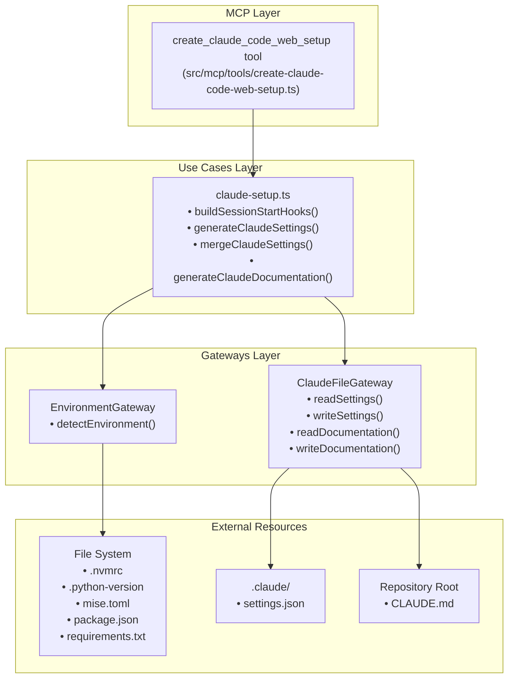
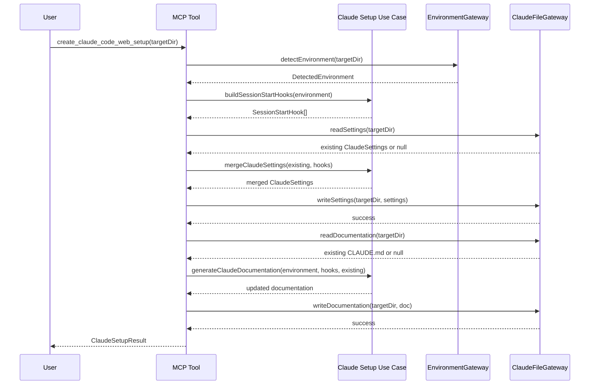

# Feature: Claude Code Web Environment Setup

## Problem Statement

When software engineers want to leverage Claude Code on the web effectively, they need properly configured environment setup through `.claude/settings.json` SessionStart hooks and documentation in `CLAUDE.md`. Unlike GitHub Copilot which uses repository-committed workflows, Claude Code web environments rely on UI-configured environments with SessionStart hooks for dependency installation and environment initialization. Manually creating and maintaining these hooks is time-consuming, error-prone, and requires knowledge of the repository's tooling setup. This feature automates the detection of environment configuration and generates or updates the Claude Code web environment setup accordingly, providing a consistent experience across both Copilot and Claude Code from the same source of truth—the project's detected environment.

## Personas

| Persona | Impact | Notes |
|---------|--------|-------|
| Software Engineer Learning Vibe Coding | Positive | Primary user - gets automated Claude Code setup tailored to their project's environment |
| Platform Engineer | Positive | Can ensure consistent agent configuration across both Copilot and Claude Code |
| Team Lead | Positive | Can standardize Claude Code environment configuration in documentation and templates |

## Value Assessment

- **Primary value**: Efficiency — Eliminates manual SessionStart hook creation by automatically detecting environment configuration and generating appropriate setup commands
- **Secondary value**: Customer — Increases satisfaction for engineers using Claude Code by providing parity with Copilot setup automation

## User Stories

### Story 1: Generate SessionStart Hooks for Version Files

As a **Software Engineer Learning Vibe Coding**,
I want **the tool to generate SessionStart hooks based on detected version files**,
so that I can **automatically configure my Claude Code environment without manual setup**.

#### Acceptance Criteria

- When the tool detects a `.nvmrc` file, the system shall generate a SessionStart hook that runs `nvm install` and `npm ci`
- When the tool detects a `.node-version` file, the system shall generate a SessionStart hook that runs `nvm install` and `npm ci`
- When the tool detects a `.python-version` file, the system shall generate a SessionStart hook that runs `pyenv install` and dependency installation commands
- When the tool detects `requirements.txt`, the system shall include `pip install -r requirements.txt` in the SessionStart hook
- When the tool detects `Pipfile`, the system shall include `pipenv install` in the SessionStart hook
- When the tool detects `pyproject.toml` with Poetry markers, the system shall include `poetry install` in the SessionStart hook
- When the tool detects `package-lock.json`, the system shall use `npm ci` instead of `npm install`
- When the tool detects `yarn.lock`, the system shall use `yarn install --frozen-lockfile`
- When the tool detects `pnpm-lock.yaml`, the system shall use `pnpm install --frozen-lockfile`

#### Notes

- SessionStart hooks run in the universal base image and must use tools available in that environment
- Commands should be idempotent and safe to run multiple times
- Priority order for package managers matches Copilot setup detection

### Story 2: Generate SessionStart Hooks for Mise Configuration

As a **Software Engineer Learning Vibe Coding**,
I want **the tool to generate SessionStart hooks for mise-managed projects**,
so that I can **leverage mise for multi-language runtime management in Claude Code**.

#### Acceptance Criteria

- When the tool detects `mise.toml`, the system shall generate a SessionStart hook that runs `mise install`
- When mise manages multiple runtimes, the system shall generate hooks that run `mise install` followed by dependency installation for each detected package manager
- When both `mise.toml` and individual version files exist, the system shall prioritize mise configuration
- The system shall detect which package managers are used and include appropriate installation commands after `mise install`

#### Notes

- Mise takes precedence over individual version files since it can manage multiple languages
- The SessionStart hook should run `mise install` once, then proceed with dependency installations

### Story 3: Create or Merge .claude/settings.json

As a **Software Engineer Learning Vibe Coding**,
I want **the tool to create or update `.claude/settings.json` with SessionStart hooks**,
so that I can **preserve existing configuration while adding environment setup**.

#### Acceptance Criteria

- When no `.claude/settings.json` exists, the system shall create a new file with SessionStart hooks
- When `.claude/settings.json` exists without SessionStart section, the system shall add the SessionStart section
- When `.claude/settings.json` exists with SessionStart hooks, the system shall merge new hooks without duplicating existing ones
- When merging hooks, the system shall preserve existing non-environment hooks
- The system shall maintain valid JSON structure in the generated file
- When creating or updating the file, the system shall use consistent formatting (2-space indentation)

#### Notes

- Must preserve existing settings like enabledPlugins, agents, skills
- SessionStart hooks should be an array of command strings
- Each hook command should be a single line for readability

### Story 4: Generate or Update CLAUDE.md Documentation

As a **Software Engineer Learning Vibe Coding**,
I want **the tool to document environment setup in CLAUDE.md**,
so that I can **understand what the SessionStart hooks install and maintain the documentation**.

#### Acceptance Criteria

- When no `CLAUDE.md` exists, the system shall create a new file with an Environment Setup section
- When `CLAUDE.md` exists without an Environment Setup section, the system shall append the section
- When `CLAUDE.md` exists with an Environment Setup section, the system shall update it with detected configuration
- The Environment Setup section shall list detected runtimes with versions where available
- The Environment Setup section shall list detected package managers and dependency files
- The Environment Setup section shall document the SessionStart hooks that were generated
- When no environment-specific configuration is detected, the system shall document this in the Environment Setup section

#### Notes

- Should use markdown headings and formatting consistent with existing CLAUDE.md
- Version information should be included when available from version files
- Commands should be shown in code blocks for clarity

### Story 5: Return Structured MCP Tool Response

As a **Software Engineer Learning Vibe Coding**,
I want **the MCP tool to return detailed information about generated configuration**,
so that I can **understand what was configured and any recommendations for UI-level settings**.

#### Acceptance Criteria

- The MCP tool shall return a success response with generated hook commands
- The MCP tool shall return detected environment information (runtimes, package managers)
- The MCP tool shall include recommendations for UI-level environment settings where applicable
- The MCP tool shall indicate what action was taken (created, updated, no changes needed)
- When errors occur, the system shall return an error response with a descriptive message
- The response shall include file paths for created or updated files

#### Notes

- Response format should match existing MCP tool patterns (successResponse/errorResponse)
- Recommendations might include network access requirements or environment variables
- Should provide enough detail for the LLM to explain what was done to the user

### Story 6: Handle Projects with No Detectable Configuration

As a **Software Engineer Learning Vibe Coding**,
I want **the tool to handle projects without version files gracefully**,
so that I can **still get minimal setup even when no environment is detected**.

#### Acceptance Criteria

- When no version files or package managers are detected, the system shall generate minimal setup
- When no environment is detected, the system shall include a message in the response
- When no environment is detected, the system shall create `.claude/settings.json` with an empty SessionStart array or minimal hooks
- When no environment is detected, the system shall document this in the CLAUDE.md Environment Setup section
- The minimal setup shall still be valid and functional

#### Notes

- Minimal setup might include only shell initialization or workspace setup
- Should guide users to add version files if they want automated environment setup

---

## Design

> Refer to `.github/copilot-instructions.md` for technical standards.

### Components Affected

**Entities Layer:**
- `src/entities/claude-setup.ts` (new) — Core domain types (SessionStartHook, ClaudeSettings, ClaudeEnvironmentSetup)

**Use Cases Layer:**
- `src/use-cases/claude-setup.ts` (new) — Business logic for hook generation, settings merging, documentation generation
- `src/use-cases/claude-setup.test.ts` (new) — Tests for use case logic

**Gateways Layer:**
- `src/gateways/claude-file-gateway.ts` (new) — Interface for reading/writing `.claude/settings.json` and `CLAUDE.md`
- `src/gateways/claude-file-gateway.test.ts` (new) — Tests for gateway operations

**MCP Tools Layer:**
- `src/mcp/tools/create-claude-code-web-setup.ts` (new) — MCP tool handler for Claude Code setup
- `src/mcp/server.ts` (update) — Register new tool

**Commands Layer (Optional):**
- `src/commands/claude-setup.ts` (new) — CLI command for Claude Code setup
- `src/commands/claude-setup.test.ts` (new) — Tests for command

### Dependencies

- Existing `EnvironmentGateway.detectEnvironment()` for environment detection
- Existing `buildCandidatesFromEnvironment()` pattern for candidate building
- Node.js `fs/promises` for file operations
- `zod` for schema validation

### Data Model Changes

New entity types in `src/entities/claude-setup.ts`:

```typescript
/**
 * Represents a SessionStart hook command
 */
export interface SessionStartHook {
    /** The command to run in the SessionStart hook */
    command: string;
    /** Description of what this hook does */
    description?: string;
}

/**
 * Claude Code settings structure
 */
export interface ClaudeSettings {
    /** SessionStart hooks for environment initialization */
    SessionStart?: string[];
    /** Other settings preserved during merge */
    [key: string]: unknown;
}

/**
 * Result of generating Claude setup
 */
export interface ClaudeSetupResult {
    /** SessionStart hooks that were generated */
    hooks: SessionStartHook[];
    /** Detected environment details */
    environment: DetectedEnvironment;
    /** Path to created/updated settings.json */
    settingsPath: string;
    /** Path to created/updated CLAUDE.md */
    documentationPath: string;
    /** Action taken: created, updated, or no_changes_needed */
    action: 'created' | 'updated' | 'no_changes_needed';
    /** Recommendations for UI-level configuration */
    recommendations?: string[];
}
```

### Diagrams

#### Data Flow Diagram



#### Sequence Diagram



### Open Questions

- [x] Should the tool support custom SessionStart hook templates via configuration? **No** - Keep it simple with automatic detection only
- [x] Should there be a dry-run mode that shows what would be generated without writing files? **Yes** - Add `dryRun` option to preview changes
- [x] Should the tool validate that commands in SessionStart hooks are available in Claude Code base image? **Yes** - Add validation for common commands

---

## Tasks

> Each task should be completable in a single coding agent session.
> Tasks are sequenced by dependency. Complete in order unless noted.

### Task 1: Create Entity Types for Claude Setup

**Objective**: Define core domain types for Claude Code setup including SessionStart hooks and settings structure

**Context**: This establishes the type system that the rest of the feature will use. These entities must be pure TypeScript with no external dependencies (Layer 1 of Clean Architecture).

**Affected files**:
- `src/entities/claude-setup.ts` (new)
- `src/entities/index.ts` (update - export new types)

**Requirements**:
- The system shall define `SessionStartHook` interface with command and optional description
- The system shall define `ClaudeSettings` interface with SessionStart array and extensible properties
- The system shall define `ClaudeSetupResult` interface with hooks, environment, paths, action, and recommendations
- The system shall define `ClaudeEnvironmentRecommendation` type for UI-level configuration suggestions
- All types shall be immutable using `readonly` modifiers where appropriate

**Verification**:
- [x] `npm test src/entities/claude-setup.test.ts` passes
- [x] Types can be imported from `src/entities/index.ts`
- [x] No imports from other layers (gateways, use-cases)

**Done when**:
- [x] All verification steps pass
- [x] Entity types follow existing patterns in `src/entities/copilot-setup.ts`
- [x] Code follows patterns in `.github/copilot-instructions.md`

---

### Task 2: Create Use Cases for Hook Generation

**Objective**: Implement business logic for building SessionStart hooks from detected environment

**Context**: This reuses the existing environment detection but transforms it into Claude Code SessionStart hooks instead of GitHub Actions workflow steps. The logic should parallel `buildCandidatesFromEnvironment()` from copilot-setup.

**Affected files**:
- `src/use-cases/claude-setup.ts` (new)
- `src/use-cases/claude-setup.test.ts` (new)
- `src/use-cases/index.ts` (update - export new functions)

**Requirements**:
- The system shall implement `buildSessionStartHooks(environment: DetectedEnvironment): SessionStartHook[]`
- When mise.toml is detected, the system shall generate `mise install` hook followed by package manager hooks
- When version files are detected without mise, the system shall generate runtime installation hooks (nvm, pyenv)
- When package managers are detected, the system shall generate appropriate installation hooks (npm ci, yarn install, pip install, etc.)
- The system shall follow package manager priority: npm > yarn > pnpm for Node.js, poetry > pipenv > pip for Python
- The system shall use lockfile-aware commands when lockfiles are detected
- Hook commands shall be ordered logically: runtime setup first, then dependencies

**Verification**:
- [x] `npm test src/use-cases/claude-setup.test.ts` passes
- [x] Test coverage includes mise.toml scenarios
- [x] Test coverage includes version file scenarios  
- [x] Test coverage includes all supported package managers
- [x] Test coverage includes lockfile detection

**Done when**:
- [x] All verification steps pass
- [x] Logic parallels `buildCandidatesFromEnvironment()` pattern
- [x] Tests follow AAA pattern from existing test files
- [x] Code follows patterns in `.github/copilot-instructions.md`

---

### Task 3: Create Use Cases for Settings Merging

**Objective**: Implement business logic for merging SessionStart hooks into existing `.claude/settings.json`

**Context**: This ensures we preserve existing Claude Code configuration while adding or updating environment setup hooks.

**Affected files**:
- `src/use-cases/claude-setup.ts` (update)
- `src/use-cases/claude-setup.test.ts` (update)

**Requirements**:
- The system shall implement `mergeClaudeSettings(existing: ClaudeSettings | null, hooks: SessionStartHook[]): ClaudeSettings`
- When no existing settings exist, the system shall create new settings with SessionStart hooks
- When existing settings have no SessionStart, the system shall add SessionStart array
- When existing settings have SessionStart, the system shall merge hooks without duplication
- The system shall preserve all non-SessionStart properties from existing settings
- The system shall deduplicate hooks based on command string comparison

**Verification**:
- [x] `npm test src/use-cases/claude-setup.test.ts` passes
- [x] Test coverage includes null existing settings
- [x] Test coverage includes existing settings without SessionStart
- [x] Test coverage includes existing settings with SessionStart
- [x] Test coverage includes hook deduplication

**Done when**:
- [x] All verification steps pass
- [x] Tests cover all merge scenarios
- [x] Code follows patterns in `.github/copilot-instructions.md`

---

### Task 4: Create Use Cases for Documentation Generation

**Objective**: Implement business logic for generating or updating CLAUDE.md Environment Setup section

**Context**: This provides human-readable documentation of what the SessionStart hooks do and why they exist.

**Affected files**:
- `src/use-cases/claude-setup.ts` (update)
- `src/use-cases/claude-setup.test.ts` (update)

**Requirements**:
- The system shall implement `generateEnvironmentSetupSection(environment: DetectedEnvironment, hooks: SessionStartHook[]): string`
- The generated section shall include a "## Environment Setup" heading
- The section shall list detected runtimes with versions when available
- The section shall list detected package managers and their manifest files
- The section shall include SessionStart hook commands in code blocks
- When no environment is detected, the section shall document this with a helpful message
- The system shall implement `mergeDocumentation(existing: string | null, setupSection: string): string`
- When no CLAUDE.md exists, the system shall create new documentation with the setup section
- When CLAUDE.md exists, the system shall replace existing "## Environment Setup" section or append if not present

**Verification**:
- [x] `npm test src/use-cases/claude-setup.test.ts` passes
- [x] Test coverage includes new documentation creation
- [x] Test coverage includes updating existing documentation with Environment Setup section
- [x] Test coverage includes updating existing documentation without Environment Setup section
- [x] Generated markdown is valid and well-formatted

**Done when**:
- [x] All verification steps pass
- [x] Documentation generation is clear and helpful
- [x] Code follows patterns in `.github/copilot-instructions.md`

---

### Task 5: Create Claude File Gateway

**Objective**: Implement file system adapter for reading and writing `.claude/settings.json` and `CLAUDE.md`

**Context**: This is the Layer 3 adapter that handles file I/O for Claude Code configuration files.

**Affected files**:
- `src/gateways/claude-file-gateway.ts` (new)
- `src/gateways/claude-file-gateway.test.ts` (new)
- `src/gateways/index.ts` (update - export gateway)

**Requirements**:
- The system shall define `ClaudeFileGateway` interface with methods: readSettings, writeSettings, readDocumentation, writeDocumentation
- The system shall implement `FileSystemClaudeFileGateway` class implementing the interface
- `readSettings()` shall return parsed ClaudeSettings or null if file doesn't exist
- `writeSettings()` shall write JSON with 2-space indentation and trailing newline
- `readDocumentation()` shall return file content or null if file doesn't exist
- `writeDocumentation()` shall write content with trailing newline
- All file operations shall handle errors gracefully
- Settings file path shall be `.claude/settings.json` relative to target directory
- Documentation file path shall be `CLAUDE.md` in target directory root

**Verification**:
- [x] `npm test src/gateways/claude-file-gateway.test.ts` passes
- [x] Tests perform file I/O only within isolated temporary directories and clean up after execution
- [x] Tests cover successful reads and writes
- [x] Tests cover missing files returning null
- [x] Tests cover invalid JSON in settings file

**Done when**:
- [x] All verification steps pass
- [x] Gateway follows pattern of existing gateways (e.g., `file-system-workflow-gateway.ts`)
- [x] Tests follow AAA pattern with Chance.js for test data
- [x] Code follows patterns in `.github/copilot-instructions.md`

---

### Task 6: Create MCP Tool Handler

**Objective**: Implement MCP tool handler that orchestrates environment detection, hook generation, and file updates

**Context**: This is the main entry point that ties all the pieces together and provides the MCP interface.

**Affected files**:
- `src/mcp/tools/create-claude-code-web-setup.ts` (new)
- `src/mcp/tools/index.ts` (update - export handler)
- `src/mcp/server.ts` (update - register tool)

**Requirements**:
- The system shall implement `createClaudeCodeWebSetupHandler` following the pattern of `createCopilotSetupWorkflowHandler`
- The handler shall accept `targetDir` argument (defaults to cwd)
- When target directory doesn't exist, the system shall return error response
- The handler shall call `detectEnvironment()` to get environment configuration
- The handler shall call `buildSessionStartHooks()` to generate hooks
- The handler shall call `readSettings()` to get existing settings
- The handler shall call `mergeClaudeSettings()` to merge hooks
- The handler shall call `writeSettings()` to persist merged settings
- The handler shall call `readDocumentation()` and `generateEnvironmentSetupSection()` to update docs
- The handler shall call `writeDocumentation()` to persist updated docs
- The handler shall return success response with ClaudeSetupResult data
- The tool shall be registered in MCP server with name `create_claude_code_web_setup`
- The tool description shall explain its purpose clearly
- The tool schema shall use zod for input validation

**Verification**:
- [x] `npm test src/mcp/server.test.ts` passes (includes create_claude_code_web_setup handler tests)
- [x] MCP server includes the new tool in tool list
- [x] Tool can be called via MCP client
- [x] Tool returns structured response matching ToolResult type
- [x] Tool handles errors gracefully

**Done when**:
- [x] All verification steps pass
- [x] Tool follows pattern of `create-copilot-setup-workflow.ts`
- [x] Tool is properly registered in `src/mcp/server.ts`
- [x] Code follows patterns in `.github/copilot-instructions.md`

---

### Task 7: Add Integration Tests

**Objective**: Add end-to-end integration tests that verify the full flow with real file system operations

**Context**: These tests ensure the feature works correctly with actual files and directories.

**Affected files**:
- `src/mcp/tools/create-claude-code-web-setup.integration.test.ts` (new)

**Requirements**:
- Tests shall use temporary directories for file operations
- Tests shall verify creating new `.claude/settings.json` with detected environment
- Tests shall verify updating existing `.claude/settings.json` preserving other settings
- Tests shall verify creating new `CLAUDE.md` with environment section
- Tests shall verify updating existing `CLAUDE.md` preserving other content
- Tests shall verify handling projects with no detectable environment
- Tests shall verify handling projects with mise.toml
- Tests shall verify handling projects with version files and package managers
- Tests shall clean up temporary directories after tests

**Verification**:
- [x] MCP server tests in `src/mcp/server.test.ts` cover all major scenarios
- [x] Tests cover all major scenarios from acceptance criteria
- [x] Tests verify file content is correct
- [x] Tests verify JSON structure is valid

**Done when**:
- [x] All verification steps pass
- [x] Integration tests provide confidence in end-to-end behavior
- [x] Code follows patterns in `.github/copilot-instructions.md`

---

### Task 8: Add Optional CLI Command (Optional)

**Objective**: Add CLI command for easier standalone usage outside of MCP context

**Context**: This provides a direct CLI interface similar to `copilot-setup` command.

**Affected files**:
- `src/commands/claude-setup.ts` (new)
- `src/commands/claude-setup.test.ts` (new)
- `src/index.ts` (update - register command)

**Requirements**:
- The system shall implement `claude-setup` command using citty
- The command shall accept `--directory` option for target directory
- The command shall call the same use cases as the MCP tool
- The command shall display success message with generated hooks
- The command shall display error message on failure
- The command shall be registered in main CLI

**Verification**:
- [ ] `npm test src/commands/claude-setup.test.ts` passes
- [ ] Command can be run via `npm run dev claude-setup`
- [ ] Command output is clear and helpful
- [ ] Command follows pattern of `copilot-setup.ts`

**Done when**:
- [ ] All verification steps pass
- [ ] Command is properly registered in CLI
- [ ] Code follows patterns in `.github/copilot-instructions.md`

---

### Task 9: Update Documentation

**Objective**: Document the new feature in README and add usage examples

**Context**: Users need to know about and understand how to use the new Claude Code setup feature.

**Affected files**:
- `README.md` (update)
- `docs/claude-code-setup.md` (new - optional detailed guide)

**Requirements**:
- README shall mention the new MCP tool
- README shall provide basic usage example
- Documentation shall explain the difference between Copilot setup and Claude Code setup
- Documentation shall show example `.claude/settings.json` output
- Documentation shall show example CLAUDE.md Environment Setup section
- Documentation shall document supported environment configurations

**Verification**:
- [ ] Documentation is clear and accurate
- [ ] Examples are runnable and correct
- [ ] Links work correctly

**Done when**:
- [ ] Documentation review complete
- [ ] Examples verified
- [ ] Code follows patterns in `.github/copilot-instructions.md`

---

## Out of Scope

- Full Claude Code agent configuration (agents, commands, skills) — only environment setup
- UI environment configuration automation — only generates hooks, not UI settings
- Integration with Claude Code API for automated setup
- Support for non-standard base images or custom environments
- Validation of command availability in Claude Code base image

## Future Considerations

- **Priority: High** - Add `--dry-run` flag to preview generated configuration (decided: yes)
- **Priority: High** - Validate commands against Claude Code base image capabilities (decided: yes)
- **Priority: Low** - Support custom SessionStart hook templates via configuration (decided: no - keep simple)
- Add `--merge-strategy` option for different merge behaviors
- Support for detecting and configuring additional environment variables
- Integration with Claude Code CLI for automated environment creation
