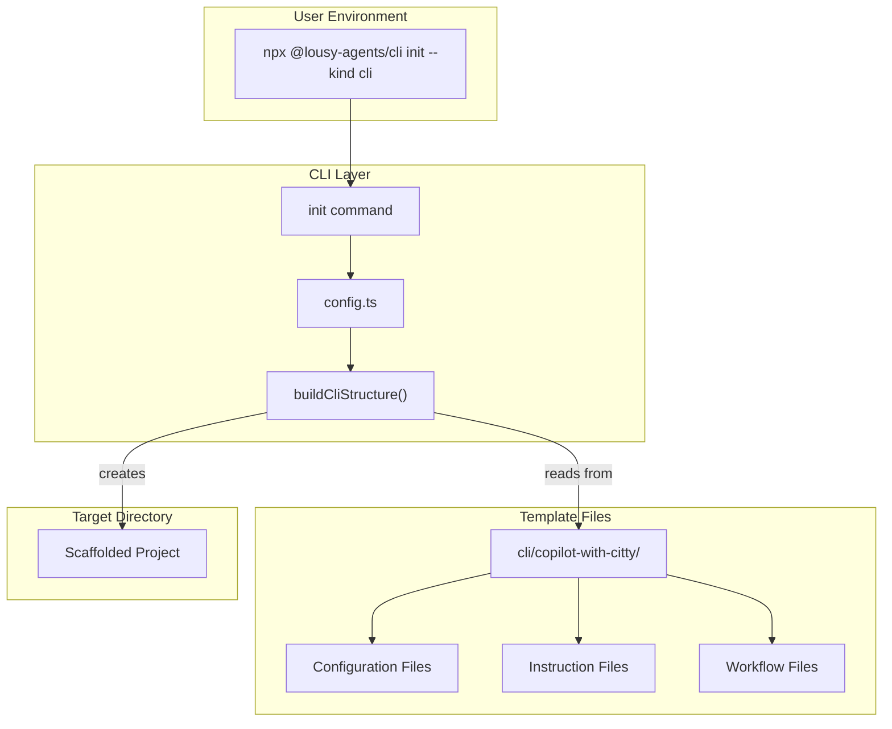
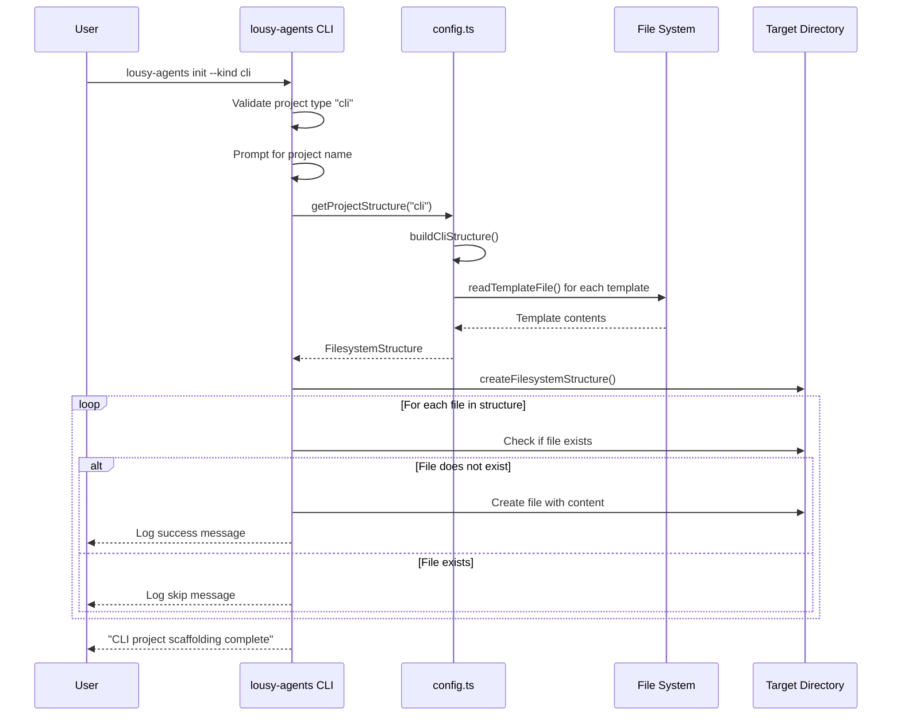

# Feature: CLI Project Scaffolding for Init Command

## Problem Statement

Software engineers learning vibe coding need a way to quickly scaffold a new CLI project with TypeScript, citty for command handling, and proper testing setup. Without pre-configured scaffolding, developers must manually create configuration files, set up testing infrastructure, and configure build tools—which is time-consuming and error-prone. This feature enables developers to scaffold a complete CLI project structure by selecting "cli" from the init command's project type menu.

## Personas

| Persona | Impact | Notes |
|---------|--------|-------|
| Software Engineer Learning Vibe Coding | Positive | Primary user - gets a fully-configured CLI project with testing, linting, and TypeScript setup |
| CLI Developer | Positive | Receives a complete TypeScript CLI development environment with Clean Architecture patterns ready to use |
| Team Lead | Positive | Can ensure consistent CLI project setup across team members |

## Value Assessment

- **Primary value**: Efficiency — Eliminates hours of manual configuration by providing a complete CLI project structure with testing, linting, and build tools pre-configured
- **Secondary value**: Customer — Improves user experience by reducing friction in starting new CLI projects and providing production-ready tooling with Clean Architecture patterns from day one

## User Stories

### Story 1: Scaffold CLI Project Files

As a **Software Engineer Learning Vibe Coding**,
I want **to select "cli" from the init command and have all necessary CLI configuration files created**,
so that I can **immediately start building CLI features without spending time on project setup**.

#### Acceptance Criteria

- When the user selects "cli" from the init prompt, the system shall create a `package.json` file with citty, consola, TypeScript, and testing dependencies if it does not exist
- When the user selects "cli", the system shall create a `tsconfig.json` file with Node.js-appropriate TypeScript configuration if it does not exist
- When the user selects "cli", the system shall create a `vitest.config.ts` file with CLI testing configuration if it does not exist
- When the user selects "cli", the system shall create a `vitest.setup.ts` file with testing library setup if it does not exist
- When the user selects "cli", the system shall create a `biome.json` file with linting and formatting rules if it does not exist
- When the user selects "cli", the system shall create a `.editorconfig` file with consistent editor settings if it does not exist
- When the user selects "cli", the system shall create a `.nvmrc` file specifying the Node.js version if it does not exist
- The system shall preserve existing files without modification
- When existing files are encountered, the system shall skip them and continue scaffolding remaining files

#### Notes

- The CLI scaffolding uses citty for command handling and consola for terminal output
- All configuration files should contain working, production-ready settings
- Dependencies should use exact versions (no ^ or ~)

### Story 2: Scaffold CLI Instructions and Guidelines

As a **Software Engineer Learning Vibe Coding**,
I want **the CLI scaffolding to include GitHub Copilot instructions tailored for CLI development**,
so that I can **receive appropriate AI assistance for my CLI project using Clean Architecture patterns**.

#### Acceptance Criteria

- When the user selects "cli", the system shall create a `.github/copilot-instructions.md` file with CLI-specific instructions including citty, consola, and Clean Architecture guidance if it does not exist
- When the user selects "cli", the system shall create a `.github/instructions` directory if it does not exist
- When the user selects "cli", the system shall create a `.github/instructions/test.instructions.md` file with CLI testing guidelines if it does not exist
- When the user selects "cli", the system shall create a `.github/instructions/spec.instructions.md` file with spec development guidelines if it does not exist
- When the user selects "cli", the system shall create a `.github/instructions/pipeline.instructions.md` file with CI/CD guidelines if it does not exist
- When the user selects "cli", the system shall create a `.github/instructions/software-architecture.instructions.md` file with Clean Architecture guidance for CLI projects if it does not exist
- The system shall preserve existing instruction files without modification

#### Notes

- Instruction files should be tailored for CLI development with citty and consola
- Content should include Clean Architecture patterns adapted for CLI projects

### Story 3: Scaffold Additional CLI Configuration

As a **Software Engineer Learning Vibe Coding**,
I want **additional configuration files for code quality, development environment, and CI/CD**,
so that I can **have a consistent and well-configured development experience**.

#### Acceptance Criteria

- When the user selects "cli", the system shall create a `.yamllint` file with YAML linting rules if it does not exist
- When the user selects "cli", the system shall create a `.vscode/extensions.json` file with recommended VSCode extensions if it does not exist
- When the user selects "cli", the system shall create a `.vscode/launch.json` file with debugging configuration for CLI projects if it does not exist
- When the user selects "cli", the system shall create a `.vscode/mcp.json` file with MCP server configuration if it does not exist
- When the user selects "cli", the system shall create a `.devcontainer/devcontainer.json` file with development container configuration if it does not exist
- When the user selects "cli", the system shall create a `.github/workflows/assign-copilot.yml` file for auto-assigning Copilot on spec issues if it does not exist
- When the user selects "cli", the system shall create a `.github/workflows/ci.yml` file with test and lint jobs if it does not exist
- When the user selects "cli", the system shall create a `.github/ISSUE_TEMPLATE/feature-to-spec.yml` file for spec-driven development if it does not exist
- When the user selects "cli", the system shall create a `.github/specs/README.md` file with specification directory guidance if it does not exist
- The system shall preserve existing configuration files without modification

#### Notes

- These files improve the development experience and enable CI/CD
- Configuration should match patterns from the API template where applicable
- CI workflow should include lint, test, and build jobs

---

## Design

> Refer to `.github/copilot-instructions.md` for technical standards.

### Data Flow Diagram

### Sequence Diagram

### Components Affected

- `cli/copilot-with-citty/` — New source directory for CLI template files
- `src/lib/config.ts` — Update CLI structure configuration to use template files
- `src/commands/init.ts` — Update to support CLI scaffolding (remove error, add handler)
- `src/commands/init.test.ts` — Update tests for CLI scaffolding
- `src/lib/config.test.ts` — Update tests for CLI structure
- `package.json` — Add `cli` directory to `files` array for npm package inclusion

### Dependencies

- Node.js `fs/promises` (already in use) — For reading template files
- `c12` (already in use) — For configuration management
- `consola` (already in use) — For logging and user feedback

### Data Model Changes

The current `FilesystemNode` types need no changes as they already support file content. The CLI template will use the same pattern as the webapp and REST API templates for lazy-loading template content.

### Open Questions

- [x] What framework should CLI projects use? — citty for commands, consola for terminal output (same as lousy-agents itself)
- [x] Should the CLI template include database support? — No, CLI projects are simpler; no database support needed

---

## Tasks

> Each task should be completable in a single coding agent session.
> Tasks are sequenced by dependency. Complete in order unless noted.

### Task 1: Create CLI template directory structure

**Objective**: Create the `cli/copilot-with-citty/` directory with all configuration and template files

**Context**: This establishes the template files that will be read by config.ts when scaffolding CLI projects. This is the foundation for all CLI scaffolding.

**Affected files**:
- `cli/copilot-with-citty/package.json`
- `cli/copilot-with-citty/tsconfig.json`
- `cli/copilot-with-citty/vitest.config.ts`
- `cli/copilot-with-citty/vitest.setup.ts`
- `cli/copilot-with-citty/biome.json`
- `cli/copilot-with-citty/.editorconfig`
- `cli/copilot-with-citty/.nvmrc`
- `cli/copilot-with-citty/.yamllint`

**Requirements**:
- The template shall include package.json with citty, consola, and testing dependencies
- The template shall include tsconfig.json with Node.js-appropriate TypeScript configuration
- The template shall include vitest.config.ts with CLI testing configuration
- All configuration files shall follow patterns from the API template where applicable

**Verification**:
- [x] `cli/copilot-with-citty/` directory exists with all configuration files
- [x] All JSON files are valid JSON
- [x] `mise run lint` passes for YAML files

**Done when**:
- [x] All verification steps pass
- [x] No new errors in affected files
- [x] All configuration files are created with appropriate content

---

### Task 2: Create CLI copilot-instructions.md and instruction files

**Depends on**: Task 1

**Objective**: Create the main copilot-instructions.md file and instruction files tailored for CLI development with Clean Architecture patterns

**Context**: These are the instruction files that guide AI assistants when working on CLI projects.

**Affected files**:
- `cli/copilot-with-citty/.github/copilot-instructions.md`
- `cli/copilot-with-citty/.github/instructions/test.instructions.md`
- `cli/copilot-with-citty/.github/instructions/spec.instructions.md`
- `cli/copilot-with-citty/.github/instructions/pipeline.instructions.md`
- `cli/copilot-with-citty/.github/instructions/software-architecture.instructions.md`

**Requirements**:
- Instructions shall include citty/consola-specific TDD workflow guidance
- Instructions shall include Clean Architecture principles adapted for CLIs
- All files shall follow similar structure to the API template instructions

**Verification**:
- [x] All instruction files exist in `.github/instructions/` directory
- [x] Files include CLI-specific guidance

**Done when**:
- [x] All verification steps pass
- [x] No new errors in affected files
- [x] All instruction files are comprehensive and CLI-specific

---

### Task 3: Create CLI GitHub workflows, templates, and VSCode config

**Depends on**: Task 2

**Objective**: Create GitHub workflow files, issue templates, specs README, VSCode config, and devcontainer for CLI projects

**Context**: These files enable CI/CD and a consistent development experience for CLI projects.

**Affected files**:
- `cli/copilot-with-citty/.github/workflows/assign-copilot.yml`
- `cli/copilot-with-citty/.github/workflows/ci.yml`
- `cli/copilot-with-citty/.github/ISSUE_TEMPLATE/feature-to-spec.yml`
- `cli/copilot-with-citty/.github/specs/README.md`
- `cli/copilot-with-citty/.vscode/extensions.json`
- `cli/copilot-with-citty/.vscode/launch.json`
- `cli/copilot-with-citty/.vscode/mcp.json`
- `cli/copilot-with-citty/.devcontainer/devcontainer.json`

**Requirements**:
- ci.yml shall include lint, test, and build jobs
- assign-copilot.yml shall follow same pattern as API template
- All workflow actions shall be pinned to exact commit SHA with version comments

**Verification**:
- [x] All files exist in their expected directories
- [x] All JSON files are valid JSON
- [x] ci.yml includes lint, test, and build jobs

**Done when**:
- [x] All verification steps pass
- [x] No new errors in affected files
- [x] All workflows and config files are properly configured for CLI projects

---

### Task 4: Update config.ts and init.ts for CLI scaffolding

**Depends on**: Task 3

**Objective**: Update config.ts to use template files for CLI structure and update init.ts to support CLI scaffolding

**Context**: This connects the CLI template files to the init command, enabling CLI scaffolding to work.

**Affected files**:
- `src/lib/config.ts`
- `src/commands/init.ts`

**Requirements**:
- config.ts shall define a buildCliStructure function following the webapp/API pattern
- config.ts shall lazy-load CLI structure only when requested
- getProjectStructure shall return CLI structure for "cli" project type with template file content
- init.ts shall support CLI project type (remove the error, add scaffolding handler)
- SUPPORTED_PROJECT_TYPES shall include "cli"

**Verification**:
- [x] `npm test` passes
- [x] `mise run format-check` passes
- [x] Code follows same pattern as webapp/API structure

**Done when**:
- [x] All verification steps pass
- [x] No new errors in affected files
- [x] CLI scaffolding logic is fully implemented

---

### Task 5: Update tests for CLI scaffolding

**Depends on**: Task 4

**Objective**: Update tests to verify CLI scaffolding functionality

**Context**: Ensures CLI scaffolding works correctly, creates expected files, and preserves existing files.

**Affected files**:
- `src/commands/init.test.ts`
- `src/lib/config.test.ts`

**Requirements**:
- Tests shall verify CLI scaffolding creates expected files in empty directory
- Tests shall verify CLI scaffolding preserves existing files
- Tests shall verify CLI scaffolding creates .github/copilot-instructions.md with CLI content
- Tests shall follow same testing patterns as webapp/API scaffolding tests
- Existing CLI tests that expect "not yet supported" error shall be updated

**Verification**:
- [x] `npm test` passes
- [x] `mise run format-check` passes
- [x] All CLI scaffolding scenarios are tested

**Done when**:
- [x] All verification steps pass
- [x] No new errors in affected files
- [x] CLI scaffolding is fully tested

---

### Task 6: Update package.json and run full validation

**Depends on**: Task 5

**Objective**: Add `cli` directory to package.json files array and run full validation suite

**Context**: Ensures template files are included when the package is published to npm.

**Affected files**:
- `package.json`

**Requirements**:
- When the package is published to npm, the system shall include the `cli` directory in the bundle

**Verification**:
- [x] `npm pack --dry-run` shows `cli/` directory contents included
- [x] `mise run ci && npm run build` passes

**Done when**:
- [x] All verification steps pass
- [x] No new errors in affected files
- [x] Template files will be included in published package
- [x] No regressions in existing functionality

---

## Out of Scope

- Smart merging of package.json with existing dependencies (preserve existing files for now)
- Creating src/ directory structure with example commands or handlers (configuration only)
- README.md generation with project-specific content
- npm install or dependency installation (users run this manually)
- Example CLI commands or handlers

## Future Considerations

- Add intelligent merging for package.json to combine dependencies
- Create example CLI commands demonstrating Clean Architecture
- Generate project-specific README.md
- Support customization of CLI scaffolding through configuration
