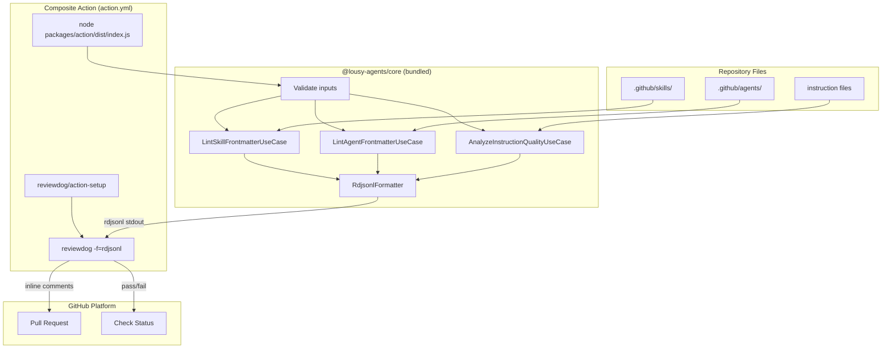
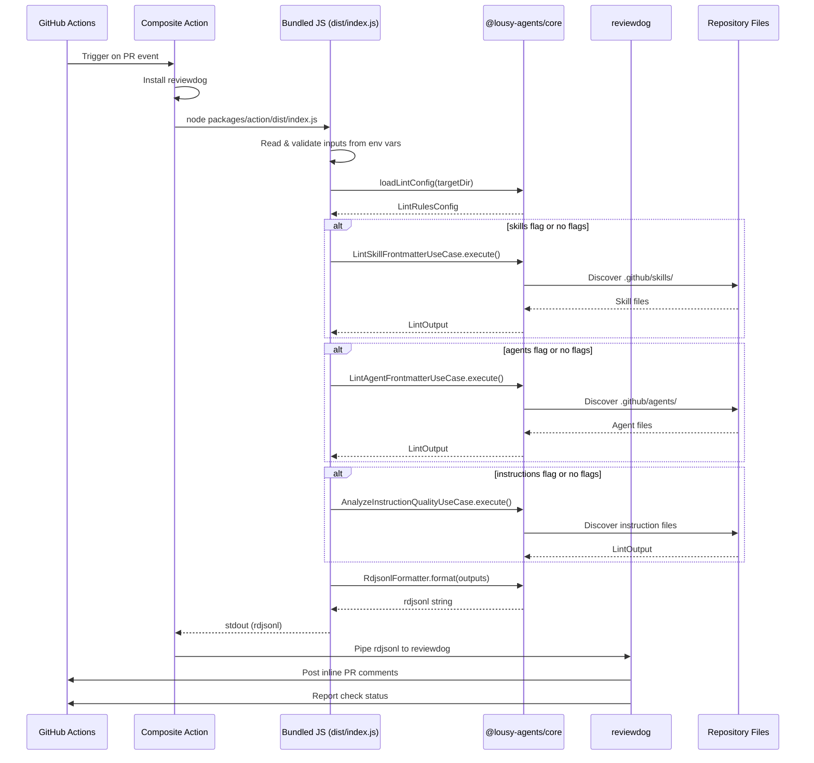

# Feature: Convert GitHub Action to JavaScript

## Problem Statement

The GitHub Action (`action.yml`) uses a large embedded shell script (lines 96–158) for input validation, flag construction, and lint orchestration. This script has no test coverage, mixes validation logic with execution, and requires installing `@lousy-agents/cli` from npm on every run. Converting the action to use a bundled JavaScript entry point that calls the `@lousy-agents/core` lint APIs directly eliminates the npm install step, enables unit testing of the action logic, and aligns with the JavaScript action pattern recommended by GitHub.

## Personas

| Persona | Impact | Notes |
|---------|--------|-------|
| Software Engineer Learning Vibe Coding | Positive | Faster action execution (no npm install), same lint feedback experience |
| Team Lead | Positive | Action is now testable and maintainable; no runtime dependency on npm registry availability |

## Value Assessment

- **Primary value**: Efficiency — Eliminates npm install step on every action run, reducing execution time by ~10-20 seconds
- **Secondary value**: Future — Action logic is now unit-testable TypeScript, reducing maintenance cost and regression risk

## User Stories

### Story 1: Lint Without npm Install

As a **Software Engineer Learning Vibe Coding**,
I want **the lousy-agents GitHub Action to run lint checks without installing the npm package**,
so that I can **get faster PR feedback and not depend on npm registry availability**.

#### Acceptance Criteria

- When the action runs, the action shall execute a bundled JavaScript file that calls the `@lousy-agents/core` lint APIs directly
- When the action runs, the action shall not install `@lousy-agents/cli` from npm
- When the user specifies target flags (skills, agents, instructions), the action shall only lint the specified targets
- When no target flags are specified, the action shall lint all targets (skills, agents, and instructions)
- When lint diagnostics are found, the action shall output rdjsonl format to stdout for reviewdog consumption
- If the directory input contains path traversal sequences, then the action shall reject the input with an error message

### Story 2: Action Smoke Test

As a **Software Engineer Learning Vibe Coding**,
I want **a smoke test workflow that validates the action on every PR**,
so that I can **catch action regressions before release**.

#### Acceptance Criteria

- When a PR is opened, the smoke test workflow shall build the action and run it against test fixtures
- When the action produces lint output, the smoke test shall verify the action completes successfully
- If the action build is broken, then the smoke test shall fail the PR check

---

## Design

> Refer to `.github/copilot-instructions.md` for technical standards.

### Components Affected

- `packages/action/src/index.ts` — New JavaScript entry point that orchestrates lint
- `packages/action/src/validate-inputs.ts` — Input validation (directory, reporter, filter_mode, level)
- `packages/action/src/run-lint.ts` — Lint orchestration calling core APIs
- `packages/action/rspack.config.ts` — Build configuration for bundling the action
- `packages/action/tsconfig.json` — TypeScript configuration
- `packages/action/package.json` — Build script and workspace metadata
- `action.yml` — Simplified to use bundled JS instead of shell script
- `.gitignore` — Allow `packages/action/dist/` to be committed
- `.github/workflows/action-smoke-test.yml` — New smoke test workflow
- `package.json` (root) — Include action in workspace build

### Dependencies

- `@lousy-agents/core` — Lint use cases, gateways, formatters, config loading
- `reviewdog/action-setup` — Installs reviewdog binary (unchanged)
- `@rspack/core` — Bundles action into single file (dev dependency, already in workspace)

### Diagrams

#### Data Flow Diagram

#### Sequence Diagram

### Open Questions

- [x] Should the dist file be committed? — Yes, standard practice for JavaScript GitHub Actions.

---

## Tasks

> Each task should be completable in a single coding agent session.
> Tasks are sequenced by dependency. Complete in order unless noted.

### Task 1: Create action source code and build configuration

**Objective**: Create the TypeScript entry point, input validation, lint orchestration, and rspack build config for the action package.

**Context**: This replaces the shell script with testable TypeScript that calls core APIs directly.

**Affected files**:
- `packages/action/src/index.ts`
- `packages/action/src/validate-inputs.ts`
- `packages/action/src/run-lint.ts`
- `packages/action/rspack.config.ts`
- `packages/action/tsconfig.json`
- `packages/action/package.json`

**Requirements**:
- The entry point shall read inputs from environment variables (INPUT_DIRECTORY, INPUT_SKILLS, INPUT_AGENTS, INPUT_INSTRUCTIONS)
- The validate-inputs module shall reject empty directories, absolute paths, home-relative paths, and path traversal sequences
- The validate-inputs module shall validate reporter against allowlist (github-pr-check, github-pr-review, github-check)
- The validate-inputs module shall validate filter_mode against allowlist (added, diff_context, file, nofilter)
- The validate-inputs module shall validate level against allowlist (info, warning, error)
- The run-lint module shall call LintSkillFrontmatterUseCase, LintAgentFrontmatterUseCase, and AnalyzeInstructionQualityUseCase from core
- The run-lint module shall apply severity filtering from lint config
- The entry point shall format output as rdjsonl and write to stdout
- The rspack config shall bundle everything into a single `dist/index.js` without shebang

**Verification**:
- [ ] `npm run build --workspace=packages/action` succeeds
- [ ] `packages/action/dist/index.js` is produced
- [ ] TypeScript compilation has no errors

**Done when**:
- [ ] All verification steps pass
- [ ] Action source code follows patterns in `.github/copilot-instructions.md`

---

### Task 2: Write unit tests for action input validation

**Objective**: Add test coverage for the input validation logic extracted from the shell script.

**Depends on**: Task 1

**Affected files**:
- `packages/action/src/validate-inputs.test.ts`

**Requirements**:
- Tests shall verify directory validation rejects empty strings, absolute paths, `..` sequences, `~` paths, and `-` values
- Tests shall verify directory validation accepts valid relative paths (`.`, `src`, `my-dir/sub`)
- Tests shall verify reporter validation accepts allowed values and rejects invalid ones
- Tests shall verify filter_mode validation accepts allowed values and rejects invalid ones
- Tests shall verify level validation accepts allowed values and rejects invalid ones

**Verification**:
- [ ] `npm test packages/action/src/validate-inputs.test.ts` passes
- [ ] All validation paths are covered

**Done when**:
- [ ] All verification steps pass
- [ ] Tests follow patterns in `.github/instructions/test.instructions.md`

---

### Task 3: Update action.yml and gitignore

**Objective**: Simplify action.yml to use the bundled JavaScript instead of shell script, remove the npm install step.

**Depends on**: Task 1

**Affected files**:
- `action.yml`
- `.gitignore`

**Requirements**:
- The action shall no longer have a `version` input
- The action shall not include a Setup Node.js step for npm installation
- The action shall not include an Install lousy-agents CLI step
- The action shall run `node $GITHUB_ACTION_PATH/packages/action/dist/index.js` and pipe to reviewdog
- The `.gitignore` shall exclude `dist` generally but allow `packages/action/dist/`

**Verification**:
- [ ] `action.yml` is valid YAML
- [ ] `packages/action/dist/index.js` is not gitignored

**Done when**:
- [ ] All verification steps pass
- [ ] Action file matches acceptance criteria

---

### Task 4: Update build pipeline and root configuration

**Objective**: Include the action in the workspace build process.

**Depends on**: Task 1

**Affected files**:
- `package.json` (root)

**Requirements**:
- The root `build` script shall include `packages/action` workspace
- Building the action shall succeed as part of the full build

**Verification**:
- [ ] `npm run build` succeeds and includes action build
- [ ] `packages/action/dist/index.js` exists after build

**Done when**:
- [ ] All verification steps pass

---

### Task 5: Create smoke test workflow

**Objective**: Add a GitHub Actions workflow that smoke-tests the action on PRs.

**Depends on**: Task 3

**Affected files**:
- `.github/workflows/action-smoke-test.yml`

**Requirements**:
- The workflow shall trigger on pull_request events
- The workflow shall build the project including the action
- The workflow shall run the action against test fixtures with valid and invalid data
- The workflow shall verify the action completes successfully for valid data
- All action references shall be pinned to commit SHA with version comment

**Verification**:
- [ ] `mise run actionlint` passes
- [ ] `mise run yamllint` passes

**Done when**:
- [ ] All verification steps pass
- [ ] Workflow follows patterns in `.github/instructions/pipeline.instructions.md`

---

### Task 6: Full validation

**Objective**: Run the complete validation suite to ensure nothing is broken.

**Depends on**: All previous tasks

**Verification**:
- [ ] `mise run ci` passes
- [ ] `npm run build` passes
- [ ] All existing tests pass
- [ ] No new lint errors

**Done when**:
- [ ] All verification steps pass

---

## Out of Scope

- Converting to a pure JavaScript action type (composite is sufficient)
- Docker-based action
- Custom reviewdog action wrapping
- Auto-fix capabilities in the action
- Publishing the action to GitHub Marketplace

## Future Considerations

- Add `@actions/core` for richer input/output handling if action type changes from composite
- Add a CI step to verify the committed dist is up to date with source
- Consider ncc as an alternative bundler for simpler action builds
