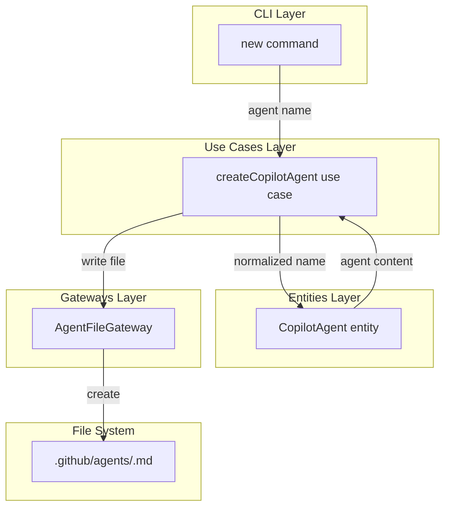
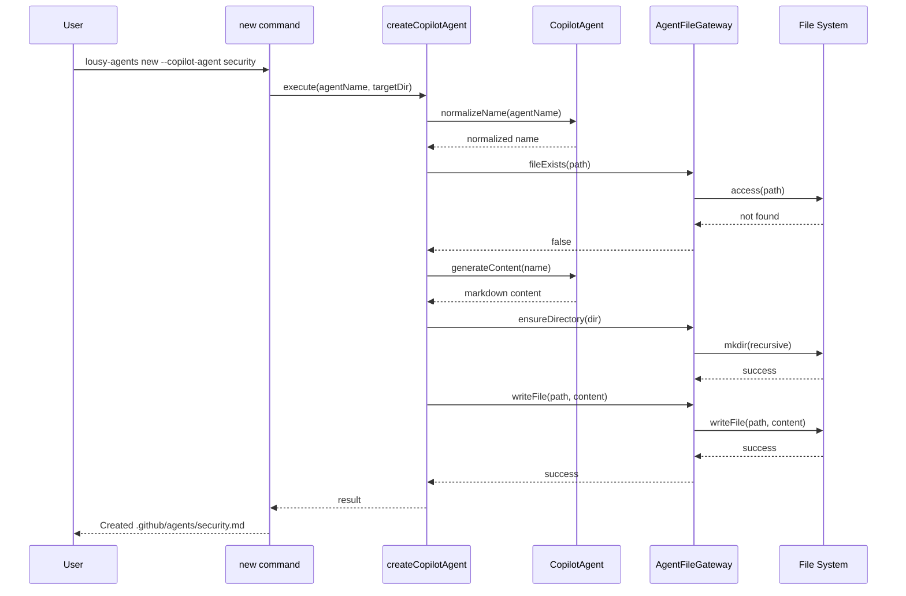

# Feature: Copilot Agent Scaffolding via CLI

## Problem Statement

Developers need to create custom GitHub Copilot agents with proper YAML frontmatter and structure. Manually creating these files is error-prone and requires memorizing the configuration schema. This command scaffolds repository-level custom agent files with recommended patterns, documentation links, and example content to reduce friction and ensure consistency.

## Personas

| Persona | Impact | Notes |
|---------|--------|-------|
| Software Engineer Learning Vibe Coding | Positive | Primary user - gets properly structured agent files with documentation links |
| Team Lead | Positive | Can ensure consistent agent configuration across team members |

## Value Assessment

- **Primary value**: Efficiency — Reduces setup time by generating properly structured agent files with correct YAML frontmatter
- **Secondary value**: Customer — Improves user experience by eliminating need to memorize configuration schema and providing documentation links

## User Stories

### Story 1: Basic Agent Creation

As a **Software Engineer Learning Vibe Coding**,
I want **to create a new Copilot agent file using a CLI command**,
so that I can **quickly scaffold a properly structured agent file without memorizing the configuration schema**.

#### Acceptance Criteria

- When the user runs `lousy-agents new --copilot-agent <name>`, the CLI shall create a new file at `.github/agents/<name>.md`
- The CLI shall include YAML frontmatter with `name` and `description` fields in the generated file
- The CLI shall include an example prompt that demonstrates agent behavior in the generated file
- The CLI shall include a comment with a link to GitHub's custom agents documentation in the generated file

#### Notes

- The generated agent file should follow GitHub's custom agents specification
- Example content should be generic but illustrative of agent capabilities

---

### Story 2: Agent Name Normalization

As a **Software Engineer Learning Vibe Coding**,
I want **agent names with spaces or mixed case to be normalized to lowercase with hyphens**,
so that I can **use natural language names while getting valid filenames**.

#### Acceptance Criteria

- When the user provides an agent name with spaces (e.g., "Test Specialist"), the CLI shall normalize it to lowercase with hyphens (e.g., `test-specialist.md`)
- When the user provides an agent name with mixed case (e.g., "TestSpecialist"), the CLI shall normalize it to lowercase with hyphens

#### Notes

- Normalization should handle common edge cases like multiple spaces, leading/trailing spaces

---

### Story 3: Directory Creation

As a **Software Engineer Learning Vibe Coding**,
I want **the `.github/agents` directory to be created automatically if it doesn't exist**,
so that I can **create agent files in new repositories without manual setup**.

#### Acceptance Criteria

- When the user runs `lousy-agents new --copilot-agent <name>` in a repository without `.github/agents`, the CLI shall create the `.github/agents` directory
- The CLI shall create the agent file inside the newly created directory

#### Notes

- The `.github` directory should also be created if it doesn't exist

---

### Story 4: Prevent Overwriting Existing Files

As a **Software Engineer Learning Vibe Coding**,
I want **the CLI to prevent overwriting existing agent files**,
so that I can **safely run the command without losing my customizations**.

#### Acceptance Criteria

- If the target agent file already exists, the CLI shall display an error message indicating the file already exists
- If the target agent file already exists, the CLI shall not modify the existing file

#### Notes

- Error message should include the full path to the existing file

---

### Story 5: Help Documentation

As a **Software Engineer Learning Vibe Coding**,
I want **to see usage information for the `--copilot-agent` option**,
so that I can **understand how to use the command correctly**.

#### Acceptance Criteria

- When the user runs `lousy-agents new --help`, the CLI shall display usage information with examples for the `--copilot-agent` option

#### Notes

- Help text should include example usage

---

### Story 6: Multiple Agents

As a **Software Engineer Learning Vibe Coding**,
I want **to create multiple agent files independently**,
so that I can **build a collection of specialized agents for different tasks**.

#### Acceptance Criteria

- When the user runs `lousy-agents new --copilot-agent <name>` multiple times with different names, the CLI shall create separate agent files in `.github/agents/`
- Each generated file shall have appropriate example content for its role based on the name

#### Notes

- Agent files should be independent and not interfere with each other

---

## Design

> Refer to `.github/copilot-instructions.md` for technical standards.

### Components Affected

- `src/commands/new.ts` (new) — New command handler for the `new` subcommand
- `src/commands/new.test.ts` (new) — Tests for the new command
- `src/entities/copilot-agent.ts` (new) — Entity for copilot agent file structure
- `src/use-cases/create-copilot-agent.ts` (new) — Use case for creating agent files
- `src/use-cases/create-copilot-agent.test.ts` (new) — Tests for the use case
- `src/gateways/agent-file-gateway.ts` (new) — Gateway for agent file operations
- `src/index.ts` — Register the new command

### Dependencies

- `citty` — For command definition and argument parsing
- `consola` — For user feedback and error messages
- Node.js `fs/promises` — For file system operations

### Data Model Changes

None - this feature does not persist state beyond file system operations.

### Diagrams

#### Data Flow Diagram

#### Sequence Diagram

### Open Questions

- [x] Should the agent name in the frontmatter be the original name or normalized name? — Use original name for display, normalized for filename

---

## Tasks

> Each task should be completable in a single coding agent session.
> Tasks are sequenced by dependency. Complete in order unless noted.

### Task 1: Create CopilotAgent entity with name normalization

**Objective**: Create the CopilotAgent entity that handles name normalization and content generation

**Context**: This establishes the core domain logic for agent files and is the foundation for the use case

**Affected files**:
- `src/entities/copilot-agent.ts` (new)
- `src/entities/copilot-agent.test.ts` (new)
- `src/entities/index.ts` — Export the new entity

**Requirements**:
- When the user provides an agent name with spaces (e.g., "Test Specialist"), the CLI shall normalize it to lowercase with hyphens (e.g., `test-specialist.md`)
- When the user provides an agent name with mixed case (e.g., "TestSpecialist"), the CLI shall normalize it to lowercase with hyphens
- The entity shall generate markdown content with YAML frontmatter containing `name` and `description` fields
- The entity shall include a comment with a link to GitHub's custom agents documentation

**Verification**:
- [x] `npm test src/entities/copilot-agent.test.ts` passes
- [x] `mise run format-check` passes
- [x] Test validates name normalization handles spaces, mixed case, multiple spaces
- [x] Test validates generated content includes required YAML frontmatter
- [x] Test validates generated content includes documentation link

**Done when**:
- [x] All verification steps pass
- [x] No new errors in affected files
- [x] Acceptance criteria for name normalization satisfied
- [x] Code follows patterns in `.github/copilot-instructions.md`

---

### Task 2: Create AgentFileGateway for file system operations

**Objective**: Create the gateway for agent file operations including existence check and file writing

**Context**: This provides the infrastructure layer for interacting with the file system

**Affected files**:
- `src/gateways/agent-file-gateway.ts` (new)
- `src/gateways/agent-file-gateway.test.ts` (new)
- `src/gateways/index.ts` — Export the new gateway

**Requirements**:
- The gateway shall check if an agent file already exists
- The gateway shall create the `.github/agents` directory if it doesn't exist
- The gateway shall write agent file content to the correct path
- If the target agent file already exists, the gateway shall report the conflict

**Verification**:
- [x] `npm test src/gateways/agent-file-gateway.test.ts` passes
- [x] `mise run format-check` passes
- [x] Test validates file existence check works correctly
- [x] Test validates directory creation when missing
- [x] Test validates file writing works correctly

**Done when**:
- [x] All verification steps pass
- [x] No new errors in affected files
- [x] Gateway handles all file system operations
- [x] Code follows patterns in `.github/copilot-instructions.md`

---

### Task 3: Create createCopilotAgent use case

**Objective**: Create the use case that orchestrates agent file creation

**Context**: This connects the entity logic with the gateway operations

**Affected files**:
- `src/use-cases/create-copilot-agent.ts` (new)
- `src/use-cases/create-copilot-agent.test.ts` (new)
- `src/use-cases/index.ts` — Export the new use case

**Requirements**:
- The use case shall normalize the agent name using the entity
- The use case shall check if the file already exists before creating
- If the target agent file already exists, the use case shall return an error result
- The use case shall create the directory structure if needed
- The use case shall generate and write the agent file content

**Verification**:
- [x] `npm test src/use-cases/create-copilot-agent.test.ts` passes
- [x] `mise run format-check` passes
- [x] Test validates successful agent creation flow
- [x] Test validates error returned when file exists
- [x] Test validates directory creation when missing

**Done when**:
- [x] All verification steps pass
- [x] No new errors in affected files
- [x] Use case orchestrates entity and gateway correctly
- [x] Code follows patterns in `.github/copilot-instructions.md`

---

### Task 4: Create new command with --copilot-agent option

**Objective**: Create the CLI command that exposes the agent scaffolding functionality

**Context**: This is the user-facing interface for the feature

**Affected files**:
- `src/commands/new.ts` (new)
- `src/commands/new.test.ts` (new)
- `src/index.ts` — Register the new command

**Requirements**:
- When the user runs `lousy-agents new --copilot-agent <name>`, the CLI shall create a new file at `.github/agents/<name>.md`
- When the user runs `lousy-agents new --help`, the CLI shall display usage information with examples for the `--copilot-agent` option
- If the target agent file already exists, the CLI shall display an error message indicating the file already exists
- The CLI shall display a success message when the agent file is created

**Verification**:
- [x] `npm test src/commands/new.test.ts` passes
- [x] `mise run format-check` passes
- [x] Test validates command creates agent file
- [x] Test validates command shows error when file exists
- [x] Test validates command displays success message
- [x] Manual test: Run `npm run build && node dist/index.js new --copilot-agent test`, verify file is created

**Done when**:
- [x] All verification steps pass
- [x] No new errors in affected files
- [x] Command is registered and functional
- [x] Code follows patterns in `.github/copilot-instructions.md`
- [x] Manual verification confirms expected behavior

---

### Task 5: Integration testing and documentation

**Objective**: Ensure end-to-end functionality works correctly

**Context**: Final validation that all components work together

**Affected files**:
- `src/commands/new.test.ts` — Add integration tests

**Requirements**:
- Integration tests shall verify the complete flow from command to file creation
- Tests shall verify multiple agents can be created independently
- Tests shall verify directory creation when `.github/agents` doesn't exist

**Verification**:
- [x] `npm test` passes (all tests)
- [x] `mise run ci && npm run build` passes
- [x] Manual test: Create multiple agents, verify each has correct content

**Done when**:
- [x] All verification steps pass
- [x] No new errors in affected files
- [x] End-to-end functionality verified
- [x] Code follows patterns in `.github/copilot-instructions.md`

---

## Out of Scope

- Interactive mode for agent creation with prompts for name and description
- Template selection for different agent types (security, code-review, etc.)
- Validation of agent file content against GitHub's schema
- Agent file migration or versioning
- Agent file editing or updating

## Future Considerations

- Add interactive mode with prompts for agent name and description
- Add template selection for common agent types (security auditor, code reviewer, docs writer)
- Add `--description` option to customize the agent description
- Add `--force` option to overwrite existing files
- Add agent discovery command to list all agents in a repository
- Add agent validation command to check agent file syntax
