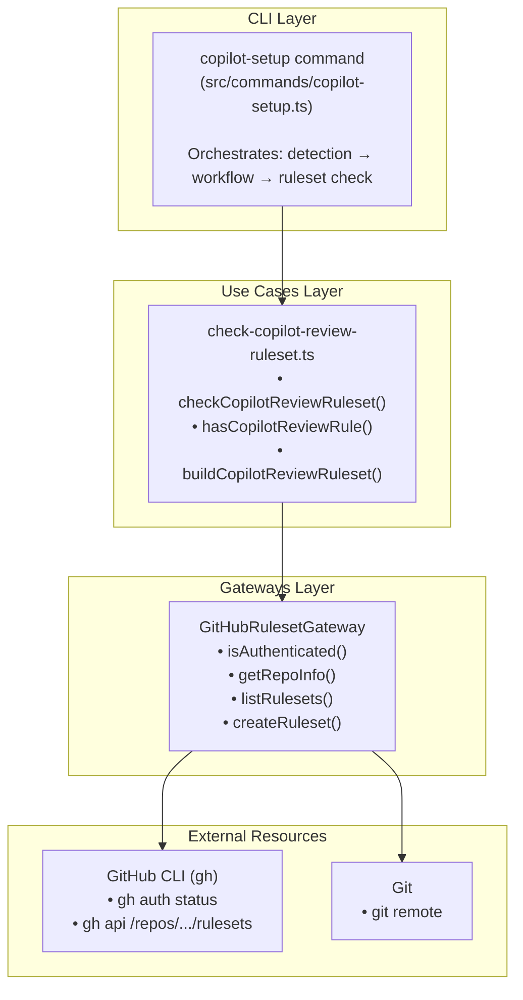
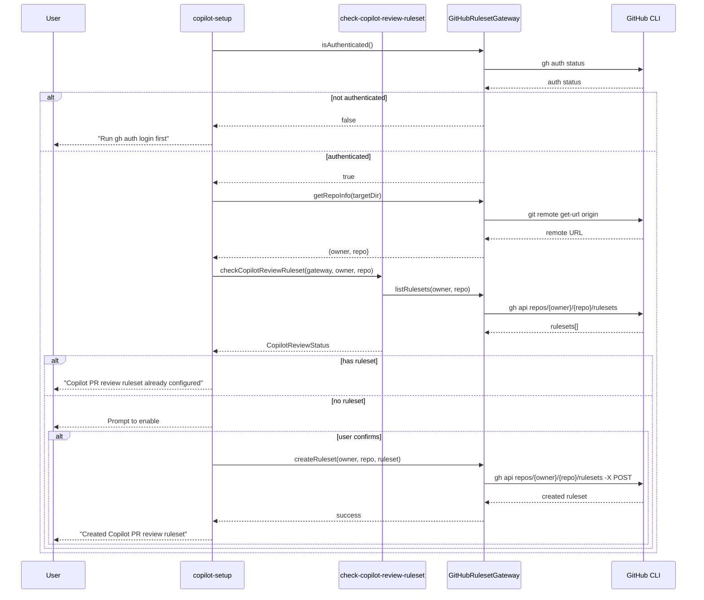

# Feature: Copilot PR Review Rulesets

## Problem Statement

When software engineers use GitHub Copilot Coding Agent, pull requests created by the agent benefit from automated code review via Copilot. However, enabling Copilot as a required PR reviewer requires configuring repository rulesets—a manual process that requires admin access and knowledge of the GitHub rulesets API. This feature automates the detection and creation of Copilot PR review rulesets as part of the `copilot-setup` command flow.

## Personas

| Persona | Impact | Notes |
|---------|--------|-------|
| Software Engineer Learning Vibe Coding | Positive | Primary user — gets automated ruleset configuration for Copilot PR review |
| Platform Engineer | Positive | Can ensure Copilot code review is consistently enabled across repositories |
| Team Lead | Positive | Can verify that Copilot code review is enforced for quality assurance |

## Value Assessment

- **Primary value**: Efficiency — Eliminates manual navigation of GitHub settings to configure Copilot PR review rulesets
- **Secondary value**: Customer — Improves code quality by ensuring Copilot reviews all pull requests automatically

## User Stories

### Story 1: Detect Existing Copilot PR Review Ruleset

As a **Software Engineer Learning Vibe Coding**,
I want **the copilot-setup command to check if a Copilot PR review ruleset exists**,
so that I can **know whether my repository is configured for automated Copilot code review**.

#### Acceptance Criteria

- When the user runs copilot-setup and is authenticated via `gh auth login`, the system shall check the repository for existing rulesets that enable Copilot code review
- When a Copilot PR review ruleset already exists, the system shall display a success message indicating the ruleset is configured
- When no Copilot PR review ruleset exists, the system shall prompt the user to enable it
- If the user is not authenticated with the GitHub CLI, then the system shall display a human-readable message explaining that `gh auth login` is required
- If the user lacks admin access to the repository, then the system shall display a human-readable message explaining that admin permissions are needed to manage rulesets

#### Notes

- Authentication uses the token provisioned by the GitHub CLI (`gh auth token`)
- The GitHub API endpoint for rulesets is `GET /repos/{owner}/{repo}/rulesets`
- Admin access is required to read and modify repository rulesets

### Story 2: Create Copilot PR Review Ruleset

As a **Software Engineer Learning Vibe Coding**,
I want **the copilot-setup command to create a Copilot PR review ruleset when one doesn't exist**,
so that I can **enforce automated Copilot code review on my pull requests**.

#### Acceptance Criteria

- When the user confirms they want to enable Copilot PR review, the system shall create a ruleset with a `code_scanning` rule that includes Copilot Autofix
- When the ruleset is created successfully, the system shall display a success message with the ruleset name
- If the GitHub API returns an error during ruleset creation, then the system shall display a human-readable error message with the status code
- If the repository cannot be determined from git remote, then the system shall display a human-readable message explaining the issue

#### Notes

- The ruleset targets the default branch
- The ruleset is created with `active` enforcement
- The ruleset name follows a consistent convention (e.g., "Copilot Code Review")

---

## Design

> Refer to `.github/copilot-instructions.md` for technical standards.

### Components Affected

**Entities Layer:**
- `src/entities/copilot-setup.ts` (extend) — Add Ruleset and CopilotReviewStatus types

**Use Cases Layer:**
- `src/use-cases/check-copilot-review-ruleset.ts` (new) — Business logic for checking and creating Copilot review rulesets
- `src/use-cases/check-copilot-review-ruleset.test.ts` (new) — Tests for use case logic

**Gateways Layer:**
- `src/gateways/github-ruleset-gateway.ts` (new) — Gateway interface and GH CLI implementation for GitHub rulesets API
- `src/gateways/github-ruleset-gateway.test.ts` (new) — Tests for gateway

**Commands Layer:**
- `src/commands/copilot-setup.ts` (extend) — Integrate ruleset checking into the copilot-setup command flow

### Dependencies

- `gh` CLI (external) — GitHub CLI for authentication and API access
- `node:child_process` (existing) — For executing `gh` CLI commands

### Data Model Changes

**Ruleset types (added to entities):**

```typescript
interface RulesetRule {
  type: string;
  parameters?: Record<string, unknown>;
}

interface Ruleset {
  id: number;
  name: string;
  enforcement: string;
  rules?: RulesetRule[];
}

interface CopilotReviewStatus {
  hasRuleset: boolean;
  rulesetName?: string;
  error?: string;
}
```

### Data Flow Diagram



### Sequence Diagram



### Open Questions

- [x] Should the ruleset target only the default branch or all branches? — Target the default branch for safety

---

## Tasks

> Each task should be completable in a single coding agent session.
> Tasks are sequenced by dependency. Complete in order unless noted.

### Task 1: Add entity types for rulesets

**Objective**: Add domain types for GitHub rulesets and Copilot review status

**Context**: These types are needed by use cases and gateways to represent ruleset data

**Affected files**:
- `src/entities/copilot-setup.ts`
- `src/entities/index.ts`

**Requirements**:
- The entity types shall represent GitHub rulesets with rules
- The entity types shall represent Copilot review status

**Verification**:
- [x] `npm test` passes
- [x] `mise run format-check` passes
- [x] Types are importable from entities

**Done when**:
- [x] All verification steps pass
- [x] No new errors in affected files
- [x] Types follow entity layer rules (no external imports)

---

### Task 2: Create use case for checking Copilot review rulesets

**Depends on**: Task 1

**Objective**: Create business logic to check if a Copilot PR review ruleset exists and build a new one if needed

**Context**: This contains the core domain logic for determining if rulesets are properly configured

**Affected files**:
- `src/use-cases/check-copilot-review-ruleset.ts`
- `src/use-cases/check-copilot-review-ruleset.test.ts`

**Requirements**:
- When checking rulesets, the use case shall determine if any ruleset contains a `code_scanning` rule with a Copilot tool
- When building a new ruleset, the use case shall create a properly structured ruleset object
- The use case shall define a port interface for the gateway

**Verification**:
- [x] `npm test src/use-cases/check-copilot-review-ruleset.test.ts` passes
- [x] `mise run format-check` passes
- [x] Tests cover happy path (ruleset found), unhappy path (no ruleset), and edge cases

**Done when**:
- [x] All verification steps pass
- [x] No new errors in affected files
- [x] Use case only imports from entities and ports

---

### Task 3: Create GitHub ruleset gateway

**Depends on**: Task 2

**Objective**: Create gateway implementation that uses GH CLI to interact with GitHub rulesets API

**Context**: This provides the external system integration for reading and writing rulesets

**Affected files**:
- `src/gateways/github-ruleset-gateway.ts`
- `src/gateways/github-ruleset-gateway.test.ts`
- `src/gateways/index.ts`

**Requirements**:
- The gateway shall check GH CLI authentication status
- The gateway shall extract repository owner/name from git remote
- The gateway shall list rulesets via `gh api`
- The gateway shall create rulesets via `gh api`
- If GH CLI is not installed, then the gateway shall throw a descriptive error
- If the API returns an error, then the gateway shall throw a descriptive error

**Verification**:
- [x] `npm test src/gateways/github-ruleset-gateway.test.ts` passes
- [x] `mise run format-check` passes
- [x] Tests cover authentication check, repo info extraction, and error cases

**Done when**:
- [x] All verification steps pass
- [x] No new errors in affected files
- [x] Gateway implements the port defined in Task 2

---

### Task 4: Integrate ruleset checking into copilot-setup command

**Depends on**: Task 3

**Objective**: Add Copilot PR review ruleset checking to the copilot-setup command flow

**Context**: This ties the ruleset feature into the existing command, adding it as an additional step after workflow generation

**Affected files**:
- `src/commands/copilot-setup.ts`
- `src/commands/copilot-setup.test.ts`

**Requirements**:
- When running copilot-setup, the command shall check for Copilot PR review rulesets after workflow generation
- When the user is not authenticated, the command shall display a warning and continue
- When a ruleset exists, the command shall display a success message
- When no ruleset exists, the command shall prompt the user to create one
- If an error occurs during ruleset checking, then the command shall display the error and continue

**Verification**:
- [x] `npm test src/commands/copilot-setup.test.ts` passes
- [x] `mise run format-check` passes
- [x] Existing copilot-setup tests still pass
- [x] `mise run ci && npm run build` passes

**Done when**:
- [x] All verification steps pass
- [x] No new errors in affected files
- [x] Command handles all error states gracefully
- [x] Existing functionality is preserved

---

## Out of Scope

- Organization-level ruleset management
- Enabling Copilot code review in repository settings (only rulesets)
- Supporting other ruleset rule types beyond code_scanning
- Interactive ruleset configuration (branch patterns, enforcement level)

## Future Considerations

- Support organization-level ruleset detection and creation
- Allow customization of ruleset enforcement level (active vs evaluate)
- Support for configuring specific Copilot review settings (severity thresholds)
- Integration with `lousy-agents init` to configure rulesets during project scaffolding
