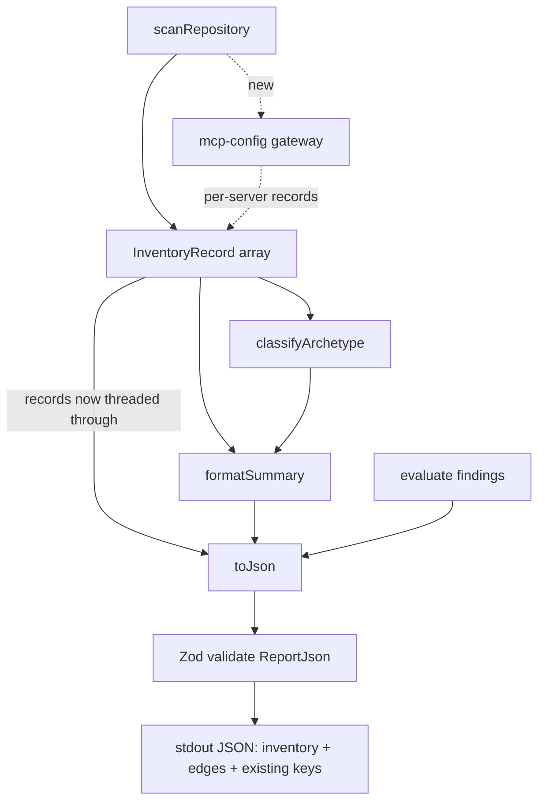
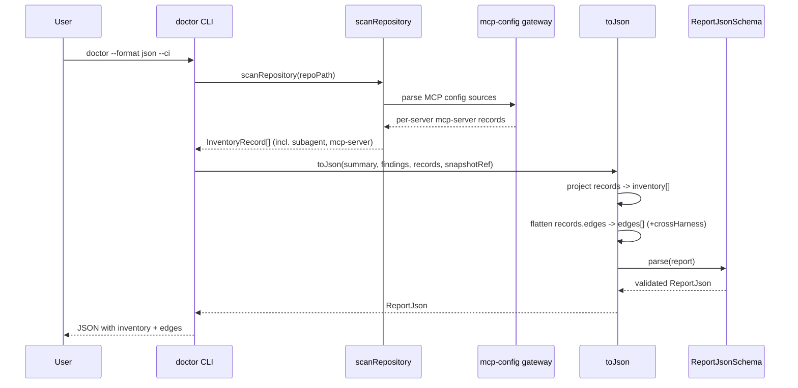

# Feature: Doctor JSON — Emit Inventory and Cross-Harness Edges

## Problem Statement

The `doctor` command already scans a repository into a rich `InventoryRecord[]` (harness, construct type, path, load mechanism, and typed edges), but `--format json` discards it and emits only aggregate counts (`harnessBreakdown` and a single `crossHarnessEdges` integer). A consuming harness or engineer can see *that* Codex has seven constructs and *that* one cross-harness edge exists, but not *what* those constructs are or *how* the files compose — which is exactly the high-fidelity, machine-readable map the feature was meant to provide. Additionally, two declared construct types (`subagent`, `mcp-server`) are never detected, so that surface area is silently absent from every run.

## Personas

| Persona | Impact | Notes |
| ------- | ------ | ----- |
| Harness Engineer | Positive | Primary user. Gets the full agentic surface area (every construct + composition edge) in one JSON payload instead of inspecting each harness's files by hand. |
| Onboarding Developer | Positive | Reads the machine-readable inventory and edge map to understand an unfamiliar repo's agentic composition without opening every config file. |
| Platform / Fleet Governance Engineer | Positive | Aggregates per-construct and per-edge data across many repos in CI; counts alone were too coarse to detect drift or composition anti-patterns. |
| Consuming Harness / Agent | Positive | Ingests structured `inventory[]`/`edges[]` as the factual base for stepwise, evidence-backed configuration improvements. |
| Skeptical Reviewer | Neutral | Requires that the new arrays are additive and do not change existing keys, so pipelines that consume the current shape keep working. |

## Value Assessment

- **Primary value — Efficiency**: Eliminates the manual, file-by-file cross-referencing needed to understand a repo's multi-harness setup by surfacing the already-computed inventory and edges the command throws away today.
- **Secondary value — Future**: Produces a reusable, inspectable, version-controllable record of a repo's agentic composition that later increments (actionable remediation, drift detection) build on. The change is purely additive to the JSON shape — a two-way-door decision that is trivially reversible.

## User Stories

### Story 1: Emit the full construct inventory

As a **Harness Engineer**,
I want **every detected construct listed in the JSON output with its harness, type, path, and load mechanism**,
so that I can **see my repo's complete agentic surface area in one payload instead of per-harness manual inspection**.

#### Acceptance Criteria

- When `doctor` is run with `--format json` and the repository contains agentic constructs, the system shall include an `inventory` array with one entry per scanned `InventoryRecord`.
- The system shall include, for each inventory entry, the fields `id`, `path`, `harness`, `constructType`, and `loadMechanism`.
- The system shall order the `inventory` array deterministically (by `path`, then `id`) so identical repository states produce identical output.
- Where the `--summary` flag is set, the system shall include the `inventory` array in the summary JSON as well.
- If the repository contains no agentic constructs (archetype `none`), then the system shall emit `inventory` as an empty array rather than omitting the key.

### Story 2: Emit typed cross-harness edges

As an **Onboarding Developer**,
I want **the composition relationships between files emitted as structured edges**,
so that I can **understand how instructions compose across harnesses without reading each file's imports by hand**.

#### Acceptance Criteria

- When `doctor` is run with `--format json`, the system shall include an `edges` array projecting every edge from every inventory record.
- The system shall include, for each edge, the fields `from`, `to`, `type`, `malformed`, and `crossHarness`, and shall always set `crossHarness` to a boolean (never leave it undefined).
- The system shall set `crossHarness` to `true` only when the edge is not malformed, its `type` is not `glob-binding`, and its resolved target path maps to a known record whose harness differs from the source record's harness; otherwise the system shall set `crossHarness` to `false`. This makes malformed and `glob-binding` edges always `false`.
- While an edge's `to` is a list (multi-target reference), the system shall emit one edge entry per resolved target and evaluate `crossHarness` independently for each.
- If an edge is malformed, then the system shall include its `reason` (`missing-target` or `path-traversal`) in the emitted edge.
- The system shall compute the retained `crossHarnessEdges` integer count as the number of emitted edges whose `crossHarness` is `true`, derived from the same predicate so the count and the per-edge flag can never diverge. Note: because today's count skips array-valued `direction.to`, evaluating multi-target references per resolved target may count cross-harness references the current implementation misses — this is an intentional, documented correctness improvement, not a silent semantic change.

### Story 3: Detect subagent constructs

As a **Harness Engineer**,
I want **subagent definitions classified as `subagent` rather than mislabeled or ignored**,
so that I can **trust the inventory to reflect the real construct types present**.

#### Acceptance Criteria

- When the scanner encounters a file under a subagent directory (e.g. `.claude/agents/`), the system shall classify its `constructType` as `subagent`.
- The system shall continue to classify files under `.claude/commands/` as `agent`, unchanged.
- If a file matches no known construct directory, then the system shall classify it as `instruction`, unchanged.

### Story 4: Enumerate MCP servers

As a **Platform / Fleet Governance Engineer**,
I want **each MCP server declared in a repo emitted as its own inventory record**,
so that I can **audit MCP surface area per server across many repos, not just detect that a config file exists**.

#### Acceptance Criteria

- When the scanner reads a recognized MCP configuration source declaring servers, the system shall emit one `mcp-server` inventory record per declared server.
- The system shall record, for each MCP server, the declaring config file as its `path`, the server name, and the transport (e.g. `stdio`, `http`, `sse`) when present in the declaration.
- The system shall set each MCP server record's `id` to `mcp-server:<config-path>#<server-name>` and its `loadMechanism` to `convention-loaded`, so multiple servers declared in one config file produce unique, deterministically ordered records — the existing `<harness>:<path>` id scheme would collide when several servers share one config file.
- The system shall attribute each MCP server record to the harness that owns its config source.
- Where a JSON config declares servers under `mcpServers`, the system shall enumerate them. Codex's TOML config (`[mcp_servers.*]`) is deferred pending a TOML-parser decision (see Open Questions); JSON sources are the baseline for this increment.
- If an MCP config source is present but declares no servers, then the system shall emit no `mcp-server` records for that source and shall not error.
- If an MCP config source is malformed or unparseable, then the system shall skip it, log at debug level, and continue scanning.

### Story 5: Preserve the existing contract

As a **Skeptical Reviewer**,
I want **the current JSON keys unchanged**,
so that **pipelines consuming today's output keep working after this change**.

#### Acceptance Criteria

- The system shall continue to emit `archetype`, `dominanceScore`, `totalRecords`, `harnessBreakdown`, `crossHarnessEdges`, and `findings` with unchanged shapes.
- The system shall validate the complete JSON output against a Zod schema before writing it to stdout.
- If the assembled output fails schema validation, then the system shall fail the run rather than emit an invalid payload.

## Design

### Components Affected

- `packages/doctor/src/formatters/json-formatter.ts` — extend `ReportJson` with `inventory` and `edges`; change `toJson` to accept `records: InventoryRecord[]`; add a Zod schema mirroring `ReportJson` and validate before return. Add helpers to project records → inventory entries and records → flattened edges (reusing the harness-by-path resolution already in `summary-formatter.ts:42-59`).
- `packages/doctor/src/entities/edge-types.ts` — add optional MCP metadata to `InventoryRecord` (e.g. `serverName?: string`, `transport?: string`) so an enumerated MCP server carries its identity without overloading `id`. Entities stay dependency-free (no Zod import here).
- `packages/doctor/src/gateways/scanner.ts` — extend `determineConstructType` to return `subagent` for `.claude/agents/`; add MCP enumeration that parses recognized config sources and yields per-server records.
- `packages/doctor/src/gateways/mcp-config.ts` *(new, Layer 3 gateway)* — parse `mcpServers` (JSON) and `[mcp_servers.*]` (TOML) from recognized config files into `{ serverName, transport, harness, path }[]`. Keeps parsing out of the entity/use-case layers.
- `packages/doctor/src/cli/index.ts` and `packages/cli/src/commands/doctor.ts` — pass the in-scope `records` into `toJson(summary, findings, records, snapshotRef)` at the JSON call sites (the mirrored `none`-archetype branch included).
- Tests: `packages/doctor/src/formatters/json-formatter.test.ts`, `packages/doctor/src/gateways/scanner.test.ts`, new `mcp-config.test.ts`, and `packages/cli/src/commands/doctor.integration.test.ts`; add fixtures covering a subagent directory and an MCP config.

### Dependencies

- JSON `mcpServers` enumeration needs no new dependency — it uses `JSON.parse` with Zod validation (Zod `4.4.3` is already a `packages/doctor` dependency). Note: although `.toml` files are in the scanner's scannable set, the scanner only *lists* them and parses markdown-style edges via `parseRawEdges`; it does **not** structurally parse TOML today (its only structured parser is `yaml`). Enumerating Codex's `[mcp_servers.*]` therefore requires either a new exact-pinned TOML parser or a scoped, dependency-free parser for that table subset. Adding a runtime dependency requires maintainer sign-off per the repo's dependency policy, so Codex TOML is deferred — see Open Questions.

### Data Model Changes

`ReportJson` (additive):

```typescript
export interface ReportInventoryItem {
    id: string;
    path: string;
    harness: HarnessName;
    constructType: ConstructType;
    loadMechanism: "referenced" | "convention-loaded";
    serverName?: string; // mcp-server records only
    transport?: string;  // mcp-server records only
}

export interface ReportEdge {
    from: string;
    to: string;
    type: EdgeType;
    malformed: boolean;
    reason?: "missing-target" | "path-traversal";
    crossHarness: boolean;
}

export interface ReportJson {
    archetype: Archetype;
    dominanceScore: number;
    totalRecords: number;
    harnessBreakdown: Array<{ harness: string; count: number }>;
    crossHarnessEdges: number;   // retained for back-compat
    inventory: ReportInventoryItem[]; // new
    edges: ReportEdge[];              // new
    findings: Finding[];
    snapshotRef?: string;
}
```

`InventoryRecord` gains optional `serverName?` / `transport?` (populated only for `mcp-server` records).

### Data Flow Diagram



### Sequence Diagram: JSON run emitting inventory and edges



### Architecture Notes

- The dependency rule is preserved: `inventory`/`edges` projection is a Layer 3 formatter concern; MCP parsing is a Layer 3 gateway; entity types stay framework-free. Only the composition roots (`cli/index.ts`, `commands/doctor.ts`) wire `records` into the formatter.
- Edges are emitted normalized: `inventory[]` entries omit nested edges (surfaced once in `edges[]`, keyed by `from` path) to avoid duplicate representations.
- `crossHarness` reuses the resolution rule already in `summary-formatter.ts` (skip malformed, skip `glob-binding`, resolve `to` path → harness), extracted into a single shared per-target predicate so both the per-edge flag and the `crossHarnessEdges` count derive from one implementation. Applying it per resolved target extends the rule to array-valued `direction.to` (which the current count skips) — a deliberate correctness improvement called out in Story 2.
- MCP server records cannot reuse the `<harness>:<path>` id scheme because several servers can share one config file; they use `mcp-server:<config-path>#<server-name>` so ids stay unique and the `path`-then-`id` inventory ordering stays deterministic.

### Open Questions

- **MCP config source list & TOML parsing**: JSON `mcpServers` sources (e.g. `.mcp.json`, `.vscode/mcp.json`, `.claude/settings.json`, `.gemini/settings.json`, `crush.json`) are in scope for this increment, driven by a data-driven source list so new sources are easy to add. Codex's `.codex/config.toml` (`[mcp_servers.*]`) is TOML, which the repo cannot parse today without a new parser dependency (maintainer sign-off required); it is deferred to a follow-up unless a dependency-free parser scoped to that table is accepted.
- **MCP metadata placement**: add optional `serverName`/`transport` to `InventoryRecord` (proposed) vs. a separate side-table. Proposed assumption: optional fields on the record, populated only for `mcp-server`.
- **Subagent directories beyond `.claude/agents/`**: other harnesses' subagent conventions are deferred; only `.claude/agents/` is in scope for this increment.

## Tasks

### Task 1: Thread records into the JSON formatter and emit `inventory[]`

- [x] **Objective**: Emit a deterministic `inventory` array in `--format json` output.
- [x] **Context**: `records` is already in scope at `cli/index.ts:51` and the mirrored `commands/doctor.ts`, but `toJson` never receives it.
- [x] **Affected files**: `packages/doctor/src/formatters/json-formatter.ts`, `packages/doctor/src/cli/index.ts`, `packages/cli/src/commands/doctor.ts`, `packages/doctor/src/formatters/json-formatter.test.ts`
- [x] **Requirements**: Add `ReportInventoryItem` and `inventory` to `ReportJson`; change `toJson` signature to accept `records`; project each record to `{ id, path, harness, constructType, loadMechanism }`; sort by `path` then `id`; update all `toJson` call sites including the `none`-archetype branch and the `--summary` JSON branch.
- [x] **Verification**: Unit test asserts `inventory.length === totalRecords` and stable ordering; integration test on an existing fixture asserts inventory presence.
- [x] **Done when**: `--format json` includes a correctly ordered `inventory` array and existing keys are unchanged.

### Task 2: Emit typed `edges[]` with a `crossHarness` flag

- [x] **Objective**: Surface every composition edge as structured data while retaining `crossHarnessEdges`.
- [x] **Context**: Cross-harness resolution already exists in `summary-formatter.ts:42-59`; extract it so the count and the edge flag share one implementation.
- [x] **Affected files**: `packages/doctor/src/formatters/json-formatter.ts`, `packages/doctor/src/formatters/summary-formatter.ts`, `packages/doctor/src/formatters/json-formatter.test.ts`. Also added `packages/doctor/src/lib/cross-harness-edges.ts` (new Layer-3 lib) to host the shared predicate so both formatters import it rather than one importing the other's internals.
- [x] **Requirements**: Add `ReportEdge` and `edges` to `ReportJson`; flatten each record's edges (one entry per resolved target when `to` is a list); set `crossHarness`, `malformed`, and `reason`; keep `crossHarnessEdges` count consistent via the shared helper.
- [x] **Verification**: Unit tests over the `malformed-edge` and cross-harness fixtures assert edge fields, `reason` on malformed edges, and that `edges.filter(e => e.crossHarness).length` equals `crossHarnessEdges`.
- [x] **Done when**: `edges[]` is emitted and consistent with the retained count.

### Task 3: Detect `subagent` construct type

- [x] **Objective**: Classify `.claude/agents/` files as `subagent`.
- [x] **Context**: `determineConstructType` (`scanner.ts:46-63`) returns `subagent` for no path today.
- [x] **Affected files**: `packages/doctor/src/gateways/scanner.ts`, `packages/doctor/src/gateways/scanner.test.ts`, new fixture `tests/fixtures/subagent-construct/` with a `.claude/agents/` file and a `.claude/commands/` file.
- [x] **Requirements**: Add a `.claude/agents/` prefix branch returning `subagent`; leave `.claude/commands/` → `agent` untouched.
- [x] **Verification**: Scanner test asserts a `.claude/agents/` file yields `constructType: "subagent"` and a `.claude/commands/` file still yields `agent`.
- [x] **Done when**: Subagent files appear as `subagent` in the inventory.

### Task 4: Enumerate MCP servers per declaration

- [x] **Objective**: Emit one `mcp-server` inventory record per declared server.
- [x] **Context**: `mcp-server` is a declared `ConstructType` never produced today; MCP servers live inside config entries, not standalone markdown files.
- [x] **Affected files**: new `packages/doctor/src/gateways/mcp-config.ts`, `packages/doctor/src/gateways/scanner.ts`, `packages/doctor/src/entities/edge-types.ts`, new `packages/doctor/src/gateways/mcp-config.test.ts`, MCP fixtures (`mcp-multi-server`, `mcp-empty-servers`, `mcp-malformed`, `mcp-vscode-source`).
- [x] **Requirements**: Parse `mcpServers` (JSON) from a data-driven list of recognized config sources (shipped with `.mcp.json` → `claude` and `.vscode/mcp.json` → `copilot`, both grounded in this repo's own conventions); yield `{ serverName, transport, harness, path }` per server; set each record's `id` to `mcp-server:<path>#<serverName>` and `loadMechanism` to `convention-loaded`; add optional `serverName`/`transport` to `InventoryRecord`; emit records with `constructType: "mcp-server"`; skip unparseable sources; emit nothing for sources declaring zero servers. Codex TOML (`[mcp_servers.*]`) enumeration is deferred pending a TOML-parser decision (see Open Questions). **Deviation**: skip-and-continue is implemented via the same silent-catch pattern used throughout `scanner.ts` (no debug log call) — this package's gateways (e.g. `wisdom-client.ts`) consistently push logging to the caller rather than taking a logger dependency, so no logger was threaded into `enumerateMcpServers` to avoid an inconsistent one-off DI pattern. The malformed-source fixture uses a schema-invalid-but-JSON-valid payload (`"mcpServers": "not-an-object"`) rather than syntactically broken JSON, since a syntactically invalid `.json` fixture breaks the repo-wide Biome lint pass.
- [x] **Verification**: Gateway tests cover a JSON source with multiple servers (asserting unique `mcp-server:<path>#<serverName>` ids), an empty-servers source, and a schema-invalid source (skipped, no throw); integration test asserts per-server records with `serverName`/`transport`.
- [x] **Done when**: Each declared MCP server appears as its own `mcp-server` record attributed to the owning harness.

### Task 5: Validate the JSON contract with Zod and lock it with tests

- [x] **Objective**: Guarantee the additive output is well-formed and back-compatible.
- [x] **Affected files**: `packages/doctor/src/formatters/json-formatter.ts`, `packages/doctor/src/formatters/json-formatter.test.ts`, `packages/cli/src/commands/doctor.integration.test.ts`
- [x] **Requirements**: Define `ReportJsonSchema` (Zod) mirroring `ReportJson`; `ReportInventoryItem`/`ReportEdge`/`ReportJson` are now derived via `z.infer` from the schema (single source of truth, per this repo's own `type X = z.infer<typeof XSchema>` convention); `toJson` validates before returning and throws on failure; all pre-existing keys retain unchanged shapes (the one behavioral change: `harnessBreakdown`/`findings` are no longer the same object reference post-`.parse()`, since Zod parsing clones — the pre-existing backward-compatibility test was updated from `toBe` to `toEqual` to assert values rather than identity, which is what "unchanged shape" actually requires).
- [x] **Verification**: Unit test parses real output against the schema; a second unit test asserts `toJson` throws when a record has a harness outside the known enum; integration tests assert presence of `inventory`/`edges` and unchanged legacy keys on both `--summary` and full JSON output. Full validation run: `npm run lint` (0 errors), `npx vitest run` repo-wide (103 files / 1813 passed, 3 skipped), `npm run build` (all packages), `npm run test:integration` (all passed except one pre-existing Docker-dependent test unrelated to this change — no container runtime available in this sandbox), and the real built CLI run against this repo confirms `inventory`/`edges` populated correctly with `crossHarnessEdges` consistent with `edges.filter(e => e.crossHarness).length`.
- [x] **Done when**: Output always validates and legacy consumers see no breaking change.

## Out of Scope

- Structured `remediation` fields, evidence-citation wiring, and an ordered `nextSteps` plan on findings (separate increment).
- A top-level `schemaVersion` / `summary` roll-up / `status` field (separate contract-hardening increment).
- Subagent conventions for harnesses other than Claude.
- Rendering the new inventory/edges in the human (`--format human`) output.
- Changes to exit-code / CI-gating behavior (already correct).

## Future Considerations

- Human-renderer visualization of the inventory and edge graph.
- A `schemaVersion` and `summary` counts object so fleet aggregation can detect drift across CLI releases.
- Populating `evidenceCitation` and structured `remediation` so the inventory becomes an actionable, stepwise improvement plan.
- Detecting additional MCP config sources and subagent directories as more harness conventions stabilize.

---

## Cross-Reference

- GitHub Issue: #890 (Feature: Agentic Configuration Doctor)
- Source: first increment of a three-part improvement brief for the shipped `doctor --format json --ci`; grounded in the wisdom knowledge base's cross-harness composition model.
