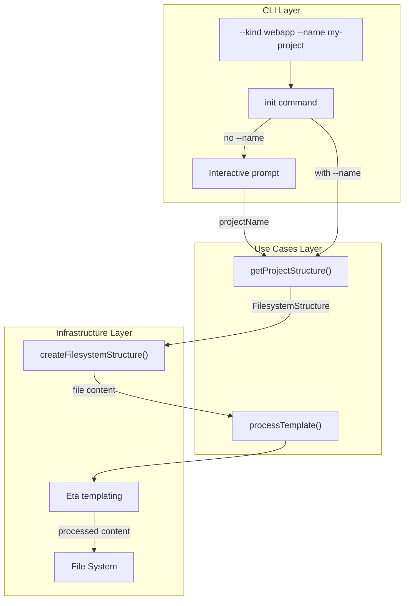
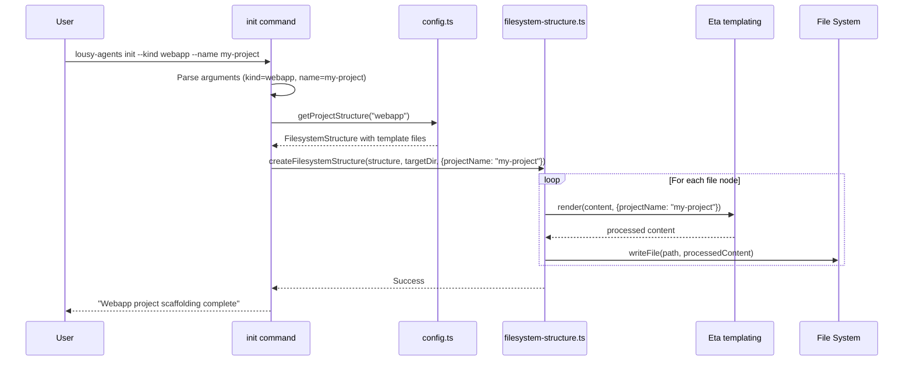

# Feature: Dynamic Project-Level Templating for Webapp Scaffolding

## Problem Statement

Currently, the webapp scaffolding creates files with hardcoded project names (e.g., "copilot-with-react" in package.json and "webapp-workshop" in devcontainer.json). This forces users to manually find and replace these values after scaffolding, which is error-prone and time-consuming. Users need a way to provide their project name during scaffolding so that all project-specific values are automatically customized.

## Personas

| Persona | Impact | Notes |
|---------|--------|-------|
| Software Engineer Learning Vibe Coding | Positive | Primary user - can create customized projects without manual find-and-replace |
| Team Lead | Positive | Can standardize project naming across team scaffolded projects |
| Platform Engineer | Positive | Can automate project creation in scripts with custom names |

## Value Assessment

- **Primary value**: Efficiency — Eliminates manual find-and-replace of project names, reducing setup time and errors
- **Secondary value**: Customer — Improves user experience by providing a polished, professional scaffolding flow that produces ready-to-use projects

## User Stories

### Story 1: Provide Project Name via CLI Flag

As a **Software Engineer Learning Vibe Coding**,
I want **to specify the project name using a `--name` flag when running `lousy-agents init --kind webapp`**,
so that I can **scaffold a project with my chosen name without additional prompts or manual editing**.

#### Acceptance Criteria

- When `lousy-agents init --kind webapp --name my-project` is executed, the CLI shall create webapp scaffolding with "my-project" as the project name in all templated files
- When `lousy-agents init --kind webapp --name my-project` is executed, the CLI shall not prompt for the project name
- The CLI shall replace the template variable in `package.json` with the provided project name
- The CLI shall replace the template variable in `.devcontainer/devcontainer.json` with the provided project name

#### Notes

- The `--name` flag should accept any valid npm package name
- This enables scriptable/automated project scaffolding

### Story 2: Prompt for Project Name Interactively

As a **Software Engineer Learning Vibe Coding**,
I want **to be prompted for the project name when running `lousy-agents init --kind webapp` without the `--name` flag**,
so that I can **interactively provide my project name during the scaffolding process**.

#### Acceptance Criteria

- When `lousy-agents init --kind webapp` is executed without the `--name` flag, the CLI shall prompt the user for the project name
- When the user provides a project name via the prompt, the CLI shall use that name in all templated files
- When the user selects "webapp" from the interactive project type menu, the CLI shall prompt for the project name next

#### Notes

- The prompt should clearly indicate what the project name will be used for
- Default project name is optional but could improve UX

### Story 3: Template Processing with Eta

As a **Software Engineer Learning Vibe Coding**,
I want **the scaffolding system to use Eta templating to process template variables**,
so that I can **receive properly formatted project files with my custom values substituted**.

#### Acceptance Criteria

- The system shall use Eta templating library for template processing
- When processing templates, the system shall replace `<%= it.projectName %>` with the provided project name
- If a template file contains syntax errors, then the system shall display a descriptive error message

#### Notes

- Eta was chosen for its simplicity, small bundle size, and TypeScript support
- Template files in `ui/copilot-with-react` will need to be converted to use Eta syntax

---

## Design

> Refer to `.github/copilot-instructions.md` for technical standards.

### Components Affected

- `ui/copilot-with-react/package.json` — Convert to template with `<%= it.projectName %>` for name field
- `ui/copilot-with-react/.devcontainer/devcontainer.json` — Convert to template with `<%= it.projectName %>` for name field
- `src/commands/init.ts` — Add `--name` argument, add prompt for project name, pass template context to scaffolding
- `src/commands/init.test.ts` — Add tests for new functionality
- `src/lib/config.ts` — Update to support template context in webapp structure
- `src/lib/filesystem-structure.ts` — Add template processing capability using Eta
- `src/lib/filesystem-structure.test.ts` — Add tests for template processing
- `package.json` — Add eta dependency

### Dependencies

- `eta` version 4.5.0 — Lightweight templating library for processing template variables

### Data Model Changes

**TemplateContext interface:**

```typescript
export interface TemplateContext {
    projectName: string;
}
```

**FileNode enhancement:**

The `content` property may contain Eta template syntax that will be processed before writing to disk.

### Diagrams

#### Data Flow Diagram



#### Sequence Diagram



### Open Questions

- [x] What files need templating? — `package.json` (name field) and `.devcontainer/devcontainer.json` (name field)
- [x] Should we validate the project name format? — Yes, basic validation for npm package name compatibility
- [x] What should the default project name be if not provided? — No default, always prompt when not provided via --name

---

## Tasks

> Each task should be completable in a single coding agent session.
> Tasks are sequenced by dependency. Complete in order unless noted.

### Task 1: Add eta dependency

**Objective**: Add the eta templating library as a project dependency

**Context**: Eta will be used to process template variables in scaffolding files. This is a prerequisite for all templating functionality.

**Affected files**:
- `package.json`

**Requirements**:
- The system shall add eta version 4.5.0 as a production dependency

**Verification**:
- [x] `npm install` succeeds
- [x] `npm run build` succeeds
- [x] eta is listed in dependencies in package.json with exact version

**Done when**:
- [x] All verification steps pass
- [x] No new errors in affected files
- [x] eta dependency is available for import

---

### Task 2: Convert template files to use Eta syntax

**Objective**: Update ui/copilot-with-react template files to use Eta template syntax for project-specific values

**Context**: These files will be processed by Eta during scaffolding to replace template variables with user-provided values.

**Affected files**:
- `ui/copilot-with-react/package.json`
- `ui/copilot-with-react/.devcontainer/devcontainer.json`

**Requirements**:
- The `package.json` shall use `<%= it.projectName %>` for the "name" field
- The `.devcontainer/devcontainer.json` shall use `<%= it.projectName %>` for the "name" field

**Verification**:
- [x] `package.json` contains `<%= it.projectName %>` as the name value
- [x] `devcontainer.json` contains `<%= it.projectName %>` as the name value
- [x] Files remain valid JSON structure (except for template syntax)

**Done when**:
- [x] All verification steps pass
- [x] No new errors in affected files
- [x] Template syntax is correctly placed in both files

---

### Task 3: Add template processing to filesystem-structure module

**Objective**: Extend createFilesystemStructure to support template processing using Eta

**Context**: This enables file content to be processed as templates before writing to disk, allowing dynamic values.

**Affected files**:
- `src/lib/filesystem-structure.ts`
- `src/lib/filesystem-structure.test.ts`

**Requirements**:
- When template context is provided, the system shall process file content through Eta before writing
- When no template context is provided, the system shall write file content unchanged (backward compatible)
- If template processing fails, then the system shall throw a descriptive error

**Verification**:
- [x] `npm test src/lib/filesystem-structure.test.ts` passes
- [x] `mise run format-check` passes
- [x] Tests verify template processing works correctly
- [x] Tests verify backward compatibility when no context provided

**Done when**:
- [x] All verification steps pass
- [x] No new errors in affected files
- [x] Template processing is implemented and tested
- [x] Code follows patterns in `.github/copilot-instructions.md`

---

### Task 4: Add --name argument to init command

**Objective**: Add the --name CLI argument for specifying project name

**Context**: This enables users to provide project name via command line for automation scenarios.

**Affected files**:
- `src/commands/init.ts`

**Requirements**:
- When the user provides `--name` argument, the CLI shall use that value as the project name
- The CLI shall include --name in the help output with a description

**Verification**:
- [x] `npm run build` succeeds
- [x] `mise run format-check` passes
- [x] Code follows patterns in `.github/copilot-instructions.md`

**Done when**:
- [x] All verification steps pass
- [x] No new errors in affected files
- [x] --name argument is added to init command

---

### Task 5: Implement project name prompting and template application

**Objective**: Add interactive prompt for project name and pass template context to scaffolding

**Context**: This connects the --name argument and interactive prompt to the template processing system.

**Affected files**:
- `src/commands/init.ts`

**Requirements**:
- When `lousy-agents init --kind webapp --name my-project` is executed, the CLI shall not prompt for the project name
- When `lousy-agents init --kind webapp` is executed without --name, the CLI shall prompt for the project name
- When creating webapp scaffolding, the CLI shall pass the project name as template context

**Verification**:
- [x] `npm run build` succeeds
- [x] `mise run format-check` passes
- [x] Code follows patterns in `.github/copilot-instructions.md`

**Done when**:
- [x] All verification steps pass
- [x] No new errors in affected files
- [x] Project name prompting and template context passing is implemented

---

### Task 6: Add tests for project name functionality

**Objective**: Add comprehensive tests for --name argument and project name prompting

**Context**: Tests ensure the feature works correctly and prevents regressions.

**Affected files**:
- `src/commands/init.test.ts`

**Requirements**:
- Tests shall verify --name argument is used without prompting
- Tests shall verify prompting occurs when --name is not provided
- Tests shall verify template variables are replaced in created files
- Tests shall follow patterns in `.github/instructions/test.instructions.md`

**Verification**:
- [x] `npm test src/commands/init.test.ts` passes
- [x] `mise run format-check` passes
- [x] All new code paths have test coverage

**Done when**:
- [x] All verification steps pass
- [x] No new errors in affected files
- [x] All acceptance criteria are tested
- [x] Tests follow patterns in `.github/instructions/test.instructions.md`

---

### Task 7: Manual verification and full validation

**Objective**: Manually test the feature end-to-end and run full validation suite

**Context**: Final verification ensures the feature works as expected from a user perspective.

**Affected files**:
- N/A (testing only)

**Requirements**:
- Manual test shall verify `lousy-agents init --kind webapp --name my-app` creates files with "my-app" as project name
- Manual test shall verify interactive prompt appears when --name is not provided
- Manual test shall verify package.json contains the provided project name
- Manual test shall verify devcontainer.json contains the provided project name
- Full validation suite shall pass

**Verification**:
- [x] `npm run build` succeeds
- [x] `node dist/index.js init --kind webapp --name test-project` creates correctly templated files
- [x] Created package.json has name: "test-project"
- [x] Created devcontainer.json has name: "test-project"
- [ ] `mise run ci && npm run build` passes

**Done when**:
- [ ] All verification steps pass
- [x] Feature works correctly in manual testing
- [x] All acceptance criteria satisfied
- [ ] Full validation suite passes

---

## Out of Scope

- Templating values beyond project name (e.g., author, description, license)
- Custom template file locations
- Multiple template variables in a single prompt session
- Validation of project name beyond basic sanity checks
- CLI project type templating (only webapp for this iteration)

## Future Considerations

- Add more template variables (author, description, license, repository URL)
- Support custom template files from user-specified locations
- Add --author, --description flags for additional customization
- Template CLI project type files
- Support template inheritance/composition for complex scaffolding scenarios
