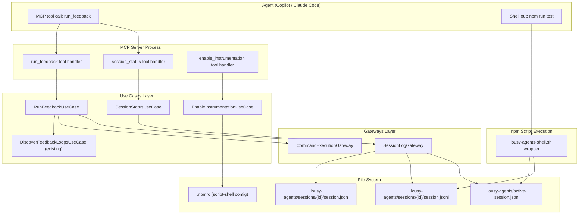
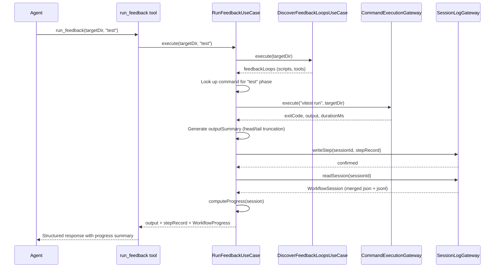
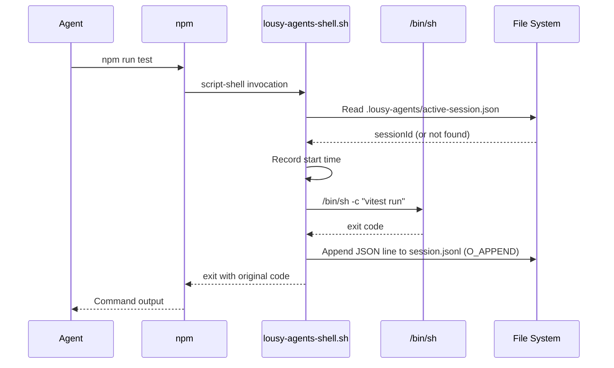

# Feature: Agent Workflow Checkpoint System

## Problem Statement

AI coding agents working through multi-step development tasks (write test, implement, lint, build) have no mechanism to track which mandatory steps they have completed, skipped, or failed within a session. Developers have no visibility into whether an agent followed the expected workflow, and agents that lose context mid-session have no way to recover their progress. The existing `discover_feedback_loops` and `validate_instruction_coverage` tools operate outside agent sessions (before or after), leaving the critical “during execution” phase unobserved.

## Personas

| Persona | Impact | Notes |
|---------|--------|-------|
| Software Engineer Learning Vibe Coding | Positive | Primary user. Gets confidence that agents are following the expected workflow without manually checking each step. |
| Team Lead | Positive | Gains visibility into agent workflow adherence across sessions. Can identify patterns in where agents get stuck or skip steps. |
| Platform Engineer | Positive | Can integrate checkpoint data into CI gates or reporting. Standard instrumentation reduces per-repo configuration. |

## Value Assessment

- **Primary value**: Customer — Increases trust in agent output by providing transparency into whether mandatory steps were followed, reducing time spent reviewing agent work.
- **Secondary value**: Future — Creates a foundation for cross-session analytics, workflow enforcement, and self-introspection capabilities without committing to those features now.

## User Stories

### Story 1: Run Feedback Loop via MCP Tool

As a **Software Engineer Learning Vibe Coding**,
I want **an MCP tool that runs my project’s feedback commands and returns structured results with workflow progress**,
so that I can **see what the agent has completed and what remains without leaving the AI assistant context**.

#### Acceptance Criteria

- When the agent calls `run_feedback` with a target directory and phase name (e.g., `targetDir: "/path/to/project"`, `phase: "test"`), the MCP server shall execute the discovered command for that phase in the specified directory.
- When the command completes, the MCP server shall record the step in the session log with the phase, command, exit code, duration, and timestamp.
- When the command completes, the MCP server shall return the command output alongside a progress summary listing completed and remaining mandatory steps.
- If the requested phase has no discovered command, then the MCP server shall return an error indicating no command is configured for that phase.
- The MCP server shall associate all recorded steps with the current process’s session ID.
- When a phase has been run previously in the same session, the MCP server shall record the new execution as an additional attempt (supporting retries).

#### Notes

- The progress summary is included in every response regardless of whether the agent asked for it. This ensures progress context is always in the agent’s context window.
- The tool should return enough output for the agent to act on failures, using a head-and-tail truncation strategy that preserves the command context (first ~500 chars) and the results/errors (last ~4,000 chars). This avoids coupling to any specific test framework’s output format while capturing the actionable information regardless of tooling.

-----

### Story 2: Capture npm Script Execution via Instrumentation

As a **Software Engineer Learning Vibe Coding**,
I want **npm script executions to be captured automatically even when the agent bypasses the MCP tool**,
so that I can **have a complete picture of what feedback loops ran during a session regardless of how the agent invoked them**.

#### Acceptance Criteria

- The checkpoint system shall provide a shell wrapper script that can be configured as npm’s `script-shell`.
- When configured, the wrapper shall record the script name, start time, exit code, and duration for every `npm run` invocation.
- The wrapper shall delegate execution to `/bin/sh -c` and exit with the original exit code.
- The wrapper shall write log entries to the active session’s log directory, or to an untracked log if no active session exists.
- If the wrapper encounters an error in its own logic, then it shall fall back to executing the command without recording and shall not prevent the script from running.
- If the target session directory does not exist, then the wrapper shall create it.

#### Notes

- The wrapper must be fast. Overhead per script invocation should be negligible (file append, not network call).
- npm passes the script name via the `npm_lifecycle_event` environment variable, which the wrapper can read.
- npm also exposes `npm_lifecycle_script` with the full command being run.

-----

### Story 3: View Session Progress

As a **Software Engineer Learning Vibe Coding**,
I want **an MCP tool that returns the current session’s workflow progress**,
so that I can **ask the agent “what have you done so far?” and get an accurate answer**.

#### Acceptance Criteria

- When the agent calls `session_status`, the MCP server shall return the list of mandatory steps with their completion state (not started, passed, failed, with attempt count).
- The MCP server shall merge data from both the MCP tool path and the npm instrumentation path into a unified view.
- When all mandatory steps have passing results, the MCP server shall indicate the workflow is complete.
- If no session log exists, then the MCP server shall return an empty progress report with all steps marked as “not started.”

-----

### Story 4: Instrument a Project for npm Capture

As a **Software Engineer Learning Vibe Coding**,
I want **a simple way to enable the npm instrumentation in my project**,
so that I can **start capturing script execution data without manual configuration**.

#### Acceptance Criteria

- When the agent calls `enable_instrumentation` (or when the developer runs a CLI command), the system shall write a `.npmrc` entry setting `script-shell` to the lousy-agents wrapper path.
- If a `.npmrc` file already exists, then the system shall append the `script-shell` entry without overwriting existing configuration.
- If `script-shell` is already set to a different value, then the system shall warn the user and not overwrite the existing value.
- The system shall verify the wrapper script is accessible at the configured path.
- Where the lousy-agents MCP server `create_claude_code_web_setup` or `init` commands are used, the system shall offer to enable instrumentation as part of project setup.

-----

### Story 5: Contextual Recovery After Failure or Retry

As a **Software Engineer Learning Vibe Coding**,
I want **the checkpoint system to provide rich context when an agent is retrying a failed step or resuming work**,
so that **the agent can understand what has already been attempted and adjust its approach rather than repeating the same mistake**.

#### Acceptance Criteria

- When a phase has failed in a previous attempt within the same session, the `run_feedback` response shall include a summary of prior attempts for that phase (count, last exit code, last output summary).
- When all mandatory steps except one have passed, the `run_feedback` response shall highlight the blocking step and its failure history.
- When the `session_status` tool is called and failures exist, the response shall include the most recent output summary for each failed step.

-----

## Design

> Refer to `.github/copilot-instructions.md` for technical standards.

### Architecture Overview

The checkpoint system follows Clean Architecture principles consistent with the existing codebase:

```
Entities:        WorkflowSession, StepRecord (multiple records per step for attempts), WorkflowProgress, ActiveSessionMarker
Use Cases:       RunFeedbackUseCase, SessionStatusUseCase, EnableInstrumentationUseCase
Gateways:        SessionLogGateway (file system), CommandExecutionGateway (child process)
Infrastructure:  MCP tool handlers, shell wrapper script, .npmrc management, composition root
```

### Key Concepts

**Dual-Path Capture:** The checkpoint system captures agent workflow data through two complementary mechanisms. The MCP Tool Path (primary) is an MCP tool called `run_feedback` that agents call instead of shelling out directly, providing structured results, progress summaries, and contextual guidance. The npm Instrumentation Path (fallback) is an npm `script-shell` wrapper that intercepts all `npm run` invocations transparently when agents bypass the MCP tool. Both paths write to the same session log, and the MCP server merges data from both sources when reporting progress.

**Session Scope:** A session represents a single agent working on a single task. The session lifecycle is tied to the MCP server process lifetime: a new session begins when the MCP server starts and ends when the process exits. The MCP server generates a unique session ID on startup (UUID at the infrastructure layer, passed into domain types as a string) and holds it in memory for the duration of the process. To enable the npm shell wrapper (which runs in a separate process) to associate its log entries with the active session, the MCP server writes a lightweight marker file (`.lousy-agents/active-session.json`) on startup containing the session ID and start timestamp. The wrapper reads this file to tag its entries. When the MCP server process exits, the marker file is cleaned up (best-effort). If the wrapper finds no marker file, it writes entries to `.lousy-agents/untracked/session.jsonl` instead. These entries use the same `StepRecord` JSON structure (no `sessionId` field needed — the file path determines association). The next MCP server session will adopt untracked entries as prior activity. Session data is stored in `.lousy-agents/sessions/{sessionId}/` within the project.

**Workflow Steps:** Workflow steps are derived from the existing `discover_feedback_loops` use case. Mandatory steps (test, lint, build, format) form the checklist. Each step tracks its phase, the command executed, whether it passed or failed, the timestamp, and optionally a summary of the output.

### Diagrams

#### Data Flow



#### Sequence: run_feedback Tool Call



#### Sequence: npm Shell Wrapper (Fallback Path)



### Dual-Path Interaction and Write Integrity

The two capture paths are designed to be complementary, not redundant. The `run_feedback` MCP tool executes the underlying command directly (e.g., `vitest run`, not `npm run test`) to avoid triggering the npm shell wrapper. This means:

- When the agent uses the MCP tool: only the MCP path writes to the session log (source: “mcp”, with rich outputSummary).
- When the agent shells out to `npm run` directly: only the wrapper path writes (source: “npm-instrumentation”, without outputSummary).
- Both paths never fire for the same execution under normal operation.

The `SessionLogGateway` includes timestamp-based deduplication as a safety net, preferring MCP-sourced entries when near-simultaneous entries exist for the same phase. This guards against edge cases (e.g., an agent calling `run_feedback` with a command that itself invokes `npm run` internally).

All writes to `.jsonl` files use append mode with each entry emitted as a single complete JSON line. On POSIX systems, `O_APPEND` ensures the write offset is atomically set to end-of-file before each write, preventing interleaving under concurrent execution. Each JSON line is self-contained and newline-terminated, so a truncated write from a killed process produces at most one malformed line. The gateway skips malformed lines on read without discarding adjacent valid entries.

### Components Affected

- `src/entities/checkpoint.ts` (new) — Session, step, and attempt domain types; `computeProgress` pure function
- `src/use-cases/run-feedback.ts` (new) — Orchestrates command execution and session logging; imports port interfaces from gateways
- `src/use-cases/run-feedback.test.ts` (new) — Use case tests with injected mock gateways
- `src/use-cases/session-status.ts` (new) — Reads and merges session log data
- `src/use-cases/session-status.test.ts` (new) — Use case tests
- `src/use-cases/enable-instrumentation.ts` (new) — Manages .npmrc configuration
- `src/use-cases/enable-instrumentation.test.ts` (new) — Use case tests
- `src/gateways/session-log-gateway.ts` (new) — Defines `SessionLogGateway` port interface and file system implementation; exports `SCHEMA_VERSION` constant
- `src/gateways/session-log-gateway.test.ts` (new) — Gateway tests
- `src/gateways/command-execution-gateway.ts` (new) — Defines `CommandExecutionGateway` port interface and child process implementation
- `src/gateways/command-execution-gateway.test.ts` (new) — Gateway tests
- `src/mcp/tools/run-feedback.ts` (new) — MCP tool handler
- `src/mcp/tools/session-status.ts` (new) — MCP tool handler
- `src/mcp/tools/enable-instrumentation.ts` (new) — MCP tool handler
- `src/mcp/server.ts` (update) — Register new tools, session lifecycle management
- `src/mcp-server.ts` (update) — Composition root wiring for new gateways and use cases
- `bin/lousy-agents-shell.sh` (new) — npm script-shell wrapper (bash, no Node.js dependency)
- `src/commands/instrument.ts` (new, optional) — CLI command for enabling instrumentation

### Dependencies

- `discover_feedback_loops` use case (existing) — Provides the list of mandatory steps and their commands
- `child_process` (Node.js built-in) — For command execution in `run_feedback`
- `zod` (existing) — For session log schema validation

### Data Model Changes

#### Active Session Marker (`.lousy-agents/active-session.json`)

Written by the MCP server on startup, read by the npm shell wrapper, cleaned up on exit.

```json
{
  "sessionId": "a1b2c3d4-e5f6-7890-abcd-ef1234567890",
  "startedAt": "2026-03-07T14:30:00.000Z",
  "pid": 12345
}
```

#### Session Log Schema (`.lousy-agents/sessions/{sessionId}/session.json`)

```json
{
  "schemaVersion": 1,
  "sessionId": "a1b2c3d4-e5f6-7890-abcd-ef1234567890",
  "workingDirectory": "/path/to/project",
  "startedAt": "2026-03-07T14:30:00.000Z",
  "project": {
    "name": "my-app",
    "packageManager": "npm"
  },
  "mandatoryPhases": ["test", "lint", "build", "format"],
  "steps": [
    {
      "phase": "test",
      "command": "vitest run",
      "source": "mcp",
      "exitCode": 0,
      "durationMs": 4523,
      "timestamp": "2026-03-07T14:31:12.000Z",
      "outputSummary": "14 tests passed, 0 failed"
    },
    {
      "phase": "test",
      "command": "vitest run",
      "source": "npm-instrumentation",
      "exitCode": 1,
      "durationMs": 3201,
      "timestamp": "2026-03-07T14:32:45.000Z",
      "outputSummary": null
    }
  ]
}
```

The `schemaVersion` field enables forward-compatible migrations as the schema evolves. The `project` and `mandatoryPhases` fields capture the context needed to interpret the session independently, so someone (or an agent) reading the log months later can understand what was expected without re-running `discover_feedback_loops`.

The `source` field distinguishes entries created by the MCP tool (“mcp”) from those captured by the npm wrapper (“npm-instrumentation”). The MCP path can provide `outputSummary`; the npm wrapper path typically cannot.

#### Shell Wrapper Data Flow

```
npm run test
  → npm invokes script-shell (lousy-agents-shell.sh)
    → wrapper reads .lousy-agents/active-session.json for sessionId
    → wrapper reads npm_lifecycle_event ("test") and npm_lifecycle_script ("vitest run")
    → wrapper records start time
    → wrapper delegates to /bin/sh -c "$@"
    → wrapper captures exit code
    → wrapper appends JSON line to .lousy-agents/sessions/{sessionId}/session.jsonl
       (or .lousy-agents/untracked/session.jsonl if no active session marker exists)
    → wrapper exits with original exit code
```

Note: The wrapper writes to a `.jsonl` (JSON Lines) append-only file for crash safety. The `SessionLogGateway` merges this with the primary `session.json` when reading.

### Open Questions

- [x] ~Should the shell wrapper communicate with the MCP server process directly (e.g., via local socket) instead of writing to a shared file?~ **Resolved: File-based via shared JSONL.** The wrapper appends entries to the session’s `.jsonl` file using append mode. Each entry is written as a single complete JSON line to minimize the risk of interleaved output. On platforms where `O_APPEND` is supported, POSIX guarantees that the write offset is atomically set to end-of-file before each write. A single checkpoint entry is ~200-300 bytes. If a write is interrupted or truncated (e.g., by SIGKILL), at most one malformed line results; the reader skips malformed lines on read. This avoids coupling the wrapper to the MCP server process and eliminates the need for IPC coordination. The `SessionLogGateway` handles the merge on read.
- [x] ~Should `run_feedback` capture and parse structured test output (e.g., Vitest JSON reporter) for richer summaries, or is raw output truncation sufficient for v1?~ **Resolved: Raw output with tail-biased truncation.** Parsing structured output couples the system to specific test frameworks and provides marginal benefit since LLMs can extract meaning from raw terminal output. The `outputSummary` shall use a head-and-tail truncation strategy: retain the first ~500 characters (command context) and the last ~4,000 characters (results, errors, summary lines), with a truncation notice in between when the full output exceeds the limit. This captures the actionable information regardless of framework.
- [x] ~What is the right session boundary?~ **Resolved: MCP server process lifetime.** The server generates a session ID on startup, writes an active-session marker, and cleans it up on exit. The shell wrapper reads the marker to associate its entries with the correct session.
- [x] ~Should the `.lousy-agents/` directory be gitignored by default?~ **Resolved: Not gitignored. User’s choice.** Session logs are not added to `.gitignore` by default. Users who want to exclude them can add `.lousy-agents/` to their own `.gitignore`. Retaining session history by default enables future analytics use cases (cross-session trend analysis, prompting agents to analyze their own past performance) without requiring users to opt in ahead of time. The session log schema must be stable and self-describing to support analysis by both tooling and LLMs reading the raw files.
- [x] ~How should the wrapper handle concurrent npm script execution (e.g., `npm-run-all` running test and lint in parallel)?~ **Resolved: Safe by design.** Append-mode writes with one complete JSON line per `write()` call prevent interleaving. Each parallel wrapper process writes its own complete JSON line independently. Write order may differ from completion order, but every entry carries a timestamp and `computeProgress` uses the most recent result per phase, making write order irrelevant.
- [x] ~How should the MCP server handle unclean shutdown (crash, SIGKILL) where the active-session marker is not cleaned up?~ **Resolved: PID-based stale marker cleanup.** On startup, the MCP server checks the `pid` field in any existing `active-session.json` marker. If the PID is no longer running, the marker is removed before writing a new one (see Task 2 requirements).

-----

## Out of Scope

- Cross-session analytics or trend reporting (future consideration, potential Dolt integration point)
- Self-introspection prompts (the progress summary in responses lays the groundwork, but explicit “reflect on your work” prompts are deferred)
- Workflow enforcement or CI gate integration (the data enables this, but enforcement logic is a separate feature)
- Support for package managers other than npm (yarn, pnpm, bun support is a future extension)
- Support for non-JavaScript feedback loops (e.g., `make`, `cargo`, `go test`)
- Modifying the agent’s behavior based on checkpoint data (the system provides information; the agent decides what to do with it)
- Framework-specific output parsing (Vitest JSON reporter, Jest structured output, etc.) — raw output truncation is framework-agnostic and sufficient for v1

## Future Considerations

- **Priority: High** — Extend instrumentation to yarn, pnpm, and bun (each has different script execution hooks)
- **Priority: High** — Self-introspection checkpoints: at configurable thresholds (e.g., after all mandatory steps pass, or after 3 consecutive failures), the `run_feedback` response includes a structured prompt encouraging the agent to evaluate its approach against the spec
- **Priority: Medium** — Cross-session analytics: aggregate session logs to identify patterns in step failures, skip rates, and retry counts across projects. Because each session log is self-describing (includes project metadata, mandatory phases, and schema version), agents can analyze the `.lousy-agents/sessions/` directory directly via prompt, e.g., “look at my past sessions and tell me where agents are struggling.” No additional tooling is required for basic analysis — the data is human- and LLM-readable JSON.
- **Priority: Medium** — CI gate: a `lousy-agents verify-session` CLI command that checks whether the most recent session log shows all mandatory steps passing, suitable for use in PR checks
- **Priority: Low** — Dolt integration for versioned session data with team-level sharing via DoltHub
- **Priority: Low** — MCP server webhook endpoint for out-of-band status reporting. A lightweight HTTP listener on the MCP server would allow any instrumented tool (not just npm) to report step completions via `curl` or equivalent, enabling instrumentation of make, cargo, custom scripts, and other non-npm tools without per-tool shell wrappers. Deferred because it introduces port management, authentication, and another listening surface that aren’t justified while npm is the only instrumented tool.
- **Priority: Low** — Real-time dashboard (web UI or terminal UI) showing live session progress for long-running agent tasks
- **Priority: Low** — Optional structured output parsing for popular frameworks (Vitest JSON reporter, Jest JSON, ESLint JSON formatter) to generate richer `outputSummary` data (e.g., exact failing test names, error counts). This would be an opt-in enhancement behind framework detection, not a replacement for the default raw truncation strategy.

-----

## Tasks

> Each task should be completable in a single coding agent session.
> Tasks are sequenced by dependency. Complete in order unless noted.

### Task 1: Define Checkpoint Domain Entities

**Objective**: Create the core domain types for sessions, steps, and attempts.

**Context**: These entities are the foundation for all other checkpoint components. They follow the same entity pattern used in `src/entities/feedback-loop.ts`.

**Affected files**:

- `src/entities/checkpoint.ts` (new)
- `src/entities/index.ts` (update — export new types)

**Requirements**:

- The `WorkflowSession` type shall include schemaVersion (number), sessionId (string), workingDirectory, startedAt, project metadata (name and packageManager), mandatoryPhases (string array capturing which phases were mandatory at session creation time), and an array of `StepRecord` entries. All fields are plain data — no ID generation, no timestamps, no side effects. The infrastructure layer (MCP server composition root) generates UUIDs and timestamps and passes them in when constructing a session.
- The `StepRecord` type shall include phase, command, source ("mcp" | "npm-instrumentation"), exitCode, durationMs, timestamp, and outputSummary (`string | null`, represented as `null` in JSON when no summary is available).
- The `ActiveSessionMarker` type shall include sessionId, startedAt, and pid (number, process ID of the MCP server).
- The `WorkflowProgress` type shall represent the computed state of a session: for each mandatory phase, whether it is not-started, passed, or failed, with attempt count.
- A `computeProgress` function shall accept a `WorkflowSession` and return `WorkflowProgress`, using the session’s embedded `mandatoryPhases` rather than requiring an external list. This ensures progress can be computed from the session log alone, supporting offline analysis.
- When multiple attempts exist for a phase, `computeProgress` shall use the most recent attempt to determine pass/fail status.
- Entity types shall NOT import from any other layer, shall NOT depend on Node.js built-ins (e.g., `crypto`, `process`), and shall NOT generate IDs or timestamps.

**Verification**:

- [ ] `npm test src/entities/checkpoint.test.ts` passes
- [ ] `npx biome check src/entities/checkpoint.ts` passes
- [ ] `npm run build` succeeds
- [ ] Entity file has zero imports from `src/use-cases/`, `src/gateways/`, `src/commands/`, `src/mcp/`, or `src/lib/`

**Done when**:

- [ ] All verification steps pass
- [ ] No new errors in affected files
- [ ] Types are exported from `src/entities/index.ts`
- [ ] Acceptance criteria for Story 1 (baseline checkpoint entities) satisfied
- [ ] Code follows patterns in `.github/copilot-instructions.md`

-----

### Task 2: Create SessionLogGateway

**Depends on**: Task 1

**Objective**: Create the file system gateway for reading and writing session logs.

**Context**: This gateway handles both the structured `session.json` written by MCP tools and the `.jsonl` append log written by the npm shell wrapper. It merges both sources into a unified `WorkflowSession`.

**Affected files**:

- `src/gateways/session-log-gateway.ts` (new)
- `src/gateways/session-log-gateway.test.ts` (new)
- `src/gateways/index.ts` (update)

**Requirements**:

- The gateway file shall export a `SCHEMA_VERSION` constant (value: 1) used when writing `session.json` and when validating schema on read. This is a serialization concern and belongs in the gateway layer, not in entities.
- The gateway shall define a `SessionLogGateway` interface (port) that use cases depend on, with methods for reading sessions, writing step records, managing the active-session marker, and adopting untracked entries.
- The gateway shall read `session.json` and `session.jsonl` from `.lousy-agents/sessions/{sessionId}/` in the target project.
- The gateway shall merge entries from both files into a single `WorkflowSession`, sorted by timestamp.
- When merging, the gateway shall deduplicate entries that were captured by both paths for the same execution. Two entries shall be considered duplicates when they share the same phase and their timestamps are within a configurable tolerance (default 1 second). In case of a duplicate, the MCP-sourced entry shall be preferred because it carries richer data (outputSummary).
- The gateway shall write new `StepRecord` entries to `session.json`.
- The gateway shall manage the active-session marker: write `.lousy-agents/active-session.json` on session start, remove it on session end.
- When a stale active-session marker exists (the `pid` in the marker is no longer running), the gateway shall remove it before writing a new one.
- The gateway shall adopt untracked entries (from `.lousy-agents/untracked/session.jsonl`) into the current session on first read, then delete the untracked file.
- When `.lousy-agents/sessions/{sessionId}/` does not exist, the gateway shall create it.
- If `session.jsonl` contains malformed lines (e.g., truncated writes from a killed process), then the gateway shall skip those lines and log a warning rather than failing. The gateway shall never discard valid lines due to an adjacent malformed line.
- The gateway shall use Zod to validate session log schema on read.

**Verification**:

- [ ] `npm test src/gateways/session-log-gateway.test.ts` passes
- [ ] `npx biome check src/gateways/session-log-gateway.ts` passes
- [ ] `npm run build` succeeds

**Done when**:

- [ ] All verification steps pass
- [ ] No new errors in affected files
- [ ] Acceptance criteria for Session Log Gateway (reading, writing, merging, deduplication, stale marker cleanup) satisfied
- [ ] Code follows patterns in `.github/copilot-instructions.md`

-----

### Task 3: Create CommandExecutionGateway

**Depends on**: Task 1

**Objective**: Create the gateway for executing shell commands and capturing results.

**Context**: This gateway wraps `child_process.spawn` to run feedback loop commands and capture exit codes, duration, and output. It is used by the `RunFeedbackUseCase`.

**Affected files**:

- `src/gateways/command-execution-gateway.ts` (new)
- `src/gateways/command-execution-gateway.test.ts` (new)
- `src/gateways/index.ts` (update)

**Requirements**:

- The gateway file shall define a `CommandExecutionGateway` interface (port) that use cases depend on, with a method for executing a command and returning structured results.
- The gateway shall execute a command string in a specified working directory and return the exit code, combined stdout/stderr (interleaved in output order), and duration in milliseconds.
- The gateway shall capture output up to a configurable limit (default 50,000 characters) and discard older output beyond that limit, retaining the most recent output. This is a safety bound to prevent unbounded memory growth; the use case layer is responsible for the user-facing truncation strategy.
- If the command fails to spawn (e.g., command not found), then the gateway shall return a structured error rather than throwing.
- The gateway shall support a timeout option (default 5 minutes) after which the process is killed and an error is returned.

**Verification**:

- [ ] `npm test src/gateways/command-execution-gateway.test.ts` passes
- [ ] `npx biome check src/gateways/command-execution-gateway.ts` passes
- [ ] `npm run build` succeeds

**Done when**:

- [ ] All verification steps pass
- [ ] No new errors in affected files
- [ ] Acceptance criteria for command execution (exit code, output capture, timeout, spawn failure) satisfied
- [ ] Code follows patterns in `.github/copilot-instructions.md`

-----

### Task 4: Create RunFeedbackUseCase

**Depends on**: Task 2, Task 3

**Objective**: Create the use case that orchestrates running a feedback command, recording the result, and returning structured progress.

**Context**: This is the core use case behind the `run_feedback` MCP tool. It composes the session log gateway, command execution gateway, and existing `discover_feedback_loops` use case.

**Affected files**:

- `src/use-cases/run-feedback.ts` (new)
- `src/use-cases/run-feedback.test.ts` (new)

**Requirements**:

- The use case shall depend on the `SessionLogGateway`, `CommandExecutionGateway`, and `DiscoverFeedbackLoopsUseCase` interfaces (ports), not concrete implementations. Dependencies shall be injected via constructor injection.
- When given a phase name and target directory, the use case shall look up the command via `discover_feedback_loops` and execute it via the command execution gateway.
- The use case shall execute the underlying command directly (e.g., `vitest run`) rather than via `npm run`, to avoid triggering the npm `script-shell` wrapper and producing duplicate entries. The discovered command from `discover_feedback_loops` already provides the raw command string.
- When the command completes, the use case shall write a `StepRecord` to the session log via the session log gateway.
- The use case shall return the command output, the recorded step, and a `WorkflowProgress` summary computed from the full session.
- The use case shall generate an `outputSummary` using head-and-tail truncation: retain the first ~500 characters and the last ~4,000 characters of combined output, with a `\n... [truncated {N} characters] ...\n` notice in between when the full output exceeds 4,500 characters. When output is within the limit, include it in full.
- The `outputSummary` shall be stored in the `StepRecord` for later retrieval by `session_status`.
- If the phase has prior failed attempts in this session, the response shall include a `priorAttempts` summary with count and last exit code.
- If the requested phase has no discovered command, then the use case shall return an error.

**Verification**:

- [ ] `npm test src/use-cases/run-feedback.test.ts` passes
- [ ] `npx biome check src/use-cases/run-feedback.ts` passes
- [ ] `npm run build` succeeds
- [ ] Use case file imports only from `src/entities/` and port interfaces (types/interfaces), not concrete gateway implementations, `src/mcp/`, or `src/commands/`

**Done when**:

- [ ] All verification steps pass
- [ ] No new errors in affected files
- [ ] Acceptance criteria for Story 1 (run_feedback) and Story 5 (contextual recovery) satisfied
- [ ] Code follows patterns in `.github/copilot-instructions.md`

-----

### Task 5: Create SessionStatusUseCase

**Depends on**: Task 2

**Objective**: Create the use case for querying current session progress.

**Context**: This is a read-only use case behind the `session_status` MCP tool. It reads and merges session data from both capture paths.

**Affected files**:

- `src/use-cases/session-status.ts` (new)
- `src/use-cases/session-status.test.ts` (new)

**Requirements**:

- The use case shall depend on the `SessionLogGateway` and `DiscoverFeedbackLoopsUseCase` interfaces (ports) via constructor injection, not concrete implementations.
- When given a target directory, the use case shall read the active session log and compute `WorkflowProgress` using the session’s embedded `mandatoryPhases` field. This makes progress computation self-contained and independent of re-running discovery.
- The progress shall merge data from both MCP and npm-instrumentation sources.
- When no session log exists, the use case shall fall back to `discover_feedback_loops` to determine mandatory phases and return all steps as “not started.”
- When all mandatory steps have at least one passing attempt, the use case shall set `workflowComplete` to true.
- The response shall include the most recent `outputSummary` for each failed step, if available.

**Verification**:

- [ ] `npm test src/use-cases/session-status.test.ts` passes
- [ ] `npx biome check src/use-cases/session-status.ts` passes
- [ ] `npm run build` succeeds

**Done when**:

- [ ] All verification steps pass
- [ ] No new errors in affected files
- [ ] Acceptance criteria for Story 3 (session_status) satisfied
- [ ] Code follows patterns in `.github/copilot-instructions.md`

-----

### Task 6a: Create npm Shell Wrapper Script

**Depends on**: Task 1

**Objective**: Create the shell wrapper script that captures npm script execution data.

**Context**: This is a lightweight bash script that npm invokes via the `script-shell` configuration. It must be fast and fail-safe. It operates independently of the Node.js codebase.

**Affected files**:

- `bin/lousy-agents-shell.sh` (new)

**Requirements**:

- The shell wrapper shall read `npm_lifecycle_event` and `npm_lifecycle_script` from the environment.
- The wrapper shall read `.lousy-agents/active-session.json` to obtain the current session ID.
- The wrapper shall record the start time, delegate to `/bin/sh -c` with the original arguments, and capture the exit code.
- When an active session marker exists, the wrapper shall append a JSON line to `.lousy-agents/sessions/{sessionId}/session.jsonl` with phase (mapped from script name using existing `SCRIPT_PHASE_MAPPING`), command, exit code, duration, and timestamp.
- When no active session marker exists, the wrapper shall append to `.lousy-agents/untracked/session.jsonl`. The entry uses the same `StepRecord` JSON structure as tracked entries (no `sessionId` field is needed — the file path determines association).
- The wrapper shall open the `.jsonl` file in append mode (e.g., `>>` redirection) and emit each entry as a single, complete, newline-terminated JSON line. Under concurrent execution (e.g., parallel npm scripts), entries shall not interleave — each line shall be a valid JSON object. The wrapper shall not use multiple writes or buffered I/O for a single entry.
- Each JSON line shall be self-contained and newline-terminated so that a truncated write (e.g., from SIGKILL) produces at most one malformed line without corrupting subsequent entries.
- The wrapper shall exit with the original command’s exit code.
- If any instrumentation logic fails (write error, missing env var, missing marker), then the wrapper shall silently continue and execute the command without recording.
- The shell wrapper requires a POSIX-compatible environment (`/bin/sh`, standard POSIX utilities). It is supported on macOS and Linux. Windows users must use WSL or a POSIX compatibility layer (e.g., Git Bash). This aligns with the npm-only scope for v1 (see Out of Scope).

**Verification**:

- [ ] Manual test: `npm_lifecycle_event=test npm_lifecycle_script="echo hello" bin/lousy-agents-shell.sh -c "echo hello"` produces a `.lousy-agents/untracked/session.jsonl` entry (when no active session marker exists)
- [ ] Manual test: wrapper exits with same code as wrapped command
- [ ] Manual test: with an active-session marker present, entries are written to the correct session directory
- [ ] Manual test: wrapper completes in under 50ms overhead beyond the wrapped command
- [ ] `shellcheck bin/lousy-agents-shell.sh` passes (if shellcheck is available)

**Done when**:

- [ ] All verification steps pass
- [ ] Wrapper handles failure in its own logic gracefully
- [ ] Wrapper adds negligible overhead (< 50ms)
- [ ] Acceptance criteria for Story 2 (npm script capture via instrumentation) satisfied

-----

### Task 6b: Create EnableInstrumentationUseCase

**Depends on**: Task 6a

**Objective**: Create the use case for enabling npm instrumentation by configuring `.npmrc` to use the shell wrapper.

**Context**: This use case manages `.npmrc` configuration and verifies the wrapper script is accessible. It follows the same use case patterns as `RunFeedbackUseCase`.

**Affected files**:

- `src/use-cases/enable-instrumentation.ts` (new)
- `src/use-cases/enable-instrumentation.test.ts` (new)

**Requirements**:

- The use case shall write `script-shell=/path/to/lousy-agents-shell.sh` to `.npmrc` in the target directory.
- If `.npmrc` already contains a `script-shell` entry with a different value, then the use case shall return a warning and not overwrite.
- If `.npmrc` already exists, then the use case shall append the `script-shell` entry without overwriting existing configuration.
- The use case shall verify the wrapper script is accessible at the configured path.
- The use case shall depend on a file system gateway interface (port) for `.npmrc` operations, injected via constructor.

**Verification**:

- [ ] `npm test src/use-cases/enable-instrumentation.test.ts` passes
- [ ] `npx biome check src/use-cases/enable-instrumentation.ts` passes
- [ ] `npm run build` succeeds

**Done when**:

- [ ] All verification steps pass
- [ ] No new errors in affected files
- [ ] Acceptance criteria for Story 4 (instrument a project for npm capture) satisfied
- [ ] Code follows patterns in `.github/copilot-instructions.md`

-----

### Task 7a: Create MCP Tool Handlers

**Depends on**: Task 4, Task 5, Task 6b

**Objective**: Create the MCP tool handler files for the three checkpoint tools.

**Context**: Follows the existing MCP tool handler pattern in `src/mcp/tools/`. Each tool handler is a thin adapter that validates input, calls the corresponding use case, and formats the response.

**Affected files**:

- `src/mcp/tools/run-feedback.ts` (new)
- `src/mcp/tools/session-status.ts` (new)
- `src/mcp/tools/enable-instrumentation.ts` (new)

**Requirements**:

- The `run_feedback` tool shall accept `targetDir` (string, required) and `phase` (string, required) parameters.
- The `session_status` tool shall accept `targetDir` (string, required) parameter.
- The `enable_instrumentation` tool shall accept `targetDir` (string, required) parameter.
- When called, each tool shall invoke the corresponding use case and return structured JSON responses.
- The tool descriptions shall clearly communicate their purpose so that agents naturally discover and prefer them.

**Verification**:

- [ ] `npx biome check src/mcp/tools/run-feedback.ts` passes
- [ ] `npx biome check src/mcp/tools/session-status.ts` passes
- [ ] `npx biome check src/mcp/tools/enable-instrumentation.ts` passes
- [ ] `npm run build` succeeds

**Done when**:

- [ ] All verification steps pass
- [ ] No new errors in affected files
- [ ] Acceptance criteria for Story 1 (run_feedback tool interface) and Story 3 (session_status tool interface) satisfied
- [ ] Code follows patterns in `.github/copilot-instructions.md`

-----

### Task 7b: Wire Tools into MCP Server and Composition Root

**Depends on**: Task 7a

**Objective**: Register the new tool handlers in the MCP server and wire up dependency injection in the composition root.

**Context**: The MCP server (`src/mcp/server.ts`) registers tools, and the composition root (`src/mcp-server.ts`) instantiates gateways, creates use cases, and manages the session lifecycle (marker file, exit cleanup).

**Affected files**:

- `src/mcp/server.ts` (update) — Register new tools
- `src/mcp/server.test.ts` (update)
- `src/mcp-server.ts` (update) — Composition root: instantiate gateways, wire use cases, manage session lifecycle

**Requirements**:

- The MCP server composition root (`src/mcp-server.ts`) shall generate a UUID session ID on startup using `crypto.randomUUID()` and write the active-session marker via the `SessionLogGateway`. UUID generation is an infrastructure concern and must not be performed in entities or use cases.
- On the first tool call that provides a `targetDir`, the MCP server shall initialize the `session.json` with project metadata (name from package.json, packageManager) and `mandatoryPhases` (from `discover_feedback_loops`). This lazy initialization handles the fact that the target directory is not known until the agent makes a tool call.
- The MCP server shall register a process exit handler (SIGTERM, SIGINT, beforeExit) that removes the active-session marker via the `SessionLogGateway`.
- When the MCP server starts and finds a stale active-session marker (pid no longer running), it shall clean it up before writing its own.

**Verification**:

- [ ] `npm test src/mcp/server.test.ts` passes (including new tool tests)
- [ ] `npm run build` succeeds

**Done when**:

- [ ] All verification steps pass
- [ ] No new errors in affected files
- [ ] Tools are registered and callable via MCP protocol
- [ ] Tool descriptions are clear and encourage agent adoption
- [ ] Acceptance criteria for session lifecycle management (Story 1, Story 2) satisfied
- [ ] Code follows patterns in `.github/copilot-instructions.md`

-----

### Task 8: Integration Tests

**Depends on**: Task 7b

**Objective**: End-to-end tests that verify the full checkpoint workflow.

**Context**: Similar to `src/use-cases/feedback-loop-discovery.integration.test.ts`, these tests create a realistic project structure and exercise the complete flow. Integration tests run under the separate integration test config (`vitest.integration.config.ts`).

**Affected files**:

- `src/use-cases/checkpoint.integration.test.ts` (new)

**Requirements**:

- Tests shall follow the Arrange-Act-Assert pattern and use Chance.js for generated test data, consistent with `test.instructions.md`.
- Tests shall create a temporary project with a package.json containing test, lint, and build scripts.
- Tests shall verify the MCP tool path: call `run_feedback` for each phase and verify session log entries and progress computation.
- Tests shall verify the npm instrumentation path: configure `script-shell`, run `npm test`, and verify the `.jsonl` log entry.
- Tests shall verify the merge: after both paths produce entries, `session_status` shall return a unified view.
- Tests shall verify no dual-capture: when `run_feedback` executes a command, confirm only one entry (source: “mcp”) appears in the session log, not a duplicate from the shell wrapper. This validates that `run_feedback` executes commands directly rather than via `npm run`.
- Tests shall verify deduplication as a safety net: manually insert near-simultaneous entries from both sources for the same phase into the session log and confirm the gateway deduplicates them, preferring the MCP-sourced entry.
- Tests shall verify concurrent writes: simulate parallel npm script execution (e.g., two wrapper processes appending to the same `.jsonl` simultaneously) and confirm no data corruption or interleaving.
- Tests shall verify retry tracking: run a failing command, then a passing one, and verify attempt history.
- Tests shall verify untracked adoption: create entries in `.lousy-agents/untracked/`, start a session, and confirm entries are adopted into the active session.
- Tests shall clean up temporary directories after tests.

**Verification**:

- [ ] `npm run test:integration` passes (including new checkpoint tests)
- [ ] No leftover temporary directories

**Done when**:

- [ ] All verification steps pass
- [ ] No new errors in affected files
- [ ] Integration tests cover both capture paths and their merge
- [ ] Acceptance criteria across Stories 1-5 are exercised end-to-end
- [ ] Code follows patterns in `.github/copilot-instructions.md`

-----

### Task 9: Update Documentation

**Depends on**: Task 7b

**Objective**: Document the checkpoint system in the project docs.

**Context**: Users need to understand the feature, its two capture paths, and how to enable instrumentation.

**Affected files**:

- `docs/checkpoint.md` (new)
- `docs/mcp-server.md` (update — add new tools to the tool table)
- `docs/README.md` (update — add checkpoint docs to table of contents)
- `README.md` (update — mention checkpoint feature)

**Requirements**:

- Documentation shall explain the dual-path capture concept.
- Documentation shall provide setup instructions for enabling npm instrumentation.
- Documentation shall describe each MCP tool with example requests and responses.
- Documentation shall explain the session log schema.
- Documentation shall note the npm-only scope for v1 and list planned extensions.
- The MCP server docs shall include the three new tools in the available tools table.

**Verification**:

- [ ] Documentation is clear and accurate
- [ ] Examples are consistent with the implementation
- [ ] Links work correctly

**Done when**:

- [ ] All verification steps pass
- [ ] No new errors in affected files
- [ ] Documentation review complete
- [ ] All existing docs updated to reference new feature
- [ ] Acceptance criteria related to user-facing documentation satisfied
