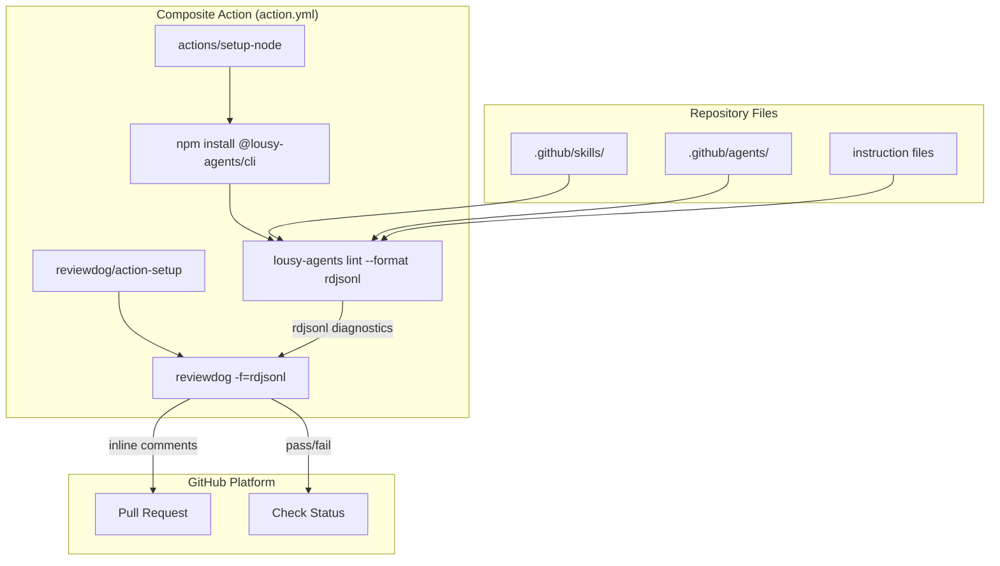
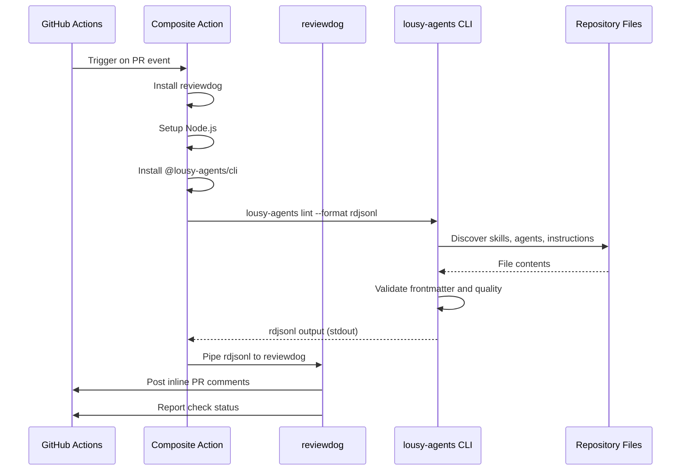

# Feature: GitHub Action for Instruction/Agent/Skill Linting

## Problem Statement

Teams using lousy-agents need automated inline feedback on their instructions, agents, and skills during pull request reviews. Without a ready-made GitHub Action, each team must manually configure CI pipelines to run the lint command and parse output. A composite GitHub Action with built-in reviewdog integration provides one-step setup for inline PR comments based on lint analysis.

## Personas

| Persona | Impact | Notes |
|---------|--------|-------|
| Software Engineer Learning Vibe Coding | Positive | Primary user — gets inline PR comments on instruction/agent/skill issues without manual CI setup |
| Team Lead | Positive | Can enforce consistent quality standards across team repositories with a single action reference |

## Value Assessment

- **Primary value**: Efficiency — Eliminates manual CI pipeline configuration for lint feedback
- **Secondary value**: Customer — Improves developer experience with inline PR review comments

## User Stories

### Story 1: Lint with Inline PR Comments

As a **Software Engineer Learning Vibe Coding**,
I want **a GitHub Action that lints my instructions, agents, and skills and posts inline comments on my PR**,
so that I can **fix issues directly from the PR review interface without reading CI logs**.

#### Acceptance Criteria

- When a user adds the lousy-agents lint action to their workflow, the action shall run the lint command with rdjsonl output format
- When lint diagnostics are found, the action shall post inline PR review comments via reviewdog at the exact file and line
- When no lint diagnostics are found, the action shall complete successfully without posting comments
- When the user specifies target flags (skills, agents, instructions), the action shall only lint the specified targets
- When no target flags are specified, the action shall lint all targets (skills, agents, and instructions)
- If the lint command detects errors, then the action shall report a failed check status

#### Notes

- The action uses reviewdog's rdjsonl format for compatibility
- The action must be a composite action (not Docker-based) for fast startup

---

### Story 2: Configurable Reviewdog Behavior

As a **Team Lead**,
I want **to configure the reviewdog reporter and filter mode**,
so that I can **control how and where lint feedback appears on PRs**.

#### Acceptance Criteria

- Where the `reporter` input is set, the action shall use the specified reviewdog reporter (github-pr-check or github-pr-review)
- Where the `filter_mode` input is set, the action shall use the specified reviewdog filter mode
- When no reporter is specified, the action shall default to `github-pr-check`
- When no filter mode is specified, the action shall default to `added`

---

### Story 3: CI Integration in lousy-agents Repository

As a **Software Engineer Learning Vibe Coding**,
I want **the lousy-agents CI workflow to use the new lint action**,
so that I can **see lint feedback on PRs to the lousy-agents repository itself**.

#### Acceptance Criteria

- When a PR is opened against the lousy-agents repository, the CI workflow shall run the lint action
- The CI workflow shall use the local action definition via `uses: ./`
- The lint action step shall only run on pull request events

---

## Design

> Refer to `.github/copilot-instructions.md` for technical standards.

### Components Affected

- `action.yml` (new) — Composite GitHub Action definition at repository root
- `.github/workflows/ci.yml` — Add lint action job for PR feedback

### Dependencies

- `reviewdog/action-setup` — Installs reviewdog binary
- `actions/setup-node` — Sets up Node.js runtime
- `@lousy-agents/cli` — The lint command (installed from npm or available locally)

### Diagrams

#### Data Flow Diagram

#### Sequence Diagram

### Open Questions

- [x] Should the action install the CLI from npm or assume it's pre-installed? — Support both via `version` input (use `local` to skip install)

---

## Tasks

> Each task should be completable in a single coding agent session.
> Tasks are sequenced by dependency. Complete in order unless noted.

### Task 1: Create composite GitHub Action

**Objective**: Create `action.yml` at the repository root defining a composite action for lint with reviewdog

**Context**: This is the primary deliverable — a reusable GitHub Action that other repositories can reference

**Affected files**:
- `action.yml` (new)

**Requirements**:
- The action shall accept inputs for github_token, skills, agents, instructions, directory, reporter, filter_mode, and version
- The action shall install reviewdog via reviewdog/action-setup (pinned to SHA)
- When version is not `local`, the action shall set up Node.js and install @lousy-agents/cli from npm
- The action shall run `lousy-agents lint` with the `--format rdjsonl` flag and pipe output to reviewdog
- The action shall build target flags from the skills, agents, and instructions inputs
- All third-party actions shall be pinned to commit SHA with version comment

**Verification**:
- [x] `action.yml` is valid YAML
- [x] `actionlint` passes on workflows using the action
- [x] Action inputs have descriptions and defaults

**Done when**:
- [x] All verification steps pass
- [x] Action file is complete with all inputs and steps

---

### Task 2: Update CI workflow to use the lint action

**Objective**: Add a job to the CI workflow that uses the new lint action for PR feedback

**Context**: Demonstrates the action in the lousy-agents repository itself and validates it works

**Depends on**: Task 1

**Affected files**:
- `.github/workflows/ci.yml`

**Requirements**:
- The CI workflow shall include a new `lint-review` job that uses the local action via `uses: ./`
- The lint-review job shall only run on pull_request events
- The lint-review job shall pass the github token for reviewdog API access
- The lint-review job shall have `pull-requests: write` permission for posting review comments
- The lint-review job shall use `version: local` and have the CLI available via npm link
- All action references shall be pinned to commit SHA with version comment

**Verification**:
- [x] `mise run actionlint` passes
- [x] `mise run yamllint` passes
- [x] CI workflow is valid YAML

**Done when**:
- [x] All verification steps pass
- [x] Workflow validates successfully

---

## Out of Scope

- Docker-based action (composite action is sufficient and faster)
- Custom reviewdog action wrapping (use reviewdog/action-setup directly)
- Auto-fix capabilities in the action
- Support for non-GitHub CI platforms

## Future Considerations

- Add a `fail_on_error` input to control whether lint errors fail the check
- Add support for custom lint configuration files
- Publish the action to GitHub Marketplace
- Add SARIF output format support for GitHub Code Scanning integration
