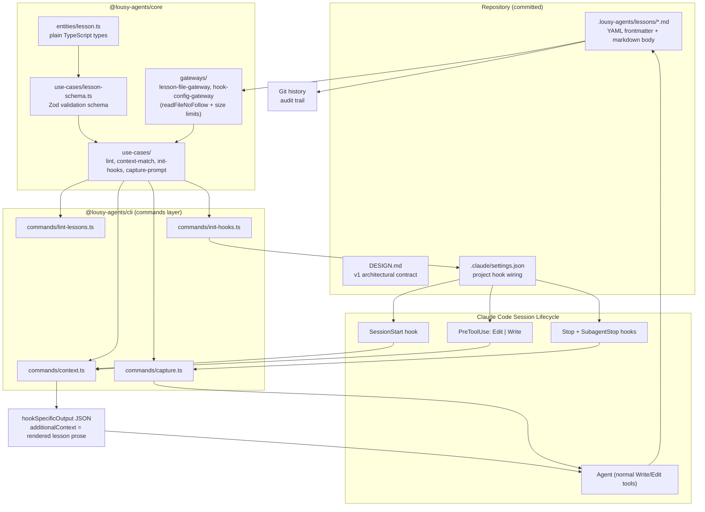
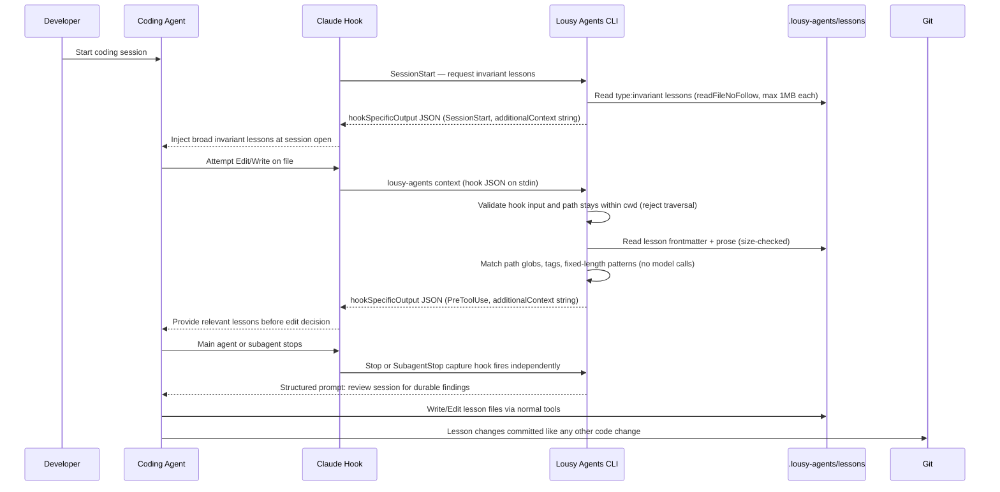

# Feature: Lesson Capture and Context Injection

## Problem Statement

AI coding agents repeat mistakes, forget project-specific conventions, and lose hard-won findings when sessions end. There is no mechanism for agents to accumulate durable knowledge from their own work, nor for that knowledge to be surfaced deterministically during future edits. Without a committed, auditable lesson store and a passive runtime injection loop, every session starts from scratch.

## Personas

| Persona | Impact | Notes |
| --- | --- | --- |
| AI Coding Agent | Positive | Receives relevant lessons before edits; can author new lessons inline |
| Vibe Coder | Positive | Software engineer learning AI-assisted development; lessons improve agent reliability without manual triage effort |
| Platform Engineer | Positive | Lessons are committed, reviewable, and auditable through normal Git workflow |

## Value Assessment

- **Primary value**: Future — agents accumulate knowledge across sessions, reducing repeated mistakes and cutting debugging time over time.
- **Secondary value**: Efficiency — lesson injection is deterministic and passive; no developer intervention required during the hot path.
- **Tertiary value**: Customer — agents produce more reliable code aligned with project-specific invariants, increasing confidence in AI-assisted development.

## User Stories

### Story 1: Lesson Injection Before File Edits

As a **Vibe Coder**,
I want **relevant lessons injected before an agent edits a file**,
so that I can **reduce repeated mistakes without manually reviewing project conventions before each session**.

#### Acceptance Criteria

- When an agent attempts to edit or write a file, the PreToolUse hook shall invoke the fixed command `lousy-agents context` and pass Claude Code hook input JSON on stdin; the command shall validate that input with Zod, extract the Edit/Write file path, and return matching lessons to Claude Code as a `hookSpecificOutput.additionalContext` string (the CLI emits the protocol-compliant Claude Code hook envelope directly on stdout — see the Data Model section for the exact shape). Hook configuration shall not interpolate file paths into shell command strings.
- When no lessons match the file, the context command shall emit the Claude Code hook envelope with an empty `additionalContext` string (i.e., `{ "hookSpecificOutput": { "hookEventName": "PreToolUse", "additionalContext": "" } }`) on stdout and exit zero.
- The context command shall not perform model calls, embedding similarity, or LLM-mediated relevance scoring.
- When a SessionStart hook fires, the context command shall return all lessons with `type: invariant` without requiring a `--files` path argument.
- If lesson files contain invalid frontmatter, then the context command shall skip those files, log a warning, and continue processing remaining lessons without crashing the hook.
- If a `--files` path resolves outside the current working directory, then the context command shall reject the path and exit non-zero. The containment check must be boundary-safe — see **Design § Path normalization requirement** for the required algorithm.
- If a file path from hook input or `--files` resolves to a symbolic link, or its real path resolves outside the current working directory, then the context command shall not read target content; it shall log a warning, treat that file as having empty content, and continue matching only on the validated in-repo path string.
- If the `.lousy-agents/lessons/` directory cannot be read for any reason (missing, not a directory, permission denied), the context command shall emit the Claude Code hook envelope with an empty `additionalContext` string (i.e., `{ "hookSpecificOutput": { "hookEventName": "...", "additionalContext": "" } }`) and exit zero rather than crashing the PreToolUse hook.
- When a lesson's `triggers.tags` array contains a value matching any forward-slash-separated path segment OR the file extension of the file under edit, the context command shall include that lesson in the rendered `additionalContext` string. For `src/rules.ts`, testable segments are `src`, `rules.ts`, and `ts`.
- After determining the set of matching lessons, the context command shall remain read-only: it shall not write to lesson files, mutate frontmatter, or persist hidden runtime state.

---

### Story 2: Inline Lesson Capture at Session End

As a **Vibe Coder**,
I want **the agent to capture durable lessons from its own session findings**,
so that I can **accumulate project-specific knowledge without a separate triage or authoring step**.

#### Acceptance Criteria

- When either a Stop or SubagentStop hook fires, the capture script shall provide the active agent with a structured prompt to review recent session context for findings worth capturing.
- When the agent captures a finding, the agent shall first inspect existing lesson files under `.lousy-agents/lessons/` and update an existing lesson when the finding extends prior knowledge rather than creating a duplicate.
- When the agent captures a finding, the agent shall write or update lesson files at `.lousy-agents/lessons/<slug>.md` using normal Write/Edit operations.
- Where the active agent is a subagent (SubagentStop), the capture prompt shall direct the agent to capture findings local to its subagent scope before that context is lost. Where the active agent is the main agent (Stop), the capture prompt shall direct the agent to capture session-level findings.
- The capture script shall not directly create lesson files on the agent's behalf.
- The runtime system shall remain passive for lesson authoring and shall not expose a custom lesson-authoring API.
- When a new lesson is written, the resulting file shall conform to the documented frontmatter schema.

---

### Story 3: Lesson Schema Validation

As a **Platform Engineer**,
I want **committed lessons validated against a documented schema**,
so that I can **catch malformed lessons before they silently fail in the injection runtime**.

#### Acceptance Criteria

- When a user runs `lousy-agents lint lessons`, the CLI shall read `.lousy-agents/lessons/` and validate each file's frontmatter.
- When a lesson file has invalid frontmatter, the linter shall report the file path and the specific validation reason.
- If any lesson file is invalid, then `lousy-agents lint lessons` shall exit non-zero.
- If all lesson files are valid, then `lousy-agents lint lessons` shall exit zero.
- If `.lousy-agents/lessons/` does not exist, then the linter shall report that no lessons are configured, exit zero, and create no hidden state.
- If a lesson specifies any `type` other than `invariant` or `pattern`, then the linter shall report a schema validation error.
- If a lesson `slug` contains path separators (`/`, `\`) or dot-dot sequences (`..`), then the linter shall reject the lesson with a slug format validation error (the `^[a-z0-9-]+$` constraint rejects these characters; no separate path-traversal check is required).
- If a lesson exceeds documented resource caps for trigger array length, trigger string length, lesson file count, or aggregate lesson bytes, then the linter shall reject the lesson set with a descriptive validation error.

---

### Story 4: Hook Initialization

As a **Vibe Coder**,
I want **a single command to wire the lesson lifecycle into my Claude Code session**,
so that I can **enable lesson injection and capture without manually editing hook configuration**.

#### Acceptance Criteria

- When a user runs `lousy-agents init-hooks`, the CLI shall configure a project-scoped PreToolUse hook for Edit and Write operations.
- When a user runs `lousy-agents init-hooks`, the CLI shall configure both Stop and SubagentStop capture hooks independently.
- Where the `--no-session-start` flag is **not** passed, `lousy-agents init-hooks` shall configure a SessionStart hook for broad invariant injection (SessionStart wiring is **enabled by default**).
- When `--no-session-start` is passed, `lousy-agents init-hooks` shall not write a SessionStart hook entry. Any pre-existing SessionStart entry in `.claude/settings.json` shall be left untouched (the flag does not act as an inverse `--force` for SessionStart).
- If a `.claude/settings.json` file already exists, then `lousy-agents init-hooks` shall preserve unrelated existing settings.
- If hook entries for the same tool and event already exist in `.claude/settings.json`, then `lousy-agents init-hooks` shall not overwrite them unless `--force` is passed.
- If `.claude/settings.json` or any ancestor path segment from the project root to `.claude/settings.json` is a symbolic link, then `lousy-agents init-hooks` shall exit non-zero with a descriptive error before reading or writing hook configuration.

---

## Design

> Refer to `.github/copilot-instructions.md` for technical standards.

### Architecture Commitment

The v1 system makes the following load-bearing decisions (documented in `DESIGN.md`):

- **Storage**: Lessons live at `.lousy-agents/lessons/<slug>.md`. One file per lesson. Committed to the repo. Git is the audit trail.
- **Lesson types**: Exactly two — `invariant` (project-scoped, fire broadly) and `pattern` (file-specific recurring concerns). No third type in v1.
- **Authorship**: Agents write lessons via normal Write/Edit tools. No custom MCP authoring API. Schema changes are documentation changes.
- **Capture trigger**: Stop and SubagentStop hooks are both wired independently; neither takes priority. SubagentStop captures subagent-local findings before that context is lost, and Stop captures main-agent/session-level findings. The agent decides what to capture and writes files. The runtime stays passive.
- **Injection**: PreToolUse hook for Edit/Write calls the fixed command `lousy-agents context` and passes Claude Code hook input JSON on stdin. Manual/debug invocations may pass repeated `--files` flags. SessionStart hook injects invariants at session open.
- **Matching**: Path globs, tag matches, and literal substring search against file content only. No regex matching on file content. No model calls in PreToolUse.

#### Error Behavior Policy

Each component has an explicit fail-open or fail-closed stance. Reviewers should treat any deviation from this table as a bug:

| Component | Stance | Rationale |
| --- | --- | --- |
| `lousy-agents context` | **Fail-open** — invalid/oversized lesson files skip with a warning; unreadable lessons directory returns empty result and exits zero; symlinked edit targets are treated as empty content | Crashing the hook blocks the agent entirely; partial injection is always preferable to blocking |
| `lousy-agents lint lessons` | **Fail-closed** — any invalid lesson → exit non-zero | Validation must be strict; a silent pass would mask broken lessons reaching the runtime |
| `lousy-agents init-hooks` | **Fail-closed** — any settings read/write or parse error → exit non-zero | Hook misconfiguration silently breaks the lifecycle; fail loudly |
| `lousy-agents capture` | **Fail-open** — absent or unparseable hook input → log warning to stderr, emit no prompt, exit zero | Stop/SubagentStop fire when the agent is already terminating; a non-zero exit cannot block useful work and may not surface to the developer at all. Stderr warnings preserve the developer signal without disrupting the lifecycle |

### Lesson Frontmatter Schema

```yaml
---
slug: fail-closed-default
title: Use fail-closed defaults for policy decisions
type: invariant  # or "pattern"
created: 2026-05-02
revised: 2026-05-02
provenance:
  - pr: 234
    finding_id: f-2026-05-02-001
    facet: "deny rules win over allow"
triggers:
  paths: ["src/policy/**"]
  tags: ["policy", "decision", "deny"]
  patterns: ["fail-closed", "return true"]
---
```

**Slug format constraint**: slugs must match `^[a-z0-9-]+$`. Path separators and dot-dot sequences are invalid. Malformed slugs will cause lesson rejection by the linter; the runtime context gateway shall skip invalid lesson files with a warning and continue.

**Pattern length constraint**: each entry in `triggers.patterns` must not exceed 200 characters, and the array must not exceed 50 entries. Patterns are treated as literal substrings for matching — never as regular expressions. The matching implementation shall use linear string search (e.g., `String.prototype.includes()`) and must not use regex on untrusted file content to prevent catastrophic backtracking.

**File size constraint**: lesson files must not exceed 1MB. The lesson gateway shall reject files larger than this limit before parsing YAML. Note: file size alone is insufficient to prevent anchor-bomb OOM — YAML alias/anchor expansion can produce gigabytes of in-memory data from a compact file. The YAML parser must be configured with `maxAliasCount: 0` (from the `yaml` package already in the workspace) to disallow aliases entirely; any alias-limit violation shall be treated as invalid frontmatter and cause the lesson to be rejected.

**Resource caps**: the lesson gateway shall process at most 500 lesson files and at most 20MB of aggregate lesson bytes per invocation. Each of `triggers.paths` and `triggers.tags` must not exceed 100 entries, and each path/tag string must not exceed 200 characters. `lousy-agents lint lessons` treats cap violations as validation failures and exits non-zero. `lousy-agents context` treats cap violations according to its fail-open policy: log a warning, emit an empty `additionalContext` string for directory-level cap violations, and skip individual lesson files that violate schema-level caps.

The body is human-readable markdown prose: the rule, when it applies, examples of correct application, and edge cases.

### Components Affected

- `packages/core/src/entities/lesson.ts` — Plain TypeScript types for `Lesson`, `LessonType`, `LessonTriggers`, `LessonProvenance` (no framework imports)
- `packages/core/src/use-cases/` — Lesson validation schema (Zod), trigger matching, hook config generation, capture prompt logic
- `packages/core/src/gateways/` — Lesson file reading (using `readFileNoFollow()`), hook config file read/write
- `packages/cli/src/commands/` — CLI command handlers: `lint-lessons`, `context`, `init-hooks`, `capture`
- `.lousy-agents/lessons/` — Seed lessons from shadow experiment
- `DESIGN.md` — v1 architectural contract
- `.claude/settings.json` — Project-scoped hook wiring (generated by `init-hooks`)

### Dependencies

- `zod` — lesson Zod schema in use-case layer (already pinned in workspace)
- **Frontmatter parser**: Do not add `gray-matter` or any new frontmatter parser without explicit approval. Before Task 4 begins, identify whether an existing YAML parser (e.g., `yaml` package already used in the workspace) can parse frontmatter with a simple fence splitter, or raise this as a **blocking open question** requiring maintainer approval before proceeding.
- Existing file-system utilities: `packages/core/src/gateways/file-system-utils.ts` (`readFileNoFollow()`) — required for all lesson and hook config file reads.
- **Glob library**: See resolved blocking open question below. The current resolution requires adding `picomatch@4.0.2` as a directly pinned dependency (exact version, no `^` or `~`, per the project dependency policy) to `packages/core/package.json` before Task 5 implementation begins. Glob semantics — particularly `**` and `dot` handling — have shifted across picomatch minor releases; the version is pinned and locked by a fixture test in Task 5 verification. Bumping the version in a future change requires re-running the fixture test and updating the spec if behavior diverges.

### Glob and Path Matching Semantics

**Library and options**: glob matching uses `picomatch` (resolved per Open Questions) with `{ dot: false, nocase: false }` — case-sensitive, does not match dot-prefixed entries unless explicitly specified.

**`**` semantics**: `src/policy/**` matches `src/policy/foo.ts` and `src/policy/foo/bar/baz.ts` — zero or more path segments. Does not match `src/policy/` itself (directory entries are not exposed as file paths).

**Empty trigger arrays**: an empty `triggers.paths`, `triggers.tags`, or `triggers.patterns` means that trigger type does **not** fire for any file. Absence is not a wildcard. A lesson with all three trigger arrays empty matches nothing.

**Tag matching**: lesson tags are tested against the set composed of the forward-slash-separated path segments of the file under edit **plus the standalone file extension** (last component after the final `.`). For `src/policy/rules.ts`, the testable segments are `src`, `policy`, `rules.ts` (path segments), and `ts` (file extension). A lesson tag must equal one of these values exactly (case-sensitive). This matches the Story 1 AC: "any forward-slash-separated path segment OR the file extension."

**Content pattern matching**: literal substring search (`String.prototype.includes()`) against the full file content string after loading it. Case-sensitive. Patterns exceeding 200 characters are rejected by the schema validator before reaching the matcher.

**Path normalization requirement**: All file paths from CLI arguments or gateway reads must be validated using the existing `resolvePathWithinRoot()` utility from `packages/core/src/gateways/file-system-utils.ts`. This utility resolves the real path of the project root, calls `path.resolve()` on the candidate, and rejects any candidate not contained within the resolved root using a boundary-safe `startsWith(rootPath + path.sep)` check that prevents prefix-confusion attacks (e.g., `/repo` incorrectly matching `/repo2`). Components shall not reimplement this check inline; using a single shared utility avoids drift between the lint, context, and init-hooks code paths. String `includes('..')` checks and naked `startsWith(rootPath)` checks (without separator suffix) are explicitly prohibited.

**Windows cross-platform**: before passing any path to glob matching, normalize backslash separators to forward slashes (e.g., `filePath.split(path.sep).join('/')`). Path glob matching is always case-sensitive regardless of the OS filesystem case sensitivity.

**Symlink handling for edit targets**: after lexical cwd containment succeeds, content reads for files under edit must reject symbolic links and verify the target's real path remains inside the resolved cwd. Symlinked targets are not followed for content-pattern matching; they are treated as unreadable/empty content with a warning so an in-repo symlink cannot expose `/etc/passwd`, `$HOME/.ssh`, or other out-of-repo files through lesson matching.

### Platform Scope

v1 targets **macOS and Linux as primary platforms**; Windows is **best-effort**. The spec is written against POSIX-shaped semantics — symbolic-link rejection, separator normalization, and case-sensitive matching all assume POSIX behavior. Windows differences:

- **Symbolic links**: Windows symlinks require admin privileges or Developer Mode. The `lstat()`-based detection used by `assertPathHasNoSymbolicLinks()` and the edit-target symlink check works identically when symlinks exist; the typical Windows developer environment does not create them, so this code path is rarely exercised.
- **Path separators**: backslash-to-forward-slash normalization is performed before glob matching (see § Glob and Path Matching Semantics). Path globs in `triggers.paths` shall be authored using forward slashes; backslash globs in lesson YAML are not supported and will not match.
- **Case sensitivity**: glob and tag matching are case-sensitive (`{ nocase: false }`) regardless of the host filesystem's behavior. Windows users authoring lessons must match the canonical case of repo paths (e.g., `src/policy/**`, not `Src/Policy/**`).
- **Filesystem APIs**: `readFileNoFollow()`, `resolvePathWithinRoot()`, and the `assertPathHasNoSymbolicLinks()` helper rely on `node:fs` primitives that behave consistently on Windows; no platform-specific code paths are added in v1.

Windows-specific bugs are accepted but will not block Task 8 sign-off in v1. CI runs on `ubuntu-latest` (per **CI/CD pipeline instructions**); Windows behavior is exercised only through unit tests with synthesized inputs (e.g., backslash-bearing path strings, simulated `lstat()` results). A future task may add a Windows CI job; until then, Windows is documented but not gated.

### Data Model Changes

Plain TypeScript types (entities layer — no framework imports):

```typescript
// biome-ignore-all lint/style/useNamingConvention: lesson schema uses snake_case field names to match YAML frontmatter keys verbatim
// packages/core/src/entities/lesson.ts
export type LessonType = 'invariant' | 'pattern';

export interface LessonTriggers {
  readonly paths: readonly string[];
  readonly tags: readonly string[];
  readonly patterns: readonly string[];
}

export interface LessonProvenance {
  readonly pr: number;
  readonly finding_id: string;
  readonly facet: string;
}

export interface Lesson {
  readonly slug: string;
  readonly title: string;
  readonly type: LessonType;
  readonly created: string;
  readonly revised: string;
  readonly provenance: readonly LessonProvenance[];
  readonly triggers: LessonTriggers;
  readonly body: string;
}
```

Zod validation schema (use-case layer — framework imports allowed here). This schema validates YAML frontmatter only — `body` is the markdown content after the `---` delimiter and is read separately by the gateway:

```typescript
// packages/core/src/use-cases/lesson-schema.ts
import { z } from 'zod';

const SAFE_SLUG = /^[a-z0-9-]+$/;
const MAX_PATTERN_LENGTH = 200;
const MAX_PATTERNS = 50;
const MAX_TRIGGER_VALUES = 100;
const MAX_TRIGGER_VALUE_LENGTH = 200;

export const LessonFrontmatterSchema = z.object({
  slug: z.string().regex(SAFE_SLUG, 'slug must match ^[a-z0-9-]+$'),
  title: z.string().min(1),
  type: z.enum(['invariant', 'pattern']),
  created: z.string().regex(/^\d{4}-\d{2}-\d{2}$/, 'created must be YYYY-MM-DD'),
  revised: z.string().regex(/^\d{4}-\d{2}-\d{2}$/, 'revised must be YYYY-MM-DD'),
  // provenance MAY be empty: agent-captured lessons are written before any PR exists.
  provenance: z.array(z.object({
    pr: z.number().int(),
    finding_id: z.string(),
    facet: z.string(),
  }).strict()),
  triggers: z.object({
    paths: z.array(z.string().min(1).max(MAX_TRIGGER_VALUE_LENGTH)).max(MAX_TRIGGER_VALUES),
    tags: z.array(z.string().min(1).max(MAX_TRIGGER_VALUE_LENGTH)).max(MAX_TRIGGER_VALUES),
    patterns: z.array(z.string().min(1).max(MAX_PATTERN_LENGTH)).max(MAX_PATTERNS),
  }).strict(),
}).strict().refine(
  (data) => data.revised >= data.created,
  { message: 'revised must be on or after created (lexicographic ISO date compare)', path: ['revised'] },
);
```

#### Gateway Port Interface

The use-case layer depends on this port; the gateway in `packages/core/src/gateways/` provides the implementation. The port must be defined in `packages/core/src/use-cases/` or `packages/core/src/entities/` — not in the gateway file.

```typescript
// packages/core/src/use-cases/lesson-file-gateway-port.ts
export interface ParsedLesson {
  readonly lesson: Lesson;
  readonly filePath: string;
}

export interface LessonReadError {
  readonly filePath: string;
  readonly reason: string;
}

export interface ReadLessonsResult {
  readonly lessons: readonly ParsedLesson[];
  readonly errors: readonly LessonReadError[];
}

export interface LessonFileGatewayPort {
  readLessons(rootDir: string): Promise<ReadLessonsResult>;
}
```

#### Claude PreToolUse Hook Input Schema

The `context` command validates Claude Code hook input from stdin before extracting the edited file path. The schema is intentionally narrow: unknown top-level and `tool_input` fields are allowed for forward compatibility, but only `Edit` and `Write` events with a safe printable `file_path` are used for matching.

```typescript
// packages/core/src/use-cases/claude-hook-input-schema.ts
import { z } from 'zod';

const MAX_HOOK_FILE_PATH_LENGTH = 4096;
const SAFE_PRINTABLE_PATH = /^[^\u0000-\u001f\u007f]+$/;

export const ClaudePreToolUseHookInputSchema = z.object({
  hook_event_name: z.literal('PreToolUse'),
  tool_name: z.enum(['Edit', 'Write']),
  tool_input: z.object({
    file_path: z.string()
      .min(1)
      .max(MAX_HOOK_FILE_PATH_LENGTH)
      .regex(SAFE_PRINTABLE_PATH, 'file_path must not contain control characters'),
  }).passthrough(),
}).passthrough();

export const ClaudeSessionStartHookInputSchema = z.object({
  hook_event_name: z.literal('SessionStart'),
}).passthrough();

// The CLI dispatches on `hook_event_name`. Stdin parsing tries the SessionStart
// schema first when stdin is non-empty but does not contain `tool_name` /
// `tool_input`, then falls back to the PreToolUse schema. If neither schema
// matches, the CLI follows its fail-open policy.
```

**Dispatch rules**:

1. If `--files` is provided, the CLI uses the `--files` set and emits `hookEventName: "PreToolUse"`. Stdin is ignored (an info message is logged to stderr if stdin also contained valid hook input). `--files` always takes precedence over stdin to keep manual/debug invocations predictable.
2. Otherwise, if stdin is non-empty and parses as JSON matching `ClaudePreToolUseHookInputSchema`, the CLI extracts `tool_input.file_path` and emits `hookEventName: "PreToolUse"`.
3. Otherwise, if stdin is non-empty and parses as JSON matching `ClaudeSessionStartHookInputSchema`, the CLI returns all `invariant` lessons and emits `hookEventName: "SessionStart"`.
4. Otherwise, if stdin is empty and no `--files` flags are provided, the CLI treats the invocation as the SessionStart invariant-injection path (`hookEventName: "SessionStart"`).
5. If stdin is non-empty but does not match either schema (malformed JSON or unknown shape), the CLI follows its fail-open policy: log a warning to stderr, emit the PreToolUse hook envelope with `additionalContext: ""`, and exit zero.

The `init-hooks` command writes the SessionStart wiring such that Claude Code pipes its standard hook input JSON on stdin; the CLI's SessionStart schema accepts this input via rule 3 above. This means the SessionStart path works regardless of whether Claude Code emits stdin or not.

#### CLI Stdout JSON Shape (Claude Code Hook Envelope)

The `lousy-agents context` command emits the **Claude Code hook response envelope directly on stdout**. Claude Code runs the fixed hook command `lousy-agents context` and supplies hook input JSON on stdin; the command validates that JSON and extracts the edited file path internally instead of receiving a shell-interpolated path argument. Repeated `--files` flags remain supported for manual/debug invocations outside the hook path. Confirmed against the [Claude Code hooks documentation](https://docs.claude.com/en/docs/claude-code/hooks): `additionalContext` is a **string** (not a structured array) nested inside `hookSpecificOutput` alongside a `hookEventName` field, and the value is capped at 10 000 characters before Claude Code spills it to a file.

```json
{
  "hookSpecificOutput": {
    "hookEventName": "PreToolUse",
    "additionalContext": "<rendered lesson prose, e.g. markdown sections per matching lesson>"
  }
}
```

Rules:

- The CLI emits exactly one JSON object on stdout. No surrounding prose, no markdown fences.
- All diagnostic output (warnings, info messages) shall go to stderr; stdout is reserved exclusively for the single JSON object per invocation.
- `hookEventName` is `"PreToolUse"` when invoked from a PreToolUse hook input or with `--files`, and `"SessionStart"` when invoked without hook input or `--files` (the SessionStart invariant-injection path).
- `additionalContext` is a **string** rendering of matched lessons (e.g., a concatenation of `## <title>\n\n<body>` blocks). It is **not** a JSON array — Claude Code expects a string here.
- When no lessons match, the CLI emits `{ "hookSpecificOutput": { "hookEventName": "...", "additionalContext": "" } }` and exits zero. An empty string is the correct "no context" signal; omitting the field or printing nothing is also acceptable per Claude's docs but the explicit empty string keeps the contract uniform and easier to test.
- The rendered `additionalContext` string is shaped by a two-stage budget so multiple lessons can fit inside Claude Code's 10 000-character cap. (1) Each matched lesson body is truncated to **2 000 characters** before rendering — this leaves room for roughly five lessons in a typical assembly. (2) After all lesson blocks are concatenated, the assembled string is truncated to **9 800 characters** to leave headroom for the truncation footer. (3) When one or more lessons are partially or fully dropped from the assembled string by the 9 800-character cap, the renderer appends `\n\n_(N additional lessons truncated due to length cap)_` where `N` is the count of dropped lessons. The footer is omitted when no lessons are dropped, even if individual bodies were truncated by the per-lesson 2 000-character cap (per-body truncation is silent because it does not lose lesson presence). See **§ `additionalContext` Rendering Format** for the canonical block layout.
- The command exits zero for all non-error conditions, including the no-match case.

#### `additionalContext` Rendering Format

The CLI assembles matched lessons into the `additionalContext` string deterministically. Every detail below is part of the contract — tests should pin the exact bytes, not just the intent:

1. **No prologue.** The string begins with the first lesson's header. No introductory sentence.
2. **Per-lesson block.** `## <lesson.title>\n\n<truncated lesson.body>` — Markdown H2, blank line, body. No metadata block, no slug, no type tag.
3. **Inter-lesson separator.** `\n\n` (one blank line) between lesson blocks.
4. **No trailing newline** at the end of the assembled string before truncation or footer append.
5. **Truncation footer.** When the 9 800-character assembled-string cap drops one or more lessons, the renderer appends `\n\n_(N additional lessons truncated due to length cap)_` where `N` is the count of dropped lessons (a lesson is "dropped" if any portion of its block, including its `## <title>` header, is removed by the cap). The footer is omitted when no lessons are dropped, even if individual bodies were shortened by the per-body 2 000-character cap.
6. **Empty result.** `additionalContext: ""` is exactly the empty string — no header, no separator, no footer, no whitespace.
7. **Ordering.** The block order matches the deterministic sort defined in **Task 5 Requirements** (`type` ascending, then `slug` ascending). Truncation respects this order: the first dropped lesson is the lowest-priority one in sort order.

#### Shared Hook-Response Builder

Both `@lousy-agents/agent-shell` (PreToolUse `permissionDecision` responses in `policy-check.ts`) and `@lousy-agents/cli` (the new `context` command's `additionalContext` responses) emit Claude Code hook envelopes. To avoid duplicating the envelope-shaping logic — and to keep both packages aligned with the documented `hookSpecificOutput` wrapper — a small shared builder shall live in `@lousy-agents/core`. In v1, only `@lousy-agents/cli` must consume it; `@lousy-agents/agent-shell` migration is explicitly deferred (see below):

```typescript
// packages/core/src/use-cases/claude-hook-response.ts
export type ClaudeHookEventName =
  | 'PreToolUse'
  | 'PostToolUse'
  | 'UserPromptSubmit'
  | 'SessionStart'
  | 'SubagentStart'
  | 'Stop'
  | 'SubagentStop';

export interface AdditionalContextPayload {
  readonly hookEventName: ClaudeHookEventName;
  readonly additionalContext: string;
}

export interface PermissionDecisionPayload {
  readonly hookEventName: 'PreToolUse';
  readonly permissionDecision: 'allow' | 'deny' | 'ask';
  readonly permissionDecisionReason?: string;
}

export function buildAdditionalContextResponse(
  payload: AdditionalContextPayload,
): string;

export function buildPermissionDecisionResponse(
  payload: PermissionDecisionPayload,
): string;
```

Both functions return the JSON-stringified envelope `{ "hookSpecificOutput": { ... } }` ready for stdout. `@lousy-agents/cli` **must** consume this builder rather than hand-constructing the envelope — this is the architectural seam that keeps the `context` command aligned with the Claude Code protocol. Migrating `agent-shell/src/use-cases/policy-check.ts` to consume `buildPermissionDecisionResponse` is **out of scope for this spec** (its current bare-`permissionDecision` shape is accepted by Claude Code today); the builder is designed to support that migration without API changes, but `agent-shell` remains unchanged in this spec.

### Capture Prompt Template

The capture command emits a structured prompt to the active agent. The template differentiates by hook event so subagent-local findings are captured before subagent context is lost. Only validated structured fields from hook input may be interpolated; raw session text shall not be embedded verbatim.

**Stop event template** (main-agent / session-level findings):

```markdown
You have just finished a coding session. Before this context is lost, review your
recent work for findings worth capturing as durable lessons.

A lesson is worth capturing when:
- You discovered a project-specific invariant that wasn't obvious from the code
- You hit a recurring concern that future agents will likely encounter on similar files
- You corrected a mistake that future agents could easily repeat

Lessons live at `.lousy-agents/lessons/<slug>.md`. Each lesson is a markdown file
with YAML frontmatter conforming to this schema:

- `slug`: lowercase, digits, hyphens only (matches `^[a-z0-9-]+$`)
- `title`: one-line human-readable summary
- `type`: `invariant` (broad project rule) or `pattern` (file-specific concern)
- `created` / `revised`: YYYY-MM-DD; `revised` must be on or after `created`
- `provenance`: array of `{ pr, finding_id, facet }` (may be empty for in-session captures)
- `triggers.paths`: glob patterns (max 100 entries, max 200 chars each)
- `triggers.tags`: path-segment or extension matches (max 100, max 200 chars)
- `triggers.patterns`: literal substrings to match in file content (max 50, max 200 chars)

Before writing a new lesson:
1. List existing lessons under `.lousy-agents/lessons/` and read any whose slug or
   title looks related to your finding.
2. If an existing lesson covers your finding, update it (bump `revised`, append
   to `provenance`, refine triggers/body) rather than creating a duplicate.
3. Only create a new lesson if no existing lesson covers the finding.

Write or edit lessons using your normal Write/Edit tools. The capture command
will not create or modify files for you.
```

**SubagentStop event template** (subagent-local findings):

```markdown
You are a subagent finishing your task. Before your subagent context is lost,
capture findings local to your scope as durable lessons.

[…schema and authorship rules identical to the Stop template…]

Focus your review on findings specific to the work you completed in this
subagent invocation. The main agent will run its own capture pass on Stop and
will see broader session findings; do not duplicate that work.
```

The capture command shall not interpolate any hook input fields into the prompt body. `hook_event_name` is consumed only as a dispatch key to select between the two static templates above. Raw session messages, tool transcripts, and free-form output from the agent are likewise excluded by construction — there is no template slot for them. If a future revision adds field interpolation, this section and the corresponding Task 7 requirement must be updated together to specify the field list and per-field validation.

### Diagrams

#### Data Flow



#### Sequence Diagram



### Open Questions

- [x] ~~Should `fire_count` and `last_fired` be auto-updated in PreToolUse, or remain manually maintained to keep the hot path passive and avoid noisy working-tree diffs?~~ **Resolved**: Both fields are deferred from v1 entirely. Manual maintenance combined with a read-only context command meant they would rot; carrying required schema fields with no writer would only burden agent-authored lesson capture. The context command stays read-only and the schema no longer includes either field. They are tracked in **Future Considerations** for reintroduction once an automated writer exists.
- [x] ~~**BLOCKING for Task 5**: What is the exact JSON shape expected by Claude Code for `additionalContext` in hook responses? A proposed shape is defined in the Data Model section above; confirm against Claude Code documentation before Task 5 begins.~~ **Resolved**: Per the [Claude Code hooks documentation](https://docs.claude.com/en/docs/claude-code/hooks), `additionalContext` is a **string** nested inside `hookSpecificOutput` alongside `hookEventName`. Claude Code caps the value at 10 000 characters before spilling to a file. The CLI emits the protocol-compliant envelope directly on stdout (no separate wrapper script needed). Repo audit: `agent-shell`'s `policy-check.ts` is the only existing Claude hook-response producer and emits a different shape (`permissionDecision`); a small shared `buildAdditionalContextResponse` / `buildPermissionDecisionResponse` helper in `@lousy-agents/core` shall be introduced so both packages avoid duplicating the envelope-shaping logic. See the Data Model section for the canonical shape and the shared builder interface.
- [x] ~~Should `lousy-agents context --files` accept comma-separated paths, repeated flags, or both?~~ **Resolved**: `--files` accepts repeated flags only (e.g., `--files path1 --files path2`). No comma-splitting — avoids the need to escape or parse commas in file paths.
- [x] ~~Which hook takes priority for capture: `SubagentStop`, `Stop`, or both wired independently?~~ **Resolved**: Both Stop and SubagentStop are wired independently; neither takes priority. SubagentStop captures findings from a subagent's local context before that context is lost, while Stop captures main-agent and session-level findings. The capture prompt must be safe to run for either event and rely on the active agent to check existing lessons before writing or updating files.
- [x] ~~**BLOCKING**: Is an existing YAML parser in the workspace sufficient for frontmatter parsing, or is a new dependency required? Do not begin Task 4 until this is resolved with explicit maintainer approval.~~ **Resolved**: The `yaml` package already in the workspace is sufficient. The duplicated `parseFrontmatter` implementation was extracted from `FileSystemSkillLintGateway` and `FileSystemAgentLintGateway` into a shared utility at `packages/core/src/lib/frontmatter.ts`. Task 4 must import `parseFrontmatter` from `@lousy-agents/core/lib/frontmatter.js` — no new dependency required.
- [x] ~~**BLOCKING for Task 5**: Is a glob library available as a direct pinned dependency in `@lousy-agents/cli` or `@lousy-agents/core`?~~ **Resolved**: Workspace audit (2026-05-03) confirmed neither package has a direct glob dependency. `minimatch` appears only as a transitive dev dep through `testcontainers → archiver → readdir-glob` and is not reliable for production. **Decision**: add `picomatch@4.0.2` (smaller and faster than `minimatch`, no regex precompile cost on the hot path; pinned exact, no `^` or `~`) as a directly pinned dep to `packages/core/package.json`. Glob matching shall use `picomatch` with `{ dot: false, nocase: false }` per the Design § Glob and Path Matching Semantics section. Pinning the dep is part of Task 5's implementation work, and Task 5 includes a fixture test that locks the version-dependent `**` and `dot: false` semantics so a future bump cannot silently regress matching.

---

## Tasks

> Each task is a phase. If a task lists more than three affected files, assign its **Implementation slices** separately; each slice is the coding-agent-sized unit (~1–3 files, ~200–300 lines changed).
> Complete tasks and slices in order. Each task feeds the next.
> All test fixtures must use Chance.js for generated values. Never hardcode the same value in both test setup and assertions.

### Task 1: Lock v1 Architecture in DESIGN.md

**Objective**: Document the load-bearing v1 decisions before any implementation begins.

**Context**: This is the architectural contract that prevents scope creep. Every subsequent task references it. It must exist and be committed before code is written.

**Affected files**:
- `DESIGN.md`

**Requirements**:
- The document states the storage layout, lesson schema, lesson types, authorship model, capture trigger, injection mechanism, deterministic matching strategy, and v1 out-of-scope list.
- The document does not exceed 150 lines — decisions, not alternatives.
- The document explicitly states: no database, no hidden state, no model calls in PreToolUse, no custom lesson-authoring MCP API.
- The document explicitly states the slug safety constraint (`^[a-z0-9-]+$`), trigger/resource caps, the 200-character pattern limit, and the 1MB lesson file size limit.

**Verification**:
- [ ] `DESIGN.md` exists at the repository root.
- [ ] The document addresses all seven architecture lock decisions.
- [ ] The document states the slug format, trigger/resource caps, pattern length, and file size constraints.
- [ ] `mise run lint` passes.

**Done when**:
- [ ] All verification steps pass.
- [ ] No new errors in affected files.
- [ ] Architecture section in spec is satisfied.
- [ ] Code follows patterns in `.github/copilot-instructions.md`.

---

### Task 2: Define Lesson Entity and Schema

**Depends on**: Task 1

**Objective**: Create plain TypeScript types for the lesson entity and a separate Zod validation schema in the use-case layer.

**Context**: The entities layer must not import frameworks. The Zod schema lives in the use-case layer. All other layers import the plain TypeScript types from entities and the Zod schema from the use-case schema module.

**Affected files**:
- `packages/core/src/entities/lesson.ts` (new) — plain TypeScript types only, no imports
- `packages/core/src/entities/lesson.test.ts` (new)
- `packages/core/src/use-cases/lesson-schema.ts` (new) — Zod schema
- `packages/core/src/use-cases/lesson-schema.test.ts` (new)

**Requirements**:
- `lesson.ts` contains only TypeScript `type` and `interface` declarations. No imports of any kind.
- `lesson-schema.ts` defines the Zod schema using the constraints: slug `^[a-z0-9-]+$`, trigger path/tag arrays `max(100)`, trigger path/tag strings `max(200)`, patterns `max(200)` per entry, patterns array `max(50)`, and `type` enum `['invariant', 'pattern']`. The schema includes a `.refine()` enforcing `revised >= created` (lexicographic ISO date compare).
- All required frontmatter fields are covered by the schema.
- Invalid `type` values produce a descriptive Zod error.
- Invalid slugs produce a descriptive Zod error that names the constraint.

**Verification**:
- [ ] `lesson.ts` has zero import statements.
- [ ] Tests cover a valid `invariant` lesson.
- [ ] Tests cover a valid `pattern` lesson.
- [ ] Tests cover rejection of unknown `type`.
- [ ] Tests cover rejection of a slug containing `/`.
- [ ] Tests cover rejection of a slug containing `..`.
- [ ] Tests cover rejection of a pattern exceeding 200 characters.
- [ ] Tests cover rejection of too many content patterns.
- [ ] Tests cover rejection of too many trigger paths or tags.
- [ ] Tests cover rejection of trigger path/tag strings exceeding 200 characters.
- [ ] Tests cover missing required fields.
- [ ] Tests cover rejection of `revised` earlier than `created` (e.g., `created: 2026-05-02`, `revised: 2026-05-01`) with a descriptive error.
- [ ] Tests cover acceptance of `revised` equal to `created` (same-day authoring).
- [ ] Tests cover acceptance of an empty `provenance` array (in-session captures pre-PR).
- [ ] `mise run test` passes.
- [ ] `mise run lint` passes.

**Done when**:
- [ ] All verification steps pass.
- [ ] Acceptance criteria: Story 3 (schema validation) partially satisfied.
- [ ] Code follows patterns in `.github/copilot-instructions.md`.

---

### Task 3: Add Seed Lessons

**Depends on**: Task 2

**Objective**: Populate `.lousy-agents/lessons/` with manually seeded lessons from the shadow experiment.

**Context**: The system needs lessons to exist before the runtime can be validated. Seed lessons are the first test of the schema against real content.

**Affected files**:
- `.lousy-agents/lessons/<slug>.md` (minimum three new files, one slug per file)

**Requirements**:
- At least three seed lessons are committed.
- Each uses only `invariant` or `pattern` type.
- Each slug matches `^[a-z0-9-]+$` exactly.
- Each has valid frontmatter and human-readable markdown prose.
- Trigger fields are populated with at least one path, tag, or pattern.
- No single pattern exceeds 200 characters, no path/tag trigger exceeds 200 characters, and trigger arrays stay within documented schema caps.

**Verification**:
- [ ] Three or more lesson files exist.
- [ ] Each slug matches `^[a-z0-9-]+$`.
- [ ] `mise run lint` passes (markdownlint, yamllint).

**Done when**:
- [ ] All verification steps pass.
- [ ] Lessons cover at least one `invariant` and one `pattern` type.

---

### Task 4: Implement `lousy-agents lint lessons`

**Depends on**: Tasks 2 and 3

**Objective**: Validate lesson files against the schema and report errors with actionable messages.

**Context**: Validation is the first executable runtime contract. Every other component trusts lesson metadata to be well-formed; the linter enforces that trust. All file reads must use `readFileNoFollow()` with the 1MB size limit.

**Affected files**:
- `packages/core/src/lib/frontmatter.ts` (modified — see Slice 4A)
- `packages/core/src/lib/frontmatter.test.ts` (modified or new test cases)
- `packages/core/src/gateways/lesson-file-gateway.ts` (new)
- `packages/core/src/gateways/lesson-file-gateway.test.ts` (new)
- `packages/core/src/use-cases/lint-lessons-use-case.ts` (new)
- `packages/core/src/use-cases/lint-lessons-use-case.test.ts` (new)
- `packages/cli/src/commands/lint-lessons.ts` (new)
- `packages/cli/src/commands/lint-lessons.test.ts` (new)

**Implementation slices**:
- Slice 4A: extend the shared `parseFrontmatter` utility to return a tagged result distinguishing "no frontmatter present" from "invalid YAML" and surfacing the underlying YAML error reason. The current `null` return swallows YAML error specifics, which prevents the linter from meeting the Story 3 AC requiring a "specific validation reason." Update existing callers (`FileSystemSkillLintGateway`, `FileSystemAgentLintGateway`) to consume the new tagged return type without behavior change. Tests cover: missing frontmatter, malformed YAML with line/column reason surfaced, and valid frontmatter parsing unchanged.
- Slice 4B: lesson file gateway and gateway tests (`lesson-file-gateway.ts`, `lesson-file-gateway.test.ts`).
- Slice 4C: lint use case and use-case tests (`lint-lessons-use-case.ts`, `lint-lessons-use-case.test.ts`).
- Slice 4D: CLI command and command tests (`lint-lessons.ts`, `lint-lessons.test.ts`).

**Requirements**:
- Gateway reads `.lousy-agents/lessons/` relative to the resolved project root (not raw `process.cwd()` string).
- Before calling `readdir()`, the gateway shall use `assertPathHasNoSymbolicLinks(projectRoot, lessonsDir)` from `packages/core/src/gateways/file-system-utils.ts` to verify that no path segment from the project root to `.lousy-agents/lessons/` is a symbolic link. A plain `lstat()` on the final segment is insufficient — it follows symlinks in ancestor directories (e.g., `.lousy-agents/` itself could be a symlink). Any symlink detection shall throw a typed error; the CLI command is responsible for treating this as a fatal condition and setting a non-zero exit code.
- All file reads use `readFileNoFollow()` from `packages/core/src/gateways/file-system-utils.ts` with a 1MB `maxBytes` limit.
- Files exceeding 1MB are reported as errors, not silently skipped.
- Frontmatter is validated using `LessonFrontmatterSchema` from `lesson-schema.ts`.
- Reports invalid files with file path and specific validation reason.
- Exits non-zero if any lesson is invalid.
- Exits zero if all lessons are valid.
- Reports gracefully if the directory does not exist: exits zero with an informational message stating no lessons are configured. Does not create hidden state.
- If the `.lousy-agents/lessons/` directory path exists but cannot be read (e.g., permission denied), or the path exists but is not a directory: exits non-zero with a descriptive error message identifying the path and the failure reason.

**Verification**:
- [ ] Tests cover a directory with all-valid lessons (exit 0).
- [ ] Tests cover a lesson with an invalid `type` (exit 1, message includes file path).
- [ ] Tests cover a lesson with a slug containing `/` (exit 1, message includes slug constraint).
- [ ] Tests cover a lesson with missing required fields (exit 1, message includes field name).
- [ ] Tests cover malformed YAML frontmatter (exit 1) — the lint output shall include the underlying YAML error reason (e.g., line/column or expected token), not a generic "frontmatter parse failed" message.
- [ ] Tests cover a file exceeding 1MB (exit 1, message includes file path).
- [ ] Tests cover more than 500 lesson files causing exit 1 with a descriptive cap error.
- [ ] Tests cover aggregate lesson bytes exceeding 20MB causing exit 1 with a descriptive cap error.
- [ ] Tests cover trigger arrays exceeding schema caps causing exit 1 with a specific validation reason.
- [ ] Tests cover a non-existent `.lousy-agents/lessons/` directory.
- [ ] Tests cover `.lousy-agents/lessons/` path existing but not being a directory (exit 1, message includes path).
- [ ] Tests cover `.lousy-agents/lessons/` path existing but unreadable/permission denied (exit 1, message includes path and reason).
- [ ] Tests cover `.lousy-agents/lessons/` being a symlink (exit 1 with a descriptive error).
- [ ] `mise run test` passes.
- [ ] `mise run lint` passes.

**Done when**:
- [ ] All verification steps pass.
- [ ] Acceptance criteria: Story 3 fully satisfied.
- [ ] Code follows patterns in `.github/copilot-instructions.md`.

---

### Task 5: Implement `lousy-agents context`

**Depends on**: Task 4

**Objective**: Return matching lessons as deterministic, model-free JSON for hook `additionalContext`.

**Context**: This is the hot-path runtime feature. It must be fast, debuggable, and contain no model calls. File paths from Claude hook input or CLI args must be validated to stay within the working directory before any I/O.

**Affected files**:
- `packages/core/src/use-cases/claude-hook-response.ts` (new — shared hook envelope builder; see Data Model section)
- `packages/core/src/use-cases/claude-hook-response.test.ts` (new)
- `packages/core/src/use-cases/claude-hook-input-schema.ts` (new — stdin hook input validation; see Data Model section)
- `packages/core/src/use-cases/claude-hook-input-schema.test.ts` (new)
- `packages/core/src/use-cases/lesson-context-use-case.ts` (new)
- `packages/core/src/use-cases/lesson-context-use-case.test.ts` (new)
- `packages/cli/src/commands/context.ts` (new)
- `packages/cli/src/commands/context.test.ts` (new)

**Implementation slices**:
- Slice 5A: hook response builder and tests (`claude-hook-response.ts`, `claude-hook-response.test.ts`).
- Slice 5B: hook input schema and tests (`claude-hook-input-schema.ts`, `claude-hook-input-schema.test.ts`).
- Slice 5C: lesson context use case and tests (`lesson-context-use-case.ts`, `lesson-context-use-case.test.ts`).
- Slice 5D: CLI command and command tests (`context.ts`, `context.test.ts`).

**Requirements**:
- By default, reads Claude Code hook input JSON from stdin and dispatches per the rules in **Data Model § Dispatch rules**: validates against `ClaudePreToolUseHookInputSchema` first, then `ClaudeSessionStartHookInputSchema`, falling back to fail-open on schema mismatch. The fixed hook command must not receive a shell-interpolated path argument.
- If stdin contains malformed JSON or hook input that matches neither schema, logs a warning to stderr, emits the PreToolUse hook envelope with `additionalContext: ""`, and exits zero.
- Accepts one or more file paths via repeated `--files` flags (e.g., `--files path1 --files path2`) for manual/debug invocations. Comma-separated values in a single flag are not supported.
- When `--files` is provided, the CLI uses that path set and emits `hookEventName: "PreToolUse"`. Stdin is not consumed for path extraction; if stdin also contained valid hook input, the CLI logs an info message to stderr noting that `--files` took precedence.
- When invoked without `--files` and without parseable stdin hook input (or stdin matches `ClaudeSessionStartHookInputSchema`), returns all lessons with `type: invariant` without performing path, tag, or content matching. This is the SessionStart injection path; the emitted envelope shall use `hookEventName: "SessionStart"`.
- When invoked from validated PreToolUse hook input or with one or more `--files` arguments, the emitted envelope shall use `hookEventName: "PreToolUse"`.
- Before any file I/O, validates each hook-input or `--files` path using the shared `resolvePathWithinRoot()` utility from `packages/core/src/gateways/file-system-utils.ts` (see **Design § Path normalization requirement**). Components shall not reimplement the boundary-safe containment check inline.
- File paths are normalized to forward-slash separators before glob matching.
- If a target path cannot be read (e.g., file does not exist yet on new-file Write flows, permission denied, or symlink target rejected), it is treated as having empty content: content-pattern matching is skipped for that path, a warning is logged, and the command continues. This does not affect exit code. Path containment and symlink validation still apply before any read attempt.
- Before reading target file content, rejects symbolic links and verifies the target's real path remains within the resolved cwd. Symlinked targets are never followed for content matching; they are treated as empty content with a warning.
- Reads committed lesson files using the gateway from Task 4 (including per-file size, lesson-count, aggregate-byte, and symlink enforcement).
- Matches lessons by path globs, tag intersection, and literal substring content matching using the semantics defined in the Design section. Pattern matching uses `String.prototype.includes()` or equivalent linear-time search. Regex matching against file content is explicitly prohibited.
- Empty trigger arrays (`paths: []`, `tags: []`, `patterns: []`) do not match any file — absence is not a wildcard.
- The matched lesson result set is deduplicated by `slug` (a lesson matching multiple `--files` paths appears only once) and sorted deterministically by `type` ascending then `slug` ascending before being rendered into the envelope.
- Each matched lesson's body is truncated to **2 000 characters** before being rendered into the `additionalContext` string (so multiple lessons fit inside Claude Code's 10 000-character cap). After all matched lessons are concatenated, the assembled string is truncated to **9 800 characters** to leave headroom for a truncation footer. When the 9 800-character cap partially or fully drops one or more lessons, the renderer appends `\n\n_(N additional lessons truncated due to length cap)_` where `N` is the count of dropped lessons (a lesson is "dropped" if any portion of its block, including its `## <title>` header, is removed). Per-body truncation alone (without dropping a lesson from the set) does not produce the footer. The block layout, separators, and footer placement are specified in **§ `additionalContext` Rendering Format**.
- Emits the Claude Code hook envelope on stdout via the shared `buildAdditionalContextResponse` helper (defined in `packages/core/src/use-cases/claude-hook-response.ts`). The CLI must not hand-construct the `hookSpecificOutput` envelope; consuming the shared builder is mandatory so `agent-shell`'s policy hook and this command stay in sync with the protocol.
- Performs no model calls, embedding lookup, or LLM relevance scoring.
- Returns an envelope with `additionalContext: ""` (empty string) and exits zero when no lessons match.
- Returns an envelope with `additionalContext: ""` and exits zero when the lessons directory cannot be read.
- If the gateway throws a typed symlink error for `.lousy-agents/lessons/` (the shared gateway security check from Task 4), the context command shall catch that error, log a warning, and emit `additionalContext: ""` with exit 0. The symlink check is a security control in the shared gateway; the context command's fail-open policy means it must handle this condition gracefully rather than propagating it as a fatal error (contrast with `lint lessons` in Task 4, which treats the symlink error as a fatal condition).
- If individual lesson files are invalid, oversized, or violate schema-level resource caps, skips them with a logged warning and continues. Directory-level resource cap violations emit `additionalContext: ""` with exit 0.
- The command is read-only: it shall not write to lesson files, mutate frontmatter, or persist hidden runtime state as part of context injection.

**Verification**:
- [ ] Tests cover the shared `buildAdditionalContextResponse` helper producing `{ "hookSpecificOutput": { "hookEventName": "...", "additionalContext": "..." } }` for both `PreToolUse` and `SessionStart` event names.
- [ ] Tests cover a path-glob match (lesson fires for matching path).
- [ ] Tests cover a tag match (lesson fires when a tag equals a path segment of the `--files` path).
- [ ] Tests cover a content-pattern match (literal substring found in file content).
- [ ] Tests cover a non-matching lesson being excluded.
- [ ] Tests cover empty trigger arrays not matching any file.
- [ ] Tests cover empty match result emitting an envelope with `additionalContext: ""` and exiting zero.
- [ ] Tests cover multiple `--files` flags producing a merged match result deduplicated by `slug` (a lesson matching two different paths appears once in the output).
- [ ] Tests cover the result set being sorted by `type` ascending then `slug` ascending (deterministic ordering).
- [ ] Tests cover a `--files` target path that does not exist being treated as empty content (content-pattern matching skipped, no exit error, warning logged).
- [ ] Tests cover a `--files` target path with unreadable permissions being treated as empty content (content-pattern matching skipped, no exit error, warning logged).
- [ ] Tests cover a `--files` path with `..` segments that resolves outside cwd being rejected with exit 1 (e.g., `../../etc/passwd`). A path with `..` segments that still resolves inside cwd (e.g., `src/../lib/safe.ts`) shall not be rejected.
- [ ] Tests cover a `--files` path resolving outside cwd being rejected with exit 1.
- [ ] Tests cover path normalization: a `--files` path with backslash separators resolves correctly against cwd.
- [ ] Tests cover path normalization: a lesson with path glob `src/policy/**` matches a `--files` path with backslash separators after normalization.
- [ ] **Picomatch version lock fixture**: tests assert the exact `picomatch@4.0.2` semantics required by this spec — `src/policy/**` matches `src/policy/foo.ts` and `src/policy/foo/bar/baz.ts` and does not match `src/policy/.hidden.ts` (with `dot: false`); `src/policy/*.ts` matches `src/policy/foo.ts` but not `src/policy/foo/bar.ts`. This fixture exists so a future picomatch bump cannot silently change matching behavior; if the fixture fails after a version bump, the spec must be revisited before the bump lands.
- [ ] Tests cover validated Claude hook input on stdin extracting an Edit/Write file path and emitting `hookEventName: "PreToolUse"`.
- [ ] Tests cover malformed stdin hook JSON emitting `additionalContext: ""`, warning on stderr, and exiting zero.
- [ ] Tests cover stdin hook input missing `tool_input.file_path` emitting `additionalContext: ""`, warning on stderr, and exiting zero.
- [ ] Tests cover a hook-input filename containing shell metacharacters (for example, `$(touch pwned).ts`) being treated as data, never interpolated into a shell command.
- [ ] Tests cover an in-repo symlink target pointing outside cwd being treated as empty content with a warning, not read.
- [ ] Tests cover an individual lesson body exceeding 2 000 characters being truncated to 2 000 characters before concatenation.
- [ ] Tests cover per-body truncation alone (one lesson over 2 000 chars, no lessons dropped from the set) producing **no** truncation footer.
- [ ] Tests cover the assembled `additionalContext` string being truncated to 9 800 characters and a `\n\n_(N additional lessons truncated due to length cap)_` footer appended when the concatenation of multiple matched lessons exceeds the assembled-string cap.
- [ ] Tests cover `N` in the truncation footer correctly reflecting the count of lessons partially or fully dropped from the rendered string (lesson is "dropped" if any portion of its block, including header, is removed).
- [ ] Tests cover the dropped lessons being the lowest-priority in sort order (deterministic truncation: `type` ascending, then `slug` ascending — the last lessons in sort order are dropped first).
- [ ] Tests pin the exact byte layout per **§ `additionalContext` Rendering Format**: H2 headers, single blank line between blocks, no prologue, no trailing newline before footer.
- [ ] Tests cover unreadable lessons directory emitting an envelope with `additionalContext: ""` and exiting zero.
- [ ] Tests cover directory-level resource caps emitting an envelope with `additionalContext: ""`, logging a warning, and exiting zero.
- [ ] Tests cover `.lousy-agents/lessons/` being a symlink emitting an envelope with `additionalContext: ""` and exiting zero (fail-open contrast with Task 4's fail-closed behavior).
- [ ] Tests cover invoking the command without `--files` returning all `invariant` lessons with `hookEventName: "SessionStart"` (SessionStart path).
- [ ] Tests cover invoking the command with `--files` emitting `hookEventName: "PreToolUse"`.
- [ ] Output is valid JSON on stdout conforming to the Claude Code hook envelope shape in the Data Model section.
- [ ] Tests cover matched lessons leaving lesson file contents unchanged on disk after the command runs (read-only contract).
- [ ] Tests cover `--files` taking precedence over valid stdin hook input: when both are supplied, the resolved path set comes from `--files`, an info message is logged to stderr, and stdin is not consumed for path extraction.
- [ ] Tests cover validated SessionStart stdin hook input emitting `hookEventName: "SessionStart"` with all `invariant` lessons.
- [ ] `mise run test` passes.
- [ ] `mise run lint` passes.

**Done when**:
- [ ] All verification steps pass.
- [ ] Acceptance criteria: Story 1 (context injection) partially satisfied.
- [ ] Code follows patterns in `.github/copilot-instructions.md`.

---

### Task 6: Implement `lousy-agents init-hooks`

**Depends on**: Task 5

**Objective**: Generate or update project-scoped Claude hook wiring for lesson injection and capture.

**Context**: The feature is only useful when wired into the agent lifecycle. This command bridges the CLI and the Claude Code session. Existing hook entries must not be overwritten without `--force`.

**Affected files**:
- `packages/core/src/gateways/init-hooks-config-gateway.ts` (new — separate from the existing `FileSystemHookConfigGateway` which is read-only/discovery for `lint hooks`; the existing gateway must not be modified to support writes)
- `packages/core/src/gateways/init-hooks-config-gateway.test.ts` (new)
- `packages/core/src/use-cases/init-hooks-use-case.ts` (new)
- `packages/core/src/use-cases/init-hooks-use-case.test.ts` (new)
- `packages/cli/src/commands/init-hooks.ts` (new)
- `packages/cli/src/commands/init-hooks.test.ts` (new)

**Implementation slices**:
- Slice 6A: init-hooks config gateway and gateway tests (`init-hooks-config-gateway.ts`, `init-hooks-config-gateway.test.ts`).
- Slice 6B: init-hooks use case and use-case tests (`init-hooks-use-case.ts`, `init-hooks-use-case.test.ts`).
- Slice 6C: CLI command and command tests (`init-hooks.ts`, `init-hooks.test.ts`).

**Requirements**:
- Configures PreToolUse hook for Edit and Write operations invoking the fixed command `lousy-agents context`; file paths are supplied only through Claude hook input JSON on stdin, not by shell interpolation.
- Configures both Stop and SubagentStop capture hooks independently, with both invoking `lousy-agents capture`.
- Configures a SessionStart hook for broad invariant injection **by default**. The SessionStart hook shall invoke `lousy-agents context` without any `--files` arguments to return all `invariant` lessons. The CLI exposes a `--no-session-start` flag that disables SessionStart wiring; when this flag is passed, no SessionStart entry is written and any pre-existing SessionStart entry is left untouched (the flag never deletes a user-authored hook entry, with or without `--force`).
- Before reading or writing `.claude/settings.json`, the hook config gateway shall use `assertPathHasNoSymbolicLinks(projectRoot, settingsPath)` to verify no path segment from the project root to the settings file is a symbolic link.
- Hook config gateway reads `.claude/settings.json` using `readFileNoFollow()` and writes it without following symlinks. Writes shall be atomic within the `.claude` directory when possible.
- Preserves unrelated existing settings in `.claude/settings.json` if the file already exists.
- Does not overwrite existing hook entries for the same tool/event unless `--force` is passed.
- The `--force` flag is **per-event**: it shall only rewrite hook entries that `init-hooks` would otherwise have written (PreToolUse for Edit/Write, Stop, SubagentStop, optionally SessionStart). Unrelated hook entries authored manually by the user, comments, or any other key in `.claude/settings.json` shall never be altered, even when `--force` is passed.
- If `.claude/settings.json` contains malformed JSON, exits non-zero with a descriptive error.
- The hook config gateway shall parse `.claude/settings.json` using `JSON.parse()` followed by prototype-safe object construction. Any object at any nesting level containing `__proto__`, `constructor`, or `prototype` as keys shall cause the gateway to throw a typed error with a descriptive message. The CLI command is responsible for treating this as a fatal condition and setting a non-zero exit code.

**Verification**:
- [ ] Tests cover creating hook config when no file exists.
- [ ] Tests cover merging into existing settings without destroying unrelated config.
- [ ] Tests cover refusing to overwrite existing hook entries without `--force`.
- [ ] Tests cover overwriting existing hook entries when `--force` is passed.
- [ ] Tests cover `--force` preserving unrelated hook entries authored by the user (e.g., a manual `UserPromptSubmit` hook is left intact when `init-hooks --force` rewrites only the lesson lifecycle entries).
- [ ] Tests cover PreToolUse wiring for Edit.
- [ ] Tests cover PreToolUse wiring for Write.
- [ ] Tests cover Stop capture wiring.
- [ ] Tests cover SubagentStop capture wiring.
- [ ] Tests cover SessionStart invariant wiring being created by default (no flag passed).
- [ ] Tests cover `--no-session-start` suppressing SessionStart wiring on a fresh `.claude/settings.json`.
- [ ] Tests cover `--no-session-start` leaving a pre-existing user-authored SessionStart entry untouched (the flag is not destructive).
- [ ] Tests cover `--no-session-start` combined with `--force` still leaving a pre-existing SessionStart entry untouched.
- [ ] Tests cover malformed existing JSON causing exit 1 with an error message.
- [ ] Tests cover `.claude/` being a symlink causing exit 1 before reading or writing settings.
- [ ] Tests cover `.claude/settings.json` being a symlink causing exit 1 before reading or writing settings.
- [ ] Tests cover a settings file containing a top-level `__proto__` key being rejected with exit 1.
- [ ] Tests cover a settings file containing a nested `__proto__` key (e.g., within a nested object) being rejected with exit 1.
- [ ] `mise run test` passes.
- [ ] `mise run lint` passes.

**Done when**:
- [ ] All verification steps pass.
- [ ] Acceptance criteria: Story 4 fully satisfied.
- [ ] Code follows patterns in `.github/copilot-instructions.md`.

---

### Task 7: Implement Capture Prompt Script

**Depends on**: Task 6

**Objective**: Prompt the active agent at session end to author durable lessons from its own session findings.

**Context**: The authorship boundary is critical. The capture script constructs and delivers a structured prompt; the agent authors the lessons. The runtime does not create lesson files directly.

**Affected files**:
- `packages/core/src/use-cases/capture-prompt-use-case.ts` (new)
- `packages/core/src/use-cases/capture-prompt-use-case.test.ts` (new)
- `packages/cli/src/commands/capture.ts` (new)
- `packages/cli/src/commands/capture.test.ts` (new)

**Implementation slices**:
- Slice 7A: capture prompt use case and tests (`capture-prompt-use-case.ts`, `capture-prompt-use-case.test.ts`).
- Slice 7B: CLI command and command tests (`capture.ts`, `capture.test.ts`).

**Requirements**:
- Script reads hook input available from Stop or SubagentStop context.
- The Stop and SubagentStop prompt templates documented in **Design § Capture Prompt Template** are static text. The capture command uses the validated `hook_event_name` field **only as a dispatch key** to choose between the two templates — `hook_event_name` is **not interpolated as text** into the prompt body, and no other hook input field is templated. Because no untrusted data is embedded, no per-field sanitization is required; the templates ship as compile-time string constants. If a future revision needs to interpolate session-derived signals (file paths, tool names, etc.), this requirement and the corresponding template documentation must be updated to specify which fields are interpolated and how each is validated before this code is changed.
- If hook input is absent or cannot be parsed, the capture script shall log a descriptive warning to stderr, emit no prompt on stdout, and exit zero. The capture command is **fail-open** per the Error Behavior Policy: Stop/SubagentStop hooks fire when the agent is already terminating, so a non-zero exit cannot block useful work and may not surface to the developer at all. Stderr warnings preserve the developer signal without disrupting the lifecycle.
- Produces a structured prompt instructing the agent to review recent session findings; the prompt content shall match the **Stop event template** or **SubagentStop event template** documented in **Design § Capture Prompt Template** based on the validated `hook_event_name` from hook input.
- The Stop and SubagentStop templates shall produce different prompts: the Stop template directs the main agent to capture session-level findings; the SubagentStop template directs the subagent to capture findings local to its scope before that context is lost.
- Prompt includes the documented lesson schema requirements, including the slug safety constraint and the `revised >= created` rule.
- Prompt instructs the agent to check for existing lessons before creating new ones and to update when a finding extends prior knowledge.
- Script does not directly create or write lesson files.
- Maintains the architectural boundary: the runtime is passive for lesson authoring.

**Verification**:
- [ ] Tests cover prompt output including the schema structure.
- [ ] Tests cover prompt output including the slug format constraint.
- [ ] Tests cover prompt instructing agent to check for existing lessons before creating new ones.
- [ ] Tests cover Stop vs SubagentStop producing distinguishable prompt content per the Design § Capture Prompt Template section.
- [ ] Tests confirm no lesson file is created by the capture script itself.
- [ ] Tests cover absent or unparseable hook input emitting a descriptive stderr warning, no stdout output, and exit zero (fail-open per Error Behavior Policy).
- [ ] Tests cover the prompt output for a valid Stop event being **byte-identical** to the documented Stop template constant — confirming `hook_event_name` is used only for dispatch and no hook fields are interpolated into the body.
- [ ] Tests cover the prompt output for a valid SubagentStop event being byte-identical to the documented SubagentStop template constant.
- [ ] Tests cover that arbitrary additional fields in hook input (e.g., a `tool_input.file_path`, a fake `session_text` field, control characters) do not appear anywhere in the prompt output, even partially.
- [ ] `mise run test` passes.
- [ ] `mise run lint` passes.

**Done when**:
- [ ] All verification steps pass.
- [ ] Acceptance criteria: Story 2 fully satisfied.
- [ ] Code follows patterns in `.github/copilot-instructions.md`.

---

### Task 8: End-to-End Walking Skeleton Validation

**Depends on**: Tasks 1–7

**Objective**: Demonstrate the full lesson lifecycle loop against the seed lessons.

**Context**: Validates the core v1 claim — that lessons can be linted, injected deterministically, and captured inline — without any v2 features.

**Affected files**:
- Smoke tests or integration tests (new)
- CLI registration/index updates if any commands are not yet wired

**Requirements**:
- A seeded lesson can be linted.
- A matching file path returns that lesson through `lousy-agents context` from both validated hook stdin and manual `--files` invocation.
- A path traversal attempt via `--files` is rejected.
- A symlinked edit target pointing outside cwd is not read.
- Hook config can be initialized without error and without shell-interpolated file path arguments.
- The capture prompt can be produced from hook input.
- No v1 out-of-scope features are present in the implementation.

**Verification**:
- [ ] `lousy-agents lint lessons` exits 0 for seed lessons.
- [ ] `lousy-agents context --files <matching-path>` returns the expected lesson in JSON.
- [ ] Piping representative PreToolUse hook JSON into `lousy-agents context` returns the expected lesson in JSON.
- [ ] `lousy-agents context --files ../../etc/passwd` exits non-zero with a path traversal error.
- [ ] A symlinked matching path pointing outside cwd does not cause out-of-repo content to be read.
- [ ] `lousy-agents init-hooks` produces hook wiring that invokes `lousy-agents context` without interpolating a file path into the command string.
- [ ] `mise run ci` passes.
- [ ] `npm run build` passes.

**Done when**:
- [ ] All verification steps pass.
- [ ] All acceptance criteria across all four stories are satisfied.
- [ ] No warnings or errors were suppressed to reach exit 0.

---

## Out of Scope

- `try-lesson` simulation command
- Retro or triage UI
- Model-assisted lesson clustering or drafting as a separate feature
- Model-assisted relevance scoring in the injection hot path
- Embedding similarity
- GitHub PR integration
- GitHub Actions workflow log integration
- External lesson sources
- Multi-repo lesson sharing
- Telemetry, analytics, or lesson scoring

## Future Considerations

- `lousy-agents try-lesson <slug> --files <path>` to simulate what would fire on a given file
- Retro command for bulk lesson authoring after a multi-session project phase
- Multi-repo lesson sharing via a shareable `c12` configuration
- GitHub PR comment integration as an additional provenance source
- `lousy-agents context --explain` mode for surfacing why a lesson did or did not match a path (debugging aid for lesson authors)
- Reintroduce `fire_count` and `last_fired` frontmatter fields once an automated writer exists; both are deferred from v1 because manual maintenance combined with a read-only context command produces dead metadata that rots
