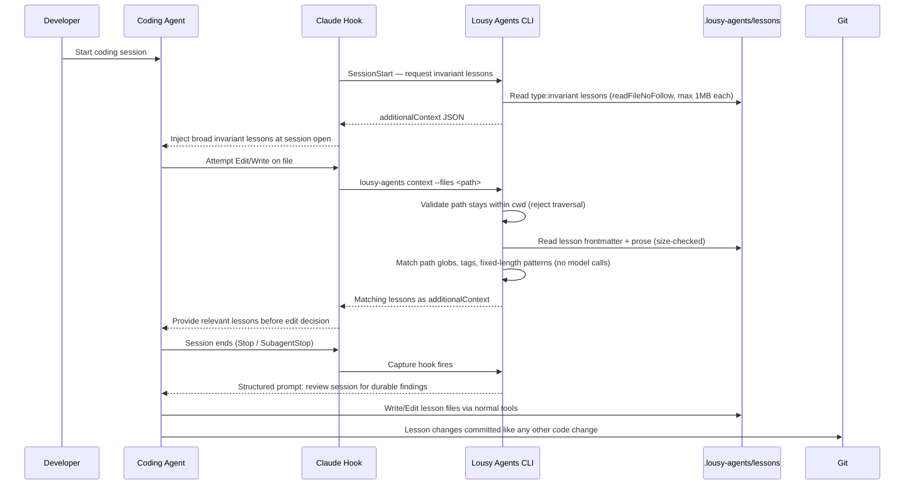

# Feature: Lesson Capture and Context Injection

## Problem Statement

AI coding agents repeat mistakes, forget project-specific conventions, and lose hard-won findings when sessions end. There is no mechanism for agents to accumulate durable knowledge from their own work, nor for that knowledge to be surfaced deterministically during future edits. Without a committed, auditable lesson store and a passive runtime injection loop, every session starts from scratch.

## Personas

| Persona | Impact | Notes |
| --- | --- | --- |
| AI Coding Agent | Positive | Receives relevant lessons before edits; can author new lessons inline |
| Vibe Coder (software engineer learning AI-assisted development) | Positive | Lessons improve agent reliability without manual triage effort |
| Platform Engineer | Positive | Lessons are committed, reviewable, and auditable through normal Git workflow |

## Value Assessment

- **Primary value**: Future — agents accumulate knowledge across sessions, reducing repeated mistakes and cutting debugging time over time.
- **Secondary value**: Efficiency — lesson injection is deterministic and passive; no developer intervention required during the hot path.
- **Secondary value**: Customer — agents produce more reliable code aligned with project-specific invariants, increasing confidence in AI-assisted development.

## User Stories

### Story: Lesson Injection Before File Edits

As a **Vibe Coder**,
I want **relevant lessons injected before an agent edits a file**,
so that I can **reduce repeated mistakes without manually reviewing project conventions before each session**.

#### Acceptance Criteria

- When an agent attempts to edit or write a file, the PreToolUse hook shall invoke `lousy-agents context --files <path>` and return matching lessons as `additionalContext`.
- When no lessons match the file, the context command shall return a valid empty JSON result without error.
- The context command shall not perform model calls, embedding similarity, or LLM-mediated relevance scoring.
- When a SessionStart hook fires, the context command shall return all lessons with `type: invariant` without requiring a `--files` path argument.
- If lesson files contain invalid frontmatter, then the context command shall skip those files, log a warning, and continue processing remaining lessons without crashing the hook.
- If a `--files` path resolves outside the current working directory, then the context command shall reject the path with a boundary-safe containment check (e.g., `const rel = path.relative(cwd, file); rel.startsWith('..') || path.isAbsolute(rel)` — the `path.isAbsolute` guard handles Windows paths on different drive letters where `path.relative` returns an absolute path rather than a `..`-prefixed one; `rel === ''` means file equals cwd and shall be treated as a valid in-bounds path) and exit non-zero.
- If the `.lousy-agents/lessons/` directory cannot be read for any reason (missing, not a directory, permission denied), the context command shall return an empty `context` array and exit zero rather than crashing the PreToolUse hook.
- When a lesson's `triggers.tags` array contains a value matching any forward-slash-separated path segment OR the file extension of the file under edit, the context command shall include that lesson in `additionalContext`. For `src/rules.ts`, testable segments are `src`, `rules.ts`, and `ts`.

---

### Story: Inline Lesson Capture at Session End

As a **Vibe Coder**,
I want **the agent to capture durable lessons from its own session findings**,
so that I can **accumulate project-specific knowledge without a separate triage or authoring step**.

#### Acceptance Criteria

- When a Stop or SubagentStop hook fires, the capture script shall provide the active agent a structured prompt to review recent session context for findings worth capturing.
- When the agent captures a finding, the agent shall write or update lesson files at `.lousy-agents/lessons/<slug>.md` using normal Write/Edit operations.
- The capture script shall not directly create lesson files on the agent's behalf.
- The runtime system shall remain passive for lesson authoring and shall not expose a custom lesson-authoring API.
- When a new lesson is written, the resulting file shall conform to the documented frontmatter schema.

---

### Story: Lesson Schema Validation

As a **Platform Engineer**,
I want **committed lessons validated against a documented schema**,
so that I can **catch malformed lessons before they silently fail in the injection runtime**.

#### Acceptance Criteria

- When a user runs `lousy-agents lint lessons`, the CLI shall read `.lousy-agents/lessons/` and validate each file's frontmatter.
- When a lesson file has invalid frontmatter, the linter shall report the file path and the specific validation reason.
- If any lesson file is invalid, then `lousy-agents lint lessons` shall exit non-zero.
- If all lesson files are valid, then `lousy-agents lint lessons` shall exit zero.
- If `.lousy-agents/lessons/` does not exist, then the linter shall report that no lessons are configured, exit zero, and create no hidden state.
- If a lesson specifies any `type` other than `invariant` or `pattern`, then the linter shall report a schema validation error.
- If a lesson `slug` contains path separators (`/`, `\`) or dot-dot sequences (`..`), then the linter shall reject the lesson with a path traversal validation error.

---

### Story: Hook Initialization

As a **Vibe Coder**,
I want **a single command to wire the lesson lifecycle into my Claude Code session**,
so that I can **enable lesson injection and capture without manually editing hook configuration**.

#### Acceptance Criteria

- When a user runs `lousy-agents init-hooks`, the CLI shall configure a project-scoped PreToolUse hook for Edit and Write operations.
- When a user runs `lousy-agents init-hooks`, the CLI shall configure a Stop or SubagentStop capture hook.
- Where SessionStart support is enabled, `lousy-agents init-hooks` shall configure a SessionStart hook for broad invariant injection.
- If a `.claude/settings.json` file already exists, then `lousy-agents init-hooks` shall preserve unrelated existing settings.
- If hook entries for the same tool and event already exist in `.claude/settings.json`, then `lousy-agents init-hooks` shall not overwrite them unless `--force` is passed.

---

## Design

> Refer to `.github/copilot-instructions.md` for technical standards.

### Architecture Commitment

The v1 system makes the following load-bearing decisions (documented in `DESIGN.md`):

- **Storage**: Lessons live at `.lousy-agents/lessons/<slug>.md`. One file per lesson. Committed to the repo. Git is the audit trail.
- **Lesson types**: Exactly two — `invariant` (project-scoped, fire broadly) and `pattern` (file-specific recurring concerns). No third type in v1.
- **Authorship**: Agents write lessons via normal Write/Edit tools. No custom MCP authoring API. Schema changes are documentation changes.
- **Capture trigger**: Stop/SubagentStop hook prompts the active agent. The agent decides what to capture and writes files. The runtime stays passive.
- **Injection**: PreToolUse hook for Edit/Write calls `lousy-agents context --files <path>`. SessionStart hook injects invariants at session open.
- **Matching**: Path globs, tag matches, and literal substring search against file content only. No regex matching on file content. No model calls in PreToolUse.

#### Error Behavior Policy

Each component has an explicit fail-open or fail-closed stance. Reviewers should treat any deviation from this table as a bug:

| Component | Stance | Rationale |
| --- | --- | --- |
| `lousy-agents context --files` | **Fail-open** — invalid/oversized lesson files skip with a warning; unreadable lessons directory returns empty result and exits zero | Crashing the hook blocks the agent entirely; partial injection is always preferable to blocking |
| `lousy-agents lint lessons` | **Fail-closed** — any invalid lesson → exit non-zero | Validation must be strict; a silent pass would mask broken lessons reaching the runtime |
| `lousy-agents init-hooks` | **Fail-closed** — any settings read/write or parse error → exit non-zero | Hook misconfiguration silently breaks the lifecycle; fail loudly |
| `lousy-agents capture` | **Fail-closed** — absent or unparseable hook input → exit non-zero | A silent failure could cause lesson loss with no indication to the developer |

### Lesson Frontmatter Schema

```yaml
---
slug: fail-closed-default
title: Use fail-closed defaults for policy decisions
type: invariant  # or "pattern"
created: 2026-05-02
revised: 2026-05-02
fire_count: 0
last_fired: null
provenance:
  - pr: 234
    finding_id: f-2026-05-02-001
    facet: "deny rules win over allow"
triggers:
  paths: ["src/policy/**"]
  tags: ["policy", "decision", "deny"]
  patterns: ["fail-closed", "return true"]
---
```

**Slug format constraint**: slugs must match `^[a-z0-9-]+$`. Path separators and dot-dot sequences are invalid. Malformed slugs will cause lesson rejection by the linter; the runtime context gateway shall skip invalid lesson files with a warning and continue.

**Pattern length constraint**: each entry in `triggers.patterns` must not exceed 200 characters. Patterns are treated as literal substrings for matching — never as regular expressions. The matching implementation shall use linear string search (e.g., `String.prototype.includes()`) and must not use regex on untrusted file content to prevent catastrophic backtracking.

**File size constraint**: lesson files must not exceed 1MB. The lesson gateway shall reject files larger than this limit before parsing YAML to prevent anchor-bomb OOM.

The body is human-readable markdown prose: the rule, when it applies, examples of correct application, and edge cases.

### Components Affected

- `packages/core/src/entities/lesson.ts` — Plain TypeScript types for `Lesson`, `LessonType`, `LessonTriggers`, `LessonProvenance` (no framework imports)
- `packages/core/src/use-cases/` — Lesson validation schema (Zod), trigger matching, hook config generation, capture prompt logic
- `packages/core/src/gateways/` — Lesson file reading (using `readFileNoFollow()`), hook config file read/write
- `packages/cli/src/commands/` — CLI command handlers: `lint-lessons`, `context`, `init-hooks`, `capture`
- `.lousy-agents/lessons/` — Seed lessons from shadow experiment
- `DESIGN.md` — v1 architectural contract
- `.claude/settings.json` — Project-scoped hook wiring (generated by `init-hooks`)

### Dependencies

- `zod` — lesson Zod schema in use-case layer (already pinned in workspace)
- **Frontmatter parser**: Do not add `gray-matter` or any new frontmatter parser without explicit approval. Before Task 4 begins, identify whether an existing YAML parser (e.g., `yaml` package already used in the workspace) can parse frontmatter with a simple fence splitter, or raise this as a **blocking open question** requiring maintainer approval before proceeding.
- Existing file-system utilities: `packages/core/src/gateways/file-system-utils.ts` (`readFileNoFollow()`) — required for all lesson and hook config file reads.
- **Glob library**: Do not add a glob library without explicit approval. Before Task 5 begins, confirm whether `minimatch`, `picomatch`, or an equivalent library is already present in the workspace. If not present, raise as a **blocking open question** requiring maintainer approval before proceeding.

### Glob and Path Matching Semantics

**Library and options**: glob matching uses `minimatch` (or workspace-approved equivalent) with `{ dot: false, nocase: false }` — case-sensitive, does not match dot-prefixed entries unless explicitly specified.

**`**` semantics**: `src/policy/**` matches `src/policy/foo.ts` and `src/policy/foo/bar/baz.ts` — zero or more path segments. Does not match `src/policy/` itself (directory entries are not exposed as file paths).

**Empty trigger arrays**: an empty `triggers.paths`, `triggers.tags`, or `triggers.patterns` means that trigger type does **not** fire for any file. Absence is not a wildcard. A lesson with all three trigger arrays empty matches nothing.

**Tag matching**: lesson tags are tested against the set of forward-slash-separated path segments of the file under edit. For `src/policy/rules.ts`, the testable segments are `src`, `policy`, `rules.ts`, and `ts`. A lesson tag must equal one of these segments exactly (case-sensitive).

**Content pattern matching**: literal substring search (`String.prototype.includes()`) against the full file content string after loading it. Case-sensitive. Patterns exceeding 200 characters are rejected by the schema validator before reaching the matcher.

**Path normalization requirement**: all file paths from CLI arguments or gateway reads must be normalized with `path.resolve()` before any comparison or I/O. The cwd containment check must be boundary-safe (e.g., `const rel = path.relative(cwd, resolvedFilePath); rel.startsWith('..') || path.isAbsolute(rel)` — the `path.isAbsolute` guard handles Windows cross-drive paths where `path.relative` returns an absolute path instead of a `..`-prefixed relative path) to prevent both path traversal and prefix confusion (e.g., `/repo` matching `/repo2`). String `includes('..')` and simple `startsWith` prefix checks are explicitly prohibited for this check — `includes('..')` is insufficient (misses encoded traversal) and incorrect (rejects valid names like `..foo.ts`), while `startsWith` is vulnerable to prefix confusion.

**Windows cross-platform**: before passing any path to glob matching, normalize backslash separators to forward slashes (e.g., `filePath.split(path.sep).join('/')`). Path glob matching is always case-sensitive regardless of the OS filesystem case sensitivity.

### Data Model Changes

Plain TypeScript types (entities layer — no framework imports):

```typescript
// packages/core/src/entities/lesson.ts
export type LessonType = 'invariant' | 'pattern';

export interface LessonTriggers {
  readonly paths: readonly string[];
  readonly tags: readonly string[];
  readonly patterns: readonly string[];
}

export interface LessonProvenance {
  readonly pr: number;
  readonly finding_id: string;
  readonly facet: string;
}

export interface Lesson {
  readonly slug: string;
  readonly title: string;
  readonly type: LessonType;
  readonly created: string;
  readonly revised: string;
  readonly fire_count: number;
  readonly last_fired: string | null;
  readonly provenance: readonly LessonProvenance[];
  readonly triggers: LessonTriggers;
  readonly body: string;
}
```

Zod validation schema (use-case layer — framework imports allowed here):

```typescript
// packages/core/src/use-cases/lesson-schema.ts
import { z } from 'zod';

const SAFE_SLUG = /^[a-z0-9-]+$/;
const MAX_PATTERN_LENGTH = 200;
const MAX_PATTERNS = 50;

export const LessonSchema = z.object({
  slug: z.string().regex(SAFE_SLUG, 'slug must match ^[a-z0-9-]+$'),
  title: z.string().min(1),
  type: z.enum(['invariant', 'pattern']),
  created: z.string(),
  revised: z.string(),
  fire_count: z.number().int().min(0),
  last_fired: z.string().nullable(),
  provenance: z.array(z.object({
    pr: z.number().int(),
    finding_id: z.string(),
    facet: z.string(),
  })),
  triggers: z.object({
    paths: z.array(z.string()),
    tags: z.array(z.string()),
    patterns: z.array(z.string().max(MAX_PATTERN_LENGTH)).max(MAX_PATTERNS),
  }),
});
```

#### Gateway Port Interface

The use-case layer depends on this port; the gateway in `packages/core/src/gateways/` provides the implementation. The port must be defined in `packages/core/src/use-cases/` or `packages/core/src/entities/` — not in the gateway file.

```typescript
// packages/core/src/use-cases/lesson-file-gateway-port.ts
export interface ParsedLesson {
  readonly lesson: Lesson;
  readonly filePath: string;
}

export interface LessonReadError {
  readonly filePath: string;
  readonly reason: string;
}

export interface ReadLessonsResult {
  readonly lessons: readonly ParsedLesson[];
  readonly errors: readonly LessonReadError[];
}

export interface LessonFileGatewayPort {
  readLessons(rootDir: string): Promise<ReadLessonsResult>;
}
```

#### `additionalContext` JSON Shape

> **BLOCKING open question for Task 5**: Confirm the exact field name(s) expected by Claude Code for `additionalContext` hook responses before Task 5 begins. The shape below defines the *lousy-agents* stdout output; field naming must conform to the Claude Code hook protocol once confirmed.

```json
{
  "context": [
    {
      "slug": "fail-closed-default",
      "title": "Use fail-closed defaults for policy decisions",
      "type": "invariant",
      "body": "<lesson prose, truncated to 10 000 characters if longer>"
    }
  ]
}
```

Rules:
- `context` is an empty array (`[]`) when no lessons match — never `null` or absent.
- Lesson body is truncated to 10 000 characters before injection to prevent context-window exhaustion.
- The command exits zero for all non-error conditions, including the no-match case.

### Diagrams

#### Data Flow


#### Sequence Diagram



### Open Questions

- [ ] Should `fire_count` and `last_fired` be auto-updated in PreToolUse, or remain manually maintained to keep the hot path passive and avoid noisy working-tree diffs?
- [ ] **BLOCKING for Task 5**: What is the exact JSON shape expected by Claude Code for `additionalContext` in hook responses? A proposed shape is defined in the Data Model section above; confirm against Claude Code documentation before Task 5 begins.
- [x] ~~Should `lousy-agents context --files` accept comma-separated paths, repeated flags, or both?~~ **Resolved**: `--files` accepts repeated flags only (e.g., `--files path1 --files path2`). No comma-splitting — avoids the need to escape or parse commas in file paths.
- [ ] Which hook takes priority for capture: `SubagentStop`, `Stop`, or both wired independently?
- [ ] **BLOCKING**: Is an existing YAML parser in the workspace sufficient for frontmatter parsing, or is a new dependency required? Do not begin Task 4 until this is resolved with explicit maintainer approval.

---

## Tasks

> Each task is completable in a single coding agent session (~1–3 files, ~200–300 lines changed).
> Complete tasks in order. Each task feeds the next.
> All test fixtures must use Chance.js for generated values. Never hardcode the same value in both test setup and assertions.

### Task 1: Lock v1 Architecture in DESIGN.md

**Objective**: Document the load-bearing v1 decisions before any implementation begins.

**Context**: This is the architectural contract that prevents scope creep. Every subsequent task references it. It must exist and be committed before code is written.

**Affected files**:
- `DESIGN.md`

**Requirements**:
- The document states the storage layout, lesson schema, lesson types, authorship model, capture trigger, injection mechanism, deterministic matching strategy, and v1 out-of-scope list.
- The document is sized to fit on two screens — decisions, not alternatives.
- The document explicitly states: no database, no hidden state, no model calls in PreToolUse, no custom lesson-authoring MCP API.
- The document explicitly states the slug safety constraint (`^[a-z0-9-]+$`), the 200-character pattern limit, and the 1MB lesson file size limit.

**Verification**:
- [ ] `DESIGN.md` exists at the repository root.
- [ ] The document addresses all seven architecture lock decisions.
- [ ] The document states the slug format, pattern length, and file size constraints.
- [ ] `mise run lint` passes.

**Done when**:
- [ ] All verification steps pass.
- [ ] No new errors in affected files.
- [ ] Architecture section in spec is satisfied.
- [ ] Code follows patterns in `.github/copilot-instructions.md`.

---

### Task 2: Define Lesson Entity and Schema

**Depends on**: Task 1

**Objective**: Create plain TypeScript types for the lesson entity and a separate Zod validation schema in the use-case layer.

**Context**: The entities layer must not import frameworks. The Zod schema lives in the use-case layer. All other layers import the plain TypeScript types from entities and the Zod schema from the use-case schema module.

**Affected files**:
- `packages/core/src/entities/lesson.ts` (new) — plain TypeScript types only, no imports
- `packages/core/src/entities/lesson.test.ts` (new)
- `packages/core/src/use-cases/lesson-schema.ts` (new) — Zod schema
- `packages/core/src/use-cases/lesson-schema.test.ts` (new)

**Requirements**:
- `lesson.ts` contains only TypeScript `type` and `interface` declarations. No imports of any kind.
- `lesson-schema.ts` defines the Zod schema using the constraints: slug `^[a-z0-9-]+$`, patterns `max(200)` per entry, patterns array `max(50)`, `type` enum `['invariant', 'pattern']`.
- All required frontmatter fields are covered by the schema.
- Invalid `type` values produce a descriptive Zod error.
- Invalid slugs produce a descriptive Zod error that names the constraint.

**Verification**:
- [ ] `lesson.ts` has zero import statements.
- [ ] Tests cover a valid `invariant` lesson.
- [ ] Tests cover a valid `pattern` lesson.
- [ ] Tests cover rejection of unknown `type`.
- [ ] Tests cover rejection of a slug containing `/`.
- [ ] Tests cover rejection of a slug containing `..`.
- [ ] Tests cover rejection of a pattern exceeding 200 characters.
- [ ] Tests cover missing required fields.
- [ ] `mise run test` passes.
- [ ] `mise run lint` passes.

**Done when**:
- [ ] All verification steps pass.
- [ ] Acceptance criteria: Story 3 (schema validation) partially satisfied.
- [ ] Code follows patterns in `.github/copilot-instructions.md`.

---

### Task 3: Add Seed Lessons

**Depends on**: Task 2

**Objective**: Populate `.lousy-agents/lessons/` with manually seeded lessons from the shadow experiment.

**Context**: The system needs lessons to exist before the runtime can be validated. Seed lessons are the first test of the schema against real content.

**Affected files**:
- `.lousy-agents/lessons/<slug>.md` (minimum three new files, one slug per file)

**Requirements**:
- At least three seed lessons are committed.
- Each uses only `invariant` or `pattern` type.
- Each slug matches `^[a-z0-9-]+$` exactly.
- Each has valid frontmatter and human-readable markdown prose.
- Trigger fields are populated with at least one path, tag, or pattern.
- No single pattern exceeds 200 characters.

**Verification**:
- [ ] Three or more lesson files exist.
- [ ] Each slug matches `^[a-z0-9-]+$`.
- [ ] `mise run lint` passes (markdownlint, yamllint).

**Done when**:
- [ ] All verification steps pass.
- [ ] Lessons cover at least one `invariant` and one `pattern` type.

---

### Task 4: Implement `lousy-agents lint lessons`

**Depends on**: Tasks 2 and 3

**Objective**: Validate lesson files against the schema and report errors with actionable messages.

**Context**: Validation is the first executable runtime contract. Every other component trusts lesson metadata to be well-formed; the linter enforces that trust. All file reads must use `readFileNoFollow()` with the 1MB size limit.

**Affected files**:
- `packages/core/src/gateways/lesson-file-gateway.ts` (new)
- `packages/core/src/gateways/lesson-file-gateway.test.ts` (new)
- `packages/core/src/use-cases/lint-lessons-use-case.ts` (new)
- `packages/core/src/use-cases/lint-lessons-use-case.test.ts` (new)
- `packages/cli/src/commands/lint-lessons.ts` (new)
- `packages/cli/src/commands/lint-lessons.test.ts` (new)

**Requirements**:
- Gateway reads `.lousy-agents/lessons/` relative to the resolved project root (not raw `process.cwd()` string).
- Before calling `readdir()`, the gateway shall call `lstat()` on `.lousy-agents/lessons/` and reject the path with a non-zero exit if the entry is a symlink (to prevent directory-level symlink redirection to arbitrary paths).
- All file reads use `readFileNoFollow()` from `packages/core/src/gateways/file-system-utils.ts` with a 1MB `maxBytes` limit.
- Files exceeding 1MB are reported as errors, not silently skipped.
- Frontmatter is validated using `LessonSchema` from `lesson-schema.ts`.
- Reports invalid files with file path and specific validation reason.
- Exits non-zero if any lesson is invalid.
- Exits zero if all lessons are valid.
- Reports gracefully if the directory does not exist: exits zero with an informational message stating no lessons are configured. Does not create hidden state.

**Verification**:
- [ ] Tests cover a directory with all-valid lessons (exit 0).
- [ ] Tests cover a lesson with an invalid `type` (exit 1, message includes file path).
- [ ] Tests cover a lesson with a slug containing `/` (exit 1, message includes slug constraint).
- [ ] Tests cover a lesson with missing required fields (exit 1, message includes field name).
- [ ] Tests cover malformed YAML frontmatter (exit 1).
- [ ] Tests cover a file exceeding 1MB (exit 1, message includes file path).
- [ ] Tests cover a non-existent `.lousy-agents/lessons/` directory.
- [ ] Tests cover `.lousy-agents/lessons/` being a symlink (exit 1 with a descriptive error).
- [ ] `mise run test` passes.
- [ ] `mise run lint` passes.

**Done when**:
- [ ] All verification steps pass.
- [ ] Acceptance criteria: Story 3 fully satisfied.
- [ ] Code follows patterns in `.github/copilot-instructions.md`.

---

### Task 5: Implement `lousy-agents context --files`

**Depends on**: Task 4

**Objective**: Return matching lessons as deterministic, model-free JSON for hook `additionalContext`.

**Context**: This is the hot-path runtime feature. It must be fast, debuggable, and contain no model calls. All file paths from CLI args must be validated to stay within the working directory before any I/O.

**Affected files**:
- `packages/core/src/use-cases/lesson-context-use-case.ts` (new)
- `packages/core/src/use-cases/lesson-context-use-case.test.ts` (new)
- `packages/cli/src/commands/context.ts` (new)
- `packages/cli/src/commands/context.test.ts` (new)

**Requirements**:
- Accepts one or more file paths via repeated `--files` flags (e.g., `--files path1 --files path2`). Comma-separated values in a single flag are not supported.
- When invoked without any `--files` arguments, returns all lessons with `type: invariant` without performing path, tag, or content matching. This is the SessionStart injection path.
- Before any file I/O, validates each `--files` path using `path.resolve()` and applies a boundary-safe containment check: compute `const rel = path.relative(resolvedCwd, resolvedPath)` and reject if `rel.startsWith('..')` or `path.isAbsolute(rel)` — this prevents both path traversal and prefix-confusion attacks (e.g., `/repo` incorrectly matching `/repo2`). String `includes('..')` and simple `startsWith` prefix checks must not be used for this check.
- File paths are normalized to forward-slash separators before glob matching.
- Reads committed lesson files using the gateway from Task 4 (including size limit enforcement).
- Matches lessons by path globs, tag intersection, and literal substring content matching using the semantics defined in the Design section. Pattern matching uses `String.prototype.includes()` or equivalent linear-time search. Regex matching against file content is explicitly prohibited.
- Empty trigger arrays (`paths: []`, `tags: []`, `patterns: []`) do not match any file — absence is not a wildcard.
- Lesson body content is truncated to 10 000 characters before inclusion in the `additionalContext` output.
- Returns JSON conforming to the `additionalContext` shape defined in the Data Model section.
- Performs no model calls, embedding lookup, or LLM relevance scoring.
- Returns a valid empty `context` array (exits zero) when no lessons match.
- Returns a valid empty `context` array (exits zero) when the lessons directory cannot be read.
- If individual lesson files are invalid or oversized, skips them with a logged warning and continues.

**Verification**:
- [ ] Tests cover a path-glob match (lesson fires for matching path).
- [ ] Tests cover a tag match (lesson fires when a tag equals a path segment of the `--files` path).
- [ ] Tests cover a content-pattern match (literal substring found in file content).
- [ ] Tests cover a non-matching lesson being excluded.
- [ ] Tests cover empty trigger arrays not matching any file.
- [ ] Tests cover empty match result returning `{ context: [] }` and exiting zero.
- [ ] Tests cover multiple `--files` flags producing a merged match result.
- [ ] Tests cover a `--files` path with `..` segments that resolves outside cwd being rejected with exit 1 (e.g., `../../etc/passwd`). A path with `..` segments that still resolves inside cwd (e.g., `src/../lib/safe.ts`) shall not be rejected.
- [ ] Tests cover a `--files` path resolving outside cwd being rejected with exit 1.
- [ ] Tests cover path normalization: a `--files` path with backslash separators resolves correctly against cwd.
- [ ] Tests cover path normalization: a lesson with path glob `src/policy/**` matches a `--files` path with backslash separators after normalization.
- [ ] Tests cover lesson body exceeding 10 000 characters being truncated in JSON output.
- [ ] Tests cover unreadable lessons directory returning `{ context: [] }` and exiting zero.
- [ ] Tests cover invoking the command without `--files` returning all `invariant` lessons (SessionStart path).
- [ ] Output is valid JSON on stdout conforming to the shape in the Data Model section.
- [ ] `mise run test` passes.
- [ ] `mise run lint` passes.

**Done when**:
- [ ] All verification steps pass.
- [ ] Acceptance criteria: Story 1 (context injection) partially satisfied.
- [ ] Code follows patterns in `.github/copilot-instructions.md`.

---

### Task 6: Implement `lousy-agents init-hooks`

**Depends on**: Task 5

**Objective**: Generate or update project-scoped Claude hook wiring for lesson injection and capture.

**Context**: The feature is only useful when wired into the agent lifecycle. This command bridges the CLI and the Claude Code session. Existing hook entries must not be overwritten without `--force`.

**Affected files**:
- `packages/core/src/gateways/hook-config-gateway.ts` (new or extended)
- `packages/core/src/gateways/hook-config-gateway.test.ts` (new)
- `packages/core/src/use-cases/init-hooks-use-case.ts` (new)
- `packages/core/src/use-cases/init-hooks-use-case.test.ts` (new)
- `packages/cli/src/commands/init-hooks.ts` (new)
- `packages/cli/src/commands/init-hooks.test.ts` (new)

**Requirements**:
- Configures PreToolUse hook for Edit and Write operations invoking `lousy-agents context --files <path>`.
- Configures Stop or SubagentStop capture hook.
- Supports optional SessionStart hook for broad invariant injection. The SessionStart hook shall invoke `lousy-agents context` without any `--files` arguments to return all `invariant` lessons.
- Hook config gateway reads `.claude/settings.json` using `readFileNoFollow()`.
- Preserves unrelated existing settings in `.claude/settings.json` if the file already exists.
- Does not overwrite existing hook entries for the same tool/event unless `--force` is passed.
- If `.claude/settings.json` contains malformed JSON, exits non-zero with a descriptive error.
- The hook config gateway shall parse `.claude/settings.json` using `JSON.parse()` followed by prototype-safe object construction. Any object at any nesting level containing `__proto__`, `constructor`, or `prototype` as keys shall be rejected with a non-zero exit and descriptive error.

**Verification**:
- [ ] Tests cover creating hook config when no file exists.
- [ ] Tests cover merging into existing settings without destroying unrelated config.
- [ ] Tests cover refusing to overwrite existing hook entries without `--force`.
- [ ] Tests cover overwriting existing hook entries when `--force` is passed.
- [ ] Tests cover PreToolUse wiring for Edit.
- [ ] Tests cover PreToolUse wiring for Write.
- [ ] Tests cover Stop or SubagentStop capture wiring.
- [ ] Tests cover SessionStart invariant wiring.
- [ ] Tests cover malformed existing JSON causing exit 1 with an error message.
- [ ] Tests cover a settings file containing a top-level `__proto__` key being rejected with exit 1.
- [ ] Tests cover a settings file containing a nested `__proto__` key (e.g., within a nested object) being rejected with exit 1.
- [ ] `mise run test` passes.
- [ ] `mise run lint` passes.

**Done when**:
- [ ] All verification steps pass.
- [ ] Acceptance criteria: Story 4 fully satisfied.
- [ ] Code follows patterns in `.github/copilot-instructions.md`.

---

### Task 7: Implement Capture Prompt Script

**Depends on**: Task 6

**Objective**: Prompt the active agent at session end to author durable lessons from its own session findings.

**Context**: The authorship boundary is critical. The capture script constructs and delivers a structured prompt; the agent authors the lessons. The runtime does not create lesson files directly.

**Affected files**:
- `packages/core/src/use-cases/capture-prompt-use-case.ts` (new)
- `packages/core/src/use-cases/capture-prompt-use-case.test.ts` (new)
- `packages/cli/src/commands/capture.ts` (new)
- `packages/cli/src/commands/capture.test.ts` (new)

**Requirements**:
- Script reads hook input available from Stop/SubagentStop context.
- Hook input fields used in prompt construction must be sanitized: raw session text must not be embedded verbatim into the prompt string. Only structured metadata fields (e.g., tool name, resolved file path) may be interpolated into the prompt, and each such field must be validated as a safe printable string (no control characters, reasonable length limit) before interpolation.
- If hook input is absent or cannot be parsed, the capture script shall exit non-zero with a descriptive error. It shall not produce a partial or silent prompt.
- Produces a structured prompt instructing the agent to review recent session findings.
- Prompt includes the documented lesson schema requirements, including the slug safety constraint.
- Prompt instructs the agent to check for existing lessons before creating new ones and to update when a finding extends prior knowledge.
- Script does not directly create or write lesson files.
- Maintains the architectural boundary: the runtime is passive for lesson authoring.

**Verification**:
- [ ] Tests cover prompt output including the schema structure.
- [ ] Tests cover prompt output including the slug format constraint.
- [ ] Tests cover prompt instructing agent to check for existing lessons before creating new ones.
- [ ] Tests confirm no lesson file is created by the capture script itself.
- [ ] Tests cover absent or unparseable hook input causing exit 1 with a descriptive error.
- [ ] Tests cover that raw session text from hook input is not present verbatim in the prompt output.
- [ ] `mise run test` passes.
- [ ] `mise run lint` passes.

**Done when**:
- [ ] All verification steps pass.
- [ ] Acceptance criteria: Story 2 fully satisfied.
- [ ] Code follows patterns in `.github/copilot-instructions.md`.

---

### Task 8: End-to-End Walking Skeleton Validation

**Depends on**: Tasks 1–7

**Objective**: Demonstrate the full lesson lifecycle loop against the seed lessons.

**Context**: Validates the core v1 claim — that lessons can be linted, injected deterministically, and captured inline — without any v2 features.

**Affected files**:
- Smoke tests or integration tests (new)
- CLI registration/index updates if any commands are not yet wired

**Requirements**:
- A seeded lesson can be linted.
- A matching file path returns that lesson through `lousy-agents context`.
- A path traversal attempt via `--files` is rejected.
- Hook config can be initialized without error.
- The capture prompt can be produced from hook input.
- No v1 out-of-scope features are present in the implementation.

**Verification**:
- [ ] `lousy-agents lint lessons` exits 0 for seed lessons.
- [ ] `lousy-agents context --files <matching-path>` returns the expected lesson in JSON.
- [ ] `lousy-agents context --files ../../etc/passwd` exits non-zero with a path traversal error.
- [ ] `lousy-agents init-hooks` produces the expected hook wiring in `.claude/settings.json`.
- [ ] `mise run ci` passes (lint → test → smoke-test).
- [ ] `npm run build` passes.

**Done when**:
- [ ] All verification steps pass.
- [ ] All acceptance criteria across all four stories are satisfied.
- [ ] No warnings or errors were suppressed to reach exit 0.

---

## Out of Scope

- `try-lesson` simulation command
- Retro or triage UI
- Model-assisted lesson clustering or drafting as a separate feature
- Model-assisted relevance scoring in the injection hot path
- Embedding similarity
- GitHub PR integration
- GitHub Actions workflow log integration
- External lesson sources
- Multi-repo lesson sharing
- Telemetry, analytics, or lesson scoring
- Automatic mutation of `fire_count` or `last_fired` in the hot path

## Future Considerations

- Auto-updating `fire_count` and `last_fired` once the passive hot path is validated
- `lousy-agents try-lesson <slug> --files <path>` to simulate what would fire on a given file
- Retro command for bulk lesson authoring after a multi-session project phase
- Multi-repo lesson sharing via a shareable `c12` configuration
- GitHub PR comment integration as an additional provenance source
