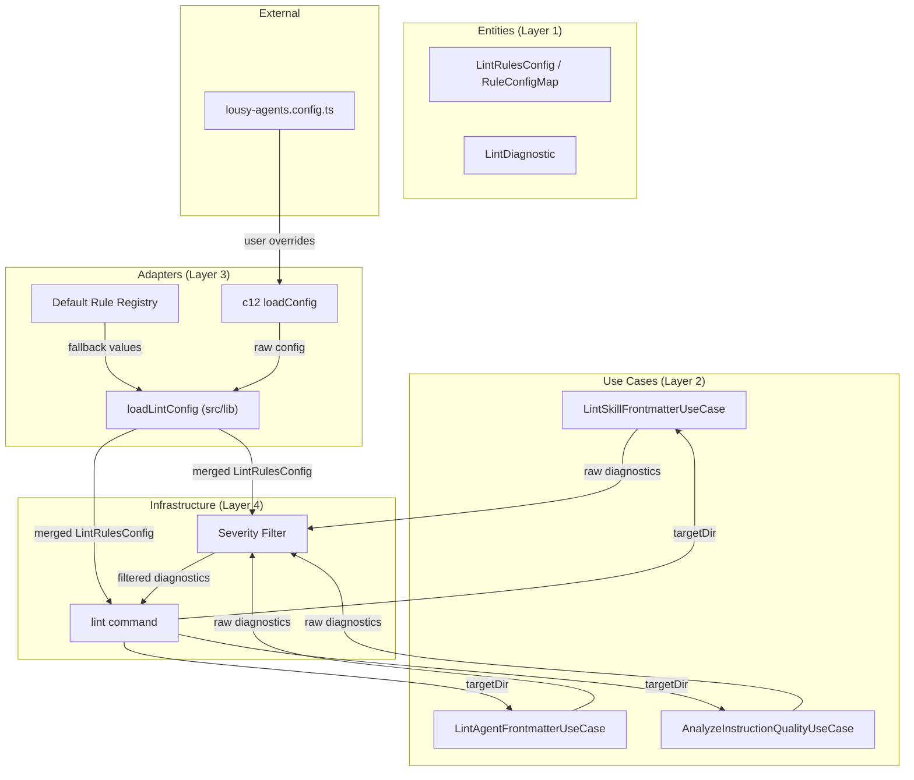
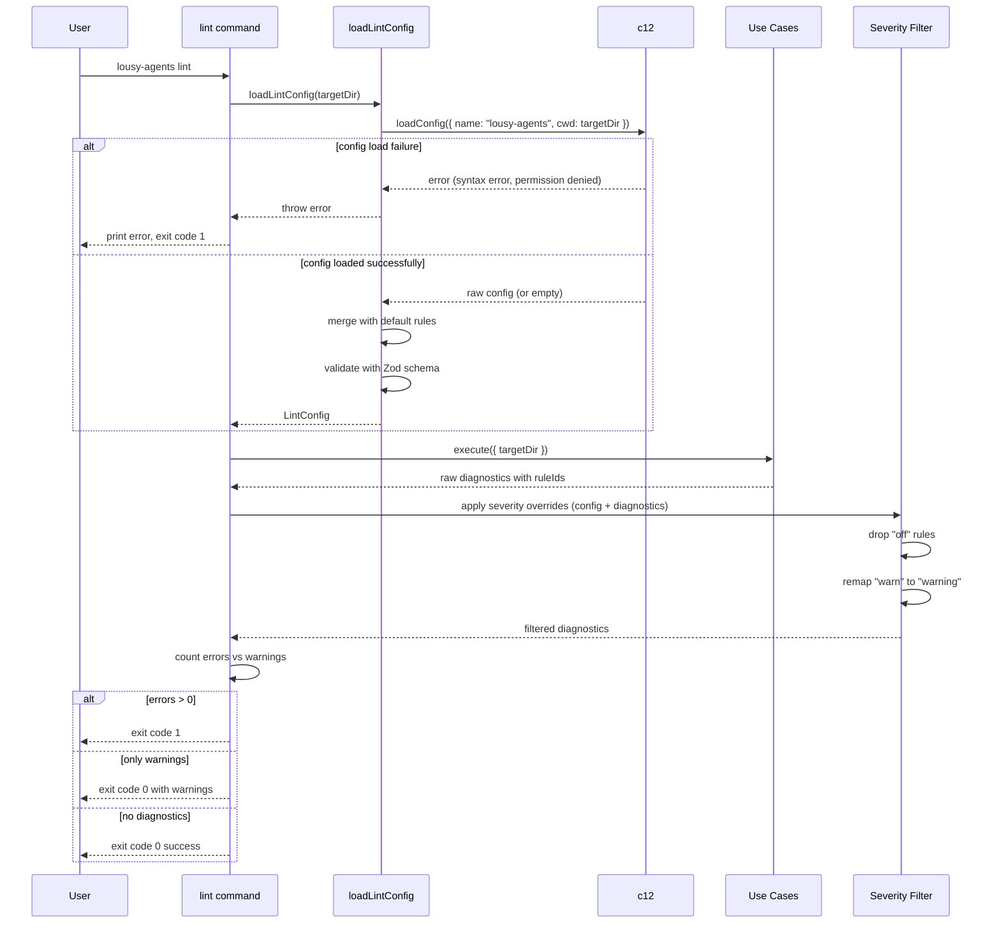

# Feature: Lint Configuration

## Problem Statement

The lousy-agents lint command currently treats all lint rules with fixed severity levels — errors always fail the run, warnings always display but pass, and there is no way to disable rules. Teams have different standards and may want to suppress certain rules, promote warnings to errors, or demote errors to warnings. Without a configuration mechanism, teams must either accept all rules as-is or avoid the lint command entirely.

## Personas

| Persona | Impact | Notes |
|---------|--------|-------|
| Software Engineer Learning Vibe Coding | Positive | Primary user — can tailor lint rules to their project's needs and suppress noise |
| Team Lead | Positive | Can define a shared lint configuration that enforces team-wide standards |

## Value Assessment

- **Primary value**: Customer — Increases retention by letting teams customize lint behavior to match their workflows
- **Secondary value**: Efficiency — Reduces time spent triaging irrelevant lint warnings or working around hardcoded rules

## User Stories

### Story 1: Configure Rule Severity

As a **Software Engineer Learning Vibe Coding**,
I want **to set each lint rule to error, warn, or off in a configuration file**,
so that I can **control which rules cause lint failures, which produce warnings, and which are ignored**.

#### Acceptance Criteria

- When the user creates a `lousy-agents.config.ts` (or any c12-supported config file) with rule overrides, the lint command shall use those severity levels instead of defaults
- When a rule is set to `"off"`, the lint command shall skip the check and produce no diagnostic for that rule
- When a rule is set to `"warn"`, the lint command shall emit a warning diagnostic but shall not cause a non-zero exit code
- When a rule is set to `"error"`, the lint command shall emit an error diagnostic and cause a non-zero exit code
- The lint configuration shall be loaded from the target directory using c12 with the name `"lousy-agents"` and `cwd` set to the target directory
- If the configuration file has a syntax error or validation failure, then the lint command shall log the error to the console and exit with a non-zero exit code
- If the configuration file cannot be loaded due to permission denied, then the lint command shall log the error to the console and exit with a non-zero exit code

#### Notes

- c12 supports multiple config file formats: `.lousy-agentsrc.json`, `lousy-agents.config.ts`, `lousy-agents.config.mjs`, etc.
- The existing c12 config name `"lousy-agents"` is already used by the init command; lint config should be a nested key within the same config namespace
- Configuration files (`.ts`, `.mjs`) execute code at load time. Documentation shall warn users that config files must be treated as executable code and reviewed with the same rigor as source code. The lint command shall only load configuration from the target directory being linted, never from user-supplied remote paths

---

### Story 2: Organize Rules by Target

As a **Team Lead**,
I want **rules organized by their target category (agents, instructions, skills)**,
so that I can **quickly find and configure rules for a specific area**.

#### Acceptance Criteria

- The configuration shall group rules under their target namespace: `agents`, `instructions`, `skills`
- When a rule is configured under its target namespace (e.g., `agents: { "agent/missing-name": "off" }`), the lint command shall apply the configured severity
- If a rule ID is not present in the configuration, then the lint command shall use the default severity for that rule

#### Notes

- Current rule ID prefixes already match targets: `agent/*`, `instruction/*`, `skill/*`
- Skill rules currently lack `ruleId` fields; this feature requires adding them

---

### Story 3: Disable a Rule

As a **Software Engineer Learning Vibe Coding**,
I want **to disable a lint rule so that the lint command ignores the check entirely**,
so that I can **reduce noise from rules that do not apply to my project**.

#### Acceptance Criteria

- When a rule is set to `"off"` in the configuration, the lint command shall not emit any diagnostic for that rule
- When all rules for a target are set to `"off"`, the lint command shall still discover files for that target but produce no diagnostics
- If all rules across all targets are set to `"off"`, then the lint command shall exit with code 0

---

### Story 4: Mixed Severity Configuration

As a **Software Engineer Learning Vibe Coding**,
I want **to set different rules to different severities in the same configuration**,
so that I can **have some rules fail the build while others just warn**.

#### Acceptance Criteria

- When rules are configured with a mix of `"error"`, `"warn"`, and `"off"` severities, the lint command shall apply each rule's configured severity independently
- While only warning-level diagnostics are emitted (no errors), the lint command shall exit with code 0
- When at least one error-level diagnostic is emitted, the lint command shall exit with a non-zero exit code
- The lint summary output shall reflect the effective severity counts based on configuration

---

### Story 5: Default Configuration

As a **Software Engineer Learning Vibe Coding**,
I want **the lint command to work with sensible defaults when no configuration file exists**,
so that I can **start using lint immediately without creating a config file**.

#### Acceptance Criteria

- When no configuration file is found, the lint command shall use default severity levels for all rules
- The default severity for each rule shall match the current hardcoded behavior (errors remain errors, warnings remain warnings)
- When a configuration file is found but does not include a `lint` key, the lint command shall use default severity levels

---

## Design

> Refer to `.github/copilot-instructions.md` for technical standards.

### Components Affected

- `src/entities/lint-rules.ts` (new) — Define all known rule IDs with default severities, organized by target
- `src/use-cases/lint-skill-frontmatter.ts` — Add `ruleId` to skill diagnostics so results can be mapped to rule configuration
- `src/use-cases/lint-agent-frontmatter.ts` — Ensure diagnostics include `ruleId` so results can be mapped to rule configuration
- `src/use-cases/analyze-instruction-quality.ts` — Ensure diagnostics include `ruleId` so results can be mapped to rule configuration
- `src/lib/lint-config.ts` (new) — Load lint configuration from c12 and merge it with default severities
- `src/commands/lint.ts` — Load lint configuration, invoke use cases, and apply severity-based filtering and failure behavior to lint results

### Dependencies

- `c12` — Configuration loading (already installed)
- `zod` — Config schema validation (already installed)

### Data Model Changes

New configuration schema (loaded via c12):

```typescript
// lousy-agents.config.ts example
export default {
  lint: {
    rules: {
      agents: {
        "agent/missing-frontmatter": "error",
        "agent/invalid-frontmatter": "error",
        "agent/missing-name": "error",
        "agent/invalid-name-format": "warn",
        "agent/name-mismatch": "error",
        "agent/missing-description": "error",
        "agent/invalid-description": "error",
        "agent/invalid-field": "warn",
      },
      instructions: {
        "instruction/parse-error": "warn",
        "instruction/command-not-in-code-block": "warn",
        "instruction/command-outside-section": "off",
        "instruction/missing-error-handling": "warn",
      },
      skills: {
        "skill/invalid-frontmatter": "error",
        "skill/missing-frontmatter": "error",
        "skill/missing-name": "error",
        "skill/invalid-name-format": "error",
        "skill/name-mismatch": "error",
        "skill/missing-description": "error",
        "skill/invalid-description": "error",
        "skill/missing-allowed-tools": "warn",
      },
    },
  },
};
```

New entity types:

```typescript
/** Valid severity values for rule configuration */
export type RuleSeverityConfig = "error" | "warn" | "off";

/** A map of rule IDs to their configured severity */
export type RuleConfigMap = Record<string, RuleSeverityConfig>;

/** Lint configuration organized by target */
export interface LintConfig {
  readonly rules: {
    readonly agents: RuleConfigMap;
    readonly instructions: RuleConfigMap;
    readonly skills: RuleConfigMap;
  };
}
```

**Severity mapping**: The `RuleSeverityConfig` type uses `"warn"` (config-facing); the existing `LintSeverity` type uses `"warning"` (diagnostic-facing). The severity filter in the adapter layer (`src/commands/lint.ts`) shall map `"warn"` → `"warning"` when remapping diagnostic severity, and `"off"` → exclusion (diagnostic dropped). In clean architecture, translating between external configuration vocabulary and internal domain vocabulary is an adapter responsibility — this keeps entity types stable with no knowledge of configuration format.

### Diagrams

#### Data Flow Diagram



#### Sequence Diagram



### Open Questions

- [x] How should the lint command handle config load failures (syntax error, permission denied)? **Resolved**: Config load failures (syntax errors, permission denied, validation failures) shall cause the lint command to print errors to the console and exit with code 1.
- [x] Should `"warn"` → `"warning"` mapping be explicit in the entity or adapter layer? **Resolved**: The mapping belongs in the adapter layer (`src/commands/lint.ts`). In clean architecture, translating between external configuration vocabulary (`"warn"`) and internal domain vocabulary (`"warning"`) is an adapter responsibility. Entity types remain stable with no knowledge of configuration format.

---

## Tasks

> Each task should be completable in a single coding agent session.
> Tasks are sequenced by dependency. Complete in order unless noted.

### Task 1: Define lint rule registry entity

**Objective**: Create an entity that defines all known lint rule IDs with their default severities, organized by target

**Context**: This provides the foundation for configuration — every rule must have a known ID and a default severity so the system works without a config file

**Affected files**:
- `src/entities/lint-rules.ts` (new)
- `src/entities/lint-rules.test.ts` (new)

**Requirements**:
- The entity shall export a `RuleSeverityConfig` type with values `"error"`, `"warn"`, `"off"`
- The entity shall export a `RuleConfigMap` type mapping rule IDs to severity
- The entity shall export a `LintRulesConfig` interface with `agents`, `instructions`, and `skills` fields each containing a `RuleConfigMap`
- The entity shall export a `DEFAULT_LINT_RULES` constant with all known rule IDs and their default severities
- Default severities shall match current behavior: agent rules default to `"error"` (except `agent/invalid-field` defaults to `"warn"`), instruction rules default to `"warn"`, skill required field rules default to `"error"`, skill recommended field rules default to `"warn"`

**Verification**:
- [x] `npm test src/entities/lint-rules.test.ts` passes
- [x] `npx biome check src/entities/lint-rules.ts` passes
- [x] All known rule IDs are present in defaults

**Done when**:
- [x] All verification steps pass
- [x] No new errors in affected files
- [x] Entity has zero imports from other layers
- [x] Acceptance criteria from Story 2 (rule organization) and Story 5 (defaults) satisfied
- [x] Code follows patterns in `.github/copilot-instructions.md`

---

### Task 2: Add `ruleId` to skill lint diagnostics

**Objective**: Add `ruleId` fields to skill lint diagnostics so they can be matched against configuration rules

**Context**: Agent and instruction diagnostics already have `ruleId` fields, but skill diagnostics do not. This is required for rule-level configuration to work across all targets.

**Depends on**: Task 1

**Affected files**:
- `src/use-cases/lint-skill-frontmatter.ts`
- `src/use-cases/lint-skill-frontmatter.test.ts`

**Requirements**:
- When the skill linter emits a diagnostic for invalid frontmatter, it shall include `ruleId: "skill/invalid-frontmatter"`
- When the skill linter emits a diagnostic for missing frontmatter, it shall include `ruleId: "skill/missing-frontmatter"`
- When the skill linter emits a diagnostic for a missing name, it shall include `ruleId: "skill/missing-name"`
- When the skill linter emits a diagnostic for an invalid name format, it shall include `ruleId: "skill/invalid-name-format"`
- When the skill linter emits a diagnostic for a name mismatch, it shall include `ruleId: "skill/name-mismatch"`
- When the skill linter emits a diagnostic for a missing description, it shall include `ruleId: "skill/missing-description"`
- When the skill linter emits a diagnostic for an invalid description, it shall include `ruleId: "skill/invalid-description"`
- When the skill linter emits a diagnostic for a missing recommended field, it shall include `ruleId: "skill/missing-allowed-tools"`

**Verification**:
- [x] `npm test src/use-cases/lint-skill-frontmatter.test.ts` passes
- [x] `npx biome check src/use-cases/lint-skill-frontmatter.ts` passes
- [x] All skill diagnostics include `ruleId`

**Done when**:
- [x] All verification steps pass
- [x] No new errors in affected files
- [x] Existing test assertions are updated to include `ruleId`
- [x] Acceptance criteria from Story 1 (rule configurability) satisfied
- [x] Code follows patterns in `.github/copilot-instructions.md`

---

### Task 3: Create lint configuration loader

**Objective**: Create a configuration loader that reads lint rule overrides from c12 config and merges with defaults

**Context**: This enables users to customize lint rule severity by creating a config file in their repository root

**Depends on**: Task 1

**Affected files**:
- `src/lib/lint-config.ts` (new)
- `src/lib/lint-config.test.ts` (new)

**Requirements**:
- The loader shall use c12 `loadConfig` with name `"lousy-agents"` and `cwd: targetDir` to constrain config file discovery to the target directory
- When no config file exists, the loader shall return the default rule registry
- When a config file exists with rule overrides, the loader shall merge overrides with defaults (overrides take precedence)
- When a config file contains an invalid severity value, the loader shall reject with a Zod validation error
- The loader shall validate the config with a Zod schema using `z.record(z.string().regex(/^[a-z]+\/[a-z]+(?:-[a-z]+)*$/), z.enum(["error","warn","off"]))` to prevent prototype pollution via crafted keys
- When a config file contains unknown rule IDs, the loader shall discard them after validation (forward-compatible)
- If the configuration file cannot be loaded (syntax error, permission denied), then the loader shall throw an error with a descriptive message

**Verification**:
- [x] `npm test src/lib/lint-config.test.ts` passes
- [x] `npx biome check src/lib/lint-config.ts` passes
- [x] Config loads correctly with no file, partial overrides, and full overrides

**Done when**:
- [x] All verification steps pass
- [x] No new errors in affected files
- [x] c12 integration works with the `"lousy-agents"` config name
- [x] Acceptance criteria from Story 1 (config loading, fallback) and Story 5 (defaults) satisfied
- [x] Code follows patterns in `.github/copilot-instructions.md`

---

### Task 4: Apply severity filtering in lint command

**Objective**: Load lint configuration and apply severity filtering to diagnostics before output

**Context**: This wires configuration into the existing lint command, enabling rule severity overrides to affect lint output and exit code

**Depends on**: Task 1, Task 2, Task 3

**Affected files**:
- `src/commands/lint.ts`
- `src/commands/lint.integration.test.ts`

**Requirements**:
- When the lint command runs, it shall load lint configuration from the target directory
- When a diagnostic's `ruleId` is configured as `"off"`, the lint command shall exclude it from output
- When a diagnostic's `ruleId` is configured as `"warn"`, the lint command shall emit it with `"warning"` severity
- When a diagnostic's `ruleId` is configured as `"error"`, the lint command shall emit it with `"error"` severity
- While only warning-level diagnostics remain after filtering, the lint command shall exit with code 0
- When at least one error-level diagnostic remains after filtering, the lint command shall exit with a non-zero exit code
- The severity filter shall not modify diagnostics that have no `ruleId` (pass them through unchanged)
- The filtered summary counts (totalErrors, totalWarnings) shall reflect the post-filter severities

**Verification**:
- [x] `npm test src/commands/lint.integration.test.ts` passes
- [x] `npx biome check src/commands/lint.ts` passes
- [x] `npm run build` succeeds
- [x] Manual test: lint with config overriding error to warn produces exit code 0
- [x] Manual test: lint with config setting rule to off hides diagnostic

**Done when**:
- [x] All verification steps pass
- [x] No new errors in affected files
- [x] Exit code behavior matches acceptance criteria
- [x] All output formats (human, json, rdjsonl) reflect filtered severities
- [x] Acceptance criteria from Stories 1, 3, and 4 satisfied
- [x] Code follows patterns in `.github/copilot-instructions.md`

---

### Task 5: Update documentation

**Objective**: Update lint documentation to cover configuration options

**Context**: Users need documentation to discover and use the configuration feature

**Depends on**: Task 4

**Affected files**:
- `docs/lint.md`

**Requirements**:
- Documentation shall describe the configuration file format with examples
- Documentation shall list all available rule IDs organized by target
- Documentation shall explain the three severity levels: `"error"`, `"warn"`, `"off"`
- Documentation shall include an example `lousy-agents.config.ts` showing rule overrides

**Verification**:
- [x] Documentation is accurate and matches implementation
- [x] All rule IDs in documentation match the rule registry
- [x] Example config is valid TypeScript

**Done when**:
- [x] Documentation is complete and accurate
- [x] No broken links or references
- [x] Acceptance criteria from all stories satisfied in documentation
- [x] Code follows patterns in `.github/copilot-instructions.md`

---

## Out of Scope

- File-level rule overrides (disabling a rule for a specific file path)
- Inline disable comments (e.g., `<!-- lousy-agents-disable agent/name-mismatch -->`)
- A `--fix` flag to auto-correct fixable issues
- Shareable config presets (e.g., `extends: "lousy-agents/strict"`)
- CLI flags to override individual rule severities (e.g., `--rule agent/name-mismatch=off`)

## Future Considerations

- Add shareable config presets via c12's `extends` capability
- Add file-level rule overrides using glob patterns in config
- Add inline disable comments for per-file rule suppression
- Add a `lousy-agents lint --init` command to generate a starter config file
- Add CLI flags for one-off rule overrides without editing config
