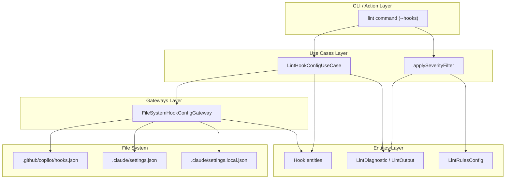
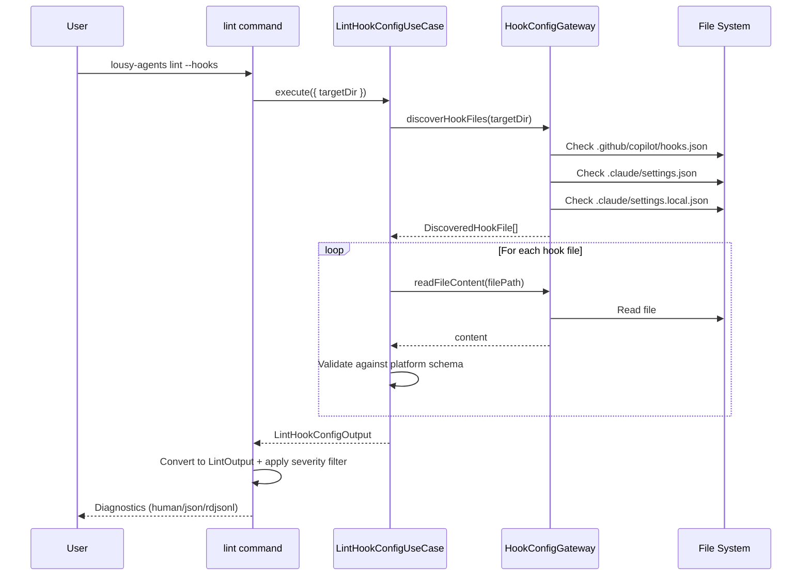

# Feature: Lint Pre-Tool-Use Hook Configurations

## Problem Statement

Software engineers configuring pre-tool-use hooks for GitHub Copilot and Claude Code have no automated validation for their hook configuration files. Missing required fields silently fail at runtime, and missing recommended fields reduce observability. This feature provides lint-time validation to catch configuration errors before they cause runtime failures.

## Personas

| Persona | Impact | Notes |
| --- | --- | --- |
| AI-Assisted Developer | Positive | Gets early feedback on hook configuration errors before runtime |
| Platform Engineer | Positive | Can enforce hook configuration standards across teams |
| Security Engineer | Positive | Can validate that policy hooks are correctly configured |

## Value Assessment

- **Primary value**: Future — Catches configuration errors at lint time instead of at runtime, reducing debugging time
- **Secondary value**: Efficiency — Automated validation replaces manual review of hook configuration files

## User Stories

### Story 1: Lint Copilot Pre-Tool-Use Hook Configuration

As an **AI-Assisted Developer**,
I want the linter to validate my GitHub Copilot hook configuration,
so that I can catch missing required fields before runtime.

#### Acceptance Criteria

- When a `.github/copilot/hooks.json` file exists with a `preToolUse` section, the linter shall validate the configuration against the Copilot hook schema.
- When a Copilot hook configuration is missing a required field (version, hooks, type, bash/powershell), the linter shall report an error diagnostic.
- When a Copilot hook configuration is missing the recommended `timeoutSec` field, the linter shall report a warning diagnostic.
- If the Copilot hook configuration contains invalid JSON, then the linter shall report an error diagnostic with the `hook/invalid-json` rule ID.

### Story 2: Lint Claude Code Pre-Tool-Use Hook Configuration

As an **AI-Assisted Developer**,
I want the linter to validate my Claude Code hook configuration,
so that I can catch missing required fields before runtime.

#### Acceptance Criteria

- When a `.claude/settings.json` or `.claude/settings.local.json` file exists with a `PreToolUse` section, the linter shall validate the configuration against the Claude hook schema.
- When a Claude hook configuration is missing a required field (hooks, type, command), the linter shall report an error diagnostic.
- When a Claude hook configuration has an empty `command` string, the linter shall report an error diagnostic.
- When a Claude hook entry is missing the recommended `matcher` field, the linter shall report a warning diagnostic.
- While a Claude settings file contains additional properties beyond hooks (e.g., `permissions`), the linter shall validate only the hooks section without rejecting the file.
- If the Claude hook configuration contains invalid JSON, then the linter shall report an error diagnostic with the `hook/invalid-json` rule ID.

### Story 3: Unified Hook Lint Output

As a **Platform Engineer**,
I want hook lint diagnostics to appear in the same output format as other lint targets,
so that I can use existing tooling to process results.

#### Acceptance Criteria

- The `lousy-agents lint` command shall support a `--hooks` flag to lint hook configurations.
- When no flags are provided, the linter shall include hook configuration linting in the default run.
- The linter shall output hook diagnostics in the same unified format (human, json, rdjsonl) as skill, agent, and instruction diagnostics.
- The severity filtering system shall apply to hook diagnostics using the `hooks` target in lint configuration.

---

## Design

### Components Affected

- `packages/core/src/entities/hook.ts` — New hook entity types (HookPlatform, HookLintDiagnostic, HookLintResult, DiscoveredHookFile)
- `packages/core/src/entities/lint.ts` — Add "hook" to LintTarget union
- `packages/core/src/entities/lint-rules.ts` — Add hook lint rules (hook/invalid-json, hook/invalid-config, hook/missing-command, hook/missing-matcher, hook/missing-timeout)
- `packages/core/src/use-cases/lint-hook-config.ts` — New use case with Zod schemas for both Copilot and Claude hook formats
- `packages/core/src/gateways/hook-config-gateway.ts` — New gateway for discovering and reading hook config files
- `packages/core/src/use-cases/apply-severity-filter.ts` — Add hook target mapping
- `packages/core/src/lib/lint-config.ts` — Add hooks section to config schema
- `packages/cli/src/commands/lint.ts` — Add --hooks flag and hook lint integration
- `packages/action/src/run-lint.ts` — Add hook lint integration
- `packages/action/src/validate-inputs.ts` — Add hooks boolean to ActionInputs

### Dependencies

- Zod for runtime schema validation
- c12 for lint configuration loading (existing)

### Data Model Changes

#### Hook Lint Rules

| Rule ID | Default Severity | Description |
| --- | --- | --- |
| `hook/invalid-json` | error | JSON parsing failed |
| `hook/invalid-config` | error | Configuration does not match expected schema |
| `hook/missing-command` | error | Hook command field missing or empty |
| `hook/missing-matcher` | warn | Recommended matcher field missing from Claude hook |
| `hook/missing-timeout` | warn | Recommended timeoutSec field missing from Copilot hook |

#### Copilot Hook Schema

```json
{
  "version": 1,
  "hooks": {
    "preToolUse": [
      {
        "type": "command",
        "bash": "./policy-check.sh",
        "cwd": ".",
        "timeoutSec": 5,
        "env": { "KEY": "value" }
      }
    ]
  }
}
```

#### Claude Hook Schema (within settings.json)

```json
{
  "hooks": {
    "PreToolUse": [
      {
        "matcher": "Bash|Edit",
        "hooks": [
          {
            "type": "command",
            "command": "/path/to/check.sh"
          }
        ]
      }
    ]
  }
}
```

### Diagrams

#### Data Flow Diagram



#### Sequence Diagram



### Open Questions

- [x] Should we validate only `preToolUse`/`PreToolUse` hooks or all hook types? — Only pre-tool-use for now per issue scope.
- [x] Should Claude settings files without a hooks section be reported? — No, gateway only discovers files that contain hook sections.

---

## Tasks

### Task 1: Create Hook Entity Types

**Objective**: Define core domain types for hook configuration linting.

**Context**: These types are used by the use case and gateway layers.

**Affected files**:
- `packages/core/src/entities/hook.ts`
- `packages/core/src/entities/hook.test.ts`
- `packages/core/src/entities/index.ts`

**Requirements**:
- Define HookPlatform, HookLintSeverity, HookLintDiagnostic, HookLintResult, DiscoveredHookFile types

**Verification**:
- [x] `npm test packages/core/src/entities/hook.test.ts` passes
- [x] `npx biome check packages/core/src/entities/hook.ts` passes

**Done when**:
- [x] All verification steps pass
- [x] Types follow existing entity patterns (readonly, no framework imports)

---

### Task 2: Update Lint Infrastructure

**Depends on**: Task 1

**Objective**: Add "hook" as a lint target across the lint infrastructure.

**Affected files**:
- `packages/core/src/entities/lint.ts` — Add "hook" to LintTarget
- `packages/core/src/entities/lint-rules.ts` — Add hook rules to LintRulesConfig and DEFAULT_LINT_RULES
- `packages/core/src/use-cases/apply-severity-filter.ts` — Add hook target mapping
- `packages/core/src/lib/lint-config.ts` — Add hooks to config schema and merge logic

**Requirements**:
- LintTarget includes "hook"
- DEFAULT_LINT_RULES includes hooks section with 5 rules
- Severity filter handles hook target correctly
- Lint config schema supports hooks rule overrides

**Verification**:
- [x] `npm test packages/core/src/entities/lint-rules.test.ts` passes
- [x] `npm test packages/core/src/use-cases/apply-severity-filter.test.ts` passes
- [x] `npm test packages/core/src/lib/lint-config.test.ts` passes

**Done when**:
- [x] All verification steps pass
- [x] Existing tests still pass unchanged

---

### Task 3: Create Hook Lint Use Case

**Depends on**: Task 2

**Objective**: Implement the lint use case with Zod schemas for Copilot and Claude hook validation.

**Affected files**:
- `packages/core/src/use-cases/lint-hook-config.ts`
- `packages/core/src/use-cases/lint-hook-config.test.ts`

**Requirements**:
- CopilotHooksConfigSchema validates version, hooks.preToolUse, command entries
- ClaudeHooksConfigSchema validates hooks.PreToolUse with matcher and inner hooks
- Reports errors for missing required fields
- Reports warnings for missing recommended fields (timeoutSec, matcher)
- Handles invalid JSON gracefully

**Verification**:
- [x] `npm test packages/core/src/use-cases/lint-hook-config.test.ts` passes
- [x] `npx biome check packages/core/src/use-cases/lint-hook-config.ts` passes

**Done when**:
- [x] All 14 test scenarios pass
- [x] Both platform schemas validate correctly

---

### Task 4: Create Hook Config Gateway

**Depends on**: Task 3

**Objective**: Implement file system discovery for hook configuration files.

**Affected files**:
- `packages/core/src/gateways/hook-config-gateway.ts`

**Requirements**:
- Discovers `.github/copilot/hooks.json` (copilot platform)
- Discovers `.claude/settings.json` and `.claude/settings.local.json` (claude platform)
- Only reports files that contain relevant hook sections
- Uses existing `fileExists` utility

**Verification**:
- [x] `npx biome check packages/core/src/gateways/hook-config-gateway.ts` passes

**Done when**:
- [x] Gateway implements HookConfigLintGateway interface
- [x] Factory function `createHookConfigGateway()` exported

---

### Task 5: Integrate into CLI and Action

**Depends on**: Task 4

**Objective**: Wire hook linting into the CLI lint command and GitHub Action.

**Affected files**:
- `packages/cli/src/commands/lint.ts`
- `packages/action/src/run-lint.ts`
- `packages/action/src/validate-inputs.ts`

**Requirements**:
- CLI lint command supports `--hooks` flag
- Hook linting runs by default when no flags are provided
- Hook output converted to unified LintOutput format
- Action supports `INPUT_HOOKS` environment variable
- Severity filtering applied to hook diagnostics

**Verification**:
- [x] `mise run ci` passes
- [x] `npm run build` succeeds
- [x] CLI `--help` shows hooks flag

**Done when**:
- [x] All verification steps pass
- [x] Smoke test confirms CLI works

---

## Out of Scope

- Deep semantic validation specific to non-`preToolUse` hook events (e.g., enforcing event-specific business rules for `postToolUse`, `sessionStart`)
- Validating hook command scripts exist on disk
- Validating matcher regex syntax in Claude Code hooks
- Linting managed policy settings or plugin hooks

## Future Considerations

- Refine validation rules per hook lifecycle event (e.g., different recommended fields or severities for `sessionStart`, `userPromptSubmitted`, `postToolUse`, `sessionEnd`)
- Add validation for hook command script existence and permissions
- Add Claude Code matcher regex syntax validation
- Support for managed policy settings linting
