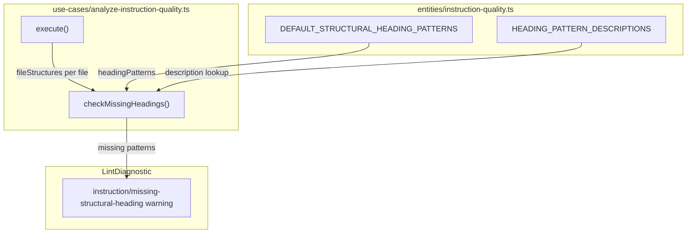
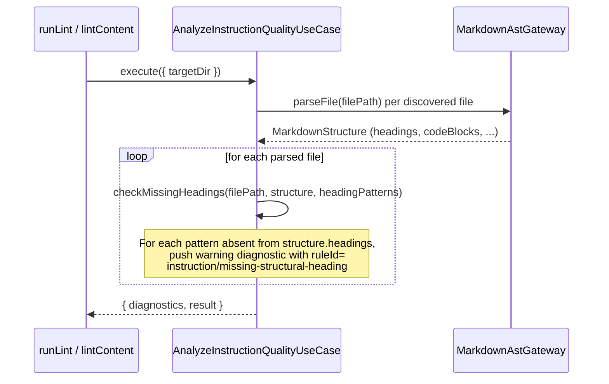

# Feature: Instruction Lint Heading Pattern Warnings

## Problem Statement

The instruction quality linter scores how well instruction files document feedback loop commands, but does not check whether the file contains the recommended structural headings that guide coding agents. Coding agents rely on recognisable headings (e.g., `## Validation`, `## Commands`) to navigate instruction files and understand what actions are required. Without these headings, agents may miss critical workflow steps. This feature adds a per-file warning whenever a recommended heading is absent from an instruction file.

## Personas

| Persona | Impact | Notes |
| --- | --- | --- |
| Software Engineer Learning Vibe Coding | Positive | Primary user — receives actionable feedback explaining which recommended headings are missing and why |
| Web App Developer | Positive | `lintContent` string-mode consumers also receive heading warnings in the same pass |
| CLI/Action Consumer | Positive | Existing `runLint` directory-mode consumers receive the new warnings automatically |

## Value Assessment

- **Primary value**: Efficiency — Reduces manual review effort by automatically flagging missing guidance sections that agents depend on
- **Secondary value**: Customer — Improves instruction quality scores and overall agent reliability for existing users

## User Stories

### Story 1: Warning on Missing Structural Headings

As a **Software Engineer Learning Vibe Coding**,
I want **the lint tool to warn me when my instruction file is missing recommended structural headings**,
so that I can **ensure coding agents have the context they need to follow structured workflows**.

#### Acceptance Criteria

- When the lint tool analyzes an instruction file that does not contain a heading matching `Validation`, the lint tool shall emit a `warning` diagnostic with rule ID `instruction/missing-structural-heading`.
- When the lint tool analyzes an instruction file that does not contain a heading matching `Verification`, the lint tool shall emit a `warning` diagnostic with rule ID `instruction/missing-structural-heading`.
- When the lint tool analyzes an instruction file that does not contain a heading matching `Feedback Loop`, the lint tool shall emit a `warning` diagnostic with rule ID `instruction/missing-structural-heading`.
- When the lint tool analyzes an instruction file that does not contain a heading matching `Mandatory`, the lint tool shall emit a `warning` diagnostic with rule ID `instruction/missing-structural-heading`.
- When the lint tool analyzes an instruction file that does not contain a heading matching `Before Commit`, the lint tool shall emit a `warning` diagnostic with rule ID `instruction/missing-structural-heading`.
- When the lint tool analyzes an instruction file that does not contain a heading matching `Validation Suite`, the lint tool shall emit a `warning` diagnostic with rule ID `instruction/missing-structural-heading`.
- When the lint tool analyzes an instruction file that does not contain a heading matching `Commands`, the lint tool shall emit a `warning` diagnostic with rule ID `instruction/missing-structural-heading`.
- When the lint tool analyzes an instruction file that contains a heading matching one of the recommended patterns (case-insensitive substring match), the lint tool shall not emit a `instruction/missing-structural-heading` warning for that pattern.
- The `instruction/missing-structural-heading` warning message shall include the name of the missing heading and a brief description explaining why the heading is recommended.
- The `instruction/missing-structural-heading` rule shall apply to both directory-mode (`runLint`) and string-mode (`lintContent`) instruction analysis.

#### Notes

- Heading matching uses case-insensitive substring inclusion (consistent with the existing `isCommandUnderMatchedHeading` logic). A heading of `## My Validation Section` satisfies the `Validation` pattern.
- Because instruction files stack on each other in the filesystem (different files cover different concerns), this rule cannot require all headings to appear in every single file — warnings (not errors) are the correct severity.
- The check is performed per file. Each instruction file is independently assessed against all seven patterns.
- Files that fail to parse already receive a `instruction/parse-error` diagnostic; they are excluded from the missing-heading check since their structure is unknown.

---

## Design

> Refer to `.github/copilot-instructions.md` and `.github/instructions/software-architecture.instructions.md` for technical standards.

### Components Affected

- `packages/core/src/entities/instruction-quality.ts` — New `HEADING_PATTERN_DESCRIPTIONS` constant maps each heading pattern to its recommendation rationale
- `packages/core/src/use-cases/analyze-instruction-quality.ts` — New `checkMissingHeadings()` private method; called from `execute()` after file structures are built
- `packages/core/src/use-cases/analyze-instruction-quality.test.ts` — New test cases covering missing headings, partial headings, all headings present, and case-insensitive matching
- `docs/lint.md` — Updated Rule IDs table with `instruction/missing-structural-heading`

### Dependencies

- No new external dependencies required
- Reuses `DEFAULT_STRUCTURAL_HEADING_PATTERNS` already defined in `instruction-quality.ts`

### Data Model Changes

New exported constant in `instruction-quality.ts`:

```typescript
export const HEADING_PATTERN_DESCRIPTIONS: ReadonlyMap<string, string> =
    new Map<string, string>([
        ["Validation", "..."],
        ["Verification", "..."],
        // ... one entry per DEFAULT_STRUCTURAL_HEADING_PATTERNS item
    ]);
```

New rule ID surfaced in `LintDiagnostic.ruleId`: `"instruction/missing-structural-heading"`

### Diagrams

#### Data Flow Diagram



#### Sequence Diagram



### Open Questions

- None — all requirements are fully specified.

---

## Tasks

> Each task is completable in a single coding agent session.
> Tasks are sequenced by dependency. Complete in order unless noted.

### Task 1: Add heading pattern descriptions to entity

**Objective**: Export a `HEADING_PATTERN_DESCRIPTIONS` constant from `instruction-quality.ts` that maps each pattern to a rationale string.

**Context**: The use case needs per-pattern descriptions to include in warning messages. Keeping descriptions in the entity layer ensures the domain concept is self-contained.

**Affected files**:
- `packages/core/src/entities/instruction-quality.ts`

**Requirements**:
- The `instruction/missing-structural-heading` warning message shall include a brief description explaining why the heading is recommended.

**Verification**:
- [x] `mise run format-check` passes
- [x] All seven patterns from `DEFAULT_STRUCTURAL_HEADING_PATTERNS` have entries in `HEADING_PATTERN_DESCRIPTIONS`

**Done when**:
- [x] All verification steps pass
- [x] No new errors in affected files
- [x] `HEADING_PATTERN_DESCRIPTIONS` is exported and accessible from the use case

---

### Task 2: Implement missing-heading check in use case

**Depends on**: Task 1

**Objective**: Add a `checkMissingHeadings()` private method to `AnalyzeInstructionQualityUseCase` and call it from `execute()` for each successfully parsed file.

**Context**: The use case already builds a `fileStructures` map during `execute()`. The new check iterates this map and emits a `warning` diagnostic for each heading pattern absent from the file's headings.

**Affected files**:
- `packages/core/src/use-cases/analyze-instruction-quality.ts`

**Requirements**:
- When the lint tool analyzes an instruction file missing a recommended heading, the lint tool shall emit a `warning` diagnostic with rule ID `instruction/missing-structural-heading`.
- Heading matching shall be case-insensitive substring inclusion.
- Files that failed to parse (not in `fileStructures`) shall be excluded from this check.

**Verification**:
- [x] `npm test packages/core/src/use-cases/analyze-instruction-quality.test.ts` passes

**Done when**:
- [x] All verification steps pass
- [x] No new errors in affected files
- [x] New diagnostics appear for each missing pattern

---

### Task 3: Add tests for the new rule

**Depends on**: Task 2

**Objective**: Add unit tests covering all new heading-check behaviors in `analyze-instruction-quality.test.ts`.

**Context**: Tests document expected behavior and protect against regressions.

**Affected files**:
- `packages/core/src/use-cases/analyze-instruction-quality.test.ts`

**Requirements**:
- All acceptance criteria from Story 1 must have corresponding test coverage.

**Verification**:
- [x] `npm test packages/core/src/use-cases/analyze-instruction-quality.test.ts` passes with 16 tests (11 existing + 5 new)

**Done when**:
- [x] All verification steps pass
- [x] New tests cover: all headings missing, partial headings, all headings present, case-insensitive matching, message includes description

---

### Task 4: Update documentation

**Depends on**: Task 3

**Objective**: Add `instruction/missing-structural-heading` to the Rule IDs table in `docs/lint.md` and explain its purpose and severity rationale.

**Affected files**:
- `docs/lint.md`

**Requirements**:
- The new rule ID, its default severity (`warn`), and a description shall appear in the Rule IDs table.

**Verification**:
- [x] `docs/lint.md` Rule IDs table contains `instruction/missing-structural-heading`
- [x] `mise run lint` passes (markdownlint)

**Done when**:
- [x] All verification steps pass

---

## Out of Scope

- Requiring all seven headings to be present in any single file (headings are intentionally distributed across stacked instruction files)
- Per-heading severity configuration via lint rules config (a follow-on enhancement)
- Cross-file aggregation to detect whether the full set of headings is covered by the combined instruction set

## Future Considerations

- Add a `--strict` / error-severity option so teams can enforce heading presence as a hard requirement
- Cross-file aggregation check: warn if no file in the discovered set contains a given heading pattern
- Expose per-pattern suppression via lint rules config (e.g., `instruction/missing-structural-heading:off`)
