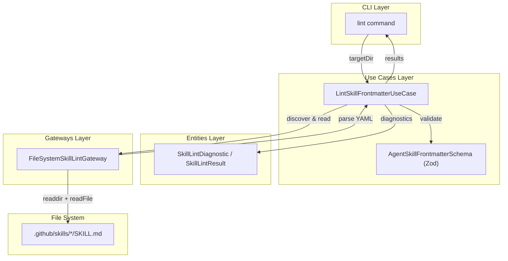
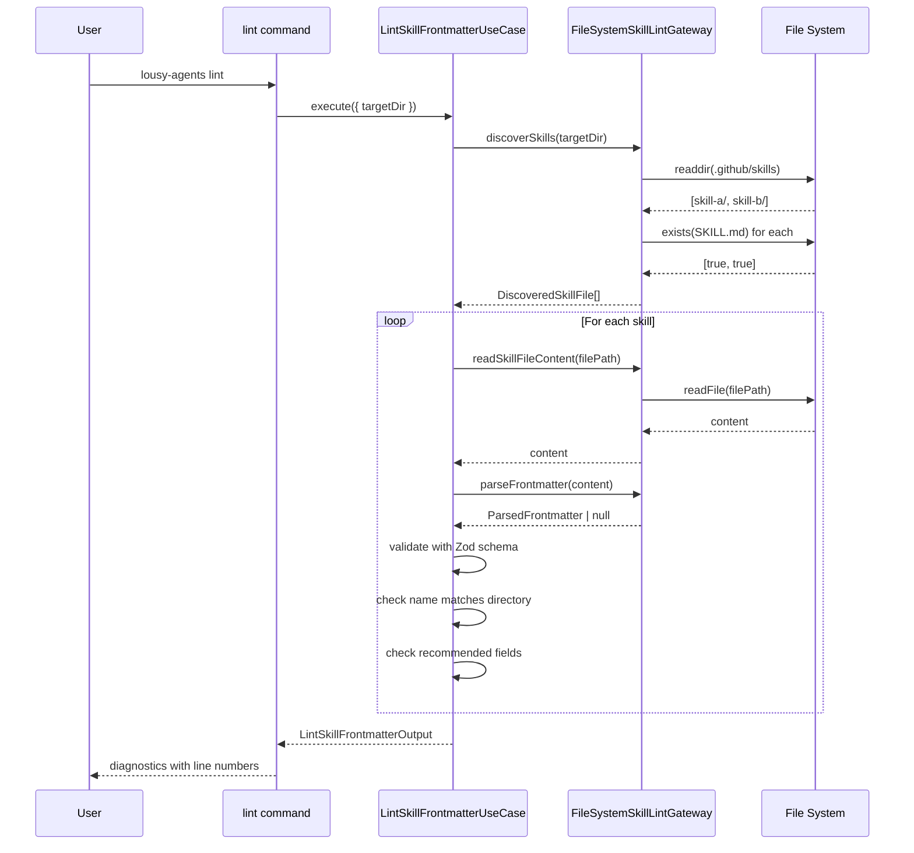

# Feature: Lint Agent Skill Frontmatter

## Problem Statement

Developers creating GitHub Copilot Agent Skills may have incomplete or invalid YAML frontmatter in their SKILL.md files. Without automated validation, missing required fields, invalid name formats, or mismatched directory names go undetected until runtime. A lint command provides early feedback with line-level diagnostics to ensure skill files conform to the agentskills.io specification.

## Personas

| Persona | Impact | Notes |
|---------|--------|-------|
| Software Engineer Learning Vibe Coding | Positive | Primary user — gets immediate feedback on skill file issues before committing |
| Team Lead | Positive | Can enforce consistent skill configuration standards across team members |

## Value Assessment

- **Primary value**: Efficiency — Catches skill frontmatter errors early, before they cause runtime issues
- **Secondary value**: Customer — Improves developer experience with clear, actionable feedback on skill files

## User Stories

### Story 1: Discover Skills in Repository

As a **Software Engineer Learning Vibe Coding**,
I want **the lint command to automatically discover all skills in my repository**,
so that I can **validate all skills at once without specifying each file path**.

#### Acceptance Criteria

- When the user runs `lousy-agents lint`, the CLI shall discover all SKILL.md files in `.github/skills/` subdirectories
- When no skills are found, the CLI shall display a message indicating no skills were found
- When skills are found, the CLI shall display the total number of discovered skills

#### Notes

- Skills are identified by the presence of a `SKILL.md` file inside a subdirectory of `.github/skills/`

---

### Story 2: Validate Required Frontmatter Fields

As a **Software Engineer Learning Vibe Coding**,
I want **the lint command to report errors for missing or invalid required fields**,
so that I can **fix issues before they cause problems**.

#### Acceptance Criteria

- When a SKILL.md file is missing YAML frontmatter, the CLI shall report an error at line 1
- When the `name` field is missing, the CLI shall report an error indicating the field is required
- When the `description` field is missing, the CLI shall report an error indicating the field is required
- When the `name` field has an invalid format, the CLI shall report an error with the validation constraint
- When the `description` field exceeds 1024 characters, the CLI shall report an error
- When the `name` field exceeds 64 characters, the CLI shall report an error
- If lint errors are found, then the CLI shall exit with a non-zero exit code

#### Notes

- The `name` field must match the pattern `^[a-z0-9]+(?:-[a-z0-9]+)*$` (lowercase, hyphens only)
- Required fields: `name`, `description`

---

### Story 3: Validate Name Matches Directory

As a **Software Engineer Learning Vibe Coding**,
I want **the lint command to verify the frontmatter name matches the parent directory name**,
so that I can **ensure consistency between the directory structure and the skill metadata**.

#### Acceptance Criteria

- When the frontmatter `name` value does not match the parent directory name, the CLI shall report an error at the line where the `name` field appears
- The error message shall include both the frontmatter name and the expected directory name

---

### Story 4: Warn on Missing Recommended Fields

As a **Software Engineer Learning Vibe Coding**,
I want **the lint command to warn about missing recommended fields**,
so that I can **improve my skill files by adding optional but valuable metadata**.

#### Acceptance Criteria

- When the `allowed-tools` field is missing, the CLI shall report a warning
- While warnings are present but no errors exist, the CLI shall exit with a zero exit code
- When warnings are present, the CLI shall display a summary of the warning count

#### Notes

- Recommended fields: `allowed-tools`
- Warnings do not cause lint failure — only errors do

---

### Story 5: Line-Level Feedback

As a **Software Engineer Learning Vibe Coding**,
I want **lint diagnostics to include the file path and line number**,
so that I can **quickly navigate to the exact location of each issue**.

#### Acceptance Criteria

- The CLI shall format diagnostics as `<file-path>:<line> [<field>]: <message>`
- When a field exists in the frontmatter, the line number shall correspond to the field's position
- When a required field is missing, the line number shall correspond to the frontmatter start

---

## Design

> Refer to `.github/copilot-instructions.md` for technical standards.

### Components Affected

- `src/entities/skill.ts` — Add lint diagnostic types (`SkillLintDiagnostic`, `SkillLintResult`, `ParsedFrontmatter`)
- `src/entities/index.ts` — Export new types
- `src/use-cases/lint-skill-frontmatter.ts` (new) — Use case with Zod schema and validation logic
- `src/use-cases/lint-skill-frontmatter.test.ts` (new) — Use case tests
- `src/gateways/skill-lint-gateway.ts` (new) — File system gateway for discovery and parsing
- `src/gateways/skill-lint-gateway.test.ts` (new) — Gateway tests
- `src/commands/lint.ts` (new) — CLI command handler
- `src/commands/lint.test.ts` (new) — Command tests
- `src/index.ts` — Register lint subcommand

### Dependencies

- `zod` — Frontmatter schema validation (already installed)
- `yaml` — YAML frontmatter parsing (already installed)
- `citty` — CLI command definition (already installed)
- `consola` — Console output formatting (already installed)

### Data Model Changes

None — this feature only reads and validates existing files.

### Diagrams

#### Data Flow Diagram

#### Sequence Diagram

### Open Questions

- [x] Should the lint command support a `--fix` flag? — Deferred to future work; the initial implementation only reports issues.

---

## Tasks

> Each task should be completable in a single coding agent session.
> Tasks are sequenced by dependency. Complete in order unless noted.

### Task 1: Add lint diagnostic types to entity layer

**Objective**: Add types for lint diagnostics, results, and parsed frontmatter to the Skill entity

**Context**: These types are the foundation used by the use case and command layers

**Affected files**:
- `src/entities/skill.ts`
- `src/entities/index.ts`

**Requirements**:
- The entity shall define `SkillLintSeverity` ("error" | "warning"), `SkillLintDiagnostic`, `SkillLintResult`, `DiscoveredSkillFile`, and `ParsedFrontmatter` types
- Types shall use `readonly` modifiers for immutability

**Verification**:
- [x] `npm test src/entities/skill.test.ts` passes
- [x] `npx biome check src/entities/skill.ts` passes
- [x] Types are exported from `src/entities/index.ts`

**Done when**:
- [x] All verification steps pass
- [x] No new errors in affected files

---

### Task 2: Create LintSkillFrontmatterUseCase with Zod schema

**Objective**: Create the use case that validates skill frontmatter against the agentskills.io specification

**Context**: This is the core business logic for frontmatter linting

**Affected files**:
- `src/use-cases/lint-skill-frontmatter.ts` (new)
- `src/use-cases/lint-skill-frontmatter.test.ts` (new)
- `src/use-cases/index.ts`

**Requirements**:
- The use case shall define an `AgentSkillFrontmatterSchema` Zod schema with required `name` and `description` fields
- The use case shall define a `SkillLintGateway` port interface
- When frontmatter is missing, the use case shall return an error diagnostic at line 1
- When required fields are missing or invalid, the use case shall return error diagnostics
- When recommended fields are missing, the use case shall return warning diagnostics
- When the name does not match the parent directory, the use case shall return an error diagnostic

**Verification**:
- [x] `npm test src/use-cases/lint-skill-frontmatter.test.ts` passes (13 tests)
- [x] `npx biome check src/use-cases/lint-skill-frontmatter.ts` passes

**Done when**:
- [x] All verification steps pass
- [x] No new errors in affected files

---

### Task 3: Create FileSystemSkillLintGateway

**Objective**: Create the gateway for discovering skill files and parsing YAML frontmatter

**Context**: This provides the file system adapter for the lint use case

**Affected files**:
- `src/gateways/skill-lint-gateway.ts` (new)
- `src/gateways/skill-lint-gateway.test.ts` (new)
- `src/gateways/index.ts`

**Requirements**:
- The gateway shall discover all SKILL.md files in `.github/skills/` subdirectories
- The gateway shall read skill file content from disk
- The gateway shall parse YAML frontmatter and track field line numbers
- When no `.github/skills/` directory exists, the gateway shall return an empty array
- When frontmatter delimiters are missing, the gateway shall return null

**Verification**:
- [x] `npm test src/gateways/skill-lint-gateway.test.ts` passes (11 tests)
- [x] `npx biome check src/gateways/skill-lint-gateway.ts` passes

**Done when**:
- [x] All verification steps pass
- [x] No new errors in affected files

---

### Task 4: Create lint command and register in CLI

**Objective**: Create the `lint` command handler and wire it into the CLI composition root

**Context**: This is the user-facing interface for the lint feature

**Affected files**:
- `src/commands/lint.ts` (new)
- `src/commands/lint.test.ts` (new)
- `src/index.ts`

**Requirements**:
- When the user runs `lousy-agents lint`, the CLI shall discover and validate all skills
- When no skills are found, the CLI shall display an informational message
- When errors are found, the CLI shall exit with a non-zero exit code
- The CLI shall format diagnostics as `<file-path>:<line> [<field>]: <message>`
- When only warnings are found, the CLI shall display a warning summary and exit successfully

**Verification**:
- [x] `npm test src/commands/lint.test.ts` passes (6 tests)
- [x] `npx biome check src/commands/lint.ts` passes
- [x] `npm run build` succeeds
- [x] Manual test: `lousy-agents lint` with valid/invalid skills

**Done when**:
- [x] All verification steps pass
- [x] No new errors in affected files
- [x] Command is registered and functional

---

## Out of Scope

- `--fix` flag to auto-fix lint issues
- Linting skill markdown body content (only frontmatter)
- Linting Copilot agent files (`.github/agents/*.md`)
- Custom lint rules or configuration
- Integration with CI/CD pipelines (beyond CLI exit code)

## Future Considerations

- Add `--fix` flag to auto-correct fixable issues (e.g., normalizing name format)
- Add `--format` option for JSON/SARIF output for CI integration
- Extend lint to cover Copilot agent files
- Add custom lint rule configuration via `.lousy-agents.yml`
- Add skill body content linting (required sections, structure)
