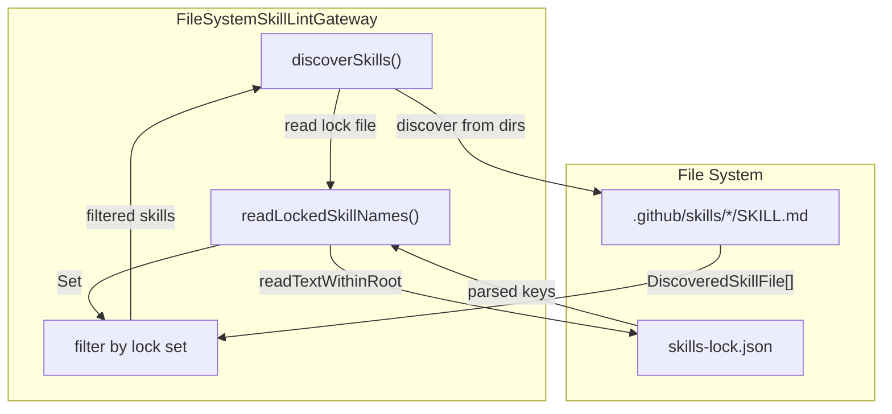
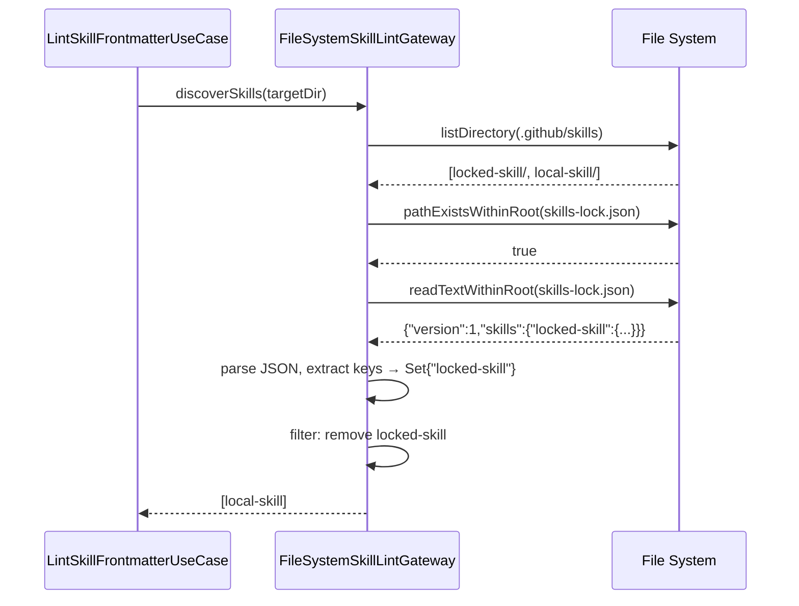

# Feature: Lint Skip Locked Skills

## Problem Statement

When developers install third-party skills via Vercel's skills package manager (`npx skills add`) or the ctx7 skill package manager (`ctx7 skills install`), these externally-managed skills are placed in standard skill directories (`.claude/skills/`, `.agents/skills/`) and tracked in a `skills-lock.json` file. Running `lint --skills` currently reports diagnostics for these third-party skills, producing noise that developers cannot act on since the files are externally managed.

## Personas

| Persona | Impact | Notes |
| ------- | ------ | ----- |
| Software Engineer Learning Vibe Coding | Positive | No longer sees irrelevant lint diagnostics for externally-managed skills |
| Team Lead | Positive | CI pipelines produce cleaner output without false positives from third-party skills |

## Value Assessment

- **Primary value**: Efficiency — Eliminates noise from lint output, letting developers focus on issues they can fix
- **Secondary value**: Customer — Improves developer experience by making lint output actionable

## User Stories

### Story 1: Exclude Locked Skills from Lint Discovery

As a **Software Engineer Learning Vibe Coding**,
I want **the lint command to automatically exclude skills listed in skills-lock.json**,
so that I can **focus on issues in my own locally-authored skills without noise from third-party installations**.

#### Acceptance Criteria

- When a `skills-lock.json` file exists at the repository root, the skill lint gateway shall read it and identify all skill names listed under the `skills` key
- When discovering skills, the gateway shall exclude any skill whose directory name matches a key in the lock file's `skills` object
- When the `skills-lock.json` file does not exist, the gateway shall return all discovered skills without filtering
- If the `skills-lock.json` file contains malformed JSON, then the gateway shall silently ignore it and return all discovered skills
- If the `skills-lock.json` file has an unexpected structure (e.g., `skills` is an array), then the gateway shall silently ignore it and return all discovered skills
- If the `skills-lock.json` triggers a file-system safety violation (symlink, traversal, too-large), then the gateway shall rethrow the error

#### Notes

- The lock file format has a `version` field and a `skills` object whose keys are skill names
- Skills installed via `npx skills add` or `ctx7 skills install` both produce entries in this file

---

### Story 2: Local Skills Remain Linted

As a **Software Engineer Learning Vibe Coding**,
I want **locally-authored skills (not in the lock file) to continue being linted**,
so that I can **still get feedback on my own skill files**.

#### Acceptance Criteria

- While a `skills-lock.json` file exists, when a skill directory name does not appear as a key in the lock file, the gateway shall include that skill in discovery results
- The filtering shall only match on exact skill directory name equality with lock file keys

---

## Design

> Refer to the repo's engineering guidance for technical standards.

### Components Affected

- `packages/core/src/gateways/skill-lint-gateway.ts` — Add `readLockedSkillNames()` helper and filter logic in `discoverSkills()`
- `packages/core/src/gateways/skill-lint-gateway.test.ts` — Add test cases for lock file filtering

### Dependencies

- `@openclaw/fs-safe` (via `readTextWithinRoot`, `pathExistsWithinRoot`) — Already used by the gateway for safe file reads

### Data Model Changes

None — this feature reads an existing external file (`skills-lock.json`) and filters existing discovery results.

### Diagrams

#### Data Flow Diagram

#### Sequence Diagram

### Open Questions

- [x] Should lock file filtering be configurable (e.g., `--include-locked`)? — Deferred to future work; default exclusion covers the primary use case.

---

## Tasks

> Each task should be completable in a single coding agent session.
> Tasks are sequenced by dependency. Complete in order unless noted.

### Task 1: Add lock file reading and filtering to skill lint gateway

**Objective**: Add a `readLockedSkillNames()` helper that reads `skills-lock.json` and returns a set of locked skill names, then filter discovered skills in `discoverSkills()`

**Context**: This is the core logic change that prevents third-party skills from appearing in lint output

**Affected files**:

- `packages/core/src/gateways/skill-lint-gateway.ts`
- `packages/core/src/gateways/skill-lint-gateway.test.ts`

**Requirements**:

- When `skills-lock.json` exists, the gateway shall parse it and extract keys from the `skills` object
- The gateway shall validate the `skills-lock.json` shape (including rejection of arrays for the `skills` field) using a Zod schema, and use `Object.hasOwn()` for defense-in-depth against prototype pollution when accessing the `skills` property
- When `skills-lock.json` does not exist, the gateway shall return an empty set (no filtering)
- If `skills-lock.json` is malformed JSON, the gateway shall return an empty set (no filtering)
- If reading the lock file triggers a fs-safe violation, the gateway shall rethrow the error
- The gateway shall use `readTextWithinRoot` with a 256 KB size limit for the lock file
- Discovered skills whose `skillName` matches a key in the lock set shall be excluded from results

**Verification**:

- [ ] `npx vitest run packages/core/src/gateways/skill-lint-gateway.test.ts` passes
- [ ] `npx biome check packages/core/src/gateways/skill-lint-gateway.ts` passes
- [ ] Lock file filtering excludes skills matching lock file keys
- [ ] Skills not in lock file are still returned
- [ ] Malformed lock files do not cause errors
- [ ] Missing lock files do not cause errors

**Done when**:

- [ ] All verification steps pass
- [ ] No new errors in affected files
- [ ] Acceptance criteria for Story 1 and Story 2 satisfied
- [ ] Code follows the repo's engineering guidance

---

## Out of Scope

- `--include-locked` CLI flag to override lock file filtering
- Filtering by lock file `sourceType` or other metadata
- Supporting alternative lock file locations
- Lock file validation or diagnostics (e.g., warning about outdated entries)
- Linting third-party skills with relaxed rules instead of full exclusion

## Future Considerations

- Add `--include-locked` flag for users who want to lint all skills regardless of lock file
- Support lock files in subdirectories or alternative locations
- Add a `lint --locked-only` mode for auditing third-party skill quality
- Consider integration with `npx skills` CLI for lock file validation

---

## Cross-Reference

- GitHub Issue: #713
