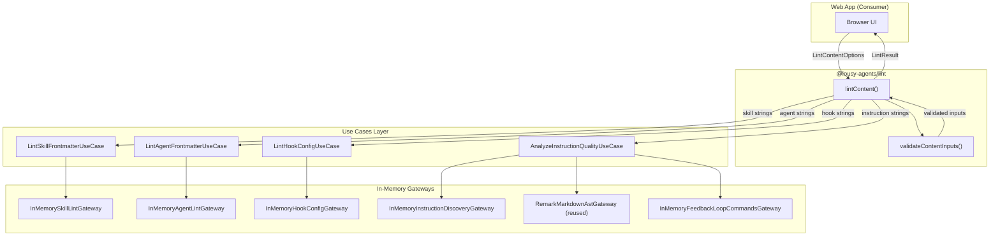
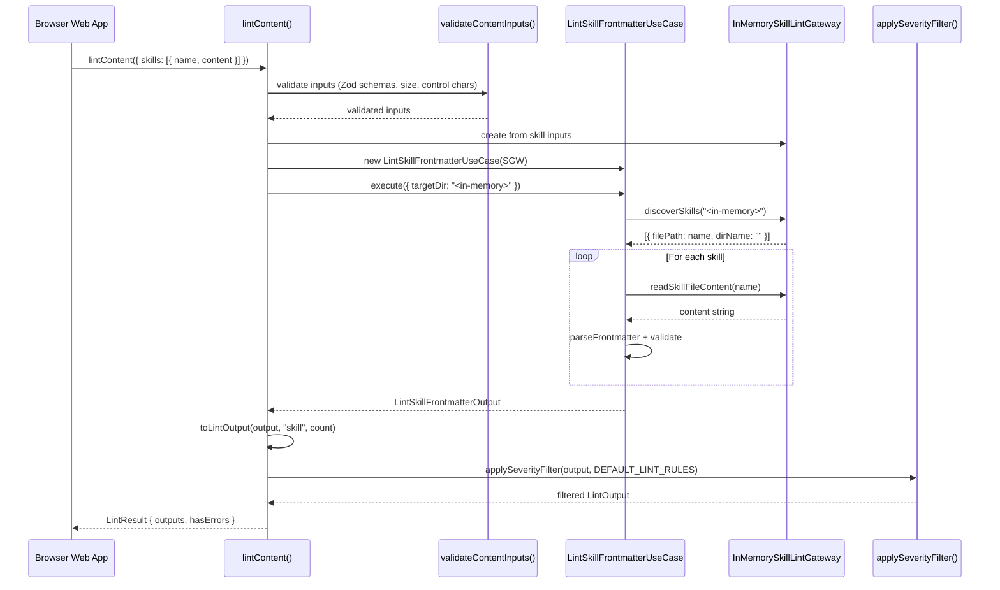

# Feature: Lint API String Input Support

## Problem Statement

The `@lousy-agents/lint` public API currently requires a filesystem directory path to discover and analyze skill, agent, instruction, and hook configuration files. This makes it unusable in browser-based environments (e.g., interactive web apps or playgrounds) where users want to paste or type content and receive immediate lint feedback without a backing filesystem. A new API entry point is needed that accepts string content directly, enabling browser-hosted lint experiences.

## Personas

| Persona | Impact | Notes |
| --- | --- | --- |
| Web App Developer | Positive | Primary user — can integrate lint into browser-based tools, playgrounds, and preview UIs |
| Software Engineer Learning Vibe Coding | Positive | Gets interactive lint feedback in a web UI without needing a local project |
| CLI/Action Consumer | Neutral | Existing `runLint` API and CLI remain unchanged |

## Value Assessment

- **Primary value**: Market — Opens the lint API to browser-based consumers, enabling interactive web experiences that attract new users
- **Secondary value**: Customer — Existing users gain a programmatic way to lint individual files or snippets without scaffolding a project directory

## User Stories

### Story 1: Lint a Single Skill from String Content

As a **Web App Developer**,
I want **to pass skill file content as a string to the lint API**,
so that I can **validate user-provided skill definitions in my web app without a filesystem**.

#### Acceptance Criteria

- When `lintContent` is called with a `skills` input containing a `name` and `content` string, the lint API shall analyze the content and return `LintResult` with skill diagnostics.
- When `lintContent` is called with a `skills` input that omits the `name` field, the lint API shall reject with a `LintValidationError`.
- When the skill content is an empty string, the lint API shall return diagnostics indicating missing frontmatter.
- If the skill content contains control characters (ASCII 0x00–0x08, 0x0B–0x0D, 0x0E–0x1F, 0x7F), then the lint API shall reject with a `LintValidationError`.

#### Notes

- The `name` field serves as a virtual filename for diagnostics (e.g., `my-skill.md:3 [name]: ...`).
- Skill name-to-directory matching validation is skipped in string mode since there is no parent directory.

---

### Story 2: Lint a Single Agent from String Content

As a **Web App Developer**,
I want **to pass agent file content as a string to the lint API**,
so that I can **validate user-provided agent definitions in my web app**.

#### Acceptance Criteria

- When `lintContent` is called with an `agents` input containing a `name` and `content` string, the lint API shall analyze the content and return `LintResult` with agent diagnostics.
- When the agent content has no YAML frontmatter, the lint API shall return an error diagnostic at line 1.
- If the `name` field is an empty string, then the lint API shall reject with a `LintValidationError`.

#### Notes

- Agent name-to-filename matching validation is skipped in string mode since there is no real filename.

---

### Story 3: Lint a Single Instruction from String Content

As a **Web App Developer**,
I want **to pass instruction file content as a string to the lint API**,
so that I can **preview instruction quality analysis without saving a file to disk**.

#### Acceptance Criteria

- When `lintContent` is called with an `instructions` input containing a `name`, `content` string, and `format` specifier, the lint API shall analyze the content and return `LintResult` with instruction quality diagnostics.
- When the instruction content is valid markdown with structural headings and code blocks, the lint API shall return a quality score and suggestions.
- If the `format` field is not a valid `InstructionFileFormat`, then the lint API shall reject with a `LintValidationError`.

#### Notes

- Feedback loop command discovery is not possible without a project directory. The use case shall use an empty command list in string mode.
- Quality scoring still works because it analyzes structural context, execution clarity, and loop completeness within the provided content.

---

### Story 4: Lint a Single Hook Configuration from String Content

As a **Web App Developer**,
I want **to pass hook configuration JSON as a string to the lint API**,
so that I can **validate hook configurations interactively**.

#### Acceptance Criteria

- When `lintContent` is called with a `hooks` input containing a `name`, `content` string, and `platform` specifier (`"copilot"` or `"claude"`), the lint API shall analyze the content and return `LintResult` with hook diagnostics.
- If the hook content is not valid JSON, then the lint API shall return a diagnostic with rule ID `hook/invalid-json`.
- If the `platform` field is not `"copilot"` or `"claude"`, then the lint API shall reject with a `LintValidationError`.

---

### Story 5: Lint Multiple Targets in a Single Call

As a **Web App Developer**,
I want **to lint multiple string inputs in a single `lintContent` call**,
so that I can **validate a complete set of agent artifacts at once**.

#### Acceptance Criteria

- When `lintContent` is called with multiple target arrays (e.g., both `skills` and `agents`), the lint API shall return separate `LintOutput` entries for each target.
- When `lintContent` is called with no inputs (all arrays empty or omitted), the lint API shall reject with a `LintValidationError`.
- The `LintResult.hasErrors` shall be true if any target produced error-severity diagnostics.

---

### Story 6: Input Size Limits

As a **Web App Developer**,
I want **the lint API to enforce reasonable size limits on string inputs**,
so that I can **protect my web app from denial-of-service via oversized payloads**.

#### Acceptance Criteria

- If a single content string exceeds 1 MB (1,048,576 bytes in UTF-8), then the lint API shall reject with a `LintValidationError`.
- The lint API shall enforce a maximum of 100 items across all target arrays combined per call.

---

## Design

> Refer to `.github/copilot-instructions.md` and `.github/instructions/software-architecture.instructions.md` for technical standards.

### Components Affected

- `packages/lint/src/lint-content.ts` (new) — New composition root for string-based linting
- `packages/lint/src/lint-content.test.ts` (new) — Tests for the new API
- `packages/lint/src/validate-content.ts` (new) — Input validation for string content
- `packages/lint/src/validate-content.test.ts` (new) — Tests for input validation
- `packages/lint/src/index.ts` — Export `lintContent` and `LintContentOptions` types
- `packages/lint/src/index.d.ts` — Add type declarations for `lintContent` API
- `packages/core/src/use-cases/lint-skill-frontmatter.ts` — Add `executeForContent` method or adapt `execute` to accept string input
- `packages/core/src/use-cases/lint-agent-frontmatter.ts` — Add string input support
- `packages/core/src/use-cases/lint-hook-config.ts` — Add string input support
- `packages/core/src/use-cases/analyze-instruction-quality.ts` — Add string input support

### Dependencies

- No new external dependencies required
- Uses existing `zod` for input validation
- Uses existing use-case classes and their gateway interfaces

### Data Model Changes

New types for the string input API:

```typescript
interface ContentInput {
    readonly name: string;     // Virtual filename for diagnostics
    readonly content: string;  // Raw file content
}

interface SkillContentInput extends ContentInput {}

interface AgentContentInput extends ContentInput {}

interface InstructionContentInput extends ContentInput {
    readonly format: InstructionFileFormat;
}

interface HookContentInput extends ContentInput {
    readonly platform: "copilot" | "claude";
}

interface LintContentOptions {
    readonly skills?: readonly SkillContentInput[];
    readonly agents?: readonly AgentContentInput[];
    readonly instructions?: readonly InstructionContentInput[];
    readonly hooks?: readonly HookContentInput[];
}
```

### Diagrams

#### Data Flow Diagram



#### Sequence Diagram



### Strategy: In-Memory Gateways

The existing use cases accept gateway interfaces (ports) via constructor injection. The string input API creates **in-memory gateway implementations** that serve content from the provided strings instead of reading from disk:

1. **InMemorySkillLintGateway** implements `SkillLintGateway` — `discoverSkills()` returns entries from the input array; `readSkillFileContent()` returns the corresponding string; `parseFrontmatter()` delegates to the same YAML parsing logic.
2. **InMemoryAgentLintGateway** implements `AgentLintGateway` — same pattern.
3. **InMemoryHookConfigGateway** implements `HookConfigLintGateway` — `discoverHookFiles()` returns entries from input; `readFileContent()` returns the string.
4. **InMemoryInstructionDiscoveryGateway** implements `InstructionFileDiscoveryGateway` — returns discovered files from input array.
5. **InMemoryFeedbackLoopCommandsGateway** implements `FeedbackLoopCommandsGateway` — returns an empty command list (no project directory to scan).
6. **RemarkMarkdownAstGateway** is reused as-is — its `parseContent()` method already works with strings.

This approach requires zero changes to use-case business logic. The use cases are unaware they are operating on in-memory content vs. filesystem content.

### Lint Rule Configuration in String Mode

Without a project directory, there is no `lousy-agents.config.json` to load. The `lintContent` API shall use `DEFAULT_LINT_RULES` as the severity configuration. A future enhancement could accept an optional `rules` parameter.

### Open Questions

- [x] Should `lintContent` accept a `rules` override parameter? — Deferred to future work. Use `DEFAULT_LINT_RULES` for the initial implementation.
- [x] Should skill name-to-directory validation be skipped? — Yes. There is no directory in string mode. The `dirName` field should be set to the skill name to avoid false positives.
- [x] Should agent name-to-filename validation be skipped? — Yes. Same reasoning. The `agentName` field should be derived from the `name` input.

---

## Tasks

> Each task should be completable in a single coding agent session.
> Tasks are sequenced by dependency. Complete in order unless noted.

### Task 1: Add content input validation module

**Objective**: Create `validate-content.ts` with Zod schemas and validation logic for string inputs.

**Context**: This module validates `LintContentOptions` before content reaches use cases. It enforces size limits, control character rejection, name format validation, and item count limits.

**Affected files**:
- `packages/lint/src/validate-content.ts` (new)
- `packages/lint/src/validate-content.test.ts` (new)

**Requirements**:
- When `lintContent` is called with a content string exceeding 1 MB, the lint API shall reject with a `LintValidationError` (Story 6).
- If a content string contains control characters, then the lint API shall reject with a `LintValidationError` (Story 1).
- When a `name` field is empty, the lint API shall reject with a `LintValidationError` (Story 2).
- When the total item count across all targets exceeds 100, the lint API shall reject with a `LintValidationError` (Story 6).
- When all input arrays are empty or omitted, the lint API shall reject with a `LintValidationError` (Story 5).
- If a `hooks` input has an invalid `platform` value, then the lint API shall reject with a `LintValidationError` (Story 4).
- If an `instructions` input has an invalid `format` value, then the lint API shall reject with a `LintValidationError` (Story 3).

**Verification**:
- [ ] `npm test packages/lint/src/validate-content.test.ts` passes
- [ ] `npx biome check packages/lint/src/validate-content.ts` passes

**Done when**:
- [ ] All verification steps pass
- [ ] No new errors in affected files
- [ ] Acceptance criteria from Stories 1–6 (input validation paths) satisfied

---

### Task 2: Create in-memory gateway implementations

**Objective**: Create in-memory gateways that implement existing use-case port interfaces using provided string content.

**Context**: These gateways enable the existing use cases to operate on string inputs without filesystem access. They are instantiated by the `lintContent` composition root.

**Depends on**: Task 1

**Affected files**:
- `packages/lint/src/in-memory-gateways.ts` (new)
- `packages/lint/src/in-memory-gateways.test.ts` (new)

**Requirements**:
- The `InMemorySkillLintGateway` shall implement `SkillLintGateway` and return content from the provided string inputs.
- The `InMemoryAgentLintGateway` shall implement `AgentLintGateway` and return content from the provided string inputs.
- The `InMemoryHookConfigGateway` shall implement `HookConfigLintGateway` and return content from the provided string inputs.
- The `InMemoryInstructionDiscoveryGateway` shall implement `InstructionFileDiscoveryGateway` and return discovered files from the provided string inputs.
- The `InMemoryFeedbackLoopCommandsGateway` shall implement `FeedbackLoopCommandsGateway` and return an empty command list.
- When `readSkillFileContent` is called with an unknown name, the gateway shall throw an error.
- The YAML frontmatter parsing logic in skill and agent gateways shall reuse the same parsing approach as the filesystem gateways.

**Verification**:
- [ ] `npm test packages/lint/src/in-memory-gateways.test.ts` passes
- [ ] `npx biome check packages/lint/src/in-memory-gateways.ts` passes

**Done when**:
- [ ] All verification steps pass
- [ ] No new errors in affected files
- [ ] Each in-memory gateway correctly implements its port interface

---

### Task 3: Create `lintContent` composition root

**Objective**: Create the `lintContent` function that wires in-memory gateways to existing use cases and produces `LintResult`.

**Context**: This is the main entry point for string-based linting. It mirrors the structure of `runLint` but uses in-memory gateways instead of filesystem gateways.

**Depends on**: Task 1, Task 2

**Affected files**:
- `packages/lint/src/lint-content.ts` (new)
- `packages/lint/src/lint-content.test.ts` (new)

**Requirements**:
- When `lintContent` is called with valid skill inputs, the lint API shall return `LintResult` with skill diagnostics (Story 1).
- When `lintContent` is called with valid agent inputs, the lint API shall return `LintResult` with agent diagnostics (Story 2).
- When `lintContent` is called with valid instruction inputs, the lint API shall return `LintResult` with instruction quality diagnostics (Story 3).
- When `lintContent` is called with valid hook inputs, the lint API shall return `LintResult` with hook diagnostics (Story 4).
- When `lintContent` is called with multiple target types, the lint API shall return separate `LintOutput` entries for each (Story 5).
- The lint API shall apply `DEFAULT_LINT_RULES` severity filtering to all outputs.
- The `LintResult.hasErrors` shall be true if any output has error-severity diagnostics.

**Verification**:
- [ ] `npm test packages/lint/src/lint-content.test.ts` passes
- [ ] `npx biome check packages/lint/src/lint-content.ts` passes

**Done when**:
- [ ] All verification steps pass
- [ ] No new errors in affected files
- [ ] Acceptance criteria from Stories 1–5 satisfied

---

### Task 4: Export `lintContent` from public API and update type declarations

**Objective**: Export `lintContent` and all associated types from the package entry point and hand-authored `.d.ts` file.

**Context**: This makes the new API available to consumers who `import` from `@lousy-agents/lint`.

**Depends on**: Task 3

**Affected files**:
- `packages/lint/src/index.ts`
- `packages/lint/src/index.d.ts`

**Requirements**:
- The `lintContent` function shall be exported from `@lousy-agents/lint`.
- The `LintContentOptions`, `ContentInput`, `SkillContentInput`, `AgentContentInput`, `InstructionContentInput`, and `HookContentInput` types shall be exported from `@lousy-agents/lint`.
- The hand-authored `index.d.ts` shall include JSDoc documentation for `lintContent` with an example.
- The existing `runLint` API shall remain unchanged and fully functional.

**Verification**:
- [ ] `npm run build --workspace=packages/lint` succeeds
- [ ] `npx biome check packages/lint/src/index.ts` passes
- [ ] Existing `runLint` tests still pass: `npm test packages/lint/`
- [ ] New `lintContent` exports are importable from the built package

**Done when**:
- [ ] All verification steps pass
- [ ] No new errors in affected files
- [ ] Public API surface includes both `runLint` and `lintContent`

---

### Task 5: Add integration tests and update documentation

**Objective**: Add end-to-end integration tests that exercise the full `lintContent` flow and update `docs/lint.md`.

**Context**: Integration tests verify the entire pipeline works together. Documentation ensures consumers know the new API exists.

**Depends on**: Task 4

**Affected files**:
- `packages/lint/src/lint-content.integration.test.ts` (new)
- `docs/lint.md`

**Requirements**:
- Integration tests shall exercise `lintContent` for each target type (skill, agent, hook, instruction) with realistic content.
- Integration tests shall verify that invalid inputs produce `LintValidationError`.
- Integration tests shall verify multi-target calls return correct output structure.
- Documentation shall include a "String Input API" section with usage examples.
- Documentation shall document `LintContentOptions` and its sub-types.

**Verification**:
- [ ] `npm test packages/lint/src/lint-content.integration.test.ts` passes
- [ ] `mise run ci` passes (full validation suite)
- [ ] Documentation renders correctly in markdown preview

**Done when**:
- [ ] All verification steps pass
- [ ] No new errors in affected files
- [ ] `mise run ci` exits 0
- [ ] Documentation accurately describes the new API

---

## Out of Scope

- Modifying the existing `runLint` directory-based API
- Adding a `rules` configuration parameter to `lintContent` (deferred)
- Browser-specific bundling or polyfills for the lint package
- Webapp scaffolding or UI for interactive linting
- Streaming or incremental linting of partial content
- Skill name-to-directory and agent name-to-filename matching validation in string mode

## Future Considerations

- Accept an optional `rules: LintRulesConfig` parameter in `lintContent` for custom severity overrides
- Add a browser-optimized bundle (ESM, tree-shakeable) of the lint package
- Support streaming content input for real-time linting as users type
- Add `--stdin` flag to the CLI that reads content from stdin and delegates to `lintContent`
- Consider a `lintContent` variant that accepts a single target for simpler single-file use cases
