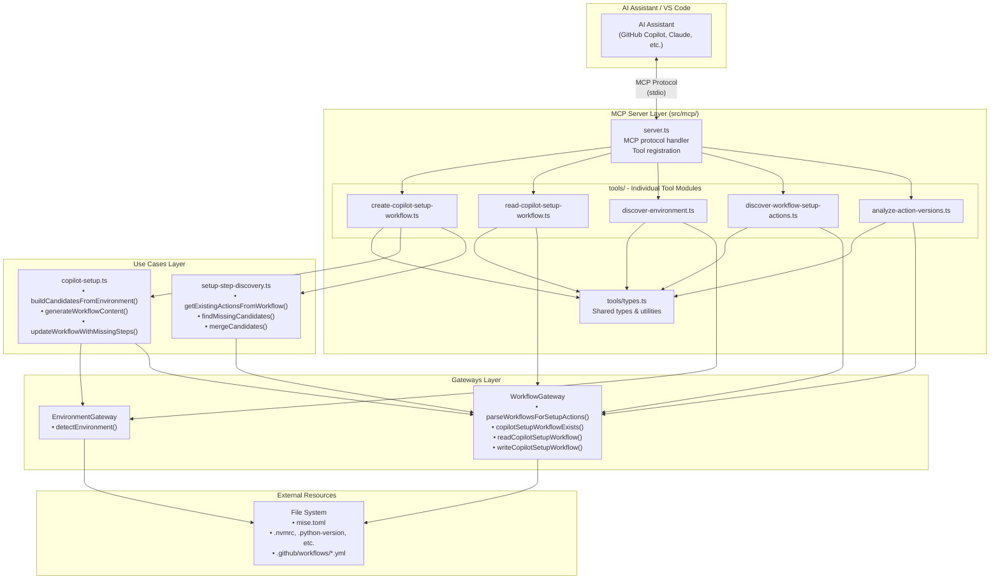
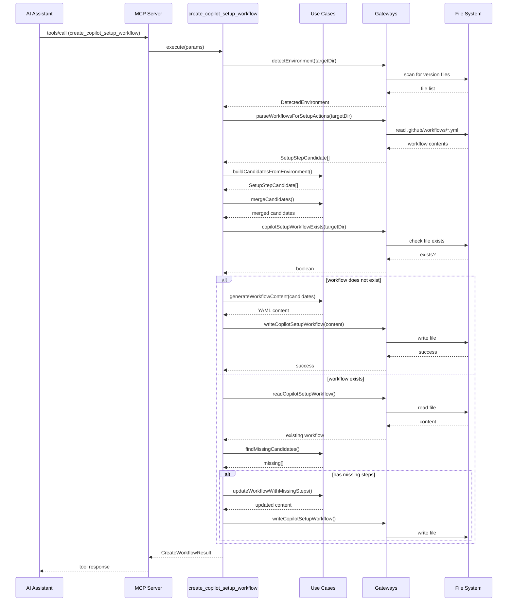
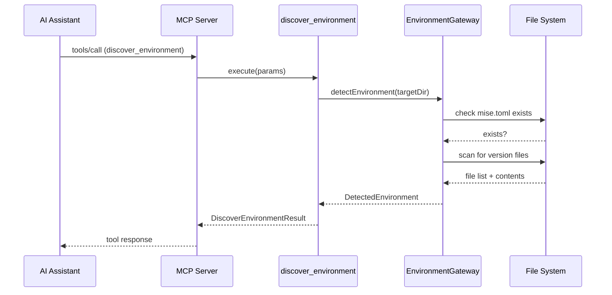

# Feature: MCP Server for Copilot Setup Steps Workflow Management

## Problem Statement

Software engineers using AI coding assistants like GitHub Copilot need a way to programmatically interact with the lousy-agents tooling from within their AI assistant conversations. Currently, the `copilot-setup` command can only be invoked via the CLI, which requires leaving the AI assistant context. An MCP (Model Context Protocol) server would expose the same capabilities as structured tools, allowing AI assistants to directly create, read, and update Copilot Setup Steps workflows, discover environment configurations, and analyze existing GitHub Actions workflows.

## Personas

| Persona | Impact | Notes |
|---------|--------|-------|
| Software Engineer Learning Vibe Coding | Positive | Primary user - can ask AI assistant to manage Copilot workflows without switching contexts |
| Platform Engineer | Positive | Can provide consistent tooling for teams via shared MCP configuration |
| Team Lead | Positive | Can standardize AI assistant capabilities across team for workflow management |

## Value Assessment

- **Primary value**: Efficiency — Eliminates context switching between AI assistant and CLI by providing direct tool access
- **Secondary value**: Customer — Improves AI assistant experience by enabling natural language requests like "set up my Copilot workflow"

## User Stories

### Story 1: Configure MCP Server in VS Code

As a **Software Engineer Learning Vibe Coding**,
I want **to add the lousy-agents MCP server to my VS Code MCP configuration**,
so that I can **access workflow management tools directly from my AI assistant**.

#### Acceptance Criteria

- The MCP server shall be configurable via VS Code's `mcp.json` configuration file
- When configured with a local path, the MCP server shall start via Node.js execution
- The MCP server shall expose available tools through the MCP protocol's `tools/list` method
- When the `tools/list` method is called, the MCP server shall return a list of all registered tools with their schemas
- If the configured path to the MCP server entry file is invalid, then the system shall return a descriptive error indicating the file cannot be found
- If Node.js is not found on the system PATH when starting the MCP server, then the system shall return a descriptive error indicating that Node.js is required to run the MCP server
- If the MCP server fails to start for any other reason, then the system shall return a descriptive error message

#### Notes

- MCP servers can be configured to run locally either via `node` execution of a JavaScript entry point (for example, `node path/to/dist/mcp-server.js`) or via the installed `lousy-agents-mcp` CLI defined in the package's `bin` field
- The server should support stdio transport for VS Code integration regardless of whether it is launched via `node` or the `lousy-agents-mcp` command

---

### Story 2: Create Copilot Setup Steps Workflow via MCP Tool

As a **Software Engineer Learning Vibe Coding**,
I want **to create a Copilot Setup Steps workflow by asking my AI assistant**,
so that I can **quickly scaffold the required workflow without leaving my conversation**.

#### Acceptance Criteria

- When the `create_copilot_setup_workflow` tool is called with a target directory, the MCP server shall scan the directory for environment configuration files (such as `mise.toml`, `.mise.toml`, `.node-version`, `.tool-versions`) and include any detected configurations in the tool response payload
- When the `create_copilot_setup_workflow` tool is called with a target directory, the MCP server shall parse existing workflows for setup actions
- When the `create_copilot_setup_workflow` tool is called and no `copilot-setup-steps.yml` exists, the MCP server shall create a new workflow file
- When the `create_copilot_setup_workflow` tool is called and `copilot-setup-steps.yml` exists, the MCP server shall update the workflow with missing steps
- The MCP server shall return a structured response indicating success or failure with details
- If the target directory does not exist, then the MCP server shall return an error with a descriptive message

#### Notes

- This tool wraps the existing `copilot-setup` command functionality
- The target directory defaults to the current working directory if not specified

---

### Story 3: Read Copilot Setup Steps Workflow via MCP Tool

As a **Software Engineer Learning Vibe Coding**,
I want **to read my existing Copilot Setup Steps workflow via an AI assistant**,
so that I can **understand and discuss my current configuration without opening files**.

#### Acceptance Criteria

- When the `read_copilot_setup_workflow` tool is called with a target directory, the MCP server shall read the `copilot-setup-steps.yml` file
- When the workflow exists, the MCP server shall return the parsed workflow structure
- When the workflow does not exist, the MCP server shall return a response indicating the workflow is missing
- The response shall include the list of setup steps currently configured

#### Notes

- Returns structured data that AI assistants can interpret and describe to users
- The target directory defaults to the current working directory if not specified

---

### Story 4: Discover Environment Configuration via MCP Tool

As a **Software Engineer Learning Vibe Coding**,
I want **to discover version file managers and environment configuration via an AI assistant**,
so that I can **understand what setup steps are appropriate for my project**.

#### Acceptance Criteria

- When the `discover_environment` tool is called with a target directory, the MCP server shall scan for `mise.toml`
- When the `discover_environment` tool is called with a target directory, the MCP server shall scan for idiomatic version files (`.nvmrc`, `.node-version`, `.python-version`, `.java-version`, `.ruby-version`, `.go-version`)
- The MCP server shall return a structured response containing detected configuration files and their contents
- The response shall indicate whether mise is present and what version files were found
- If the target directory does not exist, then the MCP server shall return an error with a descriptive message

#### Notes

- Reuses existing environment detection logic from gateways layer
- The target directory defaults to the current working directory if not specified

---

### Story 5: Discover Workflow Setup Actions via MCP Tool

As a **Software Engineer Learning Vibe Coding**,
I want **to discover setup actions used in my existing GitHub Actions workflows**,
so that I can **ensure consistency between my CI and Copilot workflows**.

#### Acceptance Criteria

- When the `discover_workflow_setup_actions` tool is called with a target directory, the MCP server shall parse all YAML files in `.github/workflows`
- The MCP server shall identify and return all setup actions (`actions/setup-*`, `jdx/mise-action`)
- The response shall include action name, version, and configuration parameters for each discovered action
- When no workflows exist, the MCP server shall return an empty list with an informative message
- If the target directory does not exist, then the MCP server shall return an error with a descriptive message

#### Notes

- Reuses existing workflow parsing logic from gateways layer
- The target directory defaults to the current working directory if not specified

---

### Story 6: Analyze GitHub Action Versions via MCP Tool

As a **Software Engineer Learning Vibe Coding**,
I want **to analyze the versions of GitHub Actions used in my workflows**,
so that I can **keep my actions up to date with AI assistant guidance**.

#### Acceptance Criteria

- When the `analyze_action_versions` tool is called with a target directory, the MCP server shall parse all workflow files
- The MCP server shall extract action references with their versions (tags or SHAs)
- The response shall include a list of unique actions with their current versions
- The response shall group actions by workflow file for context
- When no workflows exist, the MCP server shall return an empty list with an informative message

#### Notes

- Future enhancement could compare with latest versions from GitHub API
- Initially focuses on extraction and reporting of current versions
- The target directory defaults to the current working directory if not specified

---

## Design

> Refer to `.github/copilot-instructions.md` for technical standards.

### Components Affected

**MCP Server Layer (new):**
- `src/mcp/server.ts` — Main MCP server implementation using @modelcontextprotocol/sdk
- `src/mcp/server.test.ts` — Tests for MCP server initialization
- `src/mcp/tools/index.ts` — Tool registry and exports
- `src/mcp/tools/create-copilot-setup-workflow.ts` — Create/update workflow tool
- `src/mcp/tools/create-copilot-setup-workflow.test.ts` — Tests for create tool
- `src/mcp/tools/read-copilot-setup-workflow.ts` — Read workflow tool
- `src/mcp/tools/read-copilot-setup-workflow.test.ts` — Tests for read tool
- `src/mcp/tools/discover-environment.ts` — Environment discovery tool
- `src/mcp/tools/discover-environment.test.ts` — Tests for environment discovery
- `src/mcp/tools/discover-workflow-setup-actions.ts` — Workflow setup action discovery tool
- `src/mcp/tools/discover-workflow-setup-actions.test.ts` — Tests for workflow discovery
- `src/mcp/tools/analyze-action-versions.ts` — Action version analysis tool
- `src/mcp/tools/analyze-action-versions.test.ts` — Tests for action analysis
- `src/mcp/index.ts` — MCP module exports

**Entry Points:**
- `src/mcp-server.ts` — Standalone MCP server entry point for stdio transport
- `package.json` — Add MCP server bin entry and dependencies

**Existing Components (reused, no changes):**
- `src/gateways/environment-gateway.ts` — Environment detection
- `src/gateways/workflow-gateway.ts` — Workflow parsing and writing
- `src/use-cases/copilot-setup.ts` — Candidate building and workflow generation
- `src/use-cases/setup-step-discovery.ts` — Setup step discovery logic

### Dependencies

- `@modelcontextprotocol/sdk` (new) — Official MCP SDK for TypeScript
- `zod` (existing) — For tool parameter validation
- `consola` (existing) — For logging

### Data Model Changes

**Tool Response Types (new):**

```typescript
interface CreateWorkflowResult {
  success: boolean;
  action: "created" | "updated" | "no_changes_needed";
  workflowPath: string;
  stepsAdded: string[];
  message: string;
}

interface ReadWorkflowResult {
  exists: boolean;
  workflowPath: string;
  workflow?: {
    name: string;
    steps: Array<{
      name?: string;
      uses: string;
      with?: Record<string, unknown>;
    }>;
  };
  message: string;
}

interface DiscoverEnvironmentResult {
  hasMise: boolean;
  versionFiles: Array<{
    type: string;
    filename: string;
    version?: string;
  }>;
  message: string;
}

interface DiscoverSetupActionsResult {
  actions: Array<{
    action: string;
    version?: string;
    config?: Record<string, unknown>;
    source: "version-file" | "workflow";
  }>;
  message: string;
}

interface AnalyzeActionVersionsResult {
  workflows: Array<{
    file: string;
    actions: Array<{
      name: string;
      version: string;
      line?: number;
    }>;
  }>;
  uniqueActions: Array<{
    name: string;
    versions: string[];
  }>;
  message: string;
}
```

### Data Flow Diagram



### Sequence Diagram: Create Workflow Tool



### Sequence Diagram: Discover Environment Tool



### Architecture Notes

The MCP server implementation follows the same Clean Architecture principles as the existing codebase:

1. **MCP Layer** (`src/mcp/`): A new layer that handles MCP protocol specifics and tool definitions. This layer acts as an adapter between the MCP protocol and existing use cases.

2. **Tool Pattern**: Each tool is a standalone module that:
   - Defines its schema using Zod for parameter validation
   - Imports and uses existing gateways and use cases
   - Returns structured results following MCP conventions

3. **Reuse Strategy**: The MCP tools reuse existing gateway implementations and use case logic without modification. This ensures consistency between CLI and MCP interfaces.

4. **Transport**: The server uses stdio transport which is the standard for VS Code MCP integration. This allows the server to run as a subprocess spawned by the AI assistant.

### Open Questions

- [x] Should the MCP server be a separate entry point or integrated into the main CLI? — Separate entry point (`src/mcp-server.ts`) for clean separation
- [ ] Should we add SSE transport for potential web-based integrations? — Future consideration, start with stdio only
- [ ] Should the `analyze_action_versions` tool fetch latest versions from GitHub API? — Deferred for future enhancement

---

## Tasks

> Each task should be completable in a single coding agent session.
> Tasks are sequenced by dependency. Complete in order unless noted.

### Task 1: Add @modelcontextprotocol/sdk dependency

**Objective**: Add the official MCP SDK as a project dependency

**Context**: This establishes the foundation for building MCP tools using the official TypeScript SDK

**Affected files**:
- `package.json`
- `package-lock.json`

**Requirements**:
- The @modelcontextprotocol/sdk package shall be added as a production dependency
- The dependency shall be pinned to an exact version

**Verification**:
- [x] `npm install` completes successfully
- [x] `npm audit` shows no new vulnerabilities
- [x] Package is listed in package.json dependencies

**Done when**:
- [x] All verification steps pass
- [x] No new errors in affected files
- [x] Dependency is correctly added to package.json

---

### Task 2: Create MCP server infrastructure

**Objective**: Create the base MCP server setup with stdio transport

**Context**: This establishes the MCP server that will host all tools

**Depends on**: Task 1

**Affected files**:
- `src/mcp/server.ts` (new)
- `src/mcp/server.test.ts` (new)
- `src/mcp/index.ts` (new)
- `src/mcp-server.ts` (new) — Entry point for MCP server
- `package.json` — Add bin entry for mcp-server

**Requirements**:
- The MCP server shall initialize with the @modelcontextprotocol/sdk
- The MCP server shall use stdio transport for VS Code integration
- The MCP server shall expose server info via the MCP protocol
- The MCP server entry point shall be executable via Node.js
- The `package.json` bin section shall include an entry for `lousy-agents-mcp` pointing to `dist/mcp-server.js`

**Verification**:
- [x] `npm test src/mcp/server.test.ts` passes
- [x] `mise run format-check` passes
- [x] `npm run build` compiles successfully
- [x] `node dist/mcp-server.js` starts without errors (and can receive MCP protocol messages)

**Done when**:
- [x] All verification steps pass
- [x] No new errors in affected files
- [x] MCP server initializes correctly
- [x] Code follows patterns in `.github/copilot-instructions.md`

---

### Task 3: Implement discover_environment tool

**Objective**: Create MCP tool that discovers environment configuration files

**Context**: This tool exposes the existing environment detection functionality via MCP

**Depends on**: Task 2

**Affected files**:
- `src/mcp/server.ts` — Tool implemented inline with other tools

**Requirements**:
- When called, the tool shall scan for `mise.toml` and version files
- The tool shall return structured response with detected configuration
- If target directory does not exist, then the tool shall return an error

**Verification**:
- [x] `npm test src/mcp/server.test.ts` passes (tests included in server.test.ts)
- [x] `mise run format-check` passes
- [x] Tool correctly detects mise.toml presence
- [x] Tool correctly detects version files

**Done when**:
- [x] All verification steps pass
- [x] No new errors in affected files
- [x] Tool reuses existing EnvironmentGateway
- [x] Code follows patterns in `.github/copilot-instructions.md`

---

### Task 4: Implement discover_workflow_setup_actions tool

**Objective**: Create MCP tool that discovers setup actions in existing workflows

**Context**: This tool exposes the existing workflow parsing functionality via MCP

**Depends on**: Task 3

**Affected files**:
- `src/mcp/server.ts` — Tool implemented inline with other tools

**Requirements**:
- When called, the tool shall parse all workflow YAML files
- The tool shall identify and return setup actions with versions
- When no workflows exist, the tool shall return empty list with message

**Verification**:
- [x] `npm test src/mcp/server.test.ts` passes (tests included in server.test.ts)
- [x] `mise run format-check` passes
- [x] Tool correctly parses workflow files
- [x] Tool extracts action versions and config

**Done when**:
- [x] All verification steps pass
- [x] No new errors in affected files
- [x] Tool reuses existing WorkflowGateway
- [x] Code follows patterns in `.github/copilot-instructions.md`

---

### Task 5: Implement read_copilot_setup_workflow tool

**Objective**: Create MCP tool that reads existing Copilot Setup Steps workflow

**Context**: This tool allows AI assistants to inspect current workflow configuration

**Depends on**: Task 4

**Affected files**:
- `src/mcp/server.ts` — Tool implemented inline with other tools

**Requirements**:
- When called, the tool shall read `copilot-setup-steps.yml`
- When workflow exists, the tool shall return parsed workflow structure
- When workflow does not exist, the tool shall return informative response

**Verification**:
- [x] `npm test src/mcp/server.test.ts` passes (tests included in server.test.ts)
- [x] `mise run format-check` passes
- [x] Tool correctly reads existing workflow
- [x] Tool handles missing workflow gracefully

**Done when**:
- [x] All verification steps pass
- [x] No new errors in affected files
- [x] Tool reuses existing WorkflowGateway
- [x] Code follows patterns in `.github/copilot-instructions.md`

---

### Task 6: Implement create_copilot_setup_workflow tool

**Objective**: Create MCP tool that creates or updates Copilot Setup Steps workflow

**Context**: This is the main tool that wraps the copilot-setup command functionality

**Depends on**: Tasks 3 (environment detection), 4 (workflow parsing), and 5 (integration)

**Affected files**:
- `src/mcp/server.ts` — Tool implemented inline with other tools

**Requirements**:
- When called, the tool shall detect environment and parse existing workflows
- When no copilot-setup-steps.yml exists, the tool shall create new workflow
- When copilot-setup-steps.yml exists, the tool shall update with missing steps
- The tool shall return structured result with action taken and steps added

**Verification**:
- [x] `npm test src/mcp/server.test.ts` passes (tests included in server.test.ts)
- [x] `mise run format-check` passes
- [x] Tool creates new workflow correctly
- [x] Tool updates existing workflow correctly

**Done when**:
- [x] All verification steps pass
- [x] No new errors in affected files
- [x] Tool reuses existing use cases and gateways
- [x] Code follows patterns in `.github/copilot-instructions.md`

---

### Task 7: Implement analyze_action_versions tool

**Objective**: Create MCP tool that analyzes GitHub Action versions across workflows

**Context**: This tool helps users understand what action versions are in use for maintenance

**Depends on**: Task 6

**Affected files**:
- `src/mcp/server.ts` — Tool implemented inline with other tools

**Requirements**:
- When called, the tool shall parse all workflow files for action references
- The tool shall extract action name and version for each usage
- The tool shall group actions by workflow file
- The tool shall provide unique action list with all versions used

**Verification**:
- [x] `npm test src/mcp/server.test.ts` passes (tests included in server.test.ts)
- [x] `mise run format-check` passes
- [x] Tool extracts all action references
- [x] Tool correctly groups by workflow

**Done when**:
- [x] All verification steps pass
- [x] No new errors in affected files
- [x] Action extraction works for various version formats
- [x] Code follows patterns in `.github/copilot-instructions.md`

---

### Task 8: Integration testing and documentation

**Objective**: Perform end-to-end testing and add usage documentation

**Context**: Final verification ensures MCP server works correctly with VS Code

**Depends on**: Task 7

**Affected files**:
- `README.md` — Add MCP server usage instructions

**Requirements**:
- Manual test shall verify MCP server starts via node execution
- Manual test shall verify tools respond to MCP protocol messages
- Documentation shall include VS Code mcp.json configuration example
- Full validation suite shall pass

**Verification**:
- [x] `npm test` passes (all tests including new MCP tests)
- [x] `mise run format-check` passes
- [x] `npm run build` compiles successfully
- [ ] `mise run ci && npm run build` passes (full validation suite) - yamllint has pre-existing issues with node_modules
- [x] MCP server starts and responds to tool calls
- [x] README includes MCP configuration example

**Done when**:
- [x] All verification steps pass
- [x] Feature works correctly in manual testing
- [x] Documentation is complete
- [x] No regressions in existing functionality

---

## Out of Scope

- SSE or HTTP transport for MCP server (stdio only for VS Code integration)
- Fetching latest action versions from GitHub API (future enhancement)
- Interactive prompts within MCP tools (tools should be fully automated)
- MCP resources or prompts (focus on tools only for MVP)
- Integration with other AI assistants beyond VS Code (but protocol is compatible)

## Future Considerations

- Add SSE transport for web-based AI assistants
- Add `get_latest_action_versions` tool that queries GitHub API
- Add MCP resources for exposing workflow templates
- Add MCP prompts for common workflow generation scenarios
- Add tool for validating workflow YAML syntax
- Add tool for diffing current vs. recommended workflow configuration
- Consider caching environment detection results for performance
