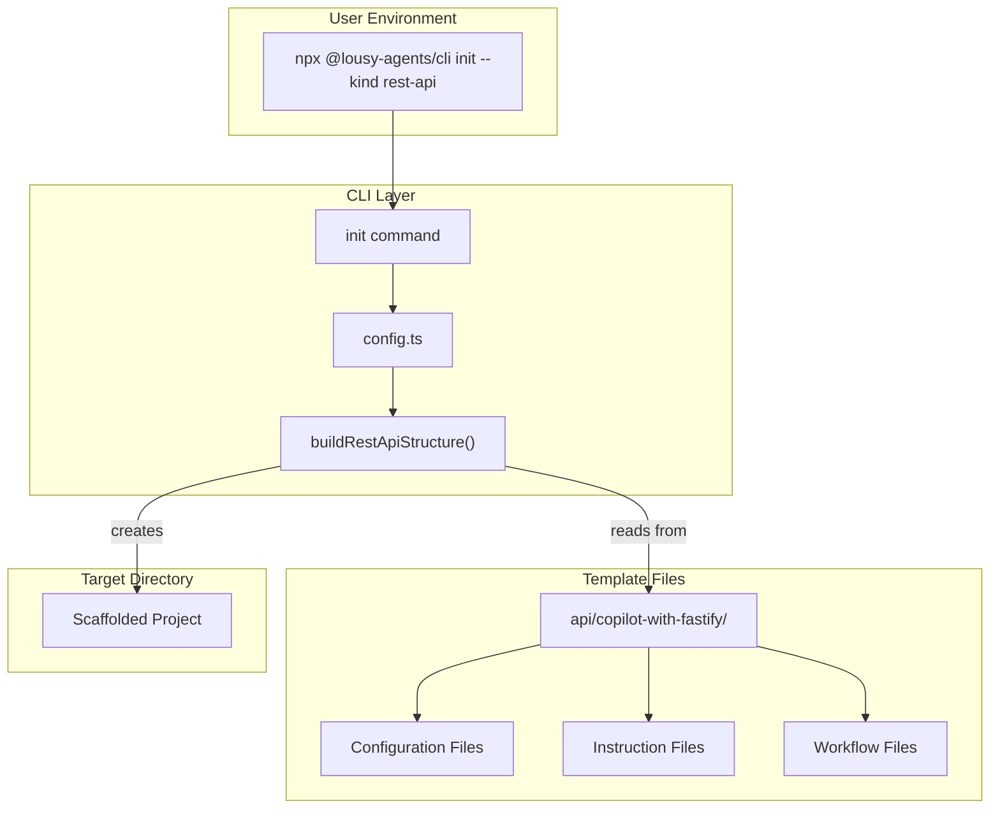
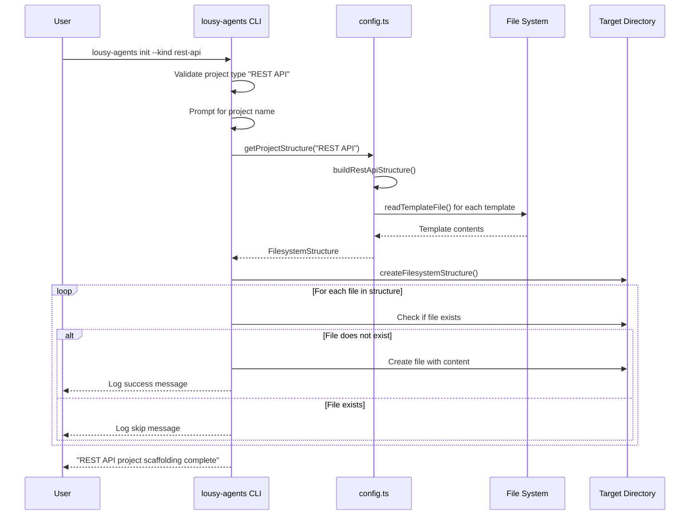

# Feature: REST API Scaffolding for Init Command

## Problem Statement

Software engineers learning vibe coding need a way to quickly scaffold a new REST API project with Fastify, TypeScript, and proper testing setup including database integration tests with Testcontainers. Without pre-configured scaffolding, developers must manually create configuration files, set up testing infrastructure, configure database access patterns, and configure GitHub Actions for integration testing—which is time-consuming and error-prone. This feature enables developers to scaffold a complete REST API project structure by selecting "REST API" from the init command's project type menu.

## Personas

| Persona | Impact | Notes |
|---------|--------|-------|
| Software Engineer Learning Vibe Coding | Positive | Primary user - gets a fully-configured Fastify REST API with testing, database integration, and linting setup |
| Backend Developer | Positive | Receives a complete Fastify/TypeScript development environment with Clean Architecture patterns ready to use |
| Team Lead | Positive | Can ensure consistent REST API project setup across team members |
| Platform Engineer | Positive | Gets pre-configured GitHub Actions workflows with Testcontainers for CI/CD |

## Value Assessment

- **Primary value**: Efficiency — Eliminates hours of manual configuration by providing a complete REST API project structure with testing, linting, database integration patterns, and build tools pre-configured
- **Secondary value**: Customer — Improves user experience by reducing friction in starting new REST API projects and providing production-ready tooling with Clean Architecture patterns from day one

## User Stories

### Story 1: Scaffold REST API Project Files

As a **Software Engineer Learning Vibe Coding**,
I want **to select "REST API" from the init command and have all necessary REST API configuration files created**,
so that I can **immediately start building API features without spending time on project setup**.

#### Acceptance Criteria

- When the user selects "REST API" from the init prompt, the system shall create a `package.json` file with Fastify, TypeScript, Kysely, Postgres.js, and testing dependencies if it does not exist
- When the user selects "REST API", the system shall create a `tsconfig.json` file with Node.js-appropriate TypeScript configuration if it does not exist
- When the user selects "REST API", the system shall create a `vitest.config.ts` file with Fastify testing configuration if it does not exist
- When the user selects "REST API", the system shall create a `vitest.setup.ts` file with testing library setup if it does not exist
- When the user selects "REST API", the system shall create a `biome.json` file with linting and formatting rules if it does not exist
- When the user selects "REST API", the system shall create a `.editorconfig` file with consistent editor settings if it does not exist
- When the user selects "REST API", the system shall create a `.nvmrc` file specifying the Node.js version if it does not exist
- The system shall preserve existing files without modification
- When existing files are encountered, the system shall skip them and continue scaffolding remaining files

#### Notes

- The REST API scaffolding uses Fastify as the web framework for its performance and plugin ecosystem
- Uses Kysely + Postgres.js for type-safe database access instead of Prisma
- All configuration files should contain working, production-ready settings
- Dependencies should use exact versions (no ^ or ~)

### Story 2: Scaffold REST API Instructions and Guidelines

As a **Software Engineer Learning Vibe Coding**,
I want **the REST API scaffolding to include GitHub Copilot instructions tailored for REST API development**,
so that I can **receive appropriate AI assistance for my REST API project using Clean Architecture patterns**.

#### Acceptance Criteria

- When the user selects "REST API", the system shall create a `.github/copilot-instructions.md` file with REST API-specific instructions including Fastify, Kysely, and Clean Architecture guidance if it does not exist
- When the user selects "REST API", the system shall create a `.github/instructions` directory if it does not exist
- When the user selects "REST API", the system shall create a `.github/instructions/test.instructions.md` file with REST API testing guidelines including Testcontainers for integration tests if it does not exist
- When the user selects "REST API", the system shall create a `.github/instructions/spec.instructions.md` file with spec development guidelines if it does not exist
- When the user selects "REST API", the system shall create a `.github/instructions/pipeline.instructions.md` file with CI/CD guidelines including Testcontainers in GitHub Actions if it does not exist
- When the user selects "REST API", the system shall create a `.github/instructions/software-architecture.instructions.md` file with Clean Architecture guidance for REST APIs if it does not exist
- The system shall preserve existing instruction files without modification

#### Notes

- Instruction files should be tailored for Fastify REST API development
- Content should include Clean Architecture patterns adapted for REST APIs
- Testcontainers guidance should be included for database integration testing
- Architecture instructions should demonstrate Kysely + Postgres.js usage patterns

### Story 3: Scaffold Additional REST API Configuration

As a **Software Engineer Learning Vibe Coding**,
I want **additional configuration files for code quality, development environment, and CI/CD**,
so that I can **have a consistent and well-configured development experience with proper integration testing**.

#### Acceptance Criteria

- When the user selects "REST API", the system shall create a `.yamllint` file with YAML linting rules if it does not exist
- When the user selects "REST API", the system shall create a `.vscode/extensions.json` file with recommended VSCode extensions if it does not exist
- When the user selects "REST API", the system shall create a `.vscode/launch.json` file with debugging configuration for Fastify if it does not exist
- When the user selects "REST API", the system shall create a `.devcontainer/devcontainer.json` file with development container configuration including PostgreSQL service if it does not exist
- When the user selects "REST API", the system shall create a `.github/workflows/assign-copilot.yml` file for auto-assigning Copilot on spec issues if it does not exist
- When the user selects "REST API", the system shall create a `.github/workflows/ci.yml` file with test and lint jobs including Testcontainers support if it does not exist
- When the user selects "REST API", the system shall create a `.github/ISSUE_TEMPLATE/feature-to-spec.yml` file for spec-driven development if it does not exist
- When the user selects "REST API", the system shall create a `.github/specs/README.md` file with specification directory guidance if it does not exist
- The system shall preserve existing configuration files without modification

#### Notes

- These files improve the development experience and enable CI/CD
- Configuration should match patterns from the webapp template where applicable
- CI workflow should include PostgreSQL service for Testcontainers
- Devcontainer should support Docker-outside-of-Docker for Testcontainers

---

## Design

> Refer to `.github/copilot-instructions.md` for technical standards.

### Data Flow Diagram

### Sequence Diagram

### Components Affected

- `src/lib/config.ts` — Add REST API structure configuration with all required files and their content
- `src/commands/init.ts` — Update to call REST API scaffolding when REST API is selected
- `src/commands/init.test.ts` — Add tests for REST API scaffolding
- `api/copilot-with-fastify/` — New source directory for REST API template files
- `package.json` — Add `api` directory to `files` array for npm package inclusion

### Dependencies

- Node.js `fs/promises` (already in use) — For reading template files
- `c12` (already in use) — For configuration management
- `consola` (already in use) — For logging and user feedback

### Data Model Changes

The current `FilesystemNode` types need no changes as they already support file content. The REST API template will use the same pattern as the webapp template for lazy-loading template content.

### Open Questions

- [x] Should we use Prisma or an alternative for database access? — Use Kysely + Postgres.js for type-safe, non-ORM database access as specified in requirements
- [x] What database should we target? — PostgreSQL as specified in requirements
- [x] How should Testcontainers be configured in GitHub Actions? — Use services for PostgreSQL and configure Docker-outside-of-Docker in workflows

---

## Tasks

> Each task should be completable in a single coding agent session.
> Tasks are sequenced by dependency. Complete in order unless noted.

### Task 1: Create REST API template directory structure

**Objective**: Create the `api/copilot-with-fastify/` directory with all configuration and template files

**Context**: This establishes the template files that will be read by the config.ts when scaffolding REST API projects. This is the foundation for all REST API scaffolding.

**Affected files**:
- `api/copilot-with-fastify/package.json`
- `api/copilot-with-fastify/tsconfig.json`
- `api/copilot-with-fastify/vitest.config.ts`
- `api/copilot-with-fastify/vitest.setup.ts`
- `api/copilot-with-fastify/biome.json`
- `api/copilot-with-fastify/.editorconfig`
- `api/copilot-with-fastify/.nvmrc`
- `api/copilot-with-fastify/.yamllint`

**Requirements**:
- The template shall include package.json with Fastify, Kysely, Postgres.js, and testing dependencies
- The template shall include tsconfig.json with Node.js-appropriate TypeScript configuration
- The template shall include vitest.config.ts with Fastify testing configuration
- All configuration files shall follow patterns from the webapp template where applicable

**Verification**:
- [ ] `api/copilot-with-fastify/` directory exists with all configuration files
- [ ] All JSON files are valid JSON
- [ ] `mise run lint` passes for YAML files

**Done when**:
- [ ] All verification steps pass
- [ ] No new errors in affected files
- [ ] All configuration files are created with appropriate content

---

### Task 2: Create REST API copilot-instructions.md

**Depends on**: Task 1

**Objective**: Create the main copilot-instructions.md file tailored for Fastify REST API development with Clean Architecture patterns

**Context**: This is the primary instruction file that guides AI assistants when working on REST API projects. It blends patterns from the root .github and ui/copilot-with-react/.github instructions.

**Affected files**:
- `api/copilot-with-fastify/.github/copilot-instructions.md`

**Requirements**:
- Instructions shall include Fastify-specific TDD workflow guidance
- Instructions shall include Kysely + Postgres.js database access patterns
- Instructions shall include Clean Architecture principles adapted for REST APIs
- Instructions shall reference Testcontainers for integration testing

**Verification**:
- [ ] `.github/copilot-instructions.md` exists in template directory
- [ ] File includes Fastify, Kysely, and Clean Architecture guidance
- [ ] File follows similar structure to webapp template instructions

**Done when**:
- [ ] All verification steps pass
- [ ] No new errors in affected files
- [ ] Instructions are comprehensive and tailored for REST API development

---

### Task 3: Create REST API instruction files

**Depends on**: Task 2

**Objective**: Create test.instructions.md, spec.instructions.md, pipeline.instructions.md, and software-architecture.instructions.md files for REST API development

**Context**: These instruction files provide specialized guidance for testing, specifications, CI/CD pipelines, and architecture patterns specific to REST API development.

**Affected files**:
- `api/copilot-with-fastify/.github/instructions/test.instructions.md`
- `api/copilot-with-fastify/.github/instructions/spec.instructions.md`
- `api/copilot-with-fastify/.github/instructions/pipeline.instructions.md`
- `api/copilot-with-fastify/.github/instructions/software-architecture.instructions.md`

**Requirements**:
- test.instructions.md shall include Testcontainers guidance for database integration tests
- pipeline.instructions.md shall include GitHub Actions configuration with PostgreSQL service
- software-architecture.instructions.md shall include Clean Architecture patterns with Fastify and Kysely
- All files shall follow EARS format for any requirements

**Verification**:
- [ ] All instruction files exist in `.github/instructions/` directory
- [ ] test.instructions.md includes Testcontainers examples
- [ ] software-architecture.instructions.md includes Kysely usage examples

**Done when**:
- [ ] All verification steps pass
- [ ] No new errors in affected files
- [ ] All instruction files are comprehensive and REST API-specific

---

### Task 4: Create REST API GitHub workflows and templates

**Depends on**: Task 3

**Objective**: Create GitHub workflow files, issue templates, and specs README for REST API projects

**Context**: These files enable CI/CD with Testcontainers and spec-driven development workflows for REST API projects.

**Affected files**:
- `api/copilot-with-fastify/.github/workflows/assign-copilot.yml`
- `api/copilot-with-fastify/.github/workflows/ci.yml`
- `api/copilot-with-fastify/.github/ISSUE_TEMPLATE/feature-to-spec.yml`
- `api/copilot-with-fastify/.github/specs/README.md`

**Requirements**:
- ci.yml shall include PostgreSQL service for Testcontainers support
- ci.yml shall include lint and test jobs
- assign-copilot.yml shall follow same pattern as webapp template
- All workflow actions shall be pinned to exact commit SHA with version comments

**Verification**:
- [ ] All workflow files exist in `.github/workflows/` directory
- [ ] `mise run lint` passes for all YAML files
- [ ] ci.yml includes PostgreSQL service configuration

**Done when**:
- [ ] All verification steps pass
- [ ] No new errors in affected files
- [ ] All workflows are properly configured for REST API projects

---

### Task 5: Create REST API VSCode and devcontainer configuration

**Depends on**: Task 4

**Objective**: Create VSCode extensions, launch configuration, and devcontainer configuration for REST API development

**Context**: These files improve the development experience and enable consistent development environments with database support.

**Affected files**:
- `api/copilot-with-fastify/.vscode/extensions.json`
- `api/copilot-with-fastify/.vscode/launch.json`
- `api/copilot-with-fastify/.devcontainer/devcontainer.json`

**Requirements**:
- devcontainer.json shall include Docker-outside-of-Docker feature for Testcontainers
- launch.json shall include Fastify debugging configuration
- All configuration files shall follow patterns from webapp template where applicable

**Verification**:
- [ ] All VSCode and devcontainer files exist
- [ ] All JSON files are valid JSON
- [ ] devcontainer.json includes Docker-outside-of-Docker feature

**Done when**:
- [ ] All verification steps pass
- [ ] No new errors in affected files
- [ ] All configuration files are appropriate for REST API development

---

### Task 6: Update config.ts for REST API scaffolding

**Depends on**: Task 5

**Objective**: Add REST API structure configuration to config.ts following the webapp pattern

**Context**: This connects the REST API template files to the init command, enabling the scaffolding to work.

**Affected files**:
- `src/lib/config.ts`

**Requirements**:
- config.ts shall define a buildRestApiStructure function following the webapp pattern
- config.ts shall lazy-load REST API structure only when requested
- getProjectStructure shall return REST API structure for "REST API" project type

**Verification**:
- [ ] `npm test src/lib/config.test.ts` passes
- [ ] `mise run format-check` passes
- [ ] Code follows same pattern as webapp structure

**Done when**:
- [ ] All verification steps pass
- [ ] No new errors in affected files
- [ ] REST API structure is properly configured

---

### Task 7: Update init.ts for REST API scaffolding

**Depends on**: Task 6

**Objective**: Add REST API scaffolding logic to the init command

**Context**: This enables users to select "REST API" and have the scaffolding created.

**Affected files**:
- `src/commands/init.ts`

**Requirements**:
- When the user selects "REST API", the system shall load the REST API structure from configuration
- When the user selects "REST API", the system shall call createFilesystemStructure with the REST API structure
- When the user selects "REST API", the system shall prompt for project name
- The system shall log appropriate success messages

**Verification**:
- [ ] `npm test src/commands/init.test.ts` passes
- [ ] `mise run format-check` passes
- [ ] Code follows same pattern as webapp scaffolding

**Done when**:
- [ ] All verification steps pass
- [ ] No new errors in affected files
- [ ] REST API scaffolding logic is implemented

---

### Task 8: Add tests for REST API scaffolding

**Depends on**: Task 7

**Objective**: Add comprehensive tests for REST API scaffolding functionality

**Context**: Ensures REST API scaffolding works correctly, creates expected files, and preserves existing files.

**Affected files**:
- `src/commands/init.test.ts`
- `src/lib/config.test.ts`

**Requirements**:
- Tests shall verify REST API scaffolding creates expected files in empty directory
- Tests shall verify REST API scaffolding preserves existing files
- Tests shall verify REST API scaffolding creates .github/copilot-instructions.md
- Tests shall follow same testing patterns as webapp scaffolding tests

**Verification**:
- [ ] `npm test` passes
- [ ] `mise run format-check` passes
- [ ] All REST API scaffolding scenarios are tested

**Done when**:
- [ ] All verification steps pass
- [ ] No new errors in affected files
- [ ] REST API scaffolding is fully tested

---

### Task 9: Update package.json for npm bundle

**Depends on**: Task 8

**Objective**: Add `api` directory to package.json files array for npm package inclusion

**Context**: Ensures template files are included when the package is published to npm.

**Affected files**:
- `package.json`

**Requirements**:
- When the package is published to npm, the system shall include the `api` directory in the bundle
- The bundle shall include all REST API template files

**Verification**:
- [ ] `npm pack --dry-run` shows `api/` directory contents included
- [ ] `mise run ci && npm run build` passes

**Done when**:
- [ ] All verification steps pass
- [ ] No new errors in affected files
- [ ] Template files will be included in published package

---

### Task 10: Manual verification and validation

**Depends on**: Task 9

**Objective**: Manually test the REST API scaffolding end-to-end and run full validation suite

**Context**: Final verification to ensure the feature works as expected from a user perspective.

**Affected files**:
- N/A (manual testing)

**Requirements**:
- Manual test shall verify `npm link && lousy-agents init` works
- Manual test shall verify selecting "REST API" creates all expected files
- Manual test shall verify content of created files matches reference
- Manual test shall verify running init in existing directory preserves files
- Full validation suite shall pass

**Verification**:
- [ ] `npm link` succeeds
- [ ] `lousy-agents init` runs without errors
- [ ] Selecting "REST API" creates expected files
- [ ] Created files have correct content
- [ ] Running init again preserves existing files
- [ ] `mise run ci && npm run build` passes

**Done when**:
- [ ] All manual verification steps pass
- [ ] Full validation suite passes
- [ ] Feature is ready for use
- [ ] No regressions in existing functionality

---

## Out of Scope

- Smart merging of package.json with existing dependencies (preserve existing files for now)
- Creating src/ directory structure with example routes or handlers (configuration only)
- Database migration tooling setup
- Docker Compose configuration for local development
- README.md generation with project-specific content
- npm install or dependency installation (users run this manually)
- Example API routes or handlers

## Future Considerations

- Add intelligent merging for package.json to combine dependencies
- Create example REST API routes and handlers demonstrating Clean Architecture
- Add database migration tooling (e.g., Kysely migrations)
- Generate project-specific README.md
- Add Docker Compose for local PostgreSQL development
- Support customization of REST API scaffolding through configuration
- Add example integration tests with Testcontainers
- Add OpenAPI/Swagger documentation generation
