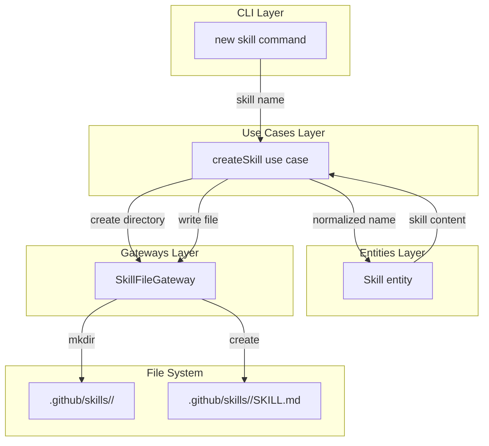
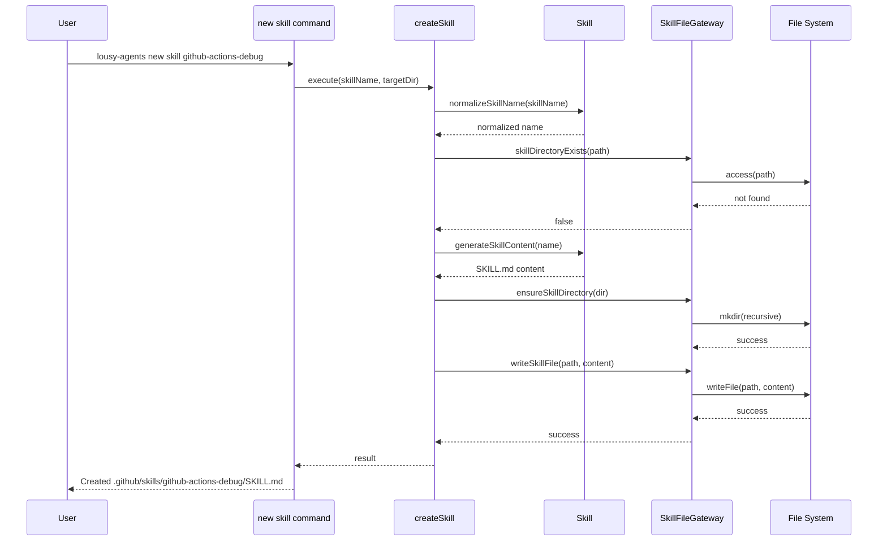

# Feature: Agent Skill Scaffolding via CLI

## Problem Statement

Developers need to create GitHub Copilot Agent Skills to teach Copilot how to perform specialized tasks. Creating skill directories and SKILL.md files manually is error-prone and requires memorizing the required structure. This command scaffolds repository-level agent skills with proper directory structure, YAML frontmatter, and example content to reduce friction and ensure consistency.

## Personas

| Persona | Impact | Notes |
|---------|--------|-------|
| Software Engineer Learning Vibe Coding | Positive | Primary user — gets properly structured skill directories with documentation links |
| Team Lead | Positive | Can ensure consistent skill configuration across team members |

## Value Assessment

- **Primary value**: Efficiency — Reduces setup time by generating properly structured skill directories with correct SKILL.md files
- **Secondary value**: Customer — Improves user experience by eliminating need to memorize skill structure and providing documentation links

## User Stories

### Story 1: Basic Skill Creation

As a **Software Engineer Learning Vibe Coding**,
I want **to create a new Agent Skill using a CLI command**,
so that I can **quickly scaffold a properly structured skill directory without memorizing the configuration structure**.

#### Acceptance Criteria

- When the user runs `lousy-agents new skill <name>`, the CLI shall create a new directory at `.github/skills/<name>/`
- When the user runs `lousy-agents new skill <name>`, the CLI shall create a `SKILL.md` file inside the skill directory
- The CLI shall include YAML frontmatter with `name` and `description` fields in the generated SKILL.md file
- The CLI shall include example instructions and guidelines in the generated SKILL.md file
- The CLI shall include a comment with a link to GitHub's Agent Skills documentation in the generated file

#### Notes

- The generated skill should follow GitHub's Agent Skills specification
- Example content should be generic but illustrative of skill capabilities

---

### Story 2: Skill Name Normalization

As a **Software Engineer Learning Vibe Coding**,
I want **skill names with spaces or mixed case to be normalized to lowercase with hyphens**,
so that I can **use natural language names while getting valid directory names**.

#### Acceptance Criteria

- When the user provides a skill name with spaces (e.g., "Test Specialist"), the CLI shall normalize it to lowercase with hyphens (e.g., `test-specialist`)
- When the user provides a skill name with mixed case (e.g., "TestSpecialist"), the CLI shall normalize it to lowercase with hyphens

#### Notes

- Normalization should handle common edge cases like multiple spaces, leading/trailing spaces

---

### Story 3: Directory Creation

As a **Software Engineer Learning Vibe Coding**,
I want **the `.github/skills` directory to be created automatically if it doesn't exist**,
so that I can **create skills in new repositories without manual setup**.

#### Acceptance Criteria

- When the user runs `lousy-agents new skill <name>` in a repository without `.github/skills`, the CLI shall create the `.github/skills` directory
- The CLI shall create the skill subdirectory inside the newly created skills directory

#### Notes

- The `.github` directory should also be created if it doesn't exist

---

### Story 4: Prevent Overwriting Existing Skills

As a **Software Engineer Learning Vibe Coding**,
I want **the CLI to prevent overwriting existing skill directories**,
so that I can **safely run the command without losing my customizations**.

#### Acceptance Criteria

- If the target skill directory already exists, the CLI shall display an error message indicating the skill already exists
- If the target skill directory already exists, the CLI shall not modify the existing directory

#### Notes

- Error message should include the full path to the existing skill directory

---

### Story 5: Help Documentation

As a **Software Engineer Learning Vibe Coding**,
I want **to see usage information for the `new skill` subcommand**,
so that I can **understand how to use the command correctly**.

#### Acceptance Criteria

- When the user runs `lousy-agents new skill --help`, the CLI shall display usage information with examples

#### Notes

- Help text should include example usage

---

### Story 6: Multiple Skills

As a **Software Engineer Learning Vibe Coding**,
I want **to create multiple skill directories independently**,
so that I can **build a collection of specialized skills for different tasks**.

#### Acceptance Criteria

- When the user runs `lousy-agents new skill <name>` multiple times with different names, the CLI shall create separate skill directories in `.github/skills/`
- Each generated skill shall have appropriate example content based on the name

#### Notes

- Skill directories should be independent and not interfere with each other

---

## Design

> Refer to `.github/copilot-instructions.md` for technical standards.

### Components Affected

- `src/entities/skill.ts` (new) — Entity for skill file structure and content generation
- `src/entities/skill.test.ts` (new) — Tests for the skill entity
- `src/gateways/skill-file-gateway.ts` (new) — Gateway for skill file system operations
- `src/gateways/skill-file-gateway.test.ts` (new) — Tests for the gateway
- `src/use-cases/create-skill.ts` (new) — Use case for creating skills
- `src/use-cases/create-skill.test.ts` (new) — Tests for the use case
- `src/commands/new.ts` — Add `skill` subcommand support
- `src/commands/new.test.ts` — Add tests for skill subcommand
- `src/index.ts` — Register the skill subcommand

### Dependencies

- `citty` — For command definition and argument parsing
- `consola` — For user feedback and error messages
- Node.js `fs/promises` — For file system operations

### Data Model Changes

None — this feature does not persist state beyond file system operations.

### Diagrams

#### Data Flow Diagram

#### Sequence Diagram

### Open Questions

- [x] Should TypeScript skills be supported? — Based on GitHub documentation, skills are defined in SKILL.md files (markdown format). TypeScript skills are not part of the official Agent Skills specification. Will implement markdown-only for now.

---

## Tasks

> Each task should be completable in a single coding agent session.
> Tasks are sequenced by dependency. Complete in order unless noted.

### Task 1: Create Skill entity with name normalization and content generation

**Objective**: Create the Skill entity that handles name normalization and SKILL.md content generation

**Context**: This establishes the core domain logic for skill files and is the foundation for the use case

**Affected files**:
- `src/entities/skill.ts` (new)
- `src/entities/skill.test.ts` (new)
- `src/entities/index.ts` — Export the new entity

**Requirements**:
- When the user provides a skill name with spaces (e.g., "Test Specialist"), the CLI shall normalize it to lowercase with hyphens (e.g., `test-specialist`)
- When the user provides a skill name with mixed case (e.g., "TestSpecialist"), the CLI shall normalize it to lowercase with hyphens
- The entity shall generate SKILL.md content with YAML frontmatter containing `name` and `description` fields
- The entity shall include a comment with a link to GitHub's Agent Skills documentation

**Verification**:
- [x] `npm test src/entities/skill.test.ts` passes
- [x] `mise run format-check` passes
- [x] Test validates name normalization handles spaces, mixed case, multiple spaces
- [x] Test validates generated content includes required YAML frontmatter
- [x] Test validates generated content includes documentation link

**Done when**:
- [x] All verification steps pass
- [x] No new errors in affected files
- [x] Acceptance criteria for name normalization satisfied
- [x] Code follows patterns in `.github/copilot-instructions.md`

---

### Task 2: Create SkillFileGateway for file system operations

**Objective**: Create the gateway for skill file operations including directory existence check, directory creation, and file writing

**Context**: This provides the infrastructure layer for interacting with the file system

**Affected files**:
- `src/gateways/skill-file-gateway.ts` (new)
- `src/gateways/skill-file-gateway.test.ts` (new)
- `src/gateways/index.ts` — Export the new gateway

**Requirements**:
- The gateway shall check if a skill directory already exists
- The gateway shall create the `.github/skills/<name>` directory if it doesn't exist
- The gateway shall write SKILL.md content to the correct path
- If the target skill directory already exists, the gateway shall report the conflict

**Verification**:
- [x] `npm test src/gateways/skill-file-gateway.test.ts` passes
- [x] `mise run format-check` passes
- [x] Test validates directory existence check works correctly
- [x] Test validates directory creation when missing
- [x] Test validates file writing works correctly

**Done when**:
- [x] All verification steps pass
- [x] No new errors in affected files
- [x] Gateway handles all file system operations
- [x] Code follows patterns in `.github/copilot-instructions.md`

---

### Task 3: Create createSkill use case

**Objective**: Create the use case that orchestrates skill directory and file creation

**Context**: This connects the entity logic with the gateway operations

**Affected files**:
- `src/use-cases/create-skill.ts` (new)
- `src/use-cases/create-skill.test.ts` (new)
- `src/use-cases/index.ts` — Export the new use case

**Requirements**:
- The use case shall normalize the skill name using the entity
- The use case shall check if the skill directory already exists before creating
- If the target skill directory already exists, the use case shall return an error result
- The use case shall create the directory structure if needed
- The use case shall generate and write the SKILL.md file content

**Verification**:
- [x] `npm test src/use-cases/create-skill.test.ts` passes
- [x] `mise run format-check` passes
- [x] Test validates successful skill creation flow
- [x] Test validates error returned when directory exists
- [x] Test validates directory creation when missing

**Done when**:
- [x] All verification steps pass
- [x] No new errors in affected files
- [x] Use case orchestrates entity and gateway correctly
- [x] Code follows patterns in `.github/copilot-instructions.md`

---

### Task 4: Add skill subcommand to new command

**Objective**: Add the `skill` subcommand to the `new` command that exposes skill scaffolding functionality

**Context**: This is the user-facing interface for the feature

**Affected files**:
- `src/commands/new.ts` — Add skill subcommand
- `src/commands/new.test.ts` — Add tests for skill subcommand

**Requirements**:
- When the user runs `lousy-agents new skill <name>`, the CLI shall create a new directory at `.github/skills/<name>/`
- When the user runs `lousy-agents new skill --help`, the CLI shall display usage information with examples
- If the target skill directory already exists, the CLI shall display an error message indicating the skill already exists
- The CLI shall display a success message when the skill is created

**Verification**:
- [x] `npm test src/commands/new.test.ts` passes
- [x] `mise run format-check` passes
- [x] Test validates command creates skill directory and SKILL.md file
- [x] Test validates command shows error when directory exists
- [x] Test validates command displays success message
- [x] Manual test: Run `npm run build && node dist/index.js new skill test`, verify skill is created

**Done when**:
- [x] All verification steps pass
- [x] No new errors in affected files
- [x] Subcommand is registered and functional
- [x] Code follows patterns in `.github/copilot-instructions.md`
- [x] Manual verification confirms expected behavior

---

### Task 5: Integration testing and documentation

**Objective**: Ensure end-to-end functionality works correctly

**Context**: Final validation that all components work together

**Affected files**:
- `src/commands/new.test.ts` — Add integration tests

**Requirements**:
- Integration tests shall verify the complete flow from command to file creation
- Tests shall verify multiple skills can be created independently
- Tests shall verify directory creation when `.github/skills` doesn't exist

**Verification**:
- [x] `npm test` passes (all tests)
- [x] `mise run ci && npm run build` passes
- [x] Manual test: Create multiple skills, verify each has correct content

**Done when**:
- [x] All verification steps pass
- [x] No new errors in affected files
- [x] End-to-end functionality verified
- [x] Code follows patterns in `.github/copilot-instructions.md`

---

## Out of Scope

- Interactive mode for skill creation with prompts for name and description
- TypeScript skill support (not part of the official Agent Skills spec)
- Personal skills stored in home directory (`~/.copilot/skills`)
- Template selection for different skill types
- Validation of skill file content against GitHub's schema
- Skill file migration or versioning
- Skill file editing or updating

## Future Considerations

- Add interactive mode with prompts for skill name and description
- Add template selection for common skill types (debugging, testing, code-review)
- Add `--description` option to customize the skill description
- Add `--force` option to overwrite existing skills
- Add skill discovery command to list all skills in a repository
- Add skill validation command to check skill file syntax
- Add support for personal skills in `~/.copilot/skills`
