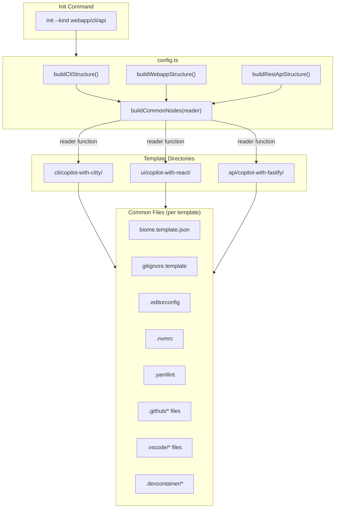
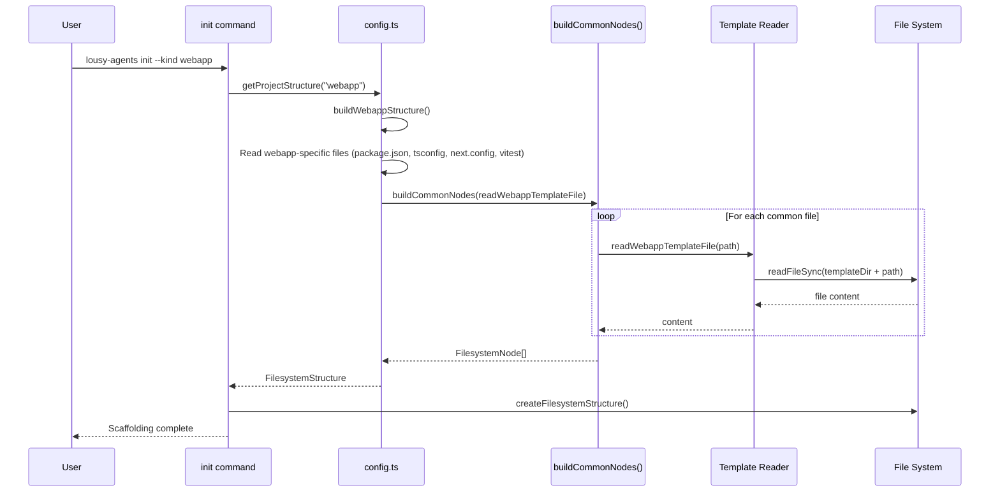

# Feature: Align Webapp Init with CLI and API Templates

## Problem Statement

The webapp scaffolding (`init --kind webapp`) was missing several files that the CLI and API templates consistently provide, creating inconsistency across project types. Specifically, the webapp template lacked `.gitignore`, `.vscode/mcp.json`, `.github/workflows/ci.yml`, and used `biome.json` directly instead of `biome.template.json` with `root: true`. Additionally, the verification process for webapp scaffolding did not include biome version compatibility or lint checks, unlike the API template. The shared file node definitions across all three project types were duplicated in `config.ts`, reducing maintainability.

## Personas

| Persona | Impact | Notes |
|---------|--------|-------|
| Software Engineer Learning Vibe Coding | Positive | Gets a consistent scaffolding experience regardless of project type |
| Frontend Developer | Positive | Webapp projects now include CI workflow, MCP config, and .gitignore by default |
| Team Lead | Positive | Can rely on consistent project setup across CLI, API, and webapp projects |

## Value Assessment

- **Primary value**: Efficiency — Ensures all project types receive the same baseline configuration files, eliminating manual setup steps for webapp projects
- **Secondary value**: Future — Extracting common file nodes into a shared function reduces maintenance burden when adding or modifying shared template files

## User Stories

### Story 1: Consistent Common Files Across Project Types

As a **Software Engineer Learning Vibe Coding**,
I want **the webapp scaffolding to include the same common files as CLI and API scaffolding**,
so that I can **have a consistent development experience regardless of project type**.

#### Acceptance Criteria

- When the user selects "webapp", the system shall create a `.gitignore` file with appropriate ignore patterns if it does not exist
- When the user selects "webapp", the system shall create a `.vscode/mcp.json` file with MCP server configuration if it does not exist
- When the user selects "webapp", the system shall create a `.github/workflows/ci.yml` file with lint, test, and build jobs if it does not exist
- When the user selects "webapp", the system shall create a `biome.json` file from `biome.template.json` with `root: true` if it does not exist
- The `.gitignore`, `.vscode/mcp.json`, and `.github/workflows/ci.yml` files shall be created for all three project types (webapp, api, cli)
- The system shall preserve existing files without modification

### Story 2: Consistent Verification Across Project Types

As a **Software Engineer Learning Vibe Coding**,
I want **the webapp scaffolding to be verified the same way as CLI and API scaffolding**,
so that I can **be confident that scaffolded webapp projects are correctly configured**.

#### Acceptance Criteria

- When a webapp project is scaffolded, the integration tests shall verify biome schema version matches the package.json biome dependency version
- When a webapp project is scaffolded and dependencies are installed, the scaffolded project shall pass `npm run lint` without errors

### Story 3: Reduced Duplication in Template Configuration

As a **maintainer of lousy-agents**,
I want **the common file node definitions to be extracted into a shared function**,
so that I can **add or modify shared template files in a single location**.

#### Acceptance Criteria

- The system shall define common file nodes (biome, gitignore, editorconfig, nvmrc, yamllint, GitHub files, VSCode files, devcontainer) in a single `buildCommonNodes` function
- When a new common file is added to one project type, it shall be added to all project types by modifying only the `buildCommonNodes` function
- The refactored code shall produce identical scaffolding output for all project types

---

## Design

> Refer to `.github/copilot-instructions.md` for technical standards.

### Data Flow Diagram

### Sequence Diagram

### Components Affected

- `ui/copilot-with-react/` — Add missing template files (gitignore.template, .vscode/mcp.json, .github/workflows/ci.yml), rename biome.json to biome.template.json
- `src/lib/config.ts` — Extract `buildCommonNodes()`, update `buildWebappStructure()`, refactor all three build functions
- `src/commands/init.test.ts` — Add shared tests for .gitignore, .vscode/mcp.json, .github/workflows/ci.yml
- `src/commands/init.integration.test.ts` — Add webapp biome version compatibility and lint tests

### Dependencies

- Node.js `fs/promises` (already in use) — For reading template files
- `c12` (already in use) — For configuration management

---

## Tasks

> Each task should be completable in a single coding agent session.
> Tasks are sequenced by dependency. Complete in order unless noted.

### Task 1: Add missing template files to webapp template directory

**Objective**: Create the missing files in `ui/copilot-with-react/` to match CLI and API templates

**Context**: The webapp template was missing `.gitignore`, `.vscode/mcp.json`, and `.github/workflows/ci.yml`. The `biome.json` also needed to be renamed to `biome.template.json` with `root: true`.

**Affected files**:
- `ui/copilot-with-react/gitignore.template`
- `ui/copilot-with-react/.vscode/mcp.json`
- `ui/copilot-with-react/.github/workflows/ci.yml`
- `ui/copilot-with-react/biome.template.json` (renamed from `biome.json`)

**Requirements**:
- When the webapp template is read, the system shall find `gitignore.template` with node_modules, dist, .next, coverage, and *.tgz patterns
- When the webapp template is read, the system shall find `.vscode/mcp.json` identical to CLI and API templates
- When the webapp template is read, the system shall find `.github/workflows/ci.yml` with lint, test, and build jobs
- When the webapp template is read, the system shall find `biome.template.json` with `root: true`

**Verification**:
- [x] All template files exist in `ui/copilot-with-react/`
- [x] `biome.template.json` has `root: true`
- [x] `.vscode/mcp.json` matches CLI and API versions

**Done when**:
- [x] All verification steps pass
- [x] No new errors in affected files

---

### Task 2: Update buildWebappStructure() in config.ts

**Depends on**: Task 1

**Objective**: Update the webapp structure to include the new template files

**Context**: The config.ts needs to read the new template files and include them in the webapp filesystem structure.

**Affected files**:
- `src/lib/config.ts`

**Requirements**:
- When building the webapp structure, the system shall read `biome.template.json` instead of `biome.json`
- When building the webapp structure, the system shall include `.gitignore` from `gitignore.template`
- When building the webapp structure, the system shall include `.vscode/mcp.json`
- When building the webapp structure, the system shall include `.github/workflows/ci.yml`

**Verification**:
- [x] `npm test src/lib/config.test.ts` passes
- [x] `npx biome check src/lib/config.ts` passes

**Done when**:
- [x] All verification steps pass
- [x] Webapp structure includes all new files

---

### Task 3: Extract common nodes to reduce duplication

**Depends on**: Task 2

**Objective**: Extract shared file node definitions into `buildCommonNodes()` function

**Context**: All three project types share ~25 identical file nodes. Extracting these reduces duplication and makes future changes easier.

**Affected files**:
- `src/lib/config.ts`

**Requirements**:
- The system shall define a `buildCommonNodes(reader)` function that returns the shared `FilesystemNode[]`
- The `buildCliStructure`, `buildWebappStructure`, and `buildRestApiStructure` functions shall use `buildCommonNodes` with their respective reader functions
- The refactored code shall produce identical output to the original

**Verification**:
- [x] `npm test` passes (all 402 tests)
- [x] `npx biome check src/lib/config.ts` passes
- [x] `npm run build` passes

**Done when**:
- [x] All verification steps pass
- [x] No regressions in scaffolding behavior

---

### Task 4: Add shared unit tests for new common files

**Depends on**: Task 3

**Objective**: Add parameterized tests that verify `.gitignore`, `.vscode/mcp.json`, and `.github/workflows/ci.yml` are created for all project types

**Affected files**:
- `src/commands/init.test.ts`

**Requirements**:
- Tests shall verify `.gitignore` creation for webapp, api, and cli project types
- Tests shall verify `.vscode/mcp.json` creation for webapp, api, and cli project types
- Tests shall verify `.github/workflows/ci.yml` creation for webapp, api, and cli project types

**Verification**:
- [x] `npm test src/commands/init.test.ts` passes
- [x] 9 new tests pass (3 files × 3 project types)
- [x] `npx biome check src/commands/init.test.ts` passes

**Done when**:
- [x] All verification steps pass
- [x] All new shared files are tested across all project types

---

### Task 5: Add webapp integration tests for verification consistency

**Depends on**: Task 4

**Objective**: Add webapp-specific integration tests matching the API template's verification pattern

**Affected files**:
- `src/commands/init.integration.test.ts`

**Requirements**:
- When a webapp project is scaffolded, the integration test shall verify biome schema version matches the biome package version in package.json
- When a webapp project is scaffolded with dependencies installed, the integration test shall verify `npm run lint` passes

**Verification**:
- [x] `npm test src/commands/init.integration.test.ts` passes (unit test mode)
- [x] `npx biome check src/commands/init.integration.test.ts` passes

**Done when**:
- [x] All verification steps pass
- [x] Webapp verification matches API verification patterns

---

### Task 6: Spec creation and final validation

**Depends on**: Task 5

**Objective**: Create the spec file and run full validation

**Affected files**:
- `.github/specs/webapp-alignment.spec.md`

**Requirements**:
- The spec shall document the feature using EARS format
- The spec shall include data flow and sequence diagrams
- The full validation suite shall pass

**Verification**:
- [x] `.github/specs/webapp-alignment.spec.md` exists
- [x] Spec includes EARS acceptance criteria
- [x] Spec includes data flow and sequence diagrams
- [x] `mise run ci && npm run build` passes

**Done when**:
- [x] All verification steps pass
- [x] Full validation suite passes

---

## Out of Scope

- Modifying webapp-specific content (Next.js config, React dependencies)
- Smart merging of existing files
- Adding source code templates (src/ directory) to webapp scaffolding
- Modifying CLI or API template content

## Future Considerations

- Consider using a template registry pattern to auto-discover common files across templates
- Add integration tests that verify all three project types produce identical common files
- Consider adding a CLI template test similar to the webapp lint test
