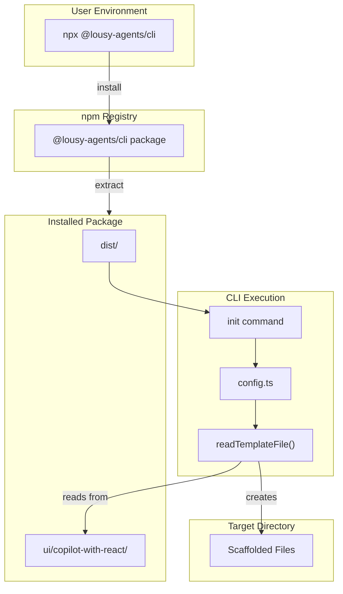
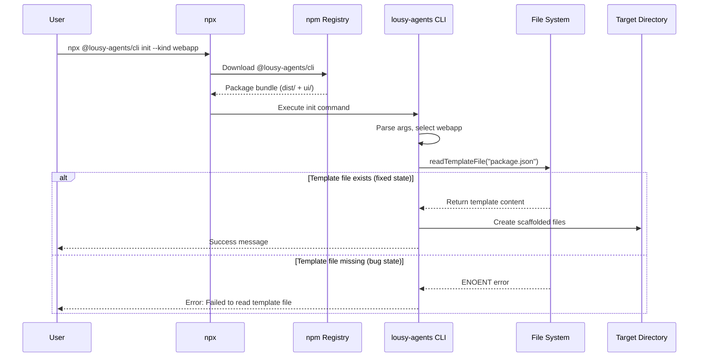

# Feature: Include Webapp Template Files in npm Package Bundle

## Problem Statement

When users run `npx @lousy-agents/cli init --kind webapp`, the command fails with an error: `Failed to read template file package.json: ENOENT: no such file or directory`. This occurs because the `ui/copilot-with-react/` template directory is not included in the npm package bundle. The `package.json` only specifies `dist` in the `files` array, but the runtime code in `src/lib/config.ts` reads template files from the `ui/` directory.

## Personas

| Persona | Impact | Notes |
|---------|--------|-------|
| Software Engineer Learning Vibe Coding | Negative | Cannot scaffold webapp projects when using published npm package |
| CLI User | Negative | Encounters cryptic error message when trying to use webapp scaffolding |
| Package Maintainer | Neutral | Needs to fix bundle configuration |

## Value Assessment

- **Primary value**: Customer — Enables users to successfully use the webapp scaffolding feature they expect to work
- **Secondary value**: Future — Prevents support issues and bug reports related to missing template files

## User Stories

### Story 1: Webapp Scaffolding from npm Package

As a **Software Engineer Learning Vibe Coding**,
I want **to run `npx @lousy-agents/cli init --kind webapp` successfully**,
so that I can **scaffold a new webapp project without errors**.

#### Acceptance Criteria

- When a user installs the package via npm/npx, the system shall include all template files from `ui/copilot-with-react/` in the package bundle
- When a user runs `init --kind webapp`, the system shall read template files from the installed package location
- If template files are missing, then the system shall display a clear error message indicating which file is missing
- When the webapp scaffolding completes, the system shall create all expected configuration files in the target directory

#### Notes

- The bug only manifests when using the published npm package, not when using a locally built version with `npm link`
- Template files are read at runtime using `readFileSync` in `src/lib/config.ts`

---

## Design

> Refer to `.github/copilot-instructions.md` for technical standards.

### Components Affected

- `package.json` — Add `ui` directory to `files` array to include templates in bundle

### Dependencies

- None - this is a configuration-only fix

### Data Model Changes

None required.

### Diagrams

#### Data Flow Diagram

#### Sequence Diagram

### Open Questions

- [x] What is the root cause? — The `ui/` directory is not included in the npm package `files` array

---

## Tasks

> Each task should be completable in a single coding agent session.
> Tasks are sequenced by dependency. Complete in order unless noted.

### Task 1: Add ui directory to npm package files

**Objective**: Include the `ui/` directory in the npm package bundle

**Context**: The `package.json` `files` array determines which files/directories are included when the package is published. Currently only `dist` is included, but the runtime code needs access to template files in `ui/copilot-with-react/`.

**Affected files**:
- `package.json`

**Requirements**:
- When the package is published to npm, the system shall include the `ui` directory in the bundle
- The bundle size should increase to include template files

**Verification**:
- [x] `npm pack --dry-run` shows `ui/` directory contents included
- [x] `mise run ci && npm run build` passes
- [x] Existing tests continue to pass

**Done when**:
- [x] All verification steps pass
- [x] No new errors in affected files
- [x] Template files will be included in published package

---

## Out of Scope

- Writing end-to-end tests that test against published npm package (requires publishing)
- Changing how template files are bundled (e.g., embedding in JS)
- Modifying the template reading logic in `src/lib/config.ts`

## Future Considerations

- Consider embedding template content directly in the built JavaScript to avoid runtime file reading
- Add integration tests that verify package contents match expected template files
- Consider using a build step to copy template files to `dist/` directory for cleaner package structure
